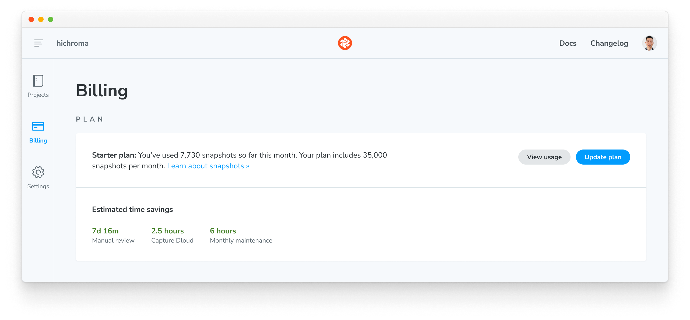
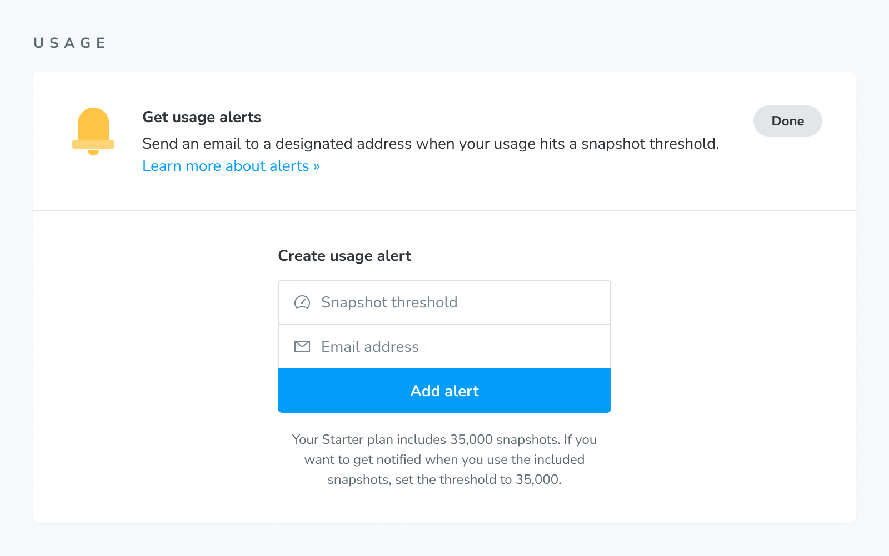
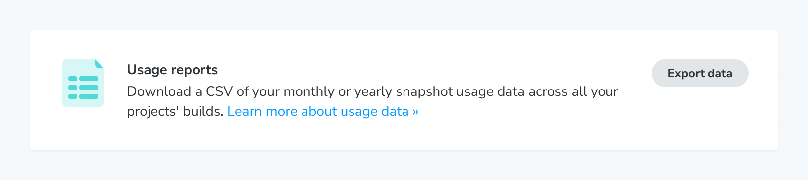

# Billing and invoices

Chromatic bills customers monthly based on their subscription date. For instance, if you subscribed on February 14th, you'll be billed on the 14th of each month. Any additional overages will be attached to the current billing period. Similarly, snapshots are allocated within the same time frame and reset following the same cadence.

## Snapshots

Chromatic charges based on [snapshots](/docs/snapshots) and browser coverage, respectively. Snapshots power [UI Tests](/docs/test) and [UI Review](/docs/review). They are only taken when you enable “UI Review” or “UI Tests” for your project.

Every time you run a build, we take one snapshot for each story. If you have 50 stories, Chromatic will take 50 snapshots. In addition, testing multiple viewports and browsers are also considered snapshots.

For example, see how many snapshots are taken in different scenarios below.

| Story count | Builds    | Browsers   | Viewports   | Snapshots taken |
| ----------- | --------- | ---------- | ----------- | --------------- |
| 1 story     | 10 builds | 1 browser  | 1 viewport  | 10 snapshots    |
| 1 story     | 10 builds | 2 browsers | 1 viewport  | 20 snapshots    |
| 2 stories   | 10 builds | 1 browser  | 1 viewport  | 20 snapshots    |
| 2 stories   | 10 builds | 2 browsers | 1 viewport  | 40 snapshots    |
| 2 stories   | 10 builds | 2 browsers | 2 viewports | 80 snapshots    |

If you use our free [Publish Storybook](/docs/setup) service only you will not be billed for snapshots.

### How we count snapshots

Snapshots are counted at the account level. If your account has multiple projects, we sum the number of snapshots each project uses to get your total usage. Chromatic doesn't break down billing per project.

### View current months usage

Find the current month's usage in the Plan section of the Billing page.

### Overages (extra snapshots)

Each plan comes with a specific number of snapshots per month. If you reach that limit:

1. **Free plan:** Review and testing will be paused once you exhaust the 5,000 free snapshots per month. You can resume testing by upgrading to a premium plan or waiting until the limit resets at the end of the billing cycle. 

2. **Premium plans:** Review and testing will not be interrupted. Any additional snapshots beyond the included amount will be billed at the end of the month.

For information on the number of snapshots included in each plan and the cost of extra snapshots, please refer to the [pricing page](https://www.chromatic.com/pricing).

Alternatively, you may consider upgrading to an enterprise plan for more snapshots. Contact us via in-app chat or <a href="mailto:support@chromatic.com?Subject=Custom%20plan">email</a> to learn more.

### Usage alerts

Keep track of your account's snapshot usage by setting up a usage alert. When you hit a certain snapshot threshold in a billing period, we'll notify the designated email address.

For example, if you want to get a notification when you use 90% of the 35,000 snapshots in the Starter plan, you'd set the snapshot alert threshold to 31,500.

### Usage reports

You can generate detailed usage reports for your own bookkeeping. Monthly and yearly reports are available for download as a CSV file. Contact us via our in-app chat or [email](mailto:support@chromatic.com) if you'd like a custom date range or have the report formatted as JSON.

The downloaded CSV includes the following columns:

| Column                      | Description                                                                                                       |
| --------------------------- | ----------------------------------------------------------------------------------------------------------------- |
| Date                        | Creation date and time of the build (ISO 8601)                                                                    |
| App ID                      | Unique Chromatic project identifier                                                                               |
| Build ID                    | Unique Chromatic build identifier                                                                                 |
| Repository slug             | Owner and name of the Git repository linked to the project (`<ownerName>:<repoName>`)                             |
| Branch name                 | Git branch name for which the build was created, prefixed with `<ownerName>:` if the build originates from a fork |
| Build number                | The incremental number for this build                                                                             |
| Skipped snapshots           | Number of snapshots that you saved (not got billed for) thanks to [TurboSnap](/docs/turbosnap)                    |
| Chrome snapshots            | Number of billed snapshots captured in Chrome                                                                     |
| Firefox snapshots           | Number of billed snapshots captured in Firefox                                                                    |
| Safari snapshots            | Number of billed snapshots captured in Safari                                                                     |
| Edge snapshots              | Number of billed snapshots captured in Edge                                                                       |
| Internet Explorer snapshots | Phasing out in 2023. Number of billed snapshots captured in Internet Explorer.                                    |

## Change plans

Change your plan in account settings. All changes are prorated to the day. That means you can change your plan anytime in the month without getting charged unnecessarily for unused snapshots.

## Invoices

Invoices are generated each month on your account's Billing page. Click to see a PDF of the amount owed and a breakdown of snapshot usage.

### Email invoices to your billing or finance manager

By default, Chromatic sets the account's billing email to the email address of the person who signed up for the plan. We send all billing and account related emails to this address.

Go to the Payment section on the Billing page to change the billing email associated with your account. Click "Change email".

### Refunds

If you aren’t happy with Chromatic, we’ll refund your money. We want customers to ship consistent UIs, save time, and build bulletproof component libraries.

If it’s not working out for you, contact us via our in-app chat or [email](mailto:support@chromatic.com) to get a refund for your current month's usage.

Subsequent refunds will be credited to your account for use in future invoices.
