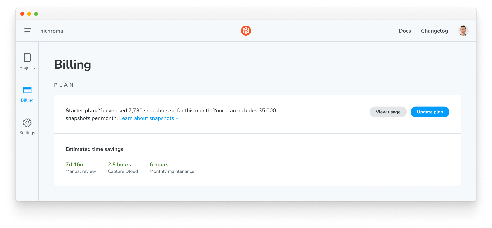
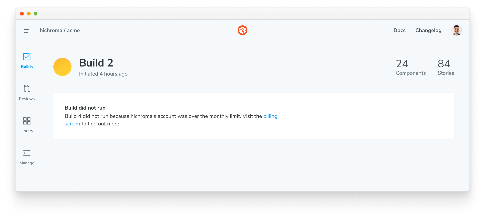
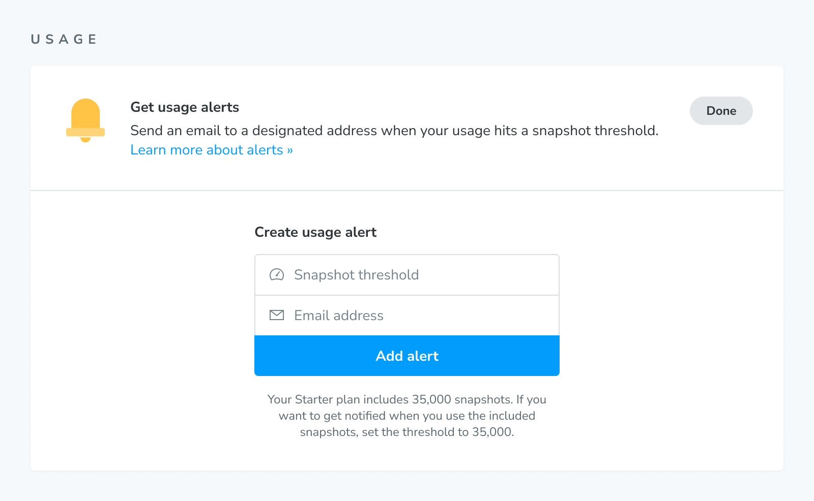
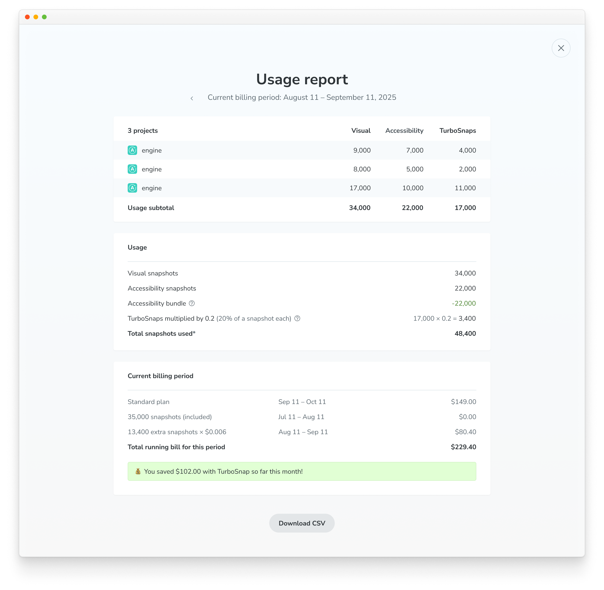
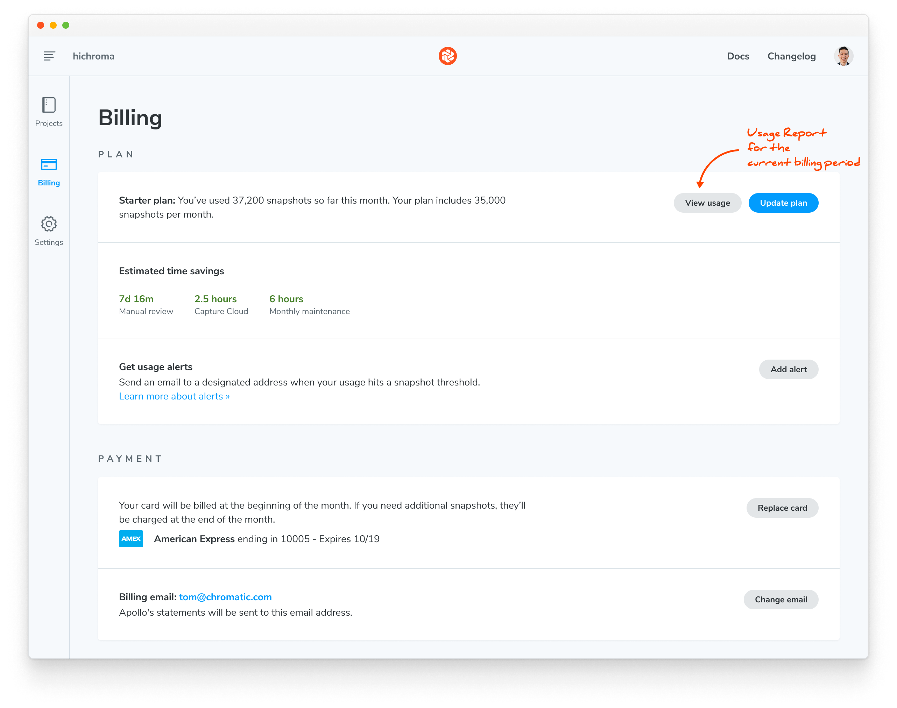
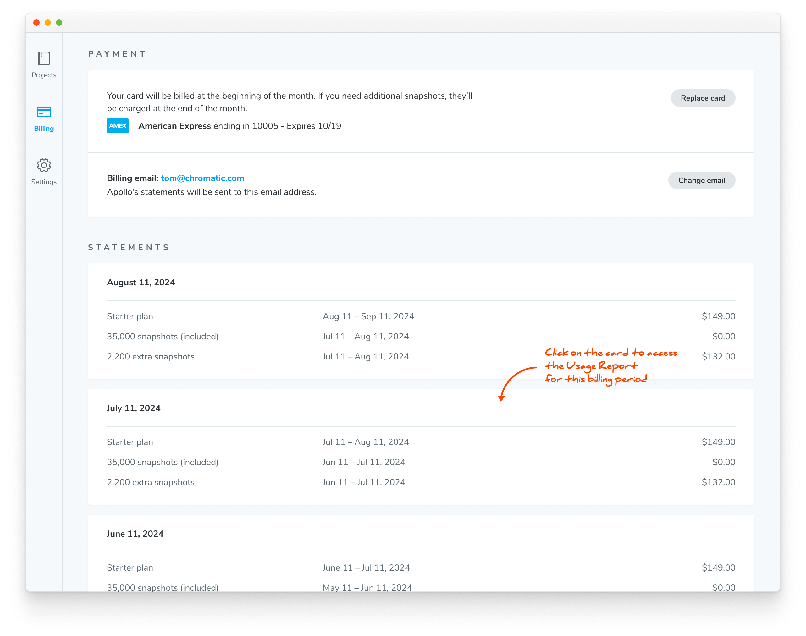
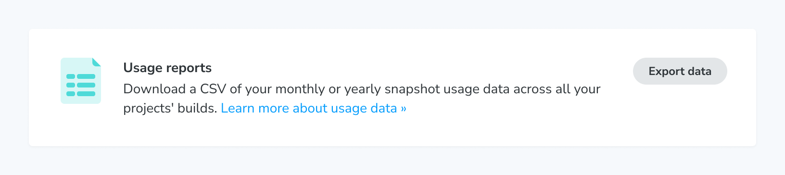
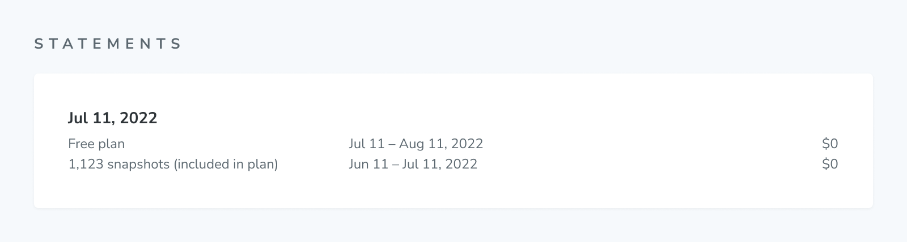
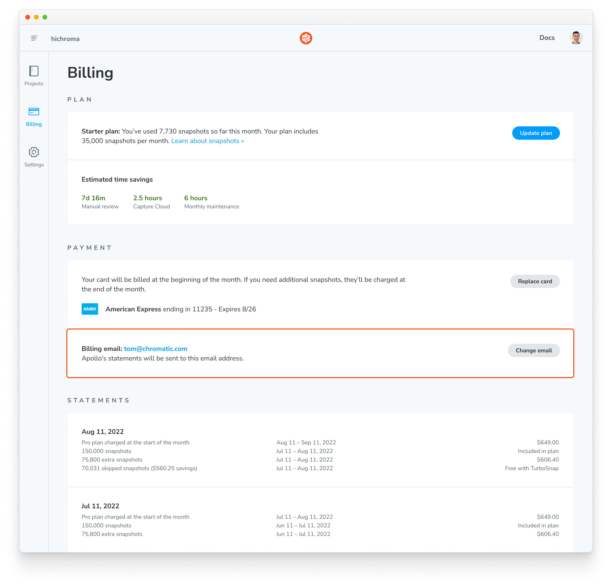

# Billing and invoices

Chromatic bills customers monthly based on their subscription date. For example, if you subscribed on February 14, you'll be billed on the 14th of each month.

Each plan comes with a set amount of billed snapshots per month. If you go beyond that amount, then you are charged for additional billed snapshots. All counts reset at the end of each month.

<details>
<summary>Why am I not receiving invoices?</summary>

Ensure that the Chromatic invoice email (`invoice+statements@chromatic.com`) and `chromatic.com` domain is added to your approved list.

</details>

<details>
<summary>Can we pay annually for our self-serve subscription?</summary>

Not at this time. We currently only support monthly payments for our self-serve customers. If you're interested in annual payments, consider upgrading to an [Enterprise plan](https://www.chromatic.com/enterprise).

</details>

## Snapshots

The monthly bill is calculated based on the number of billed [snapshots](/docs/snapshots). There are two types of snapshots:

- **Captured (1 billed snapshot):** Chromatic performs the full suite of work, including taking screenshots or capturing accessibility data, and running diffs.
- **Turbosnap (0.2 billed snapshot):** Chromatic identifies tests that have no code changes associated with them or their dependencies and copies over the existing snapshots from previous baselines for them.

## How we count billed snapshots

Each test can lead to multiple snapshots depending on the number of browsers/devices, modes, and test types you run. [Visual](/docs/visual) and [accessibility tests](/docs/accessibility) incur billed snapshots; [interaction tests](/docs/interactions) don't.

Billed snapshots are calculated based on the number of tests, builds, browsers, and modes. You can use our [snapshot calculator](https://www.chromatic.com/snapshot-calculator) to estimate your monthly snapshot usage and see the underlying math.

```
visual snapshots = Tests x Builds x Browsers x Modes
accessibility snapshots = Tests x Builds x Modes
```

### Without TurboSnap enabled

Chromatic captures a new snapshot for every test in every build resulting in higher usage. The total billed snapshots are calculated as follows:

```
billed snapshots = visual snapshots + accessibility snapshots
```

### With TurboSnap enabled

Chromatic copies over snapshots from existing baselines. We refer to these as "turbosnaps", which cost 0.2 billed snapshots each. For the remaining stories, Chromatic captures new snapshots as usual. Therefore, the total billed snapshots are calculated as follows:

```
Visual snapshots = Tests with changes x Builds x Browsers x Modes
Accessibility snapshots = Tests with changes x Builds x Modes

turbosnaps = (Tests - Tests with changes) x Builds x Browsers x Modes
billed snapshots from turbosnaps = turbosnaps * 0.2

billed snapshots = visual snapshots + accessibility snapshots + billed snapshots from turbosnaps
```

### Billed snapshots are counted at the account level

If your account has multiple projects, we sum the billed snapshots each project incurs to get your total usage. Chromatic doesn't break down billing per project.

A couple more things to note:

- Your [billing page](/docs/billing#view-current-months-usage) will include a breakdown of captured snapshots vs turbosnaps.
- If you use our free [Publish Storybook](/docs/publish) service only (i.e., UI Test and UI Review is disabled) you won't incur billed snapshots.

### View current month's usage

Find the current month's usage in the Plan section of the Billing page.



### Additional billed snapshots

Each plan comes with a specific number of included billed snapshots. If your usage reaches that amount:

1. **Free plan:** Review and testing will be paused once you use all 5,000 included billed snapshots per month. You can resume testing by upgrading to a paid plan or waiting until your included billed snapshots reset at the end of the billing cycle. 

2. **Paid plans:** Review and testing will not be interrupted. Additional billed snapshots beyond the included amount are charged at the end of the billing period.

For information on the number of billed snapshots included in each plan and the cost of additional snapshots, please refer to the [pricing page](https://www.chromatic.com/pricing). You can also set [usage alerts](/docs/billing#usage-alerts) to notify a designated email address when your usage reaches a certain number of billed snapshots.

Alternatively, you may consider upgrading to an enterprise plan for more billed snapshots. Contact us via in-app chat or <a href="mailto:support@chromatic.com?Subject=Custom%20plan">email</a> to learn more.

### Usage alerts

Keep track of your account's snapshot usage by setting up a usage alert. When your usage reaches a certain snapshot threshold in a billing period, we'll notify the designated email address.

For example, if you want to get a notification when you use 90% of the 35,000 billed snapshots in the Starter plan, you'd set the snapshot alert threshold to 31,500.



## Data retention

Chromatic guarantees a minimum of 12 months of data retention for builds and snapshots on all plans.

## Usage reports

Access usage reports for each billing period on the billing page. These reports offer a detailed breakdown of usage and display the invoice statement.

The **usage section** provides a per-project summary of Visual, Accessibility and TurboSnap snapshots utilized.

The **invoice** includes details of the active plan for the billing period, the base number of billed snapshots included, charges for additional billed snapshots, and a link to download a PDF copy of the invoice (available for all billing periods).



To access the current billing period's usage report, click on the "View usage" button in the Plan section.



To view previous billing periods, click on the card for the desired period in the Statements section.



### Export usage data as a CSV

You can generate a CSV file with a detailed list of every build within a build period. Click on a billing period to view the Usage Report, then click the "Download CSV" button to get a CSV file for that period.

The CSV file provides a granular breakdown of usage and includes the following columns:

<dl>
  <dt>Date</dt>
  <dd>Creation date and time of the build (ISO 8601)</dd>

<dt>App ID</dt>
<dd>Unique Chromatic project identifier</dd>

<dt>Build ID</dt>
<dd>Unique Chromatic build identifier</dd>

  <dt>Repository slug</dt>
  <dd>
    Owner and name of the Git repository linked to the project (`<ownerName>:<repoName>`)
  </dd>

  <dt>Branch name</dt>
  <dd>
    Git branch name for which the build was created, prefixed with `<ownerName>:` if the build originates from a fork
  </dd>

<dt>Build number</dt>
<dd>The incremental number for this build</dd>

  <dt>turbosnaps</dt>
  <dd>

Number of snapshots copied by [TurboSnap](#with-turbosnap-enabled).

  </dd>

  <dt>TurboSnap Bail Reason</dt>
  <dd>

Explains why a TurboSnap triggered a full rebuild. For more details, check out the [TurboSnap docs](/docs/turbosnap/troubleshooting#what-do-the-turbosnap-bail-reasons-in-my-usage-report-mean).

  </dd>

<dt>Chrome snapshots</dt>
<dd>Number of captured visual Chrome snapshots</dd>

<dt>Firefox snapshots</dt>
<dd>Number of captured visual Firefox snapshots</dd>

<dt>Safari snapshots</dt>
<dd>Number of captured visual Safari snapshots</dd>

<dt>Edge snapshots</dt>
<dd>Number of captured visual Edge snapshots</dd>

{' '}

<dt>Internet Explorer snapshots</dt>
<dd>Phased out in 2023. Number of captured visual Internet Explorer snapshots.</dd>

  <dt>Accessibility snapshots</dt>
  <dd>Number of captured accessibility snapshots</dd>
</dl>

### Export monthly and yearly usage data as CSV

Usage reports export your account's activity for the chosen billing period. You can also download a CSV of your monthly or yearly snapshot usage across all your projects' builds. Click the "Generate report" button and select a year and/or month, and then click "Generate CSV."

For a custom date range or to get the report in JSON format, contact us via in-app chat or [email](mailto:support@chromatic.com).



## Change plans

Change your plan in account settings. All changes are prorated to the day. That means you can change your plan anytime in the month without getting charged unnecessarily for unused billed snapshots.

## Legacy plans

In September 2025, we announced adjustments to our paid plans. The Standard plan has been renamed the Pro plan, while the now "Legacy Pro plan" is no longer available to new customers. However, we will continue to honor the benefits of the Legacy Pro plan for all existing customers on that plan as long as they remain subscribed.

These changes will take effect with the November 2025 billing cycle.

## Invoices

Invoices are generated each month on your account's Billing page. Click to see a PDF of the amount owed and a breakdown of snapshot usage.



### Email invoices to your billing or finance manager

By default, Chromatic sets the account's billing email to the email address of the person who signed up for the plan. We send all billing and account related emails to this address.

Go to the Payment section on the Billing page to change the billing email associated with your account. Click "Change email".



### Refunds

If you aren’t happy with Chromatic, we’ll refund your money. We want customers to ship consistent UIs, save time, and build bulletproof component libraries.

If it’s not working out for you, contact us via our in-app chat or [email](mailto:support@chromatic.com) to get a refund for your current month's usage.

Subsequent refunds will be credited to your account for use in future invoices.
