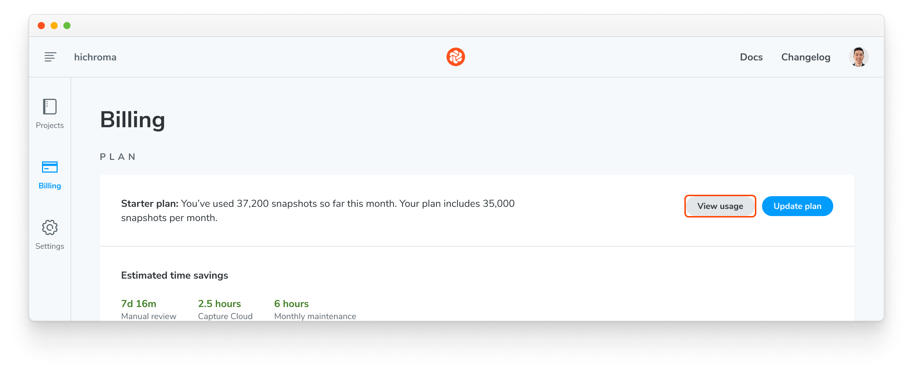
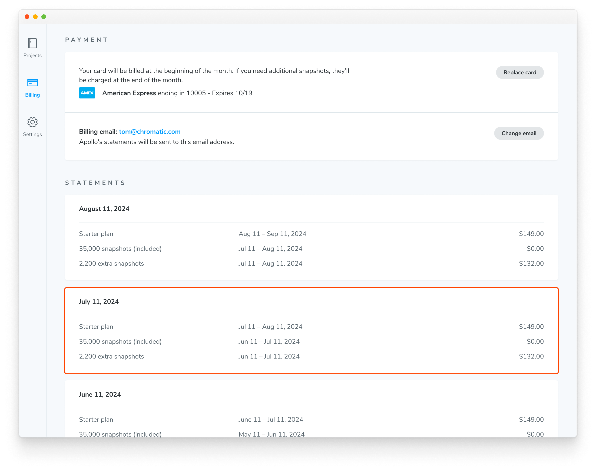
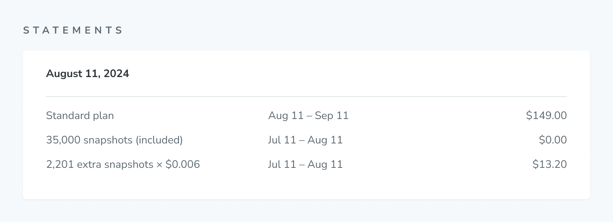

import { SnapshotCalculator } from "../../components/SnapshotCalculator/SnapshotCalculator";

# Billing and invoices

Chromatic bills customers monthly based on their subscription date. For instance, if you subscribed on February 14th, you'll be billed on the 14th of each month. Any additional overages will be attached to the current billing period. Similarly, snapshots are allocated within the same time frame and reset following the same cadence.

Why am I not receiving invoices?

Ensure that the Chromatic invoice email (`invoice+statements@chromatic.com`) and `chromatic.com` domain is added to your approved list.

Can we pay annually for our self-serve subscription?

Not at this time. We currently only support monthly payments for our self-serve customers. If you're interested in annual payments, consider upgrading to an [Enterprise plan](https://www.chromatic.com/enterprise).

## Snapshots

Chromatic charges based on [snapshots](/docs/snapshots) and browser coverage, respectively. Snapshots power [UI Tests](/docs#test-how-uis-look--function) and [UI Review](/docs/review). They are only taken when you enable “UI Review” or “UI Tests” for your project.

Every time you run a build, we take one snapshot for each test. If you have 50 tests, Chromatic will take 50 snapshots. In addition, testing multiple viewports and browsers are also considered snapshots.

Running an [accessibility test](/docs/accessibility) counts as one extra snapshot per test. However, you are not charged for [interaction](/docs/interactions) tests.

See the table below for examples of how many snapshots are taken in different scenarios. Or use the [snapshot calculator](/docs/billing#snapshot-calculator) to estimate your usage.

| Test count | Builds    | Browsers   | Viewports   | Snapshots taken |
| ---------- | --------- | ---------- | ----------- | --------------- |
| 1 test     | 10 builds | 1 browser  | 1 viewport  | 10 snapshots    |
| 1 test     | 10 builds | 2 browsers | 1 viewport  | 20 snapshots    |
| 2 tests    | 10 builds | 1 browser  | 1 viewport  | 20 snapshots    |
| 2 tests    | 10 builds | 2 browsers | 1 viewport  | 40 snapshots    |
| 2 tests    | 10 builds | 2 browsers | 2 viewports | 80 snapshots    |

If you use our free [Publish Storybook](/docs/publish) service only you will not be billed for snapshots.

### Snapshots with TurboSnap enabled (Storybook only)

Chromatic's default behavior is to capture a new snapshot for every story in every build.

With [TurboSnap](/docs/turbosnap) enabled, Chromatic first analyzes the Git history and the dependency graph of your project to identify stories that have no code changes within them or their dependencies. Instead of capturing new snapshots, it copies over the snapshots from existing baselines that didn't change. These duplicated snapshots are referred to as **TurboSnaps**, billed at 1/5th the cost of a regular snapshot.

For the remaining stories, Chromatic captures new snapshots as usual and bills them at the regular rate.

If you're running both accessibility and visual tests for a story—with no associated code changes—you'll only be charged one TurboSnap for that story.

Refer to the examples below or jump to the [snapshot calculator](/docs/billing#snapshot-calculator) to estimate your usage.

| Test count | Browsers | Viewports | Tests w/ changes | Snapshots | TurboSnaps | Billed snapshots |
| ---------- | -------- | --------- | ---------------- | --------- | ---------- | ---------------- |
| 50         | 1        | 1         | 50               | 50        | 0          | 50               |
| 50         | 1        | 1         | 10               | 10        | 40         | 18               |
| 50         | 2        | 1         | 50               | 100       | 0          | 100              |
| 50         | 2        | 1         | 10               | 20        | 80         | 36               |
| 50         | 2        | 2         | 10               | 40        | 160        | 72               |

Note: your [billing page](/docs/billing#view-current-months-usage) will include a breakdown of regular snapshots vs TurboSnaps.

### Snapshot calculator

<SnapshotCalculator client:load />

### How we count snapshots

Snapshots are counted at the account level. If your account has multiple projects, we sum the number of snapshots each project uses to get your total usage. Chromatic doesn't break down billing per project.

### View current month's usage

Find the current month's usage in the Plan section of the Billing page.

### Overages (extra snapshots)

Each plan comes with a specific number of snapshots per month. If you reach that limit:

1. **Free plan:** Review and testing will be paused once you exhaust the 5,000 free snapshots per month. You can resume testing by upgrading to a paid plan or waiting until the limit resets at the end of the billing cycle. 

2. **Paid plans:** Review and testing will not be interrupted. Any additional snapshots beyond the included amount will be billed at the end of the month.

For information on the number of snapshots included in each plan and the cost of extra snapshots, please refer to the [pricing page](https://www.chromatic.com/pricing). You can also set [usage alerts](/docs/billing#usage-alerts) to notify a designated email address when you hit a certain number of snapshots.

Alternatively, you may consider upgrading to an enterprise plan for more snapshots. Contact us via in-app chat or <a href="mailto:support@chromatic.com?Subject=Custom%20plan">email</a> to learn more.

### Usage alerts

Keep track of your account's snapshot usage by setting up a usage alert. When you hit a certain snapshot threshold in a billing period, we'll notify the designated email address.

For example, if you want to get a notification when you use 90% of the 35,000 snapshots in the Starter plan, you'd set the snapshot alert threshold to 31,500.

## Usage reports

Access usage reports for each billing period on the billing page. These reports offer a detailed breakdown of usage and display the invoice statement.

The **usage section** provides a per-project summary of Snapshots and TurboSnaps utilized (only available for billing periods starting in August 2024).

The **invoice** includes details of the active plan for the billing period, the base number of snapshots included, any overage charges for additional snapshots, and a link to download a PDF copy of the invoice (available for all billing periods).

To access the current billing period's usage report, click on the "View usage" button in the Plan section.

To view previous billing periods, click on the card for the desired period in the Statements section.

### Export usage data as a CSV

You can generate a CSV file with a detailed list of every build within a build period. Click on a billing period to view the Usage Report, then click the "Download CSV" button to get a CSV file for that period.

The CSV file provides a granular breakdown of usage and includes the following columns:

<dl>
  <dt>Date</dt>
  <dd>Creation date and time of the build (ISO 8601)</dd>

<dt>App ID</dt>
<dd>Unique Chromatic project identifier</dd>

<dt>Build ID</dt>
<dd>Unique Chromatic build identifier</dd>

  <dt>Repository slug</dt>
  <dd>
    Owner and name of the Git repository linked to the project (`<ownerName>:<repoName>`)
  </dd>

  <dt>Branch name</dt>
  <dd>
    Git branch name for which the build was created, prefixed with `<ownerName>:` if the build originates from a fork
  </dd>

<dt>Build number</dt>
<dd>The incremental number for this build</dd>

  <dt>TurboSnaps</dt>
  <dd>

Number of snapshots identified by [TurboSnap](#snapshots-with-turbosnap-enabled-storybook-only) with no associated code changes. Billed at 1/5th the cost of a regular snapshot.

  </dd>

  <dt>TurboSnaps Bail Reason</dt>
  <dd>

Explains why a TurboSnap triggered a full rebuild. For more details, check out the [TurboSnap docs](/docs/turbosnap/troubleshooting#what-do-the-turbosnap-bail-reasons-in-my-usage-report-mean).

  </dd>

<dt>Chrome snapshots</dt>
<dd>Number of billed snapshots captured in Chrome</dd>

<dt>Firefox snapshots</dt>
<dd>Number of billed snapshots captured in Firefox</dd>

<dt>Safari snapshots</dt>
<dd>Number of billed snapshots captured in Safari</dd>

<dt>Edge snapshots</dt>
<dd>Number of billed snapshots captured in Edge</dd>

  <dt>Internet Explorer snapshots</dt>
  <dd>Phased out in 2023. Number of billed snapshots captured in Internet Explorer.</dd>
</dl>

### Export monthly and yearly usage data as CSV

Usage reports export your account's activity for the chosen billing period. You can also download a CSV of your monthly or yearly snapshot usage across all your projects' builds. Click the "Generate report" button and select a year and/or month, and then click "Generate CSV."

For a custom date range or to get the report in JSON format, contact us via in-app chat or [email](mailto:support@chromatic.com).

## Change plans

Change your plan in account settings. All changes are prorated to the day. That means you can change your plan anytime in the month without getting charged unnecessarily for unused snapshots.

## Legacy plans

In September 2025, we announced adjustments to our paid plans. The Standard plan has been renamed the Pro plan, while the now "Legacy Pro plan" is no longer available to new customers. However, we will continue to honor the benefits of the Legacy Pro plan for all existing customers on that plan as long as they remain subscribed.

These changes will take effect with the November 2025 billing cycle.

## Invoices

Invoices are generated each month on your account's Billing page. Click to see a PDF of the amount owed and a breakdown of snapshot usage.

### Email invoices to your billing or finance manager

By default, Chromatic sets the account's billing email to the email address of the person who signed up for the plan. We send all billing and account related emails to this address.

Go to the Payment section on the Billing page to change the billing email associated with your account. Click "Change email".

### Refunds

If you aren’t happy with Chromatic, we’ll refund your money. We want customers to ship consistent UIs, save time, and build bulletproof component libraries.

If it’s not working out for you, contact us via our in-app chat or [email](mailto:support@chromatic.com) to get a refund for your current month's usage.

Subsequent refunds will be credited to your account for use in future invoices.
