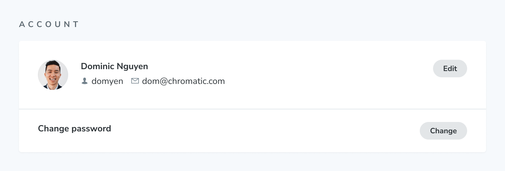

# Notifications

Chromatic sends email notifications to keep [collaborators](/docs/collaborators) in the loop. You have control over when and how these notifications are delivered.

### [UI Tests](/docs#test-how-uis-look--function)

In UI Tests, Chromatic emails the build owner when there are changes to a build and when there are discussions. If you're not the build owner but participate in a discussion thread, you'll get notified of replies for that discussion.

### [UI Review](/docs/review)

In UI Review, Chromatic emails the PR owner and any participants when a discussion begins, is replied-to, or gets resolved.

### Change the default email address

To set the default email address, go to the [Profile](https://www.chromatic.com/profile) page.



### Forward emails for different projects to other addresses

To adjust which activities trigger emails and where they get sent, go to the [Notifications](https://www.chromatic.com/notifications) page.

By default, notifications get sent to your default email address. If you signed up via GitHub, Bitbucket, or GitLab, Chromatic will retrieve the email addresses associated with your account from your Git provider. You can forward notifications to any of these email addresses.

---

### Frequently asked questions

<details>
<summary>Why am I not getting email notifications of discussions?</summary>

If you signed up to Chromatic via the supported Git providers (e.g., GitHub, GitLab, BitBucket), notifications are sent automatically to the email address you have configured for any discussion you've subscribed to.

Still, if you do not see any notifications, this could be an issue with your local Git configuration. Run the following command to verify which email is configured:

```shell
git config user.email
```

In case you need to change it, you can run the following command:

```shell
git config user.email 'your@email.com'
```

</details>
