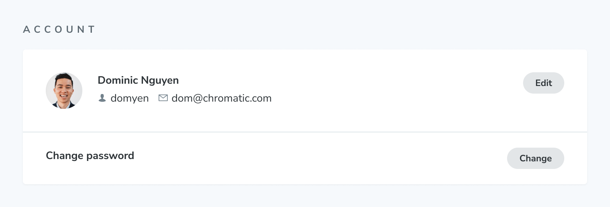

# Notifications

Chromatic sends email notifications to keep [project collaborators](/docs/access/collaborators) in the loop. You have control over when and how these notifications are delivered.

### [UI Tests](/docs#test-how-uis-look--function)

In UI Tests, Chromatic emails project collaborators when a build first becomes reviewable or when capture fails. Chromatic does not send a build email when the build passes. That includes builds whose only visual diffs were auto-ignored as [unstable](/docs/unstable-tests). You still get discussion emails if you participate in a thread.

### [UI Review](/docs/review)

In UI Review, Chromatic emails the PR owner and any participants when a discussion begins, is replied to, or gets resolved.

### Change the default email address

To set the default email address, go to the [Profile](https://www.chromatic.com/profile) page.



### Forward emails for different projects to other addresses

To adjust which activities trigger emails and where they get sent, go to the [Notifications](https://www.chromatic.com/notifications) page.

By default, notifications get sent to your default email address. If you signed up via GitHub, Bitbucket, or GitLab, Chromatic will retrieve the email addresses associated with your account from your Git provider. You can forward notifications to any of these email addresses.

---

### Frequently asked questions

<details>
<summary>Why didn't I get an email for a build?</summary>

Chromatic does not email you for every visual difference. UI Tests emails go out when a build first has unreviewed changes, or when capture fails. If the build passed, no email is sent.

Auto-ignored [unstable tests](/docs/unstable-tests) can still appear in the change count, but they do not put the build into review. Open the build and check the **Unreviewed** count. If it is 0 and the change sits under **Unstable**, Chromatic did not send a build email.

To receive emails for reviewable builds, select **All builds** or **Your builds only** on the [Notifications](https://www.chromatic.com/notifications) page.

If you have additional questions, use our **in-app chat** to contact us or email us at [support@chromatic.com](mailto:support@chromatic.com).

</details>

<details>
<summary>Why am I not getting email notifications of discussions?</summary>

If you signed up to Chromatic via the supported Git providers (e.g., GitHub, GitLab, BitBucket), notifications are sent automatically to the email address you have configured for any discussion you've subscribed to.

Still, if you do not see any notifications, this could be an issue with your local Git configuration. Run the following command to verify which email is configured:

```shell
git config user.email
```

In case you need to change it, you can run the following command:

```shell
git config user.email 'your@email.com'
```

</details>
