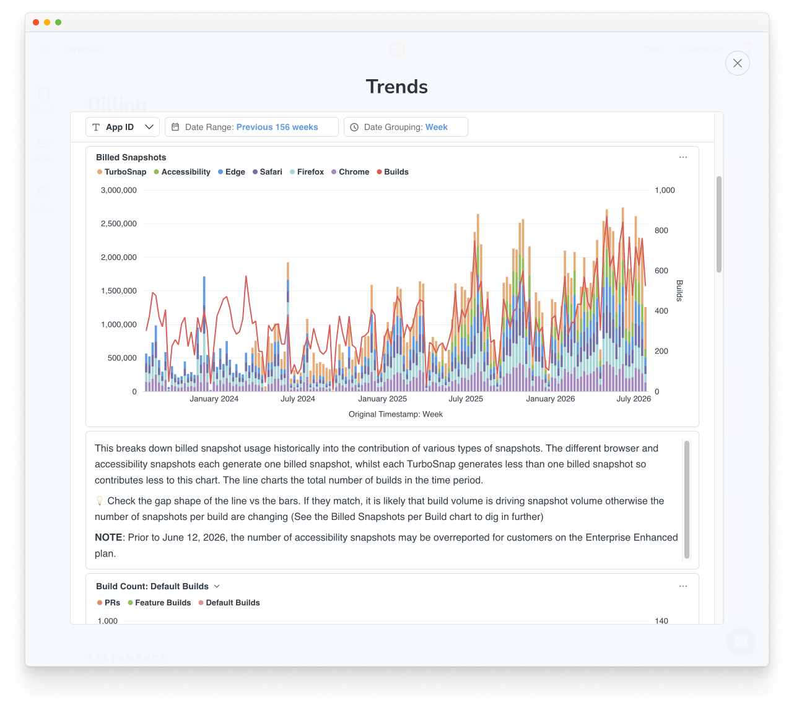
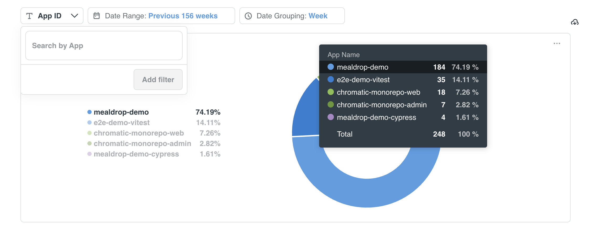
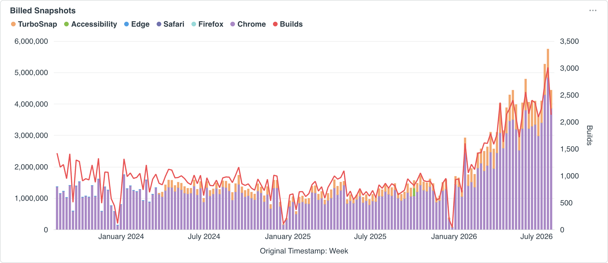
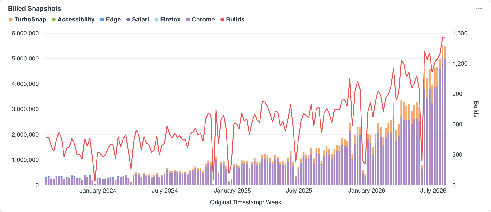
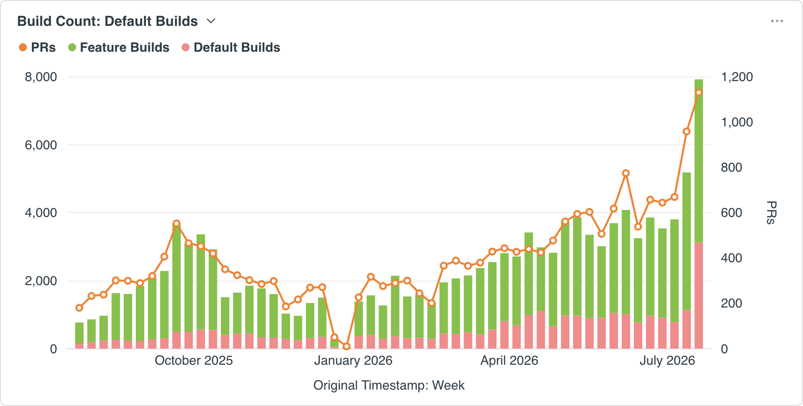
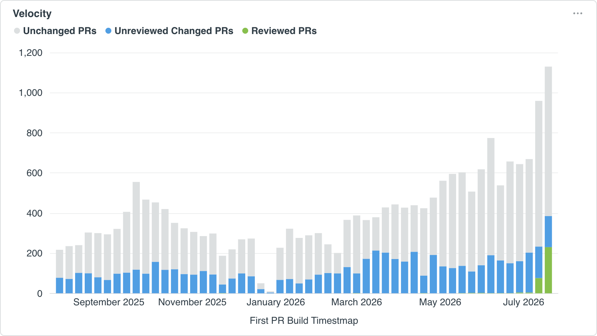

# Understand and optimize snapshot usage with Trends

Three factors drive billed snapshot usage: how many builds you run, how many snapshots each build generates, and the average billed cost of those snapshots. Trends visualizes all three over time so you can see where usage comes from and investigate unexpected increases.

Go to the Billing page and click Trends.

## How to investigate an increase in billed snapshots

Start with all projects selected and choose a Date Range that includes periods before and after the increase. More than one thing can cause an increase during the same period, so check each usage driver even after you find one cause.

### 1. Find when and where usage increased

Start with the Billed Snapshots chart, which breaks usage down by browser, accessibility testing, and TurboSnap and plots build volume as the Builds line. Identify when usage first rose above its previous pattern.

Next, use Billed Snapshots per Project to see each project's share of usage during that period. The project with the most total usage may have remained stable while a smaller project caused the increase.

Select each likely project in Billed Snapshots per Project or from the App ID filter, then compare its Billed Snapshots history with the account-wide increase. If several projects increased, repeat the remaining steps for each.

### 2. Did build volume increase?

On the Billed Snapshots chart, compare the bars with the Builds line. Look for changes at the same time and peaks that follow a similar pattern.

**Billed Snapshots + Builds line up.** When both rise at roughly the same time and follow a similar pattern, build volume likely contributed to the usage increase. Continue to [Did build volume outpace PR activity?](#did-build-volume-outpace-pr-activity).

**Billed Snapshots + Builds don't line up.** When the bars grow while the Builds line stays stable or rises more slowly, build volume is less likely to be the primary cause. Continue to [Billed Snapshots per Build](#3-did-billed-snapshots-per-build-increase).

If there is no clear pattern in the charts, check both build volume and snapshots per build.

#### Did build volume outpace PR activity?

PR volume naturally grows as teams add developers and fluctuates with seasonality. Use the Build Count chart to see whether increased build volume reflects more PRs or a CI workflow that triggers more builds.

Feature Builds run on feature branches, so they help show how much development is happening across active branches. Default Builds run on common long-lived branches and often come from routine merge, deployment, or scheduled workflows. Trends uses recognized branch names to classify builds into these groups.

| Pattern                                   | What it suggests                                | What to check                                                                  |
| ----------------------------------------- | ----------------------------------------------- | ------------------------------------------------------------------------------ |
| PRs and Feature Builds increased together | Build volume is growing with your team's output | Confirm the additional PRs and builds were expected                            |
| Feature Builds increased faster than PRs  | Each PR may now produce more builds             | Check for additional commits, reruns, bot branches, or duplicate CI jobs       |
| Default Builds increased                  | Default-branch workflows are running more often | Check for changes to merge, push, scheduled, or deployment-triggered workflows |

Use the [usage report CSV](/docs/billing/usage-reports#export-usage-data-as-a-csv) to pinpoint the branches and builds behind the increase, then review your CI workflow and [Chromatic configuration](/docs/configure) for unintended triggers.

#### Are PRs with UI changes being reviewed?

After determining why build volume grew, use the Velocity chart to see how many PRs changed the UI and how many of those were reviewed.

Unchanged PRs contain no UI changes and are typically backend-only. These are common and healthy because not every PR affects the frontend.

Unreviewed Changed PRs contain UI changes that your team is not reviewing. This may be intentional, such as a side-project spike that is not headed to production. If unreviewed changed PRs make up a large share, consider using Draft PRs and [skipping Chromatic runs for them](/docs/faq/chromatic-draft-pr) to optimize usage.

Reviewed PRs contain UI changes and have user activity on at least one of the PR's builds. This activity indicates that your team is reviewing UI changes in Chromatic, where they can catch regressions before merging.

### 3. Did billed snapshots per build increase?

Use the Billed Snapshots per Build chart to compare the periods before and after a usage increase.

| Pattern                                                                                       | What it suggests                                           | What to check                                                                                                                                                      |
| --------------------------------------------------------------------------------------------- | ---------------------------------------------------------- | ------------------------------------------------------------------------------------------------------------------------------------------------------------------ |
| Stories per Build and Total Snapshots per Build increased together                            | The project added stories or tests                         | Review the stories or tests added when usage increased and confirm the growth was intentional                                                                      |
| Total Snapshots per Build increased faster than Stories per Build                             | Each story began producing more snapshots                  | Check for added [browsers](/docs/browsers), [Modes](/docs/modes), or newly enabled [Visual Testing](/docs/visual) and [Accessibility Testing](/docs/accessibility) |
| Billed Snapshots per Build increased while Total Snapshots per Build stayed relatively stable | The average billed cost of each snapshot increased         | Continue to [Did Snapshot Billing Rate increase?](#4-did-snapshot-billing-rate-increase)                                                                           |
| No discernible pattern                                                                        | The view may be too broad, or more than one factor changed | Narrow the filters, then compare each factor                                                                                                                       |

### 4. Did Snapshot Billing Rate increase?

Snapshot Billing Rate is billed snapshots divided by total snapshots. It shows whether your usage is becoming more or less efficient over time. When you first set up Chromatic, the rate starts at `1.0` because a full cost snapshot is captured for every test.

[TurboSnap](/docs/turbosnap) lowers your Snapshot Billing Rate by using changed files to determine which stories need new snapshots. It _copies_ or _bypasses_ snapshots for stories it determines could not have changed and these are billed at a lower rate.

- Captured costs `1.0` billed snapshot.
- Copied (via TurboSnap) costs `0.2` billed snapshots.
- Bypassed (via TurboSnap) costs `0.0` billed snapshots.

There is no such thing as "best practice" rate. Most teams with TurboSnap have a lower rate than `1.0`, but the exact rate will depend on what part of your project is in development at any given time. You shouldn't expect a rate of `0.0` because that would mean every snapshot was bypassed because none of the frontend under test changed.

| Pattern                                          | What it suggests                                         | What to check                                                                              |
| ------------------------------------------------ | -------------------------------------------------------- | ------------------------------------------------------------------------------------------ |
| Snapshot Billing Rate increased                  | A larger share of snapshots was billed at full cost      | Use TurboSnap Effectiveness Breakdown to see why more snapshots were captured at full cost |
| Snapshot Billing Rate stayed stable or decreased | TurboSnap effectiveness did not drive the usage increase | Use the causes identified in steps 2 and 3                                                 |

#### Why did the rate increase?

TurboSnap [bails](/docs/turbosnap/troubleshooting#what-do-the-turbosnap-bail-reasons-in-my-usage-report-mean) when it cannot safely determine which tests were affected. When it bails, the affected snapshots are captured at the full rate of `1.0`, which raises the average Snapshot Billing Rate.

The TurboSnap Effectiveness Breakdown chart visualizes the ratio of snapshots billed at a lower rate versus full cost.

| Pattern                                             | What it suggests                                              | What to check                                                             |
| --------------------------------------------------- | ------------------------------------------------------------- | ------------------------------------------------------------------------- |
| Captured: No TurboSnap increased                    | More snapshots came from builds that were not using TurboSnap | Confirm TurboSnap is enabled for the affected projects and builds         |
| Labels beginning with Captured: Bail increased      | TurboSnap could not determine a safe set of affected tests    | Find the dominant bail reason and the builds behind it                    |
| Labels beginning with Captured: TurboSnap increased | File changes may have legitimately affected more tests        | Check which files changed and whether they should affect many tests       |
| Copied: TurboSnap or Bypassed: TurboSnap increased  | A larger share of snapshots was billed at a lower cost        | Use these segments as a reference point when comparing captured snapshots |
| No discernible pattern                              | The view may be too broad, or more than one factor changed    | Narrow the filters, then compare each factor                              |

When you've identified the dominant bail reason, export bail data from the [usage report CSV](/docs/billing/usage-reports#export-usage-data-as-a-csv) then follow the corresponding [TurboSnap troubleshooting](/docs/turbosnap/troubleshooting) guidance.

## How to verify an optimization

1. Make your optimization in code or configuration
2. Wait until the project has run enough builds to see a usage pattern emerge.
3. Return to Trends with the same App ID. Choose a Date Range that includes comparable periods before and after your optimization.
4. Compare Billed Snapshots, build volume, Total Snapshots per Build, and Snapshot Billing Rate.

If usage did not change as expected, export the [usage report CSV](/docs/billing/usage-reports#export-usage-data-as-a-csv) for the affected period and compare the individual builds.
