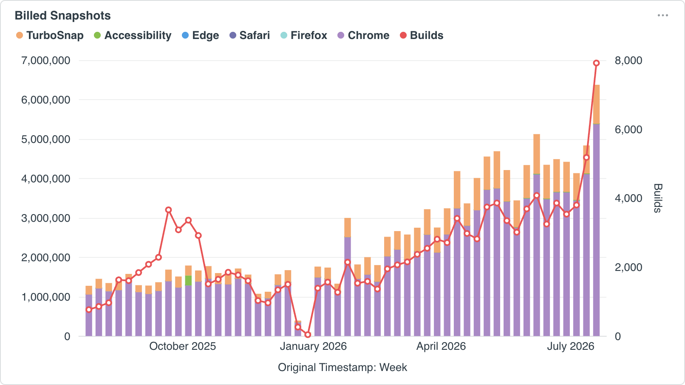
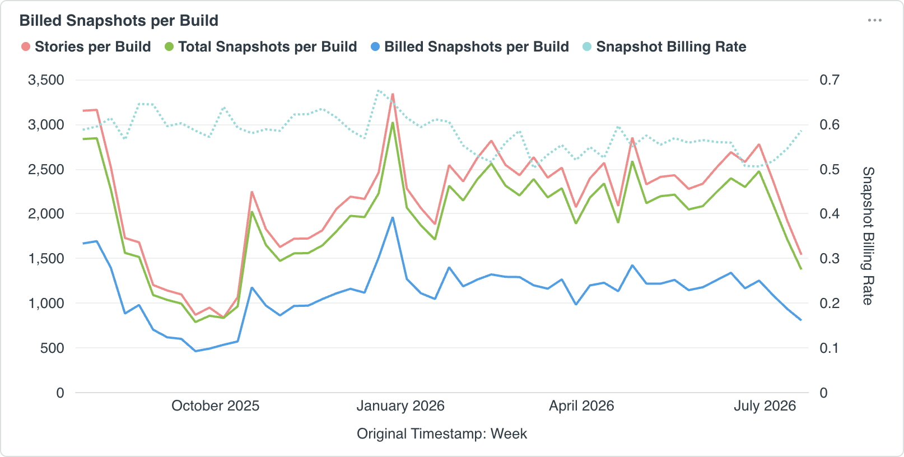
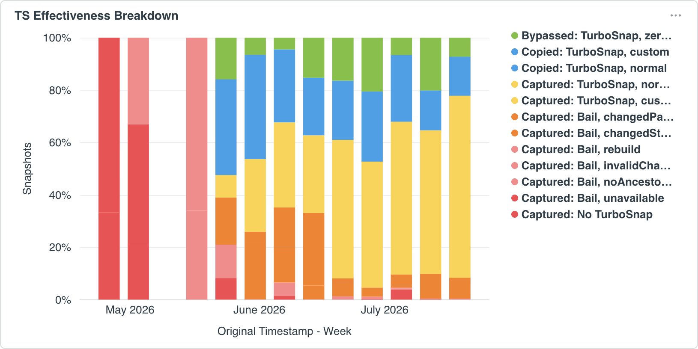

# Optimize usage

The Usage trends dashboard charts your account's [billed snapshot](/docs/billing) usage over time so you can diagnose a spike, understand what changed, and decide what to do next. Work through the questions below in order to identify the root cause and optimize your usage.

## When did it start, and in which project?

Start with the **Billed Snapshots** and **Billed Snapshots per Project** charts. You're looking for the week usage changed, and ideally the one project it changed in.

Look for whether most of your usage comes from one project, or whether one project shows the same pattern of change as your account overall. Filter the dashboard to that project to make other charts easier to read and to better understand what's driving the change.

## Did build count go up?

Compare whether the builds line matches the bars on the **Billed Snapshots chart**:

- **Lines up closely:** your usage increase is almost certainly driven by more builds. Move on to ["Are builds outpacing PRs?"](#are-builds-outpacing-prs) to understand why build volume grew.

- **Doesn't line up:** billed snapshots per build is likely the bigger contributor. Skip ahead to ["Are snapshots per build climbing?"](#are-snapshots-per-build-climbing).

## Are builds outpacing PRs?

Use the **Build count** chart to compare builds against PRs. More PRs, especially PRs with changes, means more builds and greater Chromatic usage.

If builds don't closely line up with PRs, it's likely that a structural change is causing extra builds. For example, more commits per PR, or builds running on main.

## Are snapshots per build climbing?

**Total snapshots per build** naturally rise as you add more tests. A gradual increase usually reflects growing coverage. A sharp jump typically points to a specific change, such as enabling a new test type (accessibility/visual) or adding more browsers across the board. If that isn't the case, check for a misconfiguration in your CI setup.

[TurboSnap](/docs/turbosnap) is meant to offset that increase. As total snapshots per build go up, your **Snapshot billing rate** should come down. If it isn't, investigate TurboSnap's effectiveness in the next section.

## Is TurboSnap bailing too often?

TurboSnap's effectiveness has the biggest impact on your snapshot billing rate. Bailed builds drive up _billed snapshots per build_ even when total snapshots per build are stable.

Effectiveness is the amount of copied or bypassed snapshots relative to captured ones. The more TurboSnap can copy or bypass instead of recapturing, the lower your billing rate.

If bails are a significant share of your builds, work through [TurboSnap troubleshooting](/docs/turbosnap/troubleshooting) to resolve the specific issues.

## Why TurboSnap bails affect your bill

TurboSnap copies a snapshot only when it can confidently determine that nothing affecting that test changed, based on your Git history and dependency graph.

When it can't establish that (because of how your CI checks out history, barrel files, how your Storybook is configured, or other reasons), it [bails](/docs/turbosnap/troubleshooting#what-do-the-turbosnap-bail-reasons-in-my-usage-report-mean). In that case, Chromatic captures every test instead of copying the unchanged ones, and the build is billed at the full captured rate.

Bail reasons are listed per build in the [usage report CSV export](/docs/billing/usage-reports#export-usage-data-as-a-csv). Use it to dig into specific builds rather than trends over time.
