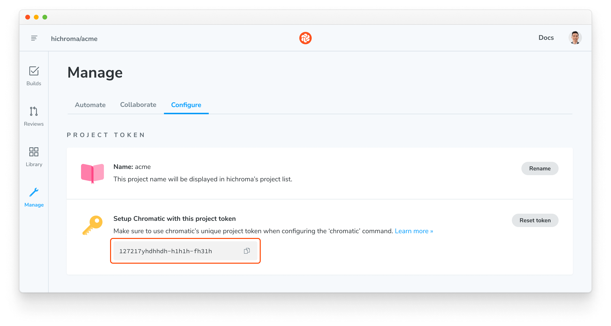
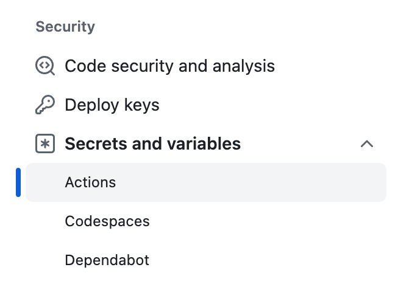

# Automate Chromatic with GitHub Actions

Chromatic provides a [GitHub Action](https://github.com/marketplace/actions/publish-to-chromatic) to help you automate your visual regression tests and publish Storybook.

## Workflow setup

In your `.github/workflows` directory, create a new file called `chromatic.yml` and add the following:

```yml
# .github/workflows/chromatic.yml

name: "Chromatic"

on: push

jobs:
  chromatic:
    runs-on: ubuntu-latest
    steps:
      - name: Checkout code
        uses: actions/checkout@v4
        with:
          fetch-depth: 0

      - name: Install dependencies
        # ⚠️ Pick one of these, matching the package manager for your project
        run: npm ci
        run: pnpm install
        run: yarn install --immutable --immutable-cache --check-cache

      - name: Run Chromatic
        uses: chromaui/action@latest
        with:
          # ⚠️ Make sure to configure a `CHROMATIC_PROJECT_TOKEN` repository secret
          projectToken: ${{ secrets.CHROMATIC_PROJECT_TOKEN }}
```

This is a fairly basic setup. More advanced options are explained below.

### Project token secret

To securely provide the projectToken to Chromatic, you must configure a GitHub repository secret. First, find your project on Chromatic.com and go to **Manage** and then **Configure**. Copy the project token.



On GitHub, go to the **Settings** tab on your repository. Under **Security**, find **Secrets and variables** and then **Actions**. Click **New repository secret**.



Set `CHROMATIC_PROJECT_TOKEN` as the **Name** and paste the project token as the **Secret**. Click **Add secret** to save the value.

<div class="aside">

Read the official [GitHub secrets documentation](https://docs.github.com/en/free-pro-team@latest/actions/reference/encrypted-secrets).

</div>

### Forked repositories

GitHub secrets work at a repository level. Forked repositories will not have access to them. If you want to run Chromatic on cross-repository (forked) PRs, you'll have to expose the `projectToken` by including it as plaintext in your `chromatic.yml` workflow file. Be aware that anyone with access to this file will be able to run Chromatic builds on your project, consuming your snapshot quota. You can reset the project token on the Manage > Configure screen at any time if you think it may have been compromised.

### Pinning the CLI version

While the CLI follows [semantic versioning](https://semver.org/), the GitHub Action typically auto-upgrades to the latest version. However, it's possible to pin the CLI version by changing the tag:

- To automatically receive all new updates, use `chromaui/action@latest` (the default).
- To automatically receive new features and bugfixes but avoid breaking changes, use `chromaui/action@vX` where `vX` is a major version number (e.g. `v10`).
- To not receive any updates but pin the action to a specific CLI version, use `chromaui/action@vX.Y.Z` where `vX.Y.Z` is a full semver version (e.g. `v10.0.0`).

The full list of tags is [available on GitHub](https://github.com/chromaui/action/tags).

## Configuration

Refer to our [CLI documentation](/docs/cli#configuration-options) for configuration options.

### Outputs

Chromatic's GitHub Action returns some information about your build in the form of outputs. The table below lists what's currently available. Read the official [GitHub documentation](https://docs.github.com/en/actions/using-workflows/workflow-syntax-for-github-actions#onworkflow_calloutputs) for more information about outputs.

| Name                             | Type     | Description                                                                                                         |
| -------------------------------- | -------- | ------------------------------------------------------------------------------------------------------------------- |
| **url**                          | `string` | An alias for the build URL.<br/> `https://www.chromatic.com/build?appId=example-app-id&number=100`                  |
| **buildUrl**                     | `string` | The build URL. <br/> `https://www.chromatic.com/build?appId=example-app-id&number=100`                              |
| **storybookUrl**                 | `string` | The Storybook preview URL for your current branch / Pull Request.<br/> `https://main--example-app-id.chromatic.com` |
| **code**                         | `string` | The exit code for the current run of the Chromatic [CLI](/docs/cli#exit-codes).                                     |
| **actualCaptureCount**           | `number` | The number of captured snapshots.                                                                                   |
| **changeCount**                  | `number` | The number of tests with visual changes, including any inherited changes (e.g., due to [TurboSnap]).                |
| **componentCount**               | `number` | The number of components in the published Storybook.                                                                |
| **errorCount**                   | `number` | The number of tests with error(s), including any inherited errors (e.g., due to [TurboSnap]).                       |
| **inheritedCaptureCount**        | `number` | The number of inherited (not captured) snapshots (e.g., due to [TurboSnap]).                                        |
| **interactionTestFailuresCount** | `number` | The number of stories with interaction test failures.                                                               |
| **specCount**                    | `number` | The number of stories in the published Storybook.                                                                   |
| **testCount**                    | `number` | The number of tests on the build.                                                                                   |

### Run Chromatic on specific branches

If you need to customize your workflow to run Chromatic on specific branches, adjust your workflow like so:

```yml
# .github/workflows/chromatic.yml

name: "Chromatic"

# 👇 Workflow event to trigger execution
on:
  push:
    branches-ignore:
      - "example" # 👈 Excludes the example branch
```

<div class="aside">

Read the official [GitHub branch workflow documentation](https://docs.github.com/en/free-pro-team@latest/actions/reference/workflow-syntax-for-github-actions#example-ignoring-branches-and-tags).

</div>

Now Chromatic will run for any branch except `example`.

Other branches, such as the ones created by the Renovate bot, can also be included.

### Run Chromatic on large projects

Chromatic is prepared to handle large file uploads (with a limit of 5000 files, including stories and assets). If your project exceeds this limit, we recommend enabling the `zip` option in your workflow to compress your build before uploading it. For example:

```yml
# .github/workflows/chromatic.yml

jobs:
  chromatic:
    steps:
      # ... other steps

      - uses: chromaui/action@latest
        with:
          projectToken: ${{ secrets.CHROMATIC_PROJECT_TOKEN }}
          # 👇 Runs Chromatic with the option to compress the build output.
          zip: true
```

### Run Chromatic on monorepos

Chromatic can be run on monorepos that have multiple subprojects. Each subproject will need its project token.

#### Prerequisites

1. Ensure that you're in the correct working directory for the subproject.
2. Have the `build-storybook` npm script in the subproject's `package.json` file OR explicitly name the script using the `buildScriptName` parameter and ensure the script is listed in the subproject's `package.json` file.

If you've already built your Storybook in a separate CI step, you can alternatively point the action at the build output using the `storybookBuildDir` parameter.

```yml
# .github/workflows/chromatic.yml

jobs:
  chromatic:
    runs-on: ubuntu-latest
    steps:
      # ... other steps

      - name: Publish Project 1 to Chromatic
        uses: chromaui/action@latest
        with:
          # 👇 Chromatic projectToken, refer to the manage page to obtain it.
          projectToken: ${{ secrets.CHROMATIC_PROJECT_TOKEN_1 }}
          workingDir: packages/project_1

      - name: Publish Project 2 to Chromatic
        uses: chromaui/action@latest
        with:
          # 👇 Chromatic projectToken, refer to the manage page to obtain it.
          projectToken: ${{ secrets.CHROMATIC_PROJECT_TOKEN_2 }}
          workingDir: packages/project_2
```

If you want to run Chromatic in parallel for each subproject, you will need to create separate workflow files.

```yml
# .github/workflows/chromatic-1.yml

# 👇 Customize the workflow name
name: "Chromatic 1"

on: push

jobs:
  chromatic:
    steps:
      # ... other steps

      - name: Run Chromatic
        uses: chromaui/action@latest
        with:
          # 👇 Chromatic projectToken, refer to the manage page to obtain it.
          projectToken: ${{ secrets.CHROMATIC_PROJECT_TOKEN_1 }}
          workingDir: packages/project_1
```

```yml
# .github/workflows/chromatic-2.yml

# 👇 Customize the workflow name
name: "Chromatic 2"

on: push

# List of jobs
jobs:
  chromatic:
    steps:
      # ... other steps

      - name: Run Chromatic
        uses: chromaui/action@latest
        with:
          # 👇 Chromatic projectToken, refer to the manage page to obtain it.
          projectToken: ${{ secrets.CHROMATIC_PROJECT_TOKEN_2 }}
          workingDir: packages/project_2
```

### Enable TurboSnap

TurboSnap is an advanced Chromatic feature implemented to improve the build time for large projects. By default, it is disabled in your CI environment. To enable it, add the `onlyChanged` option to the workflow as follows:

```yml
# .github/workflows/chromatic.yml

jobs:
  chromatic:
    steps:
      # ... other steps

      - name: Run Chromatic
        uses: chromaui/action@latest
        with:
          projectToken: ${{ secrets.CHROMATIC_PROJECT_TOKEN }}
          onlyChanged: true # 👈 Required option to enable TurboSnap
```

<div class="aside">

TurboSnap is highly customizable and can be configured to fit your requirements. For more information, read our [documentation](/docs/turbosnap).

</div>

#### Trigger full rebuilds

By default, TurboSnap relies on Webpack's dependency graph to determine which files changes since the last build. If you're working with files processed outside the scope of Webpack (e.g., fonts, images, CSS, external libraries), you can use the `externals` option to tell Chromatic to rebuild the entire project when a file matching the pattern is changed. For example:

```yml
# .github/workflows/chromatic.yml

# Other necessary configuration

jobs:
  chromatic:
    steps:
      # ... other steps

      - name: Run Chromatic
        uses: chromaui/action@latest
        with:
          projectToken: ${{ secrets.CHROMATIC_PROJECT_TOKEN }}
          onlyChanged: true # 👈 Required option to enable TurboSnap
          externals: packages/(icons/icons|tokens/src)/**
```

Multiple file patterns can also be provided as follows:

```
# ... other config

- name: Run Chromatic
  uses: chromaui/action@latest
  with:
    projectToken: ${{ secrets.CHROMATIC_PROJECT_TOKEN }}
    onlyChanged: true # 👈 Required option to enable TurboSnap
    externals: |
      *.sass
      public/**
```

<div class="aside">

The `externals` option also accept additional glob patterns defined via [picomatch].

</div>

### Support for environment variables

Environment variables are supported in Chromatic. You can use them to customize your workflow execution or provide project-related variables (e.g., API URLs). Below is a table and condensed examples featuring the available Chromatic variables and how to set up a project-specific variable.

| Environment variable          | Description                                                                                                                                                                           |
| ----------------------------- | ------------------------------------------------------------------------------------------------------------------------------------------------------------------------------------- |
| `CHROMATIC_PROJECT_TOKEN`     | Sets Chromatic's project token, used as an advanced case.<br/> See [setup](#setup) to learn how to configure the token.<br/> `env: CHROMATIC_PROJECT_TOKEN: 'Example-project-token'`  |
| `CHROMATIC_POLL_INTERVAL`     | Configures a polling interval in milliseconds to wait for the build to finish. <br/> Default value: `1000`.<br/> `env: CHROMATIC_POLL_INTERVAL: 3000`                                 |
| `CHROMATIC_RETRIES`           | Configures the number of attempts to upload to Chromatic.<br/> Default value: `5`.<br/> `env: CHROMATIC_RETRIES: 10`                                                                  |
| `CHROMATIC_STORYBOOK_VERSION` | Overrides Storybook package/version detection. <br/> `env: CHROMATIC_STORYBOOK_VERSION: '@storybook/react@6.5.0-alpha.25'`                                                            |
| `STORYBOOK_BUILD_TIMEOUT`     | Sets the waiting period in milliseconds for Storybook's build process to finish. <br/> Default value: `600000` (10 minutes).<br/> `env: STORYBOOK_BUILD_TIMEOUT: 30000`               |
| `CI`                          | Marks the execution environment as CI.<br/> `env: CI: true`                                                                                                                           |
| `LOG_LEVEL`                   | Configures the log level.<br/> Available options are: `silent`, `error`, `warn`, `info`, `debug`. <br/> `env: LOG_LEVEL:'info'`                                                       |
| `DISABLE_LOGGING`             | Disables logging. Similar to setting `env: LOG_LEVEL: 'silent'`.<br/> `env: DISABLE_LOGGING: true`                                                                                    |
| `HTTPS_PROXY` or `HTTP_PROXY` | Provides the proxy server's URL.<br/> Used to configure [https-proxy-agent](https://www.npmjs.com/package/https-proxy-agent).<br/> `env: HTTPS_PROXY: 'https://example-proxy-server'` |

```yml
# .github/workflows/chromatic.yml

jobs:
  chromatic:
    steps:
      # ... other steps

      - uses: chromaui/action@latest
        with:
          projectToken: ${{ secrets.CHROMATIC_PROJECT_TOKEN }}
        env:
          # 👇 Sets environment variables
          CHROMATIC_RETRIES: 5
          LOG_LEVEL: "error"
```

It comes with a caveat if you need to provide project-specific environment variables. We recommend that you prefix each variable with the `STORYBOOK` keyword and adjust your workflow to the following:

```yml
# .github/workflows/chromatic.yml

jobs:
  chromatic:
    steps:
      # ... other steps

      - uses: chromaui/action@latest
        with:
          projectToken: ${{ secrets.CHROMATIC_PROJECT_TOKEN }}
        env:
          # 👇 Sets the environment variable
          STORYBOOK_SOME_ENV_VAR: ${{ secrets.STORYBOOK_SOME_ENV_VAR }}
```

<div class="aside">

Read the official [Storybook environment variable's documentation](https://storybook.js.org/docs/react/configure/environment-variables).

</div>

### Recommended configuration for build events

GitHub's Actions, like other CI systems, can run based on any type of event. Our recommendation is to run Chromatic's step on `push` events. All other event types except `pull-request` will not work.

The `pull-request` event requires special consideration. Like other CI systems, GitHub allows workflow execution on either commits pushed to a branch in a pull request. Or for "merge" commits between that branch and the base branch (main).

These specific types of commits (merge) don't persist in the history of your repository. That can cause Chromatic's baselines to be lost in certain situations. Hence why we recommend running Chromatic's step on `push`.

### UI Test and UI Review

[UI Tests](/docs/test) and [UI Review](/docs/review) rely on [branch and baseline](/docs/branching-and-baselines) detection to keep track of [snapshots](/docs/snapshots). We recommend the following configuration.

#### Command exit code for "required" checks

If you are using pull request statuses as required checks before merging, you may not want your workflow step to fail if test snapshots render without errors (but with changes). To achieve this, pass the option `exitZeroOnChanges` to the `with` clause, and your workflow will continue in such cases. For example:

```yml
# .github/workflows/chromatic.yml

# Other necessary configuration

jobs:
  chromatic:
    steps:
      # ... other steps

      - name: Run Chromatic
        uses: chromaui/action@latest
        with:
          projectToken: ${{ secrets.CHROMATIC_PROJECT_TOKEN }}
          exitZeroOnChanges: true # 👈 Option to prevent the workflow from failing
```

<div class="aside">

Read about the [available options](/docs/cli/#configuration-options).

</div>

When using `exitZeroOnChanges`, your workflow will still stop and fail if your Storybook contains stories that error.

#### Re-run failed builds after verifying UI test results

Builds that contain visual changes need to be [verified](/docs/test#verify-ui-changes). They will fail if you are not using the `exitZeroOnChanges` option. Once you accept all the changes, re-run the workflow, and the `chromatic` job will pass.

If you deny any change, you will need to make the necessary code changes to fix the test (and thus start a new run) to get Chromatic to pass again.

#### Maintain a clean "main" branch

A clean `main` branch is a development **best practice** and **highly recommended** for Chromatic. This means ensuring that test builds in your `main` branch are passing.

If the builds result from direct commits to `main`, you must accept changes to keep the main branch clean. If they're merged from `feature-branches`, you must ensure those branches are passing _before_ you merge into `main`.

#### GitHub squash/rebase merge and the "main" branch

GitHub's squash/rebase merge functionality creates new commits that have no association with the branch being merged. If you've enabled our GitHub application in the [UI Review](/docs/review) workflow, then we will automatically detect this situation and bring baselines over (see [Branching and Baselines](/docs/branching-and-baselines#how-do-baselines-get-preserved-during-squash-and-rebase-merging) for more details).

If you’re using this functionality but notice the incoming changes were not accepted as baselines in Chromatic, then you'll need to adjust the workflow to include a new step with the `autoAcceptChanges` option. For example:

```yml
# .github/workflows/chromatic.yml

jobs:
  chromatic:
    steps:
      # ... other steps

      - name: Run Chromatic
        uses: chromaui/action@latest
        with:
          projectToken: ${{ secrets.CHROMATIC_PROJECT_TOKEN }}
          autoAcceptChanges: "main" # 👈 Option to accept all changes on main
```

<div class="aside">

Read about the [available options](/docs/cli/#configuration-options).

</div>

Including the `autoAcceptChanges` option ensures all incoming changes will be accepted as baselines. Additionally, you'll maintain a clean `main` branch.

If you want to test the changes introduced by the rebased branch, you can adjust your workflow and include a new step with the `ignoreLastBuildOnBranch` option. For example:

```yml
# .github/workflows/chromatic.yml

jobs:
  chromatic:
    steps:
      # ... other steps

      - name: Run Chromatic
        uses: chromaui/action@latest
        with:
          projectToken: ${{ secrets.CHROMATIC_PROJECT_TOKEN }}
          ignoreLastBuildOnBranch: "my-branch" # 👈 Option to ignore the last build on target branch
```

<div class="aside">

Read about the [available options](/docs/cli/#configuration-options).

</div>

Including the `ignoreLastBuildOnBranch` option ensures the latest build for the specific branch is not used as a baseline.

#### Run Chromatic on external forks of open source projects

You can enable PR checks for external forks by sharing your project token where you configured the Chromatic command (often in `package.json` or in the pipeline step).

Sharing project tokens allows contributors and others to run Chromatic builds on your project, consuming your snapshot quota. They cannot access your account, settings, or accept baselines. This can be an acceptable tradeoff for open source projects that value community contributions.

#### Skipping builds for certain branches

Sometimes you might want to skip running a build for a certain branch but still have Chromatic mark the latest commit on that branch as "passed". Otherwise, pull requests could be blocked due to required checks that remain pending. To avoid this issue, you can run `chromatic` with the `--skip` flag. This flag accepts a branch name or glob pattern.

For instance, Dependabot automatically updates the dependencies of a project. Although some dependencies can result in UI changes, you might not find it worthwhile to run Chromatic for every dependency update. Instead, you could rely on Chromatic running against the `main` or `develop` branch. One use case for this feature is skipping builds for branches created by a bot.

To skip builds for `dependabot` branches, use the following:

```yml
# .github/workflows/chromatic.yml

jobs:
  chromatic:
    steps:
      # ... other steps

      - name: Run Chromatic
        uses: chromaui/action@latest
        with:
          projectToken: ${{ secrets.CHROMATIC_PROJECT_TOKEN }}
          skip: "dependabot/**" # 👈 Option to skip Chromatic for certain branches
```

To apply this to multiple branches, use an "extended glob". See [picomatch] for details.

```yml
skip: "@(renovate/**|dependabot/**)"
```

<div class="aside">

Read our official [CLI documentation](/docs/cli#configuration-options).

</div>

[picomatch]: https://www.npmjs.com/package/picomatch#globbing-features
[TurboSnap]: /docs/turbosnap
