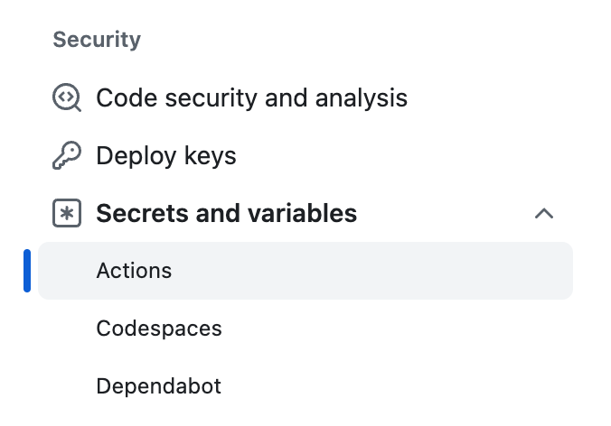
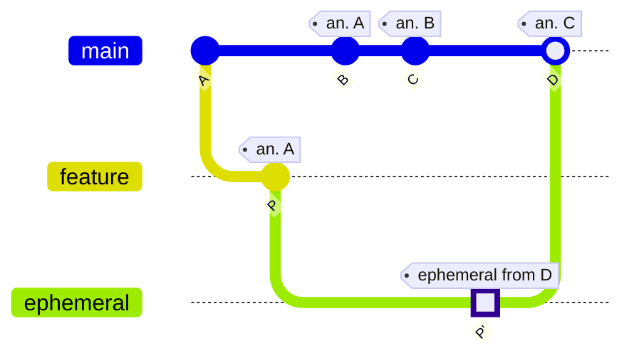

import IntegrationSnippets from "../../components/IntegrationSnippets.astro";

# Automate Chromatic with GitHub Actions

Chromatic provides a [GitHub Action](https://github.com/marketplace/actions/publish-to-chromatic) to help you automate your visual regression tests and publish Storybook.

## Workflow setup

In your `.github/workflows` directory, create a new file called `chromatic.yml` and add the following:

{/* prettier-ignore-start */}

<IntegrationSnippets>
  <Fragment slot="storybook">
    ```yml title=".github/workflows/chromatic.yml"
    name: "Chromatic"

    on: push

    jobs:
      chromatic:
        name: Run Chromatic
        runs-on: ubuntu-latest
        steps:
          - name: Checkout code
            uses: actions/checkout@v4
            with:
              fetch-depth: 0
          - uses: actions/setup-node@v4
            with:
              node-version: 22.20.0
          - name: Install dependencies
            # ⚠️ See your package manager's documentation for the correct command to install dependencies in a CI environment.
            run: npm ci
          - name: Run Chromatic
            uses: chromaui/action@latest
            with:
              # ⚠️ Make sure to configure a `CHROMATIC_PROJECT_TOKEN` repository secret
              projectToken: ${{ secrets.CHROMATIC_PROJECT_TOKEN }}
    ```
  </Fragment>
  <Fragment slot="playwright">
    ```yaml title=".github/workflows/chromatic.yml"
    name: "Chromatic"

    on: push

    jobs:
      playwright:
        runs-on: ubuntu-latest
        container:
          image: mcr.microsoft.com/playwright:v1.56.0-noble
        steps:
          - uses: actions/checkout@v4
            with:
              fetch-depth: 0
          - uses: actions/setup-node@v4
            with:
              node-version: 22.20.0
          - name: Install dependencies
            # ⚠️ See your package manager's documentation for the correct command to install dependencies in a CI environment.
            run: npm ci
          - name: Run Playwright tests
            run: npx playwright test
            env:
              HOME: /root
          - uses: actions/upload-artifact@v4
            if: always()
            with:
              # Chromatic automatically defaults to the test-results directory.
              # Replace with the path to your custom directory and adjust the CHROMATIC_ARCHIVE_LOCATION environment variable accordingly.
              name: test-results
              path: ./test-results
              retention-days: 30
      chromatic:
        name: Run Chromatic
        needs: playwright
        runs-on: ubuntu-latest
        steps:
          - uses: actions/checkout@v4
            with:
              fetch-depth: 0
          - uses: actions/setup-node@v4
            with:
              node-version: 22.20.0
          - name: Install dependencies
             # ⚠️ See your package manager's documentation for the correct command to install dependencies in a CI environment.
            run: npm ci
          - name: Download Playwright test results
            uses: actions/download-artifact@v4
            with:
              name: test-results
              path: ./test-results
          - name: Run Chromatic
            uses: chromaui/action@latest
            with:
              # ⚠️ Enable Playwright
              playwright: true
              # ⚠️ Make sure to configure a `CHROMATIC_PROJECT_TOKEN` repository secret
              projectToken: ${{ secrets.CHROMATIC_PROJECT_TOKEN }}
            # ⚠️ Optionally configure the archive location with env vars
            env: CHROMATIC_ARCHIVE_LOCATION=./test-results
    ```
  </Fragment>
  <Fragment slot="cypress">
    ```yaml title=".github/workflows/chromatic.yml"
    name: "Chromatic"

    on: push

    jobs:
      cypress:
        name: Run Cypress
        runs-on: ubuntu-latest
        container:
          image: cypress/browsers:node-22.20.0-chrome-141.0.7390.54-1-ff-143.0.4-edge-141.0.3537.57-1
          options: --user 1001
        steps:
          - uses: actions/checkout@v4
            with:
              fetch-depth: 0
          - uses: actions/setup-node@v4
            with:
              node-version: 22.20.0
          - name: Install dependencies
            # ⚠️ See your package manager's documentation for the correct command to install dependencies in a CI environment.
            run: npm ci
          - name: Run Cypress tests
            uses: cypress-io/github-action@v6
            env:
              ELECTRON_EXTRA_LAUNCH_ARGS: "--remote-debugging-port=9222"
            with:
              start: npm run dev
          - uses: actions/upload-artifact@v4
            with:
              # Chromatic automatically defaults to the cypress/downloads directory.
              # Replace with the path to your custom directory and adjust the CHROMATIC_ARCHIVE_LOCATION environment variable accordingly.
              name: test-results
              path: ./cypress/downloads
              retention-days: 30
      chromatic:
        name: Run Chromatic
        needs: cypress
        runs-on: ubuntu-latest
        steps:
          - name: Checkout code
            uses: actions/checkout@v4
            with:
              fetch-depth: 0
          - uses: actions/setup-node@v4
            with:
              node-version: 22.20.0
          - name: Install dependencies
            # ⚠️ See your package manager's documentation for the correct command to install dependencies in a CI environment.
            run: npm ci
          - name: Download Cypress test results
            uses: actions/download-artifact@v4
            with:
              name: test-results
              path: ./cypress/downloads
          - name: Run Chromatic
            uses: chromaui/action@latest
            with:
              # ⚠️ Enable Cypress
              cypress: true
              # ⚠️ Make sure to configure a `CHROMATIC_PROJECT_TOKEN` repository secret
              projectToken: ${{ secrets.CHROMATIC_PROJECT_TOKEN }}
            # ⚠️ Optionally configure the archive location with env vars
            env:
              CHROMATIC_ARCHIVE_LOCATION: ./cypress/downloads
    ```
  </Fragment>
</IntegrationSnippets>

{/* prettier-ignore-end */}

This is a fairly basic setup. More advanced options are explained below.

### Project token secret

To securely provide the projectToken to Chromatic, you must configure a GitHub repository secret. First, find your project on Chromatic.com and go to **Manage** and then **Configure**. Copy the project token.


On GitHub, go to the **Settings** tab on your repository. Under **Security**, find **Secrets and variables** and then **Actions**. Click **New repository secret**.



Set `CHROMATIC_PROJECT_TOKEN` as the **Name** and paste the project token as the **Secret**. Click **Add secret** to save the value.

<div class="aside">

Read the official [GitHub secrets documentation](https://docs.github.com/en/free-pro-team@latest/actions/reference/encrypted-secrets).

</div>

### Forked repositories

GitHub secrets work at a repository level. Forked repositories will not have access to them. If you want to run Chromatic on cross-repository (forked) PRs, you'll have to expose the `projectToken` by including it as plaintext in your `chromatic.yml` workflow file. Be aware that anyone with access to this file will be able to run Chromatic builds on your project, consuming your snapshot quota. You can reset the project token on the Manage > Configure screen at any time if you think it may have been compromised.

### Pinning the CLI version

While the CLI follows [semantic versioning](https://semver.org/), the GitHub Action typically auto-upgrades to the latest version. However, it's possible to pin the CLI version by changing the tag:

- To automatically receive all new updates, use `chromaui/action@latest` (the default).
- To automatically receive new features and bugfixes but avoid breaking changes, use `chromaui/action@vX` where `vX` is a major version number (e.g. `v10`).
- To not receive any updates but pin the action to a specific CLI version, use `chromaui/action@vX.Y.Z` where `vX.Y.Z` is a full semver version (e.g. `v10.0.0`).

The full list of tags is [available on GitHub](https://github.com/chromaui/action/tags).

## Configuration

For more information on the available options, refer to our [configuration reference documentation](/docs/configure#options).

### Outputs

Chromatic's GitHub Action returns some information about your build in the form of outputs. The table below lists what's currently available. Read the official [GitHub documentation](https://docs.github.com/en/actions/using-workflows/workflow-syntax-for-github-actions#onworkflow_calloutputs) for more information about outputs.

| Name                             | Type     | Description                                                                                                         |
| -------------------------------- | -------- | ------------------------------------------------------------------------------------------------------------------- |
| **url**                          | `string` | An alias for the build URL.<br/> `https://www.chromatic.com/build?appId=example-app-id&number=100`                  |
| **buildUrl**                     | `string` | The build URL. <br/> `https://www.chromatic.com/build?appId=example-app-id&number=100`                              |
| **storybookUrl**                 | `string` | The Storybook preview URL for your current branch / Pull Request.<br/> `https://main--example-app-id.chromatic.com` |
| **code**                         | `string` | The exit code for the current run of the Chromatic [CLI](/docs/cli#exit-codes).                                     |
| **actualCaptureCount**           | `number` | The number of captured snapshots.                                                                                   |
| **changeCount**                  | `number` | The number of tests with visual changes, including any inherited changes (e.g., due to [TurboSnap]).                |
| **componentCount**               | `number` | The number of components in the published Storybook.                                                                |
| **errorCount**                   | `number` | The number of tests with error(s), including any inherited errors (e.g., due to [TurboSnap]).                       |
| **inheritedCaptureCount**        | `number` | The number of inherited (not captured) snapshots (e.g., due to [TurboSnap]).                                        |
| **interactionTestFailuresCount** | `number` | The number of stories with interaction test failures.                                                               |
| **specCount**                    | `number` | The number of stories in the published Storybook.                                                                   |
| **testCount**                    | `number` | The number of tests on the build.                                                                                   |

### Run Chromatic on specific branches

If you need to customize your workflow to run Chromatic on specific branches, adjust your workflow like so:

```yml title=".github/workflows/chromatic.yml"
name: "Chromatic"

# 👇 Workflow event to trigger execution
on:
  push:
    branches-ignore:
      - "example" # 👈 Excludes the example branch
```

<div class="aside">

Read the official [GitHub branch workflow documentation](https://docs.github.com/en/free-pro-team@latest/actions/reference/workflow-syntax-for-github-actions#example-ignoring-branches-and-tags).

</div>

Now Chromatic will run for any branch except `example`.

Other branches, such as the ones created by the Renovate bot, can also be included.

### Run Chromatic on large projects

Chromatic is prepared to handle large file uploads (with a limit of 5000 files, including stories and assets). If your project exceeds this limit, we recommend enabling the `zip` option in your workflow to compress your build before uploading it. For example:

```yml title=".github/workflows/chromatic.yml"
jobs:
  chromatic:
    steps:
      # ... other steps

      - uses: chromaui/action@latest
        with:
          projectToken: ${{ secrets.CHROMATIC_PROJECT_TOKEN }}
          # 👇 Runs Chromatic with the option to compress the build output.
          zip: true
```

### Run Chromatic on monorepos

Chromatic can be run on monorepos that have multiple subprojects. Each subproject will need its project token.

#### Prerequisites

1. Ensure that you're in the correct working directory for the subproject.
2. Have the `build-storybook` npm script in the subproject's `package.json` file OR explicitly name the script using the `buildScriptName` parameter and ensure the script is listed in the subproject's `package.json` file.

If you've already built your Storybook in a separate CI step, you can alternatively point the action at the build output using the `storybookBuildDir` parameter.

```yml title=".github/workflows/chromatic.yml"
jobs:
  chromatic:
    runs-on: ubuntu-latest
    steps:
      # ... other steps

      - name: Publish Project 1 to Chromatic
        uses: chromaui/action@latest
        with:
          # 👇 Chromatic projectToken, refer to the manage page to obtain it.
          projectToken: ${{ secrets.CHROMATIC_PROJECT_TOKEN_1 }}
          workingDir: packages/project_1

      - name: Publish Project 2 to Chromatic
        uses: chromaui/action@latest
        with:
          # 👇 Chromatic projectToken, refer to the manage page to obtain it.
          projectToken: ${{ secrets.CHROMATIC_PROJECT_TOKEN_2 }}
          workingDir: packages/project_2
```

If you want to run Chromatic in parallel for each subproject, you will need to create separate workflow files.

```yml title=".github/workflows/chromatic-1.yml"
# 👇 Customize the workflow name
name: "Chromatic 1"

on: push

jobs:
  chromatic:
    steps:
      # ... other steps

      - name: Run Chromatic
        uses: chromaui/action@latest
        with:
          # 👇 Chromatic projectToken, refer to the manage page to obtain it.
          projectToken: ${{ secrets.CHROMATIC_PROJECT_TOKEN_1 }}
          workingDir: packages/project_1
```

```yml title=".github/workflows/chromatic-2.yml"
# 👇 Customize the workflow name
name: "Chromatic 2"

on: push

# List of jobs
jobs:
  chromatic:
    steps:
      # ... other steps

      - name: Run Chromatic
        uses: chromaui/action@latest
        with:
          # 👇 Chromatic projectToken, refer to the manage page to obtain it.
          projectToken: ${{ secrets.CHROMATIC_PROJECT_TOKEN_2 }}
          workingDir: packages/project_2
```

### Enable TurboSnap

TurboSnap is an advanced Chromatic feature implemented to improve the build time for large projects. By default, it is disabled in your CI environment. To enable it, add the `onlyChanged` option to the workflow as follows:

```yml title=".github/workflows/chromatic.yml"
jobs:
  chromatic:
    steps:
      # ... other steps

      - name: Run Chromatic
        uses: chromaui/action@latest
        with:
          projectToken: ${{ secrets.CHROMATIC_PROJECT_TOKEN }}
          onlyChanged: true # 👈 Required option to enable TurboSnap
```

<div class="aside">

TurboSnap is highly customizable and can be configured to fit your requirements. For more information, read our [documentation](/docs/turbosnap).

</div>

#### Trigger full rebuilds

By default, TurboSnap relies on Webpack's dependency graph to determine which files changes since the last build. If you're working with files processed outside the scope of Webpack (e.g., fonts, images, CSS, external libraries), you can use the `externals` option to tell Chromatic to rebuild the entire project when a file matching the pattern is changed. For example:

```yml title=".github/workflows/chromatic.yml"
# Other necessary configuration

jobs:
  chromatic:
    steps:
      # ... other steps

      - name: Run Chromatic
        uses: chromaui/action@latest
        with:
          projectToken: ${{ secrets.CHROMATIC_PROJECT_TOKEN }}
          onlyChanged: true # 👈 Required option to enable TurboSnap
          externals: packages/(icons/icons|tokens/src)/**
```

Multiple file patterns can also be provided as follows:

```yml title=".github/workflows/chromatic.yml"
# ... other config

- name: Run Chromatic
  uses: chromaui/action@latest
  with:
    projectToken: ${{ secrets.CHROMATIC_PROJECT_TOKEN }}
    onlyChanged: true # 👈 Required option to enable TurboSnap
    externals: |
      *.sass
      public/**
```

<div class="aside">

The `externals` option also accept additional glob patterns defined via [picomatch](https://github.com/micromatch/picomatch?tab=readme-ov-file#globbing-features). See the [globs guide] for more info.

</div>

### Support for environment variables

Environment variables are supported in Chromatic. You can use them to customize your workflow execution or provide project-related variables (e.g., API URLs). Add the `env` key in the workflow file and provide the necessary variables to enable them. For example:

```yml title=".github/workflows/chromatic.yml"
jobs:
  chromatic:
    steps:
      # ... other steps

      - uses: chromaui/action@latest
        with:
          projectToken: ${{ secrets.CHROMATIC_PROJECT_TOKEN }}
        env:
          # 👇 Sets environment variables
          CHROMATIC_RETRIES: 5
          LOG_LEVEL: "error"
```

<div class="aside">

For more information on the environment variables supported by Chromatic, refer to our [configuration reference documentation](/docs/configure#environment-variables).

</div>

It comes with a caveat if you need to provide project-specific environment variables. We recommend that you prefix each variable with the `STORYBOOK` keyword and adjust your workflow to the following:

```yml title=".github/workflows/chromatic.yml"
jobs:
  chromatic:
    steps:
      # ... other steps

      - uses: chromaui/action@latest
        with:
          projectToken: ${{ secrets.CHROMATIC_PROJECT_TOKEN }}
        env:
          # 👇 Sets the environment variable
          STORYBOOK_SOME_ENV_VAR: ${{ secrets.STORYBOOK_SOME_ENV_VAR }}
```

<div class="aside">

Read the official [Storybook environment variable's documentation](https://storybook.js.org/docs/configure/environment-variables).

</div>

### Fail workflow if changes are found

If you are using pull request statuses as required checks before merging, you may want your workflow step to fail if test snapshots show changes. By default, Chromatic exits with code `0` if changes are detected. We expect users to review these changes and decide whether to accept or reject them. However, if you prefer the workflow to fail when changes are found, you can use the `exitZeroOnChanges` option. For example:

```yml title=".github/workflows/chromatic.yml"
# Other necessary configuration

jobs:
  chromatic:
    steps:
      # ... other steps

      - name: Run Chromatic
        uses: chromaui/action@latest
        with:
          projectToken: ${{ secrets.CHROMATIC_PROJECT_TOKEN }}
          exitZeroOnChanges: false # 👈 Fail workflow if changes are found
```

<div class="aside">

Read about the [available options](/docs/configure#options).

</div>

#### Re-run failed builds after verifying UI test results

Builds that contain visual changes need to be [verified](/docs/quickstart#4-review-changes). The task will fail if `exitZeroOnChanges` option is set to false. Once you accept all the changes, re-run the workflow, and the `chromatic` job will pass.

If you deny any change, you will need to make the necessary code changes to fix the test (and thus start a new run) to get Chromatic to pass again.

### Recommended configuration for build events

GitHub's Actions, like other CI systems, can run based on any type of event. Our recommendation is to run Chromatic's step on `push` events.

While the `pull_request` event also works, it can cause Chromatic's baselines to be lost in certain scenarios or cause Chromatic to use an unexpected baseline from the `main` branch.

GitHub allows workflows to execute on commits pushed to a branch in a pull request or on "merge" commits between that branch and the base branch (main). These merge commits do not persist in your repository's history. When a GitHub action is triggered on `pull_request`, GitHub creates an ephemeral branch and merges the PR branch into the latest from `main`. For details, refer to the [pull request workflow docs](https://docs.github.com/en/actions/using-workflows/events-that-trigger-workflows#pull_request) to understand what `GITHUB_SHA` and `GITHUB_REF` are set to.

This means the latest build on main will be an ancestor of this ephemeral branch, even though it is not an ancestor of the actual PR branch. Therefore, it'll use the incorrect baseline for comparison. That's why we recommend running Chromatic using the `push` event.

If you decide to use the `pull_request` event, we recommend creating a separate workflow for Chromatic using the following strategy for the checkout step:

```yml
- uses: actions/checkout@v4
  with:
    fetch-depth: 0
    # 👇 Tells the checkout which commit hash to reference
    ref: ${{ github.event.pull_request.head.ref }}
  env:
    CHROMATIC_BRANCH: ${{ github.event.pull_request.head.ref || github.ref_name }}
    CHROMATIC_SHA: ${{ github.event.pull_request.head.sha || github.ref }}
    CHROMATIC_SLUG: ${{ github.repository }}
```

**NOTE:** The `ref` on the checkout step is required for TurboSnap to correctly detect changed files.

The pull_request event makes an ephemeral commit between latest main and the commit you have created.
This means our git diff will include everything that's happened on main since you branched. That's what the ref solution solves for.

Here is the scenario:



What's happened:

The user creates `P` off `A (main)` with 2 files changed.

When the GitHub Action runs on the pull_request event, by default it creates a new merge commit `P'`.

When we take the git diff between `P'` and the baseline from `main (A)` we are not going to just get the changes in `P` but also all the changes in `B`, `C` and `D`.

### UI Test and UI Review

[UI Tests](/docs#test-how-uis-look--function) and [UI Review](/docs/review) rely on [branch and baseline](/docs/branching-and-baselines) detection to keep track of [snapshots](/docs/snapshots). We recommend the following configuration.

#### Maintain a clean "main" branch

A clean `main` branch is a development **best practice** and **highly recommended** for Chromatic. This means testing your `main` branch to ensure builds are passing. It's important to note that baselines will not persist through branching and merging unless you test your `main` branch.

If the builds result from direct commits to `main`, you must accept changes to keep the main branch clean. If they're merged from `feature-branches`, you must ensure those branches are passing _before_ you merge into `main`.

#### GitHub squash/rebase merge and the "main" branch

GitHub's squash/rebase merge functionality creates new commits that have no association with the branch being merged. If you've enabled our GitHub application in the [UI Review](/docs/review) workflow, then we will automatically detect this situation and bring baselines over (see [Branching and Baselines](/docs/branching-and-baselines#how-do-baselines-get-preserved-during-squash-and-rebase-merging) for more details).

If you’re using this functionality but notice the incoming changes were not accepted as baselines in Chromatic, then you'll need to adjust the workflow to include a new step with the `autoAcceptChanges` option. For example:

```yml title=".github/workflows/chromatic.yml"
jobs:
  chromatic:
    steps:
      # ... other steps

      - name: Run Chromatic
        uses: chromaui/action@latest
        with:
          projectToken: ${{ secrets.CHROMATIC_PROJECT_TOKEN }}
          autoAcceptChanges: "main" # 👈 Option to accept all changes on main
```

<div class="aside">

Read about the [available options](/docs/configure#options).

</div>

Including the `autoAcceptChanges` option ensures all incoming changes will be accepted as baselines. Additionally, you'll maintain a clean `main` branch.

If you want to test the changes introduced by the rebased branch, you can adjust your workflow and include a new step with the `ignoreLastBuildOnBranch` option. For example:

```yml title=".github/workflows/chromatic.yml"
jobs:
  chromatic:
    steps:
      # ... other steps

      - name: Run Chromatic
        uses: chromaui/action@latest
        with:
          projectToken: ${{ secrets.CHROMATIC_PROJECT_TOKEN }}
          ignoreLastBuildOnBranch: "my-branch" # 👈 Option to ignore the last build on target branch
```

<div class="aside">

Read about the [available options](/docs/configure#options).

</div>

Including the `ignoreLastBuildOnBranch` option ensures the latest build for the specific branch is not used as a baseline.

#### Run Chromatic on external forks of open source projects

You can enable PR checks for external forks by sharing your project token where you configured the Chromatic command (often in `package.json` or in the pipeline step).

Sharing project tokens allows contributors and others to run Chromatic builds on your project, consuming your snapshot quota. They cannot access your account, settings, or accept baselines. This can be an acceptable tradeoff for open source projects that value community contributions.

#### Skipping builds for certain branches

Sometimes you might want to skip running a build for a certain branch but still have Chromatic mark the latest commit on that branch as "passed". Otherwise, pull requests could be blocked due to required checks that remain pending. To avoid this issue, you can run `chromatic` with the `--skip` flag. This flag accepts a branch name or glob pattern.

For instance, Dependabot automatically updates the dependencies of a project. Although some dependencies can result in UI changes, you might not find it worthwhile to run Chromatic for every dependency update. Instead, you could rely on Chromatic running against the `main` or `develop` branch. One use case for this feature is skipping builds for branches created by a bot.

To skip builds for `dependabot` branches, use the following:

```yml title=".github/workflows/chromatic.yml"
jobs:
  chromatic:
    steps:
      # ... other steps

      - name: Run Chromatic
        uses: chromaui/action@latest
        with:
          projectToken: ${{ secrets.CHROMATIC_PROJECT_TOKEN }}
          skip: "dependabot/**" # 👈 Option to skip Chromatic for certain branches
```

To apply this to multiple branches, use an "extended glob". See the [globs guide] for details.

```yml
skip: "@(renovate/**|dependabot/**)"
```

<div class="aside">

Read about the [available options](/docs/configure#options).

</div>

[globs guide]: /docs/globs
[TurboSnap]: /docs/turbosnap
