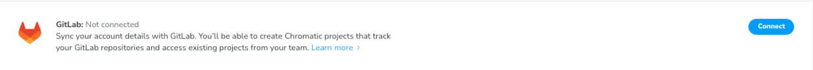
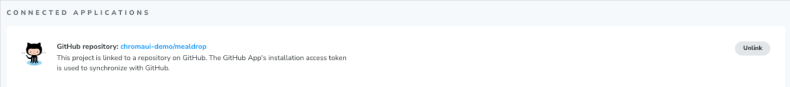

# Access control

Learn how to manage access to your Chromatic account and projects.

## Authentication

Sign in to Chromatic via OAuth, email, or SSO.

#### OAuth

Chromatic supports the cloud versions of GitHub, GitLab, or Bitbucket on our [self-serve plans](https://www.chromatic.com/pricing).

If you use the on-premise or self-managed versions of GitHub, GitLab, or Bitbucket, we can support you via our [enterprise plan](https://www.chromatic.com/pricing). We recommend trialing Chromatic first by following these [instructions](/docs/faq/chromatic-sso-on-premises-other-git).

    
What OAuth scopes does Chromatic request?

Depending on your Git provider, Chromatic will request a set of OAuth scopes when you first sign in. Chromatic uses these permissions to enumerate your list of repositories, set PR statuses, and retrieve users for assignment to review. Chromatic will never read/write source code.

| Git provider                                                                                                                 | OAuth Scopes                                             |
| ---------------------------------------------------------------------------------------------------------------------------- | -------------------------------------------------------- |
| [GitHub](https://developer.github.com/apps/building-oauth-apps/understanding-scopes-for-oauth-apps/#available-scopes)        | `['user:email', 'read:user', 'read:org', 'repo:status']` |
| [GitLab](https://docs.gitlab.com/ee/user/profile/personal_access_tokens.html#limiting-scopes-of-a-personal-access-token)     | `['api']`                                                |
| [Bitbucket](https://confluence.atlassian.com/bitbucket/oauth-on-bitbucket-cloud-238027431.html#OAuthonBitbucketCloud-Scopes) | `['account', 'repository', 'pullrequest', 'webhook']`    |

    
What do you need to link a project to a Git provider repository?

To link a project to a Git provider repository, you need:

- Membership in the organization that owns the repository.
- Write access to the repository, via one of the following roles:

| Git provider                                                                                                                                                                                                 | Role                                  |
| ------------------------------------------------------------------------------------------------------------------------------------------------------------------------------------------------------------ | ------------------------------------- |
| [GitHub](https://docs.github.com/en/organizations/managing-user-access-to-your-organizations-repositories/managing-repository-roles/repository-roles-for-an-organization#repository-roles-for-organizations) | `write`, `maintain`, or `admin`       |
| [GitLab](https://docs.gitlab.com/ee/user/permissions.html#project-members-permissions)                                                                                                                       | `developer`, `maintainer`, or `owner` |
| [Bitbucket](https://support.atlassian.com/bitbucket-cloud/docs/grant-repository-access-to-users-and-groups/)                                                                                                 | `admin`, or `write`                   |

    
What permissions does the GitHub App request?

Chromatic's GitHub App enables [UI Review](/docs/review) for pull requests. We need additional permissions to access pull request information and add PR checks.

- ✅ Read access to metadata
- ✅ Read and write access to checks and pull requests
- ✅ Read access to organization members (for collaborators)
- 🔒 We do not request access to your code

ℹ️ We recommend teams create a Chromatic “bot” or IT Service Account user on your Git provider. You can grant write permissions to that account for the repositories you want to link to Chromatic projects. This way, tokens aren’t tied to an individual user. And if a token expires, it’s straightforward for anyone on the team to validate a new one.

  
Does Chromatic access my source code?

No, Chromatic only uses the static Storybook build or Storybook source code (if the static build is not being used). The static build refers to a static web application that is generated from your Storybook that can be hosted by any web server.

**For unlinked projects:** Chromatic does not have access to your git provider

**For linked projects:** Chromatic requests data from your git provider without accessing your source code.

For GitHub, Chromatic only has access to repository metadata and merge request information.

However, GitLab and Bitbucket don't offer repository metadata and merge request information without full API access. Therefore, Chromatic has permission to access the source code on GitLab, but it doesn't actually access it.

    
How do I request access from my GitHub organization admin?

Chromatic requests the minimum permissions needed to use the tool. With GitHub, we request permissions for "OAuth" and "GitHub app" respectively. This allows organizations to expand permissions incrementally as they use more features.

If your GitHub organization requires an admin to approve apps, you'll need to request access inside of Chromatic and track their status inside of GitHub (below).

1. **Chromatic OAuth app**: Enables GitHub sign-in. Track your access request [here](https://github.com/settings/connections/applications/495b5c3cb5ae140436a0).
2. **Chromatic.com app**: Enables [UI Review](/docs/review). Track your access request [here](https://github.com/apps/chromatic-com).

    
Does Chromatic support custom GitHub roles?

**No, Chromatic doesn't support custom GitHub roles.**

Chromatic only receives the role name from GitHub, not the specific permissions associated with it. Custom role names prevent Chromatic from accurately determining permissions.

  
Is my forked repository subject to access restrictions?

When you have a fork of a private organization owned repository, that forked repository is going to be subject to that organization's access restrictions. For example, `org1/my-repo` is the original repository and you fork it to `org2/my-repo`. In this situation, the original repo `org1/my-repo` would need to approve Chromatic's OAuth App on their end. Once they do, you'll be able to use the forked repo `org2/my-repo` with Chromatic.

#### Email

Email and password authentication is available on all accounts. It's a popular authentication method for [external collaborators](/docs/collaborators#external-collaborators) like designers, PMs, and other stakeholders.

If you're setting up Chromatic for your team as the account owner or administrator, there are some boundaries to be aware of:

- Email accounts can use Chromatic as normal
- [Collaborators](/docs/collaborators) are manually managed
- [Pull request checks](/docs/ci#pull-request-checks) are manually setup via your CI system

We recommend signing up with email for projects that **are not** on GitHub, Bitbucket, or GitLab. For example, projects on services like Azure DevOps, AWS, etc. Read the setup instructions for these types of projects [here](/docs/faq/chromatic-sso-on-premises-other-git).

#### Single Sign-On (SSO)

Single Sign-On (SSO) is available to enterprise customers. To sign-in, make sure to navigate to your team's custom Chromatic URL, for example, `mycompany.chromatic.com`.

If you don't know the Chromatic URL for your team, you may need to ask the account or project owner.

  
What SSO providers are supported?

OneLogin, Okta, Google Workspace, PingOne, Keycloak, SimpleSAMLphp-based Identity Providers, and Active Directory Federation Services.

If your provider is not on the list, please reach out to us at support@chromatic.com or use our **in-app chat**, and we will determine if it is possible to integrate with it.

  
How do you log in with SSO?

Once SSO is enabled, you have two primary ways to log in:

1. **Direct subdomain link:** If a subdomain is enabled, the most straightforward method is to use your organization's unique login URL: `https://{YOUR-SUBDOMAIN}.chromatic.com/start`
2. **SSO provider dashboard:** Simply find and click the Chromatic application tile, and you'll be redirected and logged in automatically.

If you're having trouble logging in:

1. Ensure your user has been provisioned to the Chromatic application within your SSO provider. Confirm your user group has the necessary permissions.
2. Double-check that you are using the correct subdomain in the login URL. It must exactly match the one assigned to your organization.
3. Login issues are often caused by stale cookies or cached data. Try clearing your browser's cache and cookies or using a private/incognito window to log in.
4. If your organization has enabled IP restrictions, ensure you are connected to your corporate network (e.g., via a VPN) as required by your company's policy.
5. If your organization limits access by domain and you use a different email domain than your colleagues (e.g., you're a contractor), ask your team to issue you an email address on an approved domain or contact us to add your current domain to the company's allow list.

  
How do I update the SSO certificate?

The fastest and most reliable method is to provide a metadata URL from your Identity Provider (IdP). This is typically a secure link found in your IdP's admin console.

If your provider does not support a metadata URL, please send a new certificate to [priority-support@chromatic.com](mailto:priority-support@chromatic.com ) to schedule the change. This ensures a smooth transition and prevents authentication downtime for your users. Please include the following in your request:

1. The specific date, time, and timezone for the update.
2. A PEM-encoded X.509 certificate in one of these supported formats:

- `.pem`
- `.key`
- `.crt`
- `.cer`
- `.cert`

  
How are roles managed with SCIM?

SCIM (System for Cross-domain Identity Management) enables automatic user provisioning. After SSO is configured, SCIM allows you to add/remove users and manage roles directly from your IdP.

You must configure groups in your IdP that correspond to Chromatic's four roles: `Owner`, `Developer`, `Reviewer`, and `Viewer`. The groups must contain a `roles` or `role` attribute with values "owner", "developer", "reviewer", or "viewer" for Chromatic to recognize them properly.

  
Can roles be set differently for different projects?

No, SCIM currently sets standard roles across all projects - project-specific role assignment is not supported.

## Organizations

A Chromatic organization mirrors its counterpart GitHub Organization, Bitbucket Group, or GitLab Team. Open the account menu to swap between organizations or add a new organization.

## Projects

There are two types of Chromatic projects: linked and unlinked.

#### Linked projects

Linked projects are associated with a repository on GitHub, Bitbucket, or GitLab. That allows Chromatic to [sync collaborators](/docs/collaborators#project-collaborators), badge pull requests, get pull request metadata for [UI Review](/docs/review), and keep track of [UI Test](/docs) baselines.

By creating a linked project in Chromatic, you automatically have at your disposal:

- [Collaborators](/docs/collaborators) synched automatically based on your Git provider.

- The [visibility](/docs/collaborators#visibility) of your published Storybook will be synced with the visibility of your GitHub repository

- UI test notifications are enabled via automated webhooks for third-party integrations.

- Automated PR badging is configured automatically via [OAuth permissions](#what-permissions-does-the-github-app-request) granted by the Git provider.

- Chromatic's GitHub App provides a faster UI review process and PR metadata retrieval.

- Improved handling of [rebasing](/docs/branching-and-baselines) and squash & merge commit strategies enabled with Chromatic's GitHub App.

You can link a project during the project creation process or afterward on the project's Manage page within the Collaborators tab.

Why is my linked project showing up as <code>unknown</code>?

If you encounter an `<unknown>` project, this means Chromatic can no longer connect it to your Git repository.

To refresh the Git access token and reconnect the `<unknown>` project, request one of the account owners to log out and log back into Chromatic.

Alternatively, replace the Git token from the `Configure` tab on the `Manage` page of your project.

My token is <code>missing</code> or <code>invalid</code>

In the Project's Manage tab, you may see that your repository details couldn't be synced due to the token. This typically occurs for one of two reasons:

1. For **GitHub**, an access token is required when you first set up your project to link Chromatic to your repository. If this step wasn’t completed, the token will be missing.

2. Tokens can expire or be deleted on your Git provider’s side, which revokes their permissions.

Another team member can **replace** the token, or you can **unlink** and relink the repository to fix the issue.
If this doesn’t help, contact us at support@chromatic.com or via our in-app live chat.

If [IP restrictions](/docs/faq/allowlist-ips-for-git-providers) are set on your Git provider account but you haven’t added Chromatic’s IPs to the allowlist, the token may show as **invalid** or **missing** too. Setting the IPs will resolve this specific case.

Why am I getting <code>Could not retrieve repository ID</code> error when trying to link a repository?

If your project is part of an organization, you need to have [your access request](#how-do-i-request-access-from-my-github-organization-admin) approved by an admin at the organization level.
Approval from a repository-level admin alone will not be sufficient. The actual scopes that Chromatic requires are listed [here](#what-oauth-scopes-does-chromatic-request).

How do I migrate from one Git provider to another (e.g., GitLab → GitHub)?

**For linked accounts**

To migrate your Chromatic projects to the new Git provider:

1. Connect your user account to the new git provider via the [Profile page](https://www.chromatic.com/profile). Under “Connected accounts,” link your new git provider. Ensure that everyone on your team does the same. _Warning:_ do not disconnect the old git provider yet since you may lose access.
   

1. In the upper-right corner of the dashboard, open the menu and click "Add" to create a new Chromatic organization account for your new Git provider. You'll now see both accounts in that list, each linked to different Git providers.

1. Unlink all existing projects from the old Git provider through the `Manage` tab.
   

1. Then link all projects to repositories from the new Git provider. Note that projects will automatically move to the new Chromatic organization level account.

If you have a paid account, use our in-app chat to get in touch, or email us at support@chromatic.com to move your subscription to the new Chromatic entity.

**For unlinked accounts**

Follow steps 1, 3, and 4 from the guide above, but you don't need to create a new Chromatic organization level account.

**Important**

Connecting one Chromatic entity to multiple Git providers is not yet supported.

#### Unlinked projects

An unlinked project is perfect for teams that self-host Git or have enterprise Git providers (that aren't on Chromatic's enterprise plan). Unlinked projects still require Git; they are just not linked to a repository on GitHub, Bitbucket, or GitLab. They do not automatically [sync collaborators](/docs/collaborators#project-collaborators) or badge pull requests.

The characteristics of an unlinked project include:

- Your code is in a local or self-hosted repository.
- You're using an email/password account OR a personal OAuth account.
- Chromatic runs as a [CI-only](/docs/ci) job.
- Collaborators are [manually managed](/docs/collaborators#external-collaborators) via an invite list.
- PR badging is manually configured in your CI provider.
- Notifications are manually setup via Chromatic's [custom webhooks](/docs/integrations#custom-webhooks).

Learn how to create an unlinked project [here](/docs/faq/chromatic-sso-on-premises-other-git).

---

### Troubleshooting

How do I create an unlinked project on my existing GitHub, Bitbucket, or GitLab account?

- ❌ You can't create unlinked projects on GitHub org, Bitbucket workspace, or GitLab group connected accounts.
- ✅ You can create unlinked projects on personal GitHub, Bitbucket, or GitLab accounts.
- ✅ You can create unlinked projects on email/password accounts.

If your account is currently connected to a GitHub org, Bitbucket workspace, or GitLab group, you'll need to create a new email/password account to set up an unlinked project. Your teammates can access this account by sharing credentials (for example, with a password manager).

To share billing between an existing connected account and an email/password account, message us via in-app chat.

How do I link a project to a Git provider using my email/password account?

Email accounts are not connected to a Git provider by default. This means you can only create [unlinked projects](#unlinked-projects).

Follow these instructions to link your project to a Git provider:

1. Go to your profile (`/profile`) and connect to your Git provider.
2. Go to the project's Manage page » Collaborate tab.
3. Click to "sync collaborators with a Git repository".

This connects your Chromatic email/password account with your Git provider account, allowing you to set up a [linked project](#linked-projects).

Note: Your personal account must have access to the repository in order to connect in Chromatic. You may need to ask an administrator to grant you additional permissions.

How do I link my project to GitHub Enterprise Server or GitLab self-managed?

For Enterprise plans, we support connecting on-premise versions of GitHub Enterprise and GitLab. Please reach out to us via Support to get access.

You also need to have some information from your Git Provider setup ready

1. The URL to your Git Provider (e.g. https://chromatic.github.com, https://gitlab.custom.com)
2. The Name of Your Repository (e.g. chromatic/ux)
3. Access Token (See docs for [GitHub](https://docs.github.com/en/authentication/keeping-your-account-and-data-secure/managing-your-personal-access-tokens) and [GitLab](https://docs.gitlab.com/ee/user/project/settings/project_access_tokens.html))

Depending on your Git Provider, the relevant docs for creating an access token can be found below. When you create your token, please ensure that you enable the proper scopes.

| Git provider | Permission Scopes                                        |
| ------------ | -------------------------------------------------------- |
| GitHub       | `['user:email', 'read:user', 'read:org', 'repo:status']` |
| GitLab       | `['api']`                                                |

Once you have access and the prerequisite details, follow these instructions to link your project to GitHub Enterprise Server or GitLab self-managed:

1. Go to the manage (`/manage`) page for the app that you want to connect.
2. Click the Configure tab.
3. In the Connected Application section, find the "Sync project with a Git repository" area and click "Add on-prem Git Provider" to enter the details for your repository.

If your organization restricts IP addresses for git access, make sure to [add Chromatic's IP addresses to the allow list](/docs/faq/allowlist-ips-for-git-providers/#my-organization-restricts-ip-addresses-for-git-access-should-i-add-chromatic-to-the-allowlist).

Why am I getting an error when trying to access a GitHub SSO project that I see listed in Chromatic’s project list?

This error can occur when Chromatic isn’t authorized for a GitHub organization that has SSO/SAML also configured. In order to grant access to a project, Chromatic uses that project’s token and your account’s GitHub token. During the login process for Chromatic you authenticate with GitHub and will be presented with a prompt inside of GitHub to authorize Chromatic for use in your organization.

You must click the **Authorize** button. If you don’t click the **Authorize** button, but instead click the **Continue** button, you will not be able to access the project in Chromatic. If the person that set up the project previously logged into Chromatic with their GitHub credential but never authorized Chromatic for their organization, their teammates will also encounter this issue.

