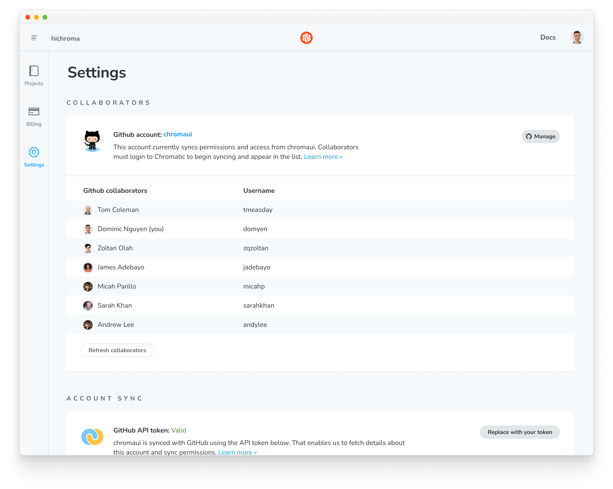
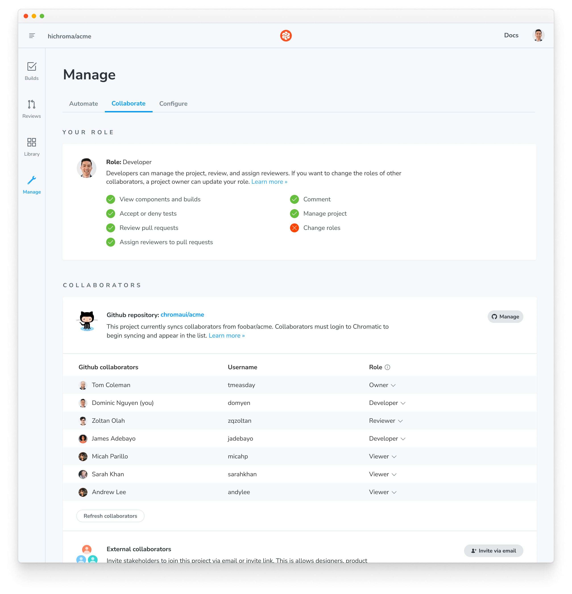
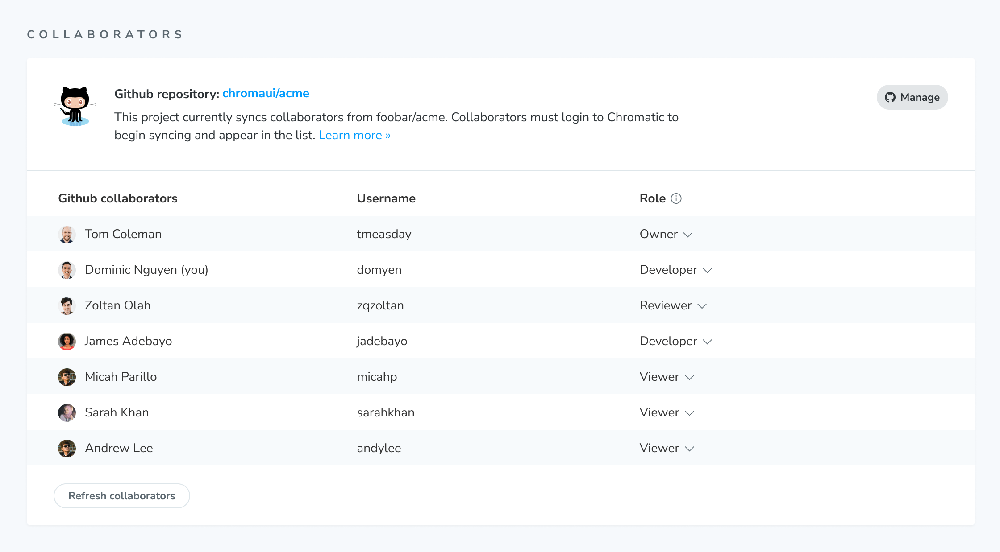
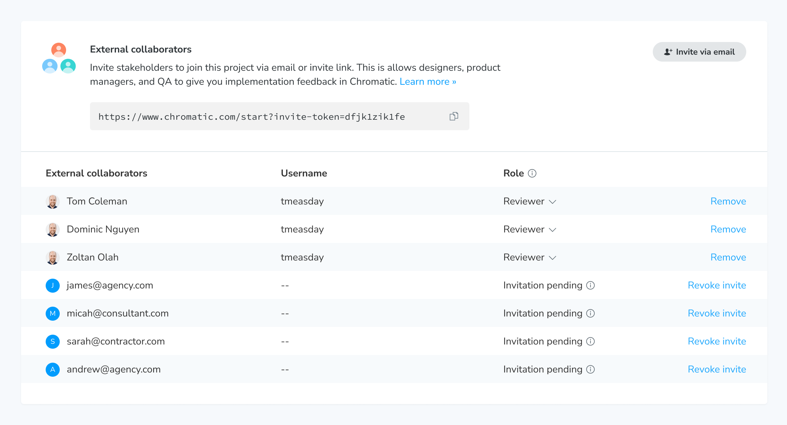
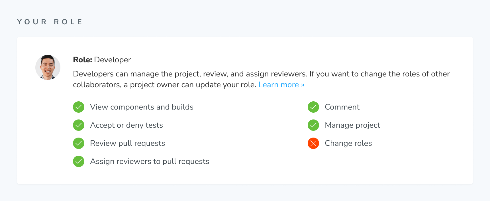
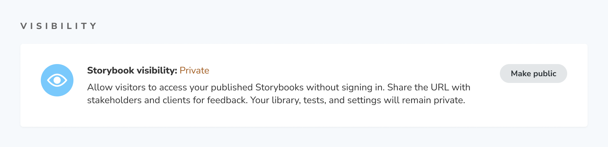

# Collaborators

Chromatic keeps track of UI feedback and tests in one place so that collaborators stays aligned without you having to do extra work.

## Organization collaborators

Manage organization collaborators via OAuth, email, or SSO.

#### OAuth

Chromatic mirrors access permissions with your GitHub Organization, Bitbucket Group, or GitLab Team. Users who have access to your organization will also have access to your Chromatic organization.

| Permission level       | What collaborators can do                           |
| ---------------------- | --------------------------------------------------- |
| Organization: `member` | View / change account settings, view / add projects |

Organization collaborators can manage billing and account status but may not have access to projects. You need to be a [project collaborator](#project-collaborators) to view and manage projects.

Go to your organization's Settings page to view collaborators.

#### Email

Email and password accounts don't have the concept of organization-level collaborators. If you want other teammates to access an account, you'll need to sync the account with a [Git provider](#organization-collaborators) or share login credentials (for example, via a password manager).

However, projects _within_ an organization do support [project-level collaborators](#project-collaborators).

#### Single Sign-On (SSO) for organizations

Single Sign-On (SSO) is available to enterprise customers. Chromatic syncs access permissions with your SSO provider. At the organization-level, contact us via in-app chat or email to manage or remove collaborators.

When you add collaborators in your SSO provider, that access will be reflected in Chromatic automatically.

### Billing and usage

Collaborate on billing, usage, and permissions by syncing your organization with GitHub, Bitbucket, or GitLab.

For email and password accounts, only the account owner can login to access billing information. For SSO accounts, contact your company's SSO administrator to manage billing.

How can I give someone billing access?

If you have an email/password user account (not linked to Git) and need access to billing, please email us at **support@chromatic.com** with your email address.

## Project collaborators

#### OAuth

Chromatic syncs access permissions with your GitHub, Bitbucket, or GitLab repository. Users who have access to your code will also have access to your project.

| Permission level | What collaborators can do                                             |
| ---------------- | --------------------------------------------------------------------- |
| Repo: `read`     | View project, auto-assigned the [Viewer](#roles) role                 |
| Repo: `write`    | Review and manage project, auto-assigned the [Developer](#roles) role |

If your project is hosted in Bitbucket, ensure that you and your team members have the <code>contributor</code> role.

Project collaborators can view and manage the project based on their [role](#roles). Go to your project's Manage page to view collaborators and assign roles.

You can add or remove a collaborator by adjusting their access in your Git repository. The permission changes in your upstream repository are mirrored downstream in Chromatic.

Manually override the mirrored permissions by adjusting collaborator [roles](#roles) or [inviting external collaborators](#external-collaborators) on an ad hoc basis.

#### Email

If you signed up via email and password, Chromatic won't have a Git repo to sync with. You'll need to manage project collaborators manually via external collaborators [below](#external-collaborators).

#### Single Sign-On (SSO) for projects

Chromatic syncs access permissions with your SSO provider. At the project-level, all collaborators who have access via SSO will also get access to every Chromatic project within your organization's account.

When you add or remove collaborators in your SSO provider, that access will be reflected in Chromatic automatically.

### External collaborators

Projects can also have external collaborators. These are stakeholders like PMs, designers, and consultants who don't commit code but contribute to the sign off process. They can also be fellow developers who don't have repo access or use a different Git provider.

External collaborators are added and removed manually. Once they create an account, they'll get access to your project. There are two ways to add collaborators:

- Invite link: Share a URL with stakeholders. They are auto-assigned a `developer` role.
- Invite email: Send individual invites via email. You can fine tune roles before sending.

#### Limitations of external collaborator accounts

External collaborator accounts cannot link the project to a repository on GitHub, Bitbucket, or GitLab.

How can I invite external collaborators to my SAML account?

SAML accounts do not directly support **external collaborators**. However, we have an allowlist of email domains that can access Chromatic with SSO.

We can add any email domain to the allowlist, as long as it is not a generic email address with `@gmail` or `@yahoo`. For example, if you have a contractor with an email like `person@storybook.org`, we can add `storybook.org` to the allowlist for your SAML account.

Many companies add contractors as external users by creating specific domains for them, such as `person@chromatic-ext.com`, and then adding `chromatic-ext.com` to the allowlist.

Send us the list of external collaborators via our **in-app chat** or email us at [support@chromatic.com](mailto:support@chromatic.com).

### Roles

Roles give you fine-grained control over who can do what. There are four roles that can be assigned to any collaborator.

Each project has a unique set of roles that are managed by the project owner. For example, you can be a "developer" in one project and a "viewer" in another.

| Role                | What you can do                                                                                                |
| ------------------- | -------------------------------------------------------------------------------------------------------------- |
| Owner               | Can manage, delete the project, and manage/assign roles to collaborators.                                      |
| Developer (default) | Can manage the project, review tests, approve PRs, and assign reviewers. Cannot assign roles to collaborators. |
| Reviewer            | Can leave comments, review tests, and approve PRs they're assigned to. Cannot assign others or self-approve.   |
| Viewer              | Read-only access to the project.                                                                               |

#### Project ownership

Projects must have at least one owner. The `owner` role is automatically assigned to the first user in a Chromatic project.

Transfer ownership by assigning another collaborator as an owner and then reassigning yourself another role.

#### View your role

Go to your project's Manage page to view your role and it's capabilities.

#### Roles for open source projects

Open source projects are viewable to all users even if they're not listed as a collaborator or have a Chromatic account. But in order to manage or review the open source project, collaborators must have explicit access and the corresponding role.

#### Roles for Single Sign-On (SSO)

Chromatic syncs collaborators with your SSO provider. All collaborators are granted `developer` capabilities.

### Visibility

By default, published Storybooks on Chromatic are private. They can only be accessed by collaborators who are signed in to Chromatic and have permission to view components and builds.

However, published Storybooks for [linked projects](/docs/access#linked-projects) with public repositories will be set to public.

When you set Storybook visibility to public, it will be accessible to visitors without signing in. Anyone with a link can access. Your private information like Chromatic library, tests, settings, Git provider, and any associated metadata will remain private. A public Storybook only shares information that is contained in that Storybook.

---

### Troubleshooting

Why can't my teammates access a project?

Chromatic syncs permissions at the account _and_ repo level. Check that your teammates are listed as collaborators in your GitHub, GitLab, or Bitbucket repository.

If they aren't listed, please add them and try accessing the Chromatic project again (you may have to sign in again). Learn more about [access control](/docs/access).

