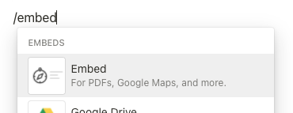

# Embed stories

Embed stories published to Chromatic in Medium articles, Notion pages, and countless other platforms.

Before we begin, you'll need to figure out which embed format your platform supports: oEmbed or standard `<iframe>`s. From there, paste the URL of a published story in the given format.

<div class="aside">

In order to embed stories, your published Storybook must be publicly accessible.
Learn more about [project visibility](/docs/collaborators#visibility).

</div>

## Embed a story with the toolbar

Embed a story with the toolbar by replacing the `<appid>`, `<uploadhash>`, and `<path-to-story>` with the details for your story. You can retrieve this URL by opening your Storybook from a Build or Library screen. Embedding Storybooks by their branch name or commit hash is not supported yet.

```shell
// oEmbed
https://<appid>-<uploadhash>.chromatic.com/?path=<path-to-story>

// iframe embed
<iframe src="https://<appid>-<uploadhash>.chromatic.com/?path=<path-to-story>&full=1&shortcuts=false&singleStory=true" width="800" height="400"></iframe>
```

<iframe src="https://5ccbc373887ca40020446347-idzavsdems.chromatic.com/?path=/story/shadowboxcta--default&full=1&shortcuts=false&singleStory=true" width="100%" height="400" style="border: none;"/>

## Embed a plain story

Embed a plain story without the toolbar by replacing the `<appid>`, `<uploadhash>`, and `<path-to-story>` with the details for your story.

```shell
// oEmbed
https://<appid>-<uploadhash>.chromatic.com/iframe.html?<path-to-story>&viewMode=story

// iframe embed
<iframe src="<appid>-<uploadhash>.chromatic.com/?path=<path-to-story>&viewMode=story&shortcuts=false&singleStory=true" width="800" height="400"></iframe>
```

<iframe src="https://5ccbc373887ca40020446347-idzavsdems.chromatic.com/iframe.html?id=shadowboxcta--default&viewMode=story&shortcuts=false&singleStory=true" width="100%" height="200" style="border: none;"/>

## Embed a docs page

You can also embed a docs page by replacing the `<appid>`, `<uploadhash>`, and `<path-to-story>` with the details for your story.

```shell
// oEmbed
https://<appid>-<uploadhash>.chromatic.com/iframe.html?<path-to-story>&viewMode=docs

// iframe embed
<iframe src="https://<appid>-<uploadhash>.chromatic.com/?path=<path-to-story>&viewMode=docs&shortcuts=false&singleStory=true" width="800" height="400"></iframe>
```

<iframe src="https://5ccbc373887ca40020446347-idzavsdems.chromatic.com/iframe.html?id=shadowboxcta--docs&viewMode=docs&shortcuts=false&singleStory=true" width="100%" height="400" style="border: none;"/>

---

### How to embed stories on popular platforms

<details>

<summary>How to embed stories in Medium</summary>

Paste the Storybook URL into your Medium article, then press Enter. The embed will automatically resize to fit the height of your story.

While editing an article, Medium renders all embeds non-interactive. Once you publish, the embed will be interactive. [View live demo on Medium »](https://medium.com/@ghengeveld/embedding-storybook-on-medium-ce8a280c03ad)

</details>

<details>

<summary>How to embed stories in Notion</summary>

In your Notion doc type `/embed`, press Enter, then paste the Storybook URL as the embed link. You can manually resize the embed as needed.



</details>

<details>

<summary>How to embed stories in Ghost</summary>

In your Ghost post type `/html`, press Enter, then paste the `<iframe>` URL. You can manually resize the embed via the height and width properties as needed.


</details>
