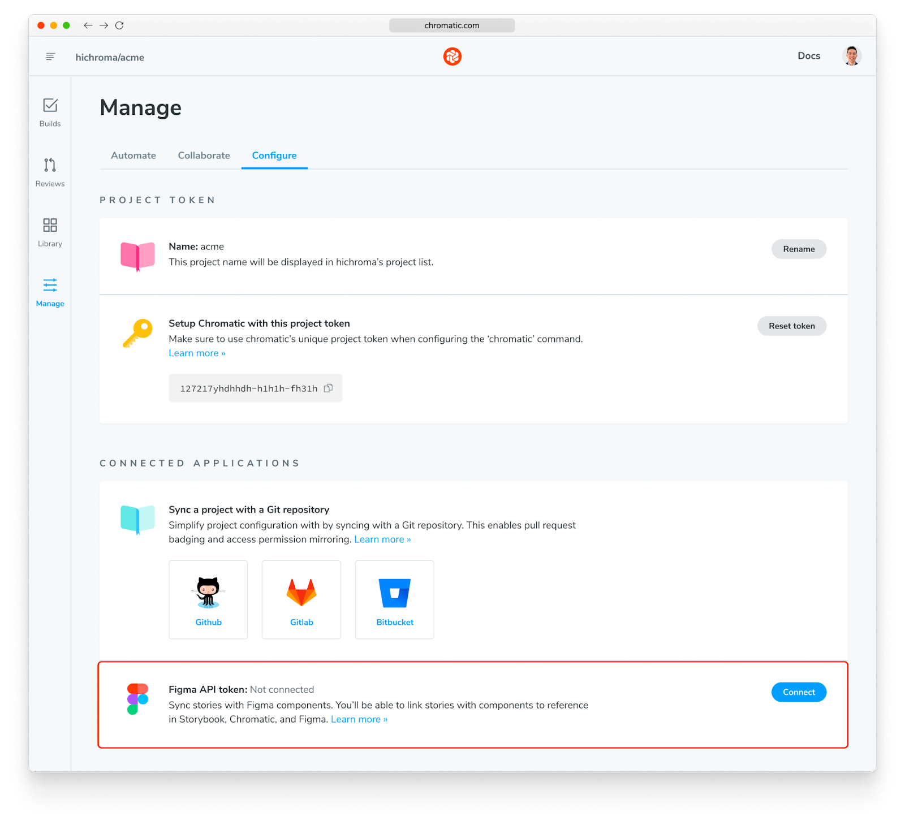
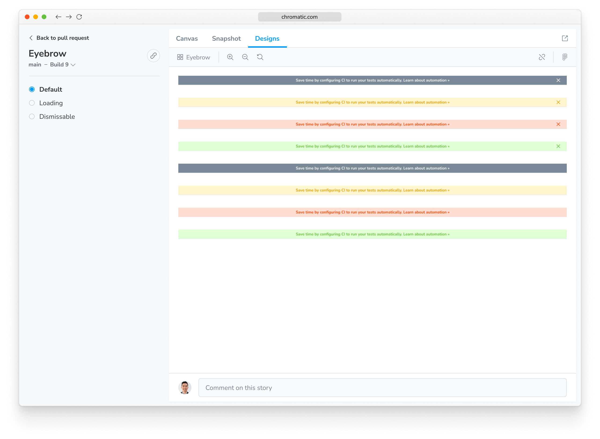

# Figma in Chromatic

In 2022 Chromatic released Storybook Connect, a Figma plugin that connects stories to Figma components. This connection allowed you to view your team’s Storybook stories without leaving Figma. Since then, thousands have downloaded the plugin to bring their stories closer to the designs.

Figma in Chromatic is another integration with Figma, bringing that code and design, side-by-side support into Chromatic. With this integration, you’ll be able to view Figma components alongside their linked story right in Chromatic.

## Enable

To get started with this integration, you need to connect your Figma account with Chromatic. Visit your project’s Manage page, and under the configuration tab, you’ll find a new “Connected Applications” section. If you or a teammate have the appropriate Figma access to view your team's designs you can go ahead and connect Figma to this project.

## View a linked Figma design

If you’ve already linked Figma components and stories via the [Storybook Connect Figma plugin](https://www.figma.com/community/plugin/1056265616080331589/Storybook-Connect) then you’ll be able to view those Figma components in Chromatic already. Just visit the Library in your Chromatic project and click one of your components. You’ll see a new “Designs” tab which renders the Figma component in a canvas.

You can zoom, pan, and even inspect the layers.

## Create a link to a Figma design

If you haven’t used the Figma plugin already, you can now connect your Figma components to your stories from within the Chromatic web app. You just need to grab the Figma URL for a component like so:

Next, enter that URL in the form on any story's design tab and save the connection for all your teammates to view this design in the future.

## Things to note

- When you link a Figma frame or layer that is not a component it will not show up in the Figma plugin, Storybook Connect, because the plugin only supports Components at this time.
- Components linked from either the plugin or the Chromatic side that have not been published to a Figma library yet will not render within the Designs tab.

Looking for a Figma plugin?

[Storybook Connect](/docs/figma-plugin) is a Figma plugin that allows you to link stories to Figma components. Once linked, you can view your live stories in the design workspace without leaving Figma.

