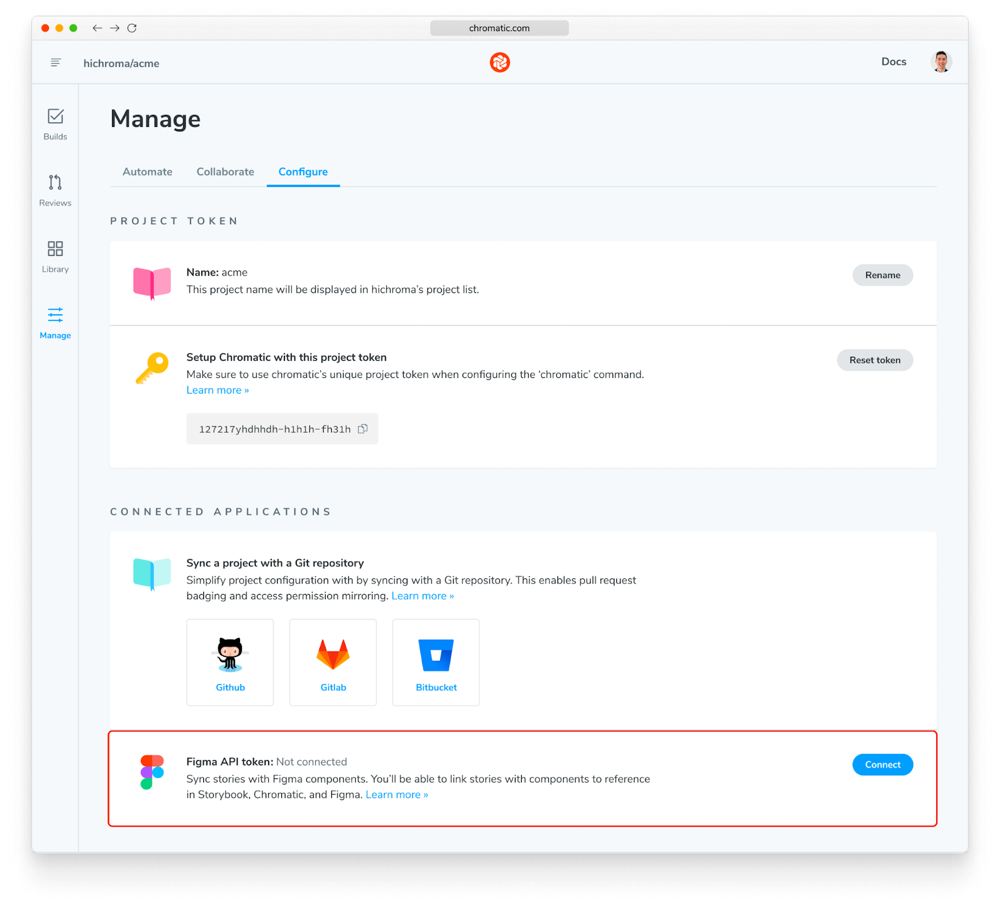
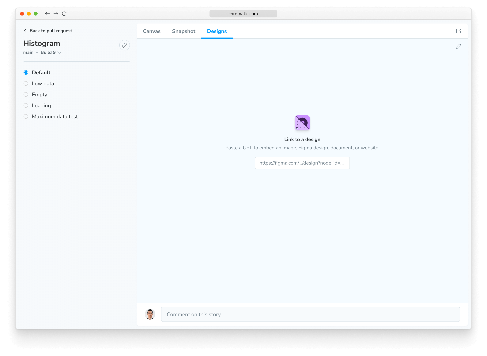
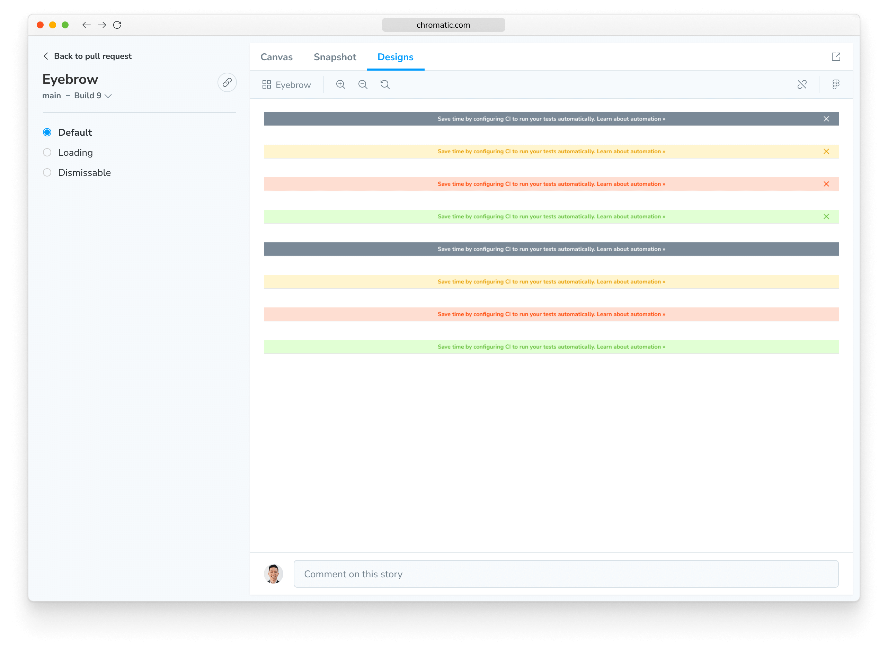
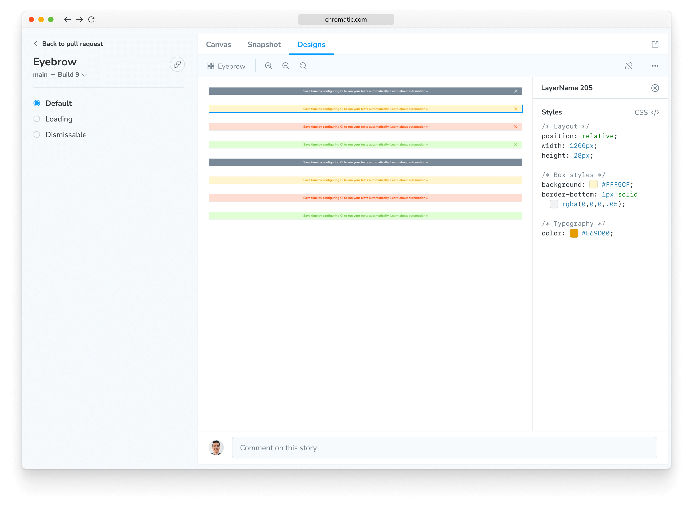

import { YouTubeCallout } from "../../components/YouTubeCallout";

# Figma in Chromatic

View Figma components alongside their linked story right in Chromatic.

<YouTubeCallout
  client:load
  id="OehwbahKzEo"
  summary="Integrating Figma with Chromatic"
/>

## Enable

Get started with this integration by connecting your Figma account with Chromatic. Visit your project’s Manage page, and under the configuration tab, you’ll find “Connected Applications”.

## Link to a Figma design

To link Figma components to your stories using the Chromatic web app, copy the Figma URL for a component like so:

  Chromatic only supports linking Figma components. It doesn't support links to
  frame or layers.

Then enter that URL on a story's Designs tab. This will link the design with the story. You and your teammates will now be to quickly reference the design in the future.

## View a Figma design in Chromatic

View Figma designs in Chromatic by going to Library and clicking one of your components. You’ll see a Designs tab which shows the linked Figma design.

You can zoom, pan, and even inspect the layers.

## Bring your stories into Figma with our plugin

[Storybook Connect](/docs/figma-plugin) is a Figma plugin that allows you view your live stories in your design workspace. It works bi-directionally with Figma in Chromatic. Any connection you make between story and component will be visible in the plugin and in Chromatic.
