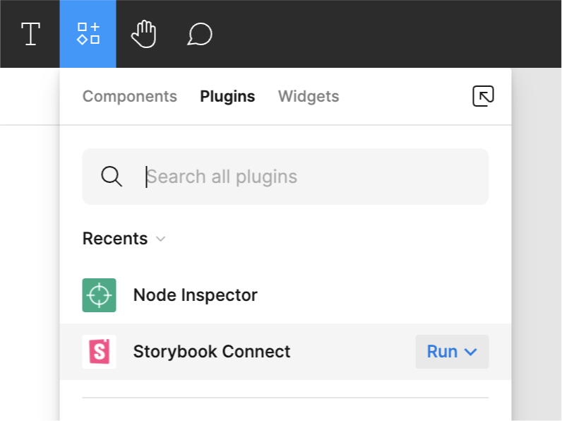
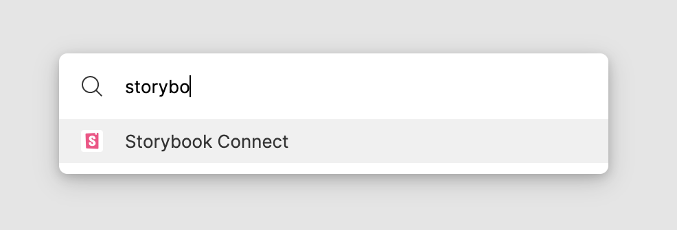
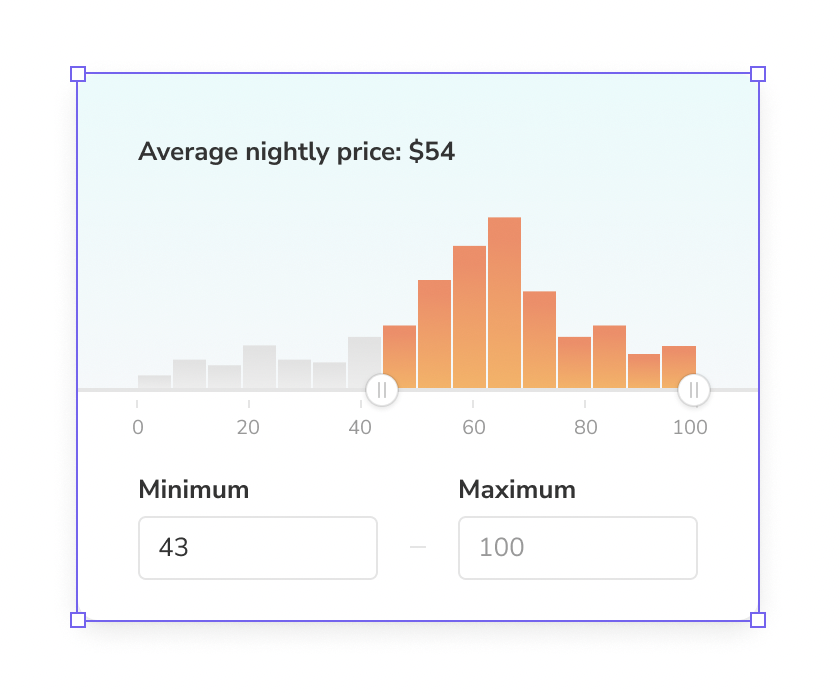
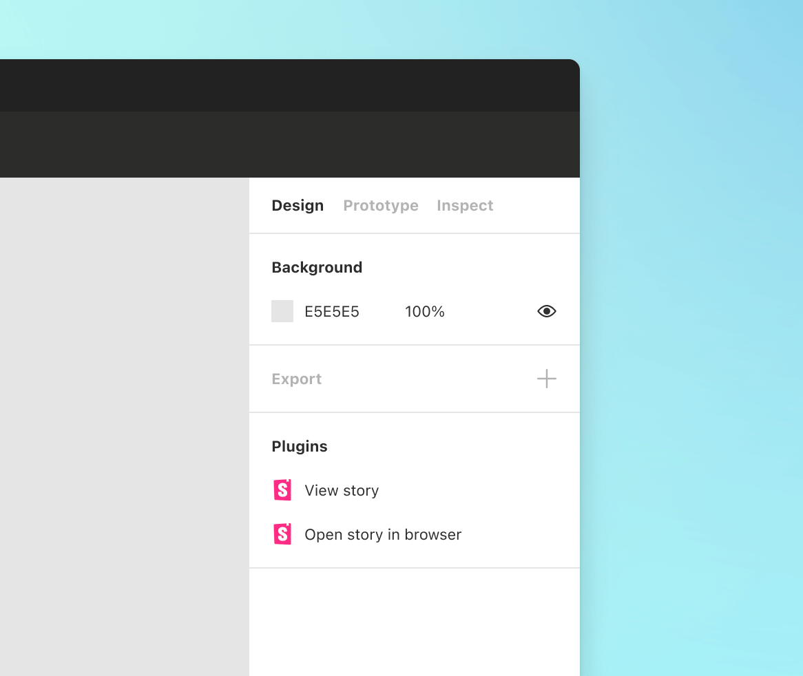
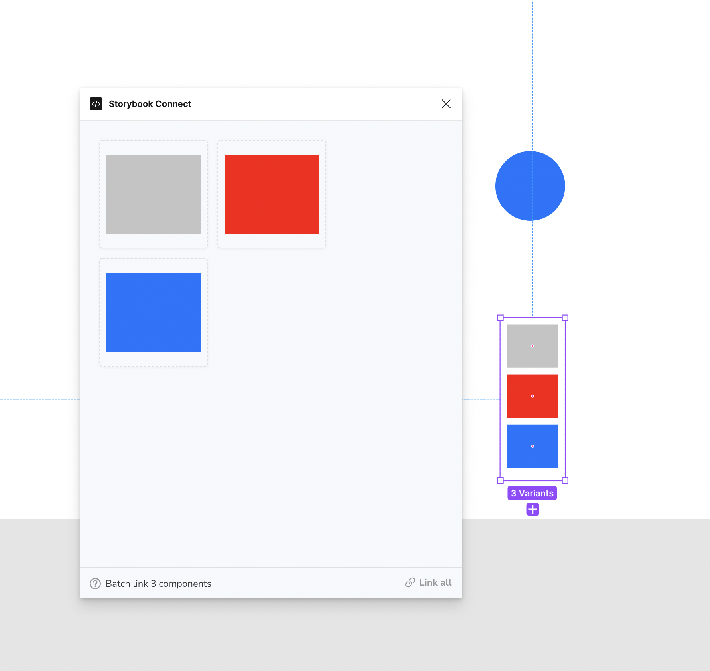
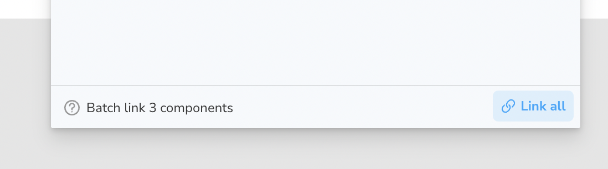

# Storybook Connect (Figma) plugin

Storybook Connect is a Figma plugin that allows you to link stories to Figma components. Once linked, you can view your live stories in the design workspace without leaving Figma.

<video autoPlay muted playsInline loop width="560px" class="center" style="pointer-events: none;">
  <source src="/docs/assets/figma-plugin-overview.mp4" type="video/mp4" />
</video>

#### Prerequisites

- Figma `editor` role (to both link and view stories)
- Listed as a [collaborator](#collaborators) in the Chromatic project
- Edit access to the Figma file

### Install the plugin

1. Go to [Storybook Connect](https://www.figma.com/community/plugin/1056265616080331589/Storybook-Connect) in the Figma community to install the plugin.
2. Open the plugin from the Resources Tab (shift+i) > Plugins > Storybook Connect. 

Alternatively you can use the command palette in Figma `command + /` then type `Storybook Connect`.  3. Follow the installation instructions to authenticate with Chromatic.

### Link a story to a Figma component

1. Select a Figma component to link. The plugin supports linking stories to Figma components, variants, and instances. It does not support linking stories to layers. 

2. Navigate to a story in a Storybook published on Chromatic. Make sure it's on the branch you want to link. Then copy the URL to the story. 

3. Paste the URL into the plugin’s form field. 

4. Once linked, the component and its instances will all have links in the sidebar to view the corresponding story. 

Do I need to re-link components everytime Storybook is published?

Nope. Chromatic automatically updates your linked stories to reflect the latest build on the designated branch. That means even when the build URL for a branch changes in Chromatic, the Figma component will always display the latest build on the branch.

### Link a story to multiple Figma variants at the same time

1. Select Figma variants. 

2. Click "Link all". 

3. Paste the URL into the plugin’s form field. 

### Open a story in Figma

1. Select the component that you've previously linked in Figma.
2. Then navigate to Figma’s Design sidebar and click the “View story” action. Alternatively, open the plugin by using the command palette `command + /` then type the name `Storybook Connect`.

<video autoPlay muted playsInline loop width="560px" class="center" style="pointer-events: none;">
  <source src="/docs/assets/figma-plugin-open-story.mp4" type="video/mp4" />
</video>

### Collaborators

When a story is linked to a Figma component, that link persists across teams and Figma files. Only [collaborators](/docs/collaborators) can find and access linked components for security purposes.

Invite non-technical teammates like designers or PMs to your Chromatic project as [external collaborators](/docs/collaborators#external-collaborators). That gives them permissions to view and manage linked components.

Every Chromatic plan comes with unlimited collaborators and [fine-grained roles](/docs/collaborators#roles). There are no extra charges "per seat".

---

## Frequently asked questions

Want to incorporate Figma in Chromatic?

Chromatic has [another integration with Figma](/docs/figma-in-chromatic) that brings code and design, side-by-side support into the web app. You’ll be able to view Figma components alongside their linked story right within Chromatic.

What URLs are supported in the Figma plugin?

The plugin supports two url formats hosted on Chromatic:

| URL Format                       | Example                                                                                                                                                      |
| -------------------------------- | ------------------------------------------------------------------------------------------------------------------------------------------------------------ |
| Story URL in published Storybook | `https://master--5ccbc373887ca40020446347.chromatic.com/?path=/story/button--basic`                                                                          |
| Component URL in Chromatic       | `https://www.chromatic.com/component?appId=5ccbc373887ca40020446347&csfId=button&buildNumber=1242&k=64821b99eedbc52679c33cd6-1200-interactive-true&h=7&b=-1` |

Can I trigger a Chromatic build from Figma?

No, when you update your Figma project, you must update your code and run a Chromatic build to upgrade the baseline.

