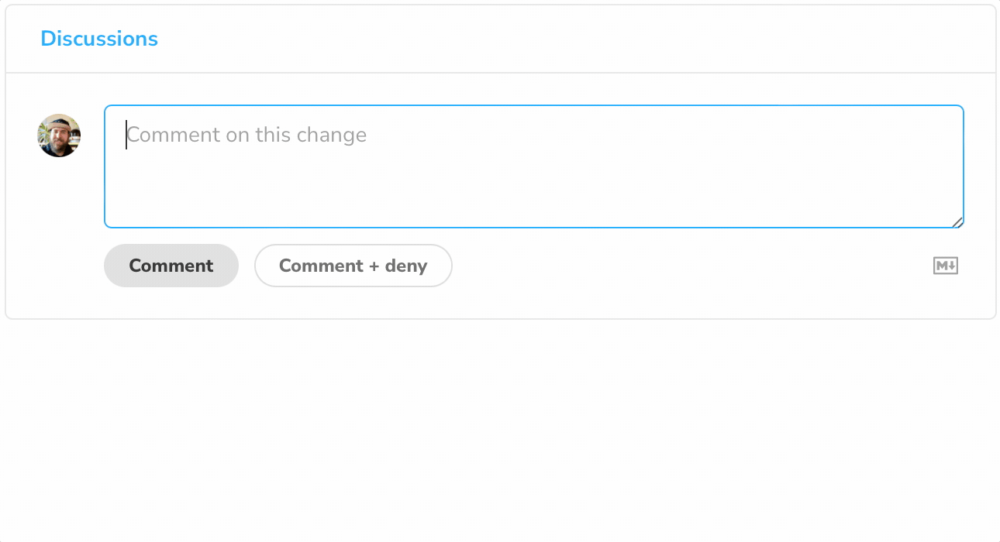

# Markdown support in Chromatic

Create sophisticated formatting for your prose and code in Chromatic with simple syntax.



## Styling text

Wrap your text with `**` to add emphasis. When published the text will be formatted in **bold**.

```md
**This is bold text.**

This is not.
```

## Quoting code

Call out relevant code or commands inside a discussion by surrounding the relevant text with single backticks <code>`</code>, the text within the backticks will not be formatted.

```md
Run Chromatic by issuing `npx chromatic --project-token=<project-token>`
```

## Working with code blocks

Share code examples by wrapping the relevant code with triple backticks <code>\`\`\`</code> before and after each code block. We recommend placing a blank line before and after the code block for readability.

````md
```js
function Example() {
  console.log("This is an example function");
}
```
````

## Working with lists

Create lists of items in your discussions by preceding one or more lines of text with `-` or `*`.

```md
- First item

- Second item

- Third item
```

If you need to order your list, precede each line with a number.

```md
1. First item

2. Second item

3. Third item
```
