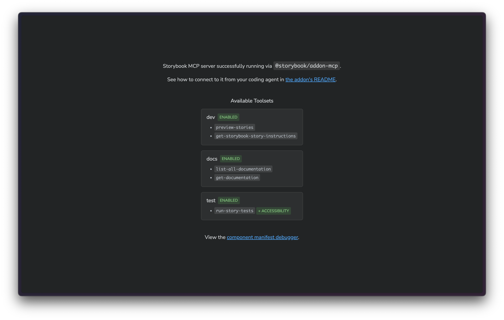
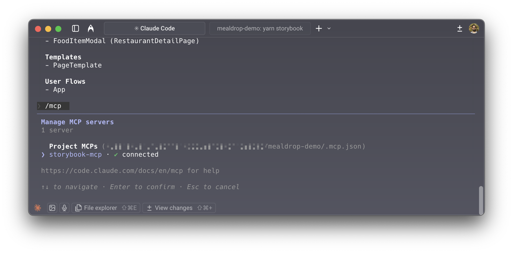
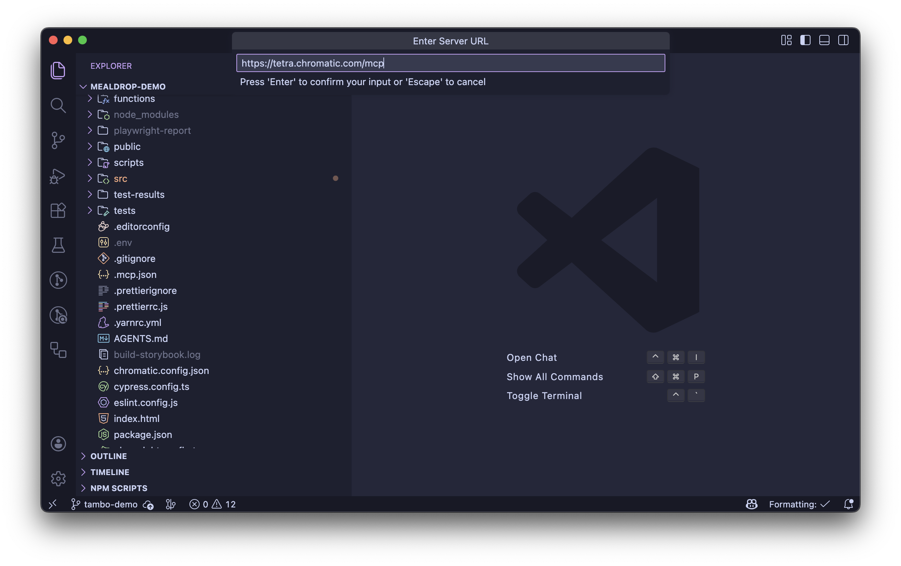
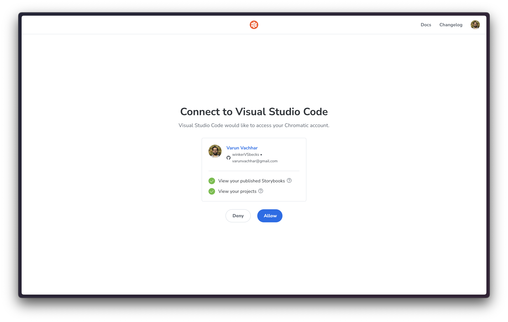

import InstallSnippets from "../../components/InstallSnippets.astro";

# Publish your Storybook MCP server

Without the right context, agents tend to produce low-quality code that doesn't align with your project's conventions. They often create new components instead of reusing existing ones and hallucinate APIs.

Storybook MCP was developed to improve generated code quality by providing agents with project-specific context about your components and allowing them to self-correct using Storybook’s testing tools.

Locally, the MCP is served by the Storybook dev server endpoint. However, to ensure the MCP server is accessible to your entire team and their coding agents, you need to deploy it.

Chromatic simplifies this process by automating deployment and hosting your MCP server alongside your published Storybook. It also manages access control, ensuring that only authorized collaborators can use your MCP server.

<details>

<summary>Why do I need to publish my Storybook MCP server?</summary>

Product teams often consume design systems built by other teams. They're unable to access the MCP server for that design system without running its Storybook locally. By publishing the MCP server, you can ensure that all consumers of a design system have access to the MCP server for that design system.

Published MCP server access also enables cloud-based coding agents such as Claude Code and GitHub Copilot to access component metadata and stories.

Additionally, it enables designers and other non-developers to prototype with coding agents without requiring a local development environment setup.

</details>

## Setup guide

To deploy your Storybook MCP server with Chromatic, you need to enable the MCP feature in your Storybook. If you've already done that, you can skip to step 3 to install the MCP server in your coding agent.

### 1. Enable MCP specific features

To use the MCP server, you need to be using Storybook 10.1 or later. If you're not already on Storybook 10.1+, upgrade your Storybook by running:

```bash
npx storybook@latest upgrade
```

Then enable the MCP-specific experimental features in your Storybook configuration.

```tsx title=".storybook/main.ts"
// Replace your-framework with the framework you are using (e.g., react-vite, nextjs)
import type { StorybookConfig } from "@storybook/your-framework";

const config: StorybookConfig = {
  // other config such as:
  // stories: [] etc.
  // ...
  features: {
    componentsManifest: true,
  },
};
export default config;
```

Storybook Component Manifest packages all of your component metadata as JSON. This includes JSDoc descriptions, React Docgen props tables, story source snippets, and content that can be extracted from MDX docs pages. This manifest is consumed by the MCP server.

Code Examples feature updates your `addon-docs` source snippets to match the manifest content. This format is better for both agents and humans.

Once you restart your Storybook, you should be able to see the manifest at: `http://localhost:PORT/manifests/components.html`

### 2. Install the MCP addon

Once the manifest is working, install the MCP addon by running:

```bash
npx storybook add @storybook/addon-mcp
```

You should now be able to see the MCP server route in your Storybook: `http://localhost:PORT/mcp`



For more information, please refer to the [Storybook MCP documentation](https://storybook.js.org/TBD).

### 3. Deploy the MCP server

To deploy your MCP server, you need to publish your Storybook to Chromatic.

#### Existing projects

Simply run your Chromatic build as usual (either via CI or locally). This will automatically deploy your MCP server alongside your Storybook.

#### New projects

Sign in to Chromatic and create a project.


Then run your first Chromatic build to publish your Storybook and MCP server.

{/* prettier-ignore-start */}

<InstallSnippets>
  <Fragment slot="npm">
  ```shell
  $ npx chromatic --project-token <your-project-token>
  ```
  </Fragment>
  <Fragment slot="yarn">
  ```shell
  $ yarn chromatic --project-token <your-project-token>
  ```
  </Fragment>
  <Fragment slot="pnpm">
  ```shell
  $ pnpm chromatic --project-token <your-project-token>
  ```
  </Fragment>
</InstallSnippets>

{/* prettier-ignore-end */}

### 4. Verify your MCP server is published

Once the build is complete, you will see a confirmation message with links to your published Storybook and MCP server in both the build output and the Chromatic web app's build screen.

{/* TODO: Insert screenshot of webapp here */}

#### Grab your MCP server URL

Chromatic publishes an instance of your MCP server for every build. However, to ensure stability, we recommend permalinks. For example, this will always point to latest successful build on your `main` branch:

```
https://main--<appid>.chromatic.com/mcp
```

You can construct permalinks to your MCP server from the "Collaborate" tab of your project settings in Chromatic.

{/* TODO: Insert screenshot of webapp here */}

### 5. Install the MCP server in your coding agent

Now that you've verified the MCP server, add it to your coding agent.

```bash
claude mcp add storybook-mcp --transport http https://main--<appid>.chromatic.com --scope project
```

Use the `/mcp` command to confirm that the MCP server is installed:



#### Authentication for private Storybooks

For private Storybooks, you need an MCP client that supports [OAuth CIMD](https://client.dev/), such as VSCode Copilot. CMID is a new standard for authenticated MCP servers.

<div class="aside">
  ⚠️ Claude Code does not yet support CIMD. Please upvote [this
  issue](https://github.com/anthropics/claude-code/issues/18251) to nudge the
  Claude Code team to add it.
</div>

To install Storybook MCP for a private Storybook in VSCode Copilot:

1. Open the command palette, and select the option: `MCP: Add Server...`
2. Select “HTTP” and paste the URL to your published server, e.g.: `https://main--<appid>.chromatic.com/mcp`
   
3. Provide a name for the server & accept
4. After accepting, you'll be prompted to authenticate



### 7. Run a prompt to test your MCP server

You're all set! Let's test it out. Start by explicitly asking the agent to run `list-all-documentation` on the MCP server. It should return a list of all components in your project.

Then run a typical prompt in your project such as the following:

```md
Create a flight booking component that includes:

- An autocomplete component for choosing source and destination from the following list of airports:
  SYD: – Sydney Airport, Australia
  MEL: – Melbourne Airport (Tullamarine), Australia
  LAX: – Los Angeles International Airport, USA
  JFK: – John F. Kennedy International Airport, New York, USA
  LHR: – Heathrow Airport, London, UK
  CDG: – Charles de Gaulle Airport, Paris, France
  ATL: – Hartsfield–Jackson Atlanta International Airport, USA
  DXB: – Dubai International Airport, UAE
  HKG: – Hong Kong International Airport, Hong Kong
  BNE: – Brisbane Airport, Australia
  PER: – Perth Airport, Australia
  DFW: – Dallas Fort Worth International Airport, USA

- A toggle button for return vs one way
- One or two date selects that when clicked on triggers a popover with a calendar widget.

The calendar widget shouldn't allow selecting dates in the past and the return flight must be after the outward flight.
```

You should see the agent using the tools provided by your Storybook MCP server to find and reuse existing components.

---

## Frequently asked questions

<details>
<summary>How do I enable or disable MCP publishing?</summary>

From your projects manage screen, navigate to the "Collaborate" tab and scroll down to find the "MCP Server" integration. From there you can enable or disable MCP publishing.

</details>

<details>
<summary>Are all tools available in the published MCP server?</summary>

Storybook MCP provides the following tools to coding agents:

- Dev tools
  - `get_ui_building_instructions`
  - `preview-stories`
- Docs tools
  - `list-all-documentation`
  - `get-component-documentation`

However, only the Docs tools are available in the published MCP servers. That's because Dev Tools provide project-specific implementation instructions which might be different for design systems consumed by multiple projects.

</details>

<details>
<summary>How do I exclude a component from the manifest?</summary>

The manifest provides lots of context to the agent; however, this context is not free. It consumes tokens, and excessive or _misleading_ context can degrade performance.

To exclude a component or story from the manifest, use the `!manifest` [tag](https://storybook.js.org/docs/writing-stories/tags).

```tsx title="MyNoisyComponent.stories.tsx"
export default {
  component: MyNoisyComponent,
  tags: ["!manifest"],
};
```

</details>
