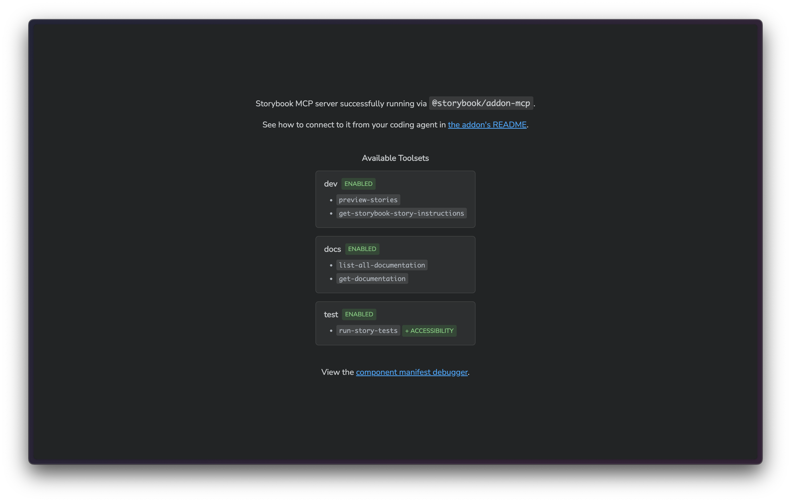
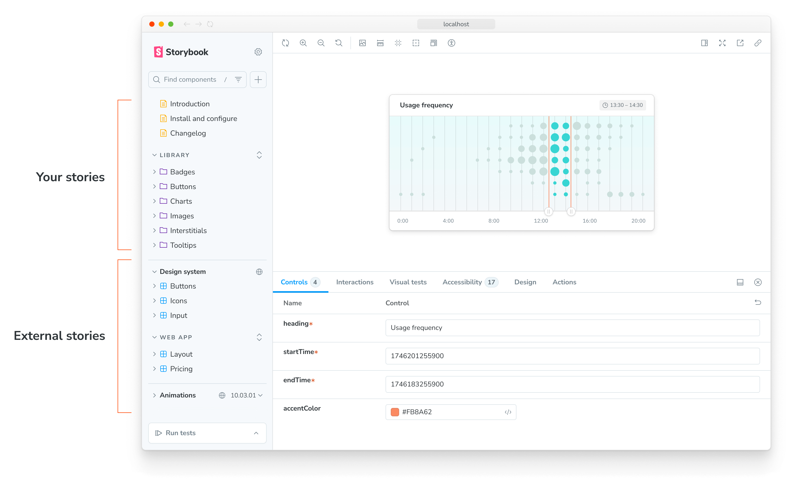
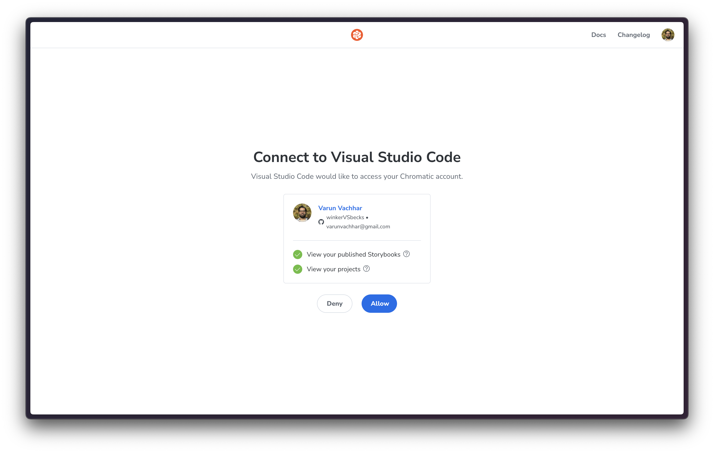
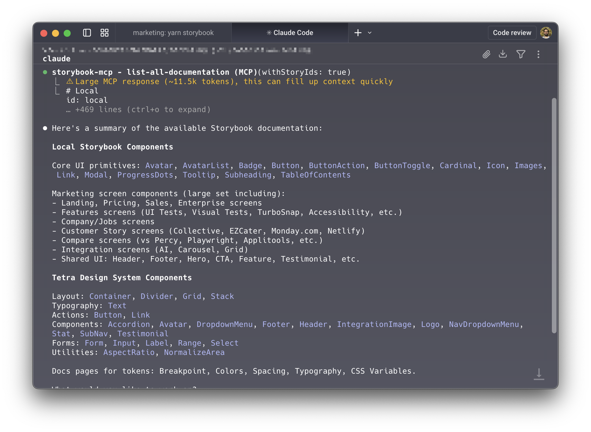

import InstallSnippets from "../../components/InstallSnippets.astro";

# Publish your Storybook MCP server

[Storybook MCP](https://storybook.js.org/docs/ai) improves generated code quality by giving agents project-specific context about your components and letting them self-correct with Storybook's testing tools. Locally, the MCP runs via the Storybook dev server endpoint.

Chromatic manages deployments to make this MCP server accessible to your entire team and their coding agents. It also manages access control, ensuring only authorized collaborators can use your MCP server.

<details>

<summary>Why do I need to publish my Storybook MCP server?</summary>

Product teams often consume components built by other teams—design systems, component libraries, microfrontends, etc. They can’t access the MCP server for those dependencies unless they run all their storybooks locally. However, once those storybooks are published, you can remotely access the MCP server.

Published MCP server access also enables coding agents such as Claude Code and GitHub Copilot to access all the information about your components: component metadata, stories, and MDX documentation.

Additionally, it enables designers and other non-developers to prototype with coding agents without requiring a local development environment setup.

</details>

## Setup guide

To deploy your Storybook MCP server with Chromatic, you need to need to be using _Storybook 10.3 or later and use React_.

### 1. Install the MCP addon

Run this command to install and register the Storybook MCP addon:

```bash
npx storybook add @storybook/addon-mcp
```

When running Storybook's dev server, you can now access the MCP server at: http://localhost:6006/mcp (your port may be different).



### 2. Run a build to publish the MCP server

Run a Chromatic build as usual via CI or locally to automatically deploy your MCP server alongside your Storybook. If you don't have a Chromatic project yet then follow our [quickstart guide](/docs/quickstart) to set up your first project and publish the Storybook.

Once the build is complete, you will see a confirmation message with links to your published Storybook. The MCP server is published at the same URL as your Storybook on the `/mcp` route. For example:

```
https://642d765a7e8afcfb104268dc-mhlulncyca.chromatic.com/mcp
```

### 3. Enable composition

If your UI pulls components from multiple Storybooks, you can compose them into a single MCP server. For example, your app might have a local Storybook while consuming a design system from a remote published Storybook.

Use [composition](/docs/composition) to stitch together context from multiple Storybooks in your local MCP server. This allows agents to reference any component during UI generation.

<div class="aside">
  If you don't have a local Storybook, then check out the instructions below on
  how to use the [MCP server without a local
  Storybook](#use-the-mcp-server-without-a-local-storybook).
</div>

To enable composition, add a `refs` section to your Storybook config. We recommend using your default branch's [permalink](/docs/permalinks) as the ref URL. For example:

```js title="storybook/main.ts"
// Replace your-framework with the framework you are using, e.g. react-vite, nextjs, vue3-vite, etc.
import type { StorybookConfig } from "@storybook/your-framework";

const config: StorybookConfig = {
  framework: '@storybook/your-framework',
  stories: ["../src/**/*.stories.@(js|jsx|ts|tsx)"],
  refs: {
    // 👇 Upper-case characters not supported in the refs key
    "chromatic-published-storybook": {
      // The title of your Storybook
      title: "Design System",
      // Permalink for your main branch
      url: "https://main--<appid>.chromatic.com",
    },
  },
};

export default config;
```



### 4. Install MCP server in your coding agent

Run the following command to configure the local MCP server for your coding agent. We only need to connect local MCP server because the remote Storybook is composed into the local Storybook.

```bash
npx mcp-add --type http --url "https://localhost:6006/mcp" --client-id "cdf3737dff9d485485968e50b63fd8b4" --scope project
```

<div class="aside">
  While you can install the MCP server manually in your coding agent, using the{" "}
  <a href="https://github.com/paoloricciuti/mcp-add">mcp-add</a> CLI tool
  simplifies the process by automating the installation across multiple agents.
</div>

#### Enable authentication

For private Storybooks, your coding agent must authenticate with Chromatic to access the MCP server. Chromatic uses [CIMD](https://client.dev/) to authenticate with tools that support it, such as VSCode and Copilot. For other coding agents, like Claude Code and Cursor, it uses a static client ID.

The `mcp-add` command above was already configured with the required client ID for authentication. The first time your agent connects to the MCP server you'll be prompted to sign in with Chromatic. Follow the instructions in the authentication flow to grant access.



### 5. Run a prompt to test your MCP server

You're all set! Let's test it out. Start by explicitly asking the agent to run `list-all-documentation` on the MCP server. It should return a list of all components in your project (both local and those in the composed Storybooks).

You should see the agent using the tools provided by your Storybook MCP server to find all the components.



---

## Use the MCP server without a local Storybook

If you don't have a local Storybook, you can connect your agent directly to the published MCP server. We recommend using your default branch's [permalink](/docs/permalinks) as the MCP server URL to ensure it stays up to date with your latest changes. For example: `https://main--<appid>.chromatic.com/mcp`

Connect your coding agent to the MCP server by running the following command, then following the authentication flow and test prompt described in [step 5](#5-run-a-prompt-to-test-your-mcp-server) above.

```bash
npx mcp-add --type http --client-id "cdf3737dff9d485485968e50b63fd8b4" --scope project
```

---

## Frequently asked questions

<details>
<summary>How do I disable MCP publishing?</summary>

Set the [`componentsManifest` feature flag](https://storybook.js.org/docs/api/main-config/main-config-features#componentsmanifest) in your Storybook config to `false` to disable the MCP feature.

```tsx title=".storybook/main.ts"
// Replace your-framework with the framework you are using (e.g., react-vite, nextjs)
import type { StorybookConfig } from "@storybook/your-framework";

const config: StorybookConfig = {
  // other config such as:
  // stories: [] etc.
  // ...
  features: {
    componentsManifest: false,
  },
};
export default config;
```

</details>

<details>
<summary>Are all tools available in the published MCP server?</summary>

Only the [Docs tools](https://storybook.js.org/docs/ai/mcp/overview#docs) are available in the published MCP server. The [Development tools](https://storybook.js.org/docs/ai/mcp/overview#development) and [Testing tools](https://storybook.js.org/docs/ai/mcp/overview#testing) are only available when running the MCP server locally with Storybook's dev server.

</details>

<details>
<summary>How do I exclude a component from the manifest?</summary>

The manifest provides a lot of context for the agent; however, this context is not free. It consumes tokens, and excessive or _misleading_ context can degrade performance.

To exclude a component or story from the manifest, use the `!manifest` [tag](https://storybook.js.org/docs/writing-stories/tags).

```tsx title="MyNoisyComponent.stories.tsx"
// Replace your-framework with the framework you are using (e.g., react-vite, nextjs)
import type { StorybookConfig } from "@storybook/your-framework";

const config: StorybookConfig = {
  component: MyNoisyComponent,
  tags: ["!manifest"],
};
export default config;
```

</details>
