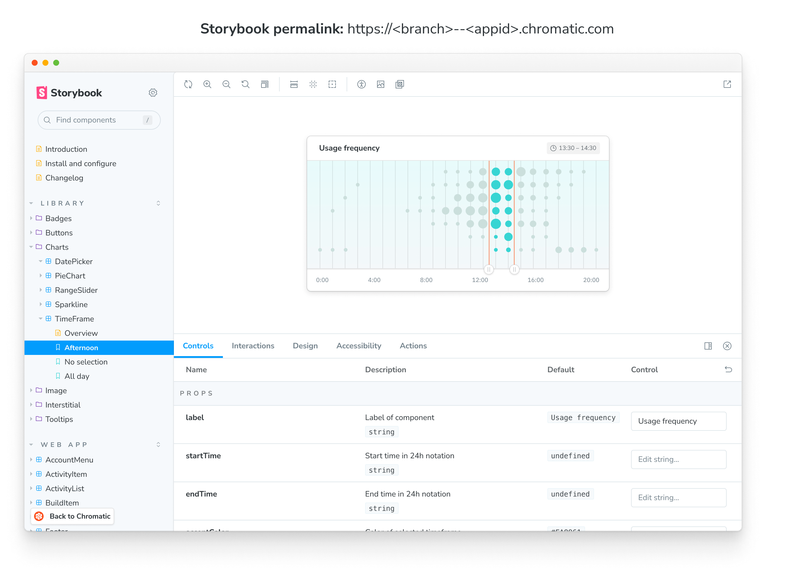
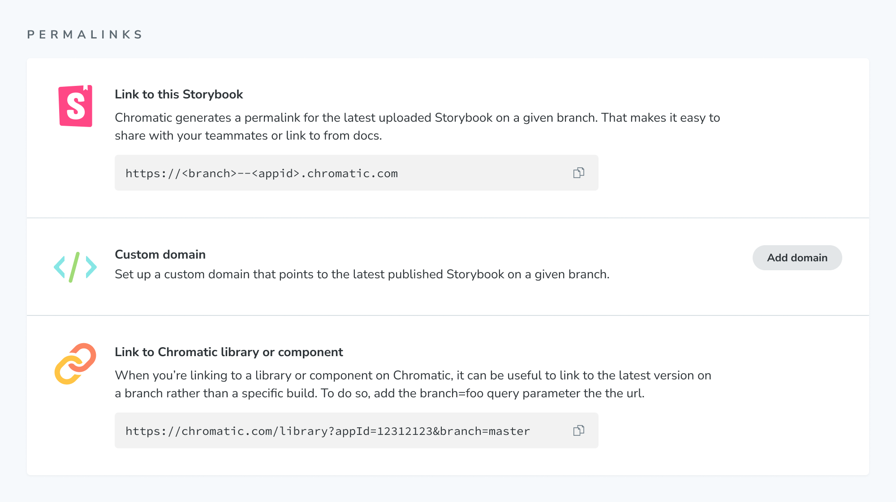

import permalinksCustomDomain from '../../images/permalinks-custom-domain-form.png';

# Permalinks

Chromatic generates a unique permalink when a Storybook is published. This gives teams secure, convenient access to browse components and stories. You can also use permalinks to combine different Storybooks using [Composition](/docs/composition).

## Get permalinks to your project

Before we begin, find your project's unique app id. Go to the permalink section of your project's manage screen. In the input field, you'll see the app id along with instructions for linking to the latest published Storybook and your Chromatic library.

### Share permalinks with collaborators

Permalink access is based on your project's [collaborators](/docs/collaborators#project-collaborators). Whoever is listed as a collaborator will be able to access your project. If your project is private, they'll need to sign in to view the permalink.

If you want to share permalinks with people that aren't listed as collaborators, you'll need set [Storybook visibility](/docs/collaborators#visibility) to public. That allows anyone with a link to access a project's published Storybooks (your library, tests, and settings will remain private).

### Build your own permalink

Build your own permalinks to get more flexibility. For example, link to the `main` branch of Storybook in your external documentation site. Or link to a specific Storybook version (via commit) for [Composition](/docs/composition).

| Permalink   | Format                                        | Example                                                   |
| ----------- | --------------------------------------------- | --------------------------------------------------------- |
| To a branch | `https://<branch>--<appid>.chromatic.com`     | `https://main--example-chromatic-app-id.chromatic.com`    |
| To a commit | `https://<commithash>--<appid>.chromatic.com` | `https://a22675e--example-chromatic-app-id.chromatic.com` |

  Tip: Check the build screen on your project's dashboard to get the commit hash for a specific
  build.

#### Branches that are within forked repositories

If your project's repository is a fork, it will appear in Chromatic with the format `organization_name:repository_name`. Permalink URLs will need to be modified as such:

| Branch      | Format                                                      | Example                                                          |
| ----------- | ----------------------------------------------------------- | ---------------------------------------------------------------- |
| To a branch | `https://<repository>-fork-<branch>--<appid>.chromatic.com` | `https://acme-fork-main--example-chromatic-app-id.chromatic.com` |

  Note that if your branch naming convention requires using `:`, we will name the branches as forks.
  Disabling this behavior is not possible.

#### Branches that contain special characters or are too long

Subdomains have character and length limitations. Only letters and dash characters are supported, that means any unsupported characters in your branch name will be replaced with dashes. Multiple dashes will be replaced with one. If your branch name is longer than 37 characters it will be truncated.

| Branch                                     | Example Permalink                                                      |
| ------------------------------------------ | ---------------------------------------------------------------------- |
| feature/fix-bug                            | `https://feature-fix-bug--<appid>.chromatic.com`                       |
| feature----fix-bug                         | `https://feature-fix-bug--<appid>.chromatic.com`                       |
| feature---dashboard/fix-bug                | `https://feature-dashboard-fix-bug--<appid>.chromatic.com`             |
| thisisareallysuperduperextralongbranchname | `https://thisisareallysuperduperextralongbranc--<appid>.chromatic.com` |

### Custom domain for your Storybook

A custom domain gives you a memorable URL to share with stakeholders and teammates. It points to your project’s latest published Storybook on a given branch. Most customers choose to setup a Storybook subdomain on their company or project domain name.

#### Prerequisites

- Pro plan subscription
- Ability to add DNS records to the domain name

#### How to setup a custom subdomain

1. Go to the DNS management interface provided by your domain registrar or web hosting provider. Find the section where you can add DNS records.
2. Add a CNAME record for the subdomain you would like to use, such as `storybook.example.com`, then enter `domains.chromatic.com` as the value.
3. Back in Chromatic, enter the full domain name you’d like to use and choose a target branch. The domain will link to the most recent build on that branch.

---

## Troubleshooting

<b>How to setup a custom apex domain</b>

1. Go to the DNS management interface provided by your domain registrar or web hosting provider. Find the section where you can add DNS records.
2. Add an **A** record for the root you would like to use, such as `example.com`, then enter `34.120.230.5` as the value.
3. Add a **TXT** record for the root domain and set `apex=domains.chromatic.com` as its value.
4. Back in Chromatic, enter the full domain name you’d like to use and choose a target branch. The domain will link to the most recent build on that branch.

<b>How to setup a custom wildcard subdomain</b>

1. Go to the DNS management interface provided by your domain registrar or web hosting provider. Find the section where you can add DNS records.
2. Add a CNAME record for the subdomain you would like to use, such as `*.storybook.example.com`, then enter `domains.chromatic.com` as the value.
3. Back in Chromatic, enter the full domain name you’d like to use and choose a target branch. The domain will link to the most recent build on that branch.
4. If you've set up a custom wildcard subdomain for another project, get in touch and ask for the domain to be whitelisted, in order to complete the configuration.

 
<b> My custom domain is "Connected" in Chromatic, but visiting the URL results in a 404 error. Why?</b>

When you set a custom domain, you select a target branch, and the domain links to the latest build on that branch. If you encounter a 404 error, it's likely because the selected branch doesn't have any Chromatic builds yet.

  <b>Are custom domains available for free plans?</b>

No. You must upgrade to the Starter plan or higher.

<b>My domain remains in the "Issuing certificate" state. What are the common causes?</b>

When you add a custom domain, Chromatic automatically provisions a TLS certificate from Let's Encrypt or ZeroSSL. The Certificate Authority (CA) must verify domain ownership by querying your public DNS records. If your DNS configuration interferes with this verification, the issuance will hang.

The most common causes are:

- [DNS proxying / CDN "orange cloud" enabled](#dns-proxying)
- [CNAME flattening (ANAME) active](#cname-flattening)
- [AAAA (IPv6) records present](#aaaa-records)
- [Restrictive CAA records](#caa-records)
- [DNSSEC misconfiguration](#dnssec)
- [DNS changes that haven't fully propagated](#dns-propagation)

Check the specific FAQs below for each issue and how to resolve it.

<b>My custom domain is stuck in a "Pending" state. What are the common causes?</b>

When you add a custom domain, Chromatic performs several steps to make it live. If any of these steps fail, the domain will remain in a "Pending" state.

The most common causes are:

- DNS configuration issues: [proxying](#dns-proxying) or [propagation](#dns-propagation)
- [Certificate issuance problems](#issuing-certificate)

Check the specific FAQs below for each issue and how to resolve it.

<b>Does Chromatic support Cloudflare proxying (orange cloud) or other CDN services?</b>

**No.** Custom domains must not be proxied through Cloudflare (orange cloud) or any other CDN / reverse proxy service while certificates are being provisioned or renewed. This includes:

- Cloudflare (when proxying is enabled)
- Fastly
- Akamai
- Imperva
- Sucuri
- CloudFront
- Any other reverse proxy or CDN placed in front of your domain

These services hide your origin server and prevent the CA from reaching Chromatic's validation endpoints.

Set your DNS record to **"DNS only"** (grey cloud for Cloudflare), so it resolves directly to `domains.chromatic.com` without any intermediate proxying.

<b>What is CNAME flattening, and can it break my certificate issuance?</b>

Some DNS providers offer "CNAME flattening" or "ANAME records," which resolve a CNAME at the DNS level and return an A (IPv4) or AAAA (IPv6) record instead. This can interfere with the validation process used by Let's Encrypt and ZeroSSL.

Consult your DNS provider's documentation to check if flattening is enabled for your zone.

- If possible, configure it to flatten CNAMEs **only at the zone apex** (root domain).
- For subdomains (e.g., `storybook.yourdomain.com`), use a **standard CNAME record** without flattening.

<b>Does Chromatic support IPv6 (AAAA records)?</b>

**No.** AAAA records are currently **not supported** for custom domains. If such records exist on your domain, they may prevent the CA from reaching Chromatic's servers and block the issuance of certificates.

**Solution:** Remove any AAAA records pointing to your custom domain. Only use the record types specified in the setup guide:

- **CNAME** for subdomains (pointing to `domains.chromatic.com`)
- **A** for apex/root domains (pointing to `34.120.230.5`) plus the required **TXT** record

<b>How should I configure CAA records for Chromatic?</b>

There is no need to configure them manually. Your DNS may have CAA (Certification Authority Authorization) records that restrict which CAs are allowed to issue certificates for your domain. Chromatic relies on **Let's Encrypt** and **ZeroSSL (Sectigo)** — both must be permitted.

<b>Does DNSSEC work with Chromatic custom domains?</b>

**Yes**, DNSSEC is supported, but it must be configured **correctly**. Invalid DNSSEC configurations—such as stale keys after a DNS provider change—can prevent DNS resolution entirely, which blocks certificate issuance.

Verify that your DNSSEC records are valid and properly propagated. If you recently changed DNS providers, ensure the DS records at your registrar have been updated. Temporarily disabling DNSSEC can help you confirm whether it is the root cause.

<b>How long does DNS propagation take for certificate issuance?</b>

DNS changes are not instant. After updating your records, it may take anywhere from a few minutes to **48 hours** (typically under an hour) for global DNS resolvers to pick up the changes. During this period, the CA may query an outdated resolver and fail validation.

Use public DNS lookup tools (like `dig` or online checkers) to verify that your record is visible from multiple locations worldwide before retrying.

<b>My certificate failed to renew. Why?</b>

Certificate renewal is an automated process that requires your DNS configuration to remain **exactly as it was during the initial setup** to avoid any limitations if changes are introduced. The renewal will fail if you don't reconfigure your DNS settings to meet the requirements.

<b>I've checked everything, but my domain is still stuck. What should I do?</b>

If you've verified all the above (DNS, certificates, etc.) and the domain remains stuck in pending or issuing certificate states, please contact **Chromatic support** with the following details:

- The custom domain name you are trying to add
- Your DNS provider
- Any DNS proxy, flattening, or security features you have enabled
- The exact DNS records you have configured (type, name, value, TTL)
- Screenshots of your DNS configuration (if possible)

This information will help our team diagnose the issue quickly.

