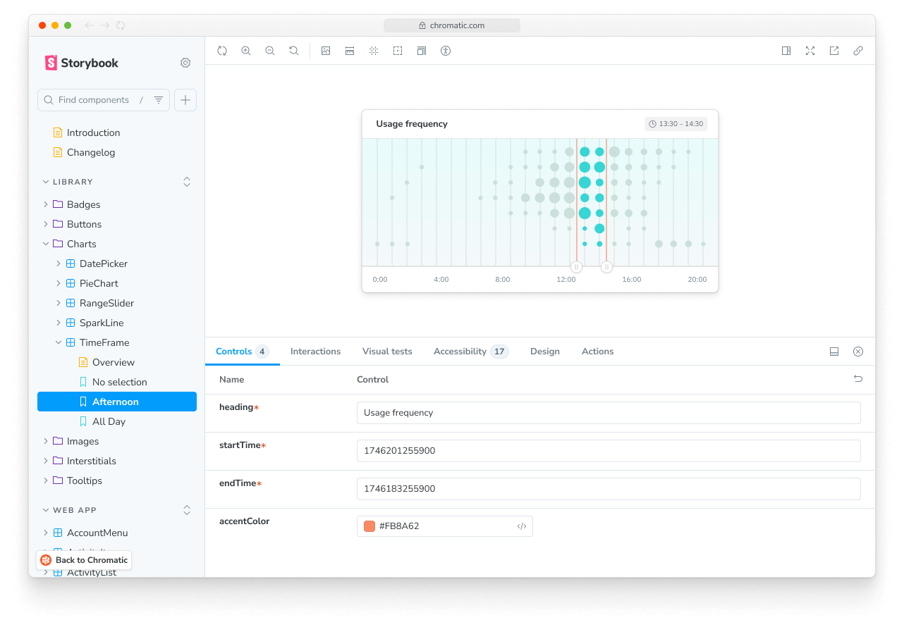

import permalinksCustomDomain from "../../images/permalinks-custom-domain-form.png";

# Permalinks

Chromatic generates a unique permalink when a Storybook is published. This gives teams secure, convenient access to browse components and stories. You can also use permalinks to combine different Storybooks using [Composition](/docs/composition).



## Get permalinks to your project

Before we begin, find your project's unique app id. Go to the permalink section of your project's manage screen. In the input field, you'll see the app id along with instructions for linking to the latest published Storybook and your Chromatic library.


### Share permalinks with collaborators

Permalink access is based on your project's [collaborators](/docs/collaborators#project-collaborators). Whoever is listed as a collaborator will be able to access your project. If your project is private, they'll need to sign in to view the permalink.

If you want to share permalinks with people that aren't listed as collaborators, you'll need set [Storybook visibility](/docs/collaborators#visibility) to public. That allows anyone with a link to access a project's published Storybooks (your library, tests, and settings will remain private).

### Build your own permalink

Build your own permalinks to get more flexibility. For example, link to the `main` branch of Storybook in your external documentation site. Or link to a specific Storybook version (via commit) for [Composition](/docs/composition).

| Permalink   | Format                                        | Example                                                   |
| ----------- | --------------------------------------------- | --------------------------------------------------------- |
| To a branch | `https://<branch>--<appid>.chromatic.com`     | `https://main--example-chromatic-app-id.chromatic.com`    |
| To a commit | `https://<commithash>--<appid>.chromatic.com` | `https://a22675e--example-chromatic-app-id.chromatic.com` |

<div class="aside">
  Tip: Check the build screen on your project's dashboard to get the commit hash
  for a specific build.
</div>

#### Branches that are within forked repositories

If your project's repository is a fork, it will appear in Chromatic with the format `organization_name:repository_name`. Permalink URLs will need to be modified as such:

| Branch      | Format                                                      | Example                                                          |
| ----------- | ----------------------------------------------------------- | ---------------------------------------------------------------- |
| To a branch | `https://<repository>-fork-<branch>--<appid>.chromatic.com` | `https://acme-fork-main--example-chromatic-app-id.chromatic.com` |

<div class="aside">
  Note that if your branch naming convention requires using `:`, we will name
  the branches as forks. Disabling this behavior is not possible.
</div>

#### Branches that contain special characters or are too long

Subdomains have character and length limitations. Only letters and dash characters are supported, that means any unsupported characters in your branch name will be replaced with dashes. Multiple dashes will be replaced with one. If your branch name is longer than 37 characters it will be truncated.

| Branch                                     | Example Permalink                                                      |
| ------------------------------------------ | ---------------------------------------------------------------------- |
| feature/fix-bug                            | `https://feature-fix-bug--<appid>.chromatic.com`                       |
| feature----fix-bug                         | `https://feature-fix-bug--<appid>.chromatic.com`                       |
| feature---dashboard/fix-bug                | `https://feature-dashboard-fix-bug--<appid>.chromatic.com`             |
| thisisareallysuperduperextralongbranchname | `https://thisisareallysuperduperextralongbranc--<appid>.chromatic.com` |

### Custom domain for your Storybook

A custom domain gives you a memorable URL to share with stakeholders and teammates. It points to your project’s latest published Storybook on a given branch. Most customers choose to setup a Storybook subdomain on their company or project domain name.

#### Prerequisites

- Pro plan subscription
- Ability to add DNS records to the domain name

#### How to setup a custom subdomain

1. Go to the DNS management interface provided by your domain registrar or web hosting provider. Find the section where you can add DNS records.
2. Add a CNAME record for the subdomain you would like to use, such as `storybook.example.com`, then enter `domains.chromatic.com` as the value.
3. Back in Chromatic, enter the full domain name you’d like to use and choose a target branch. The domain will link to the most recent build on that branch.


<details>
<summary><b>How to setup a custom apex domain</b></summary>

1. Go to the DNS management interface provided by your domain registrar or web hosting provider. Find the section where you can add DNS records.
2. Add an **A** record for the root you would like to use, such as `example.com`, then enter `34.120.230.5` as the value.
3. Add a **TXT** record for the root domain and set `apex=domains.chromatic.com` as its value.
4. Back in Chromatic, enter the full domain name you’d like to use and choose a target branch. The domain will link to the most recent build on that branch.

</details>

<details>
<summary><b>How to setup a custom wildcard subdomain</b></summary>

1. Go to the DNS management interface provided by your domain registrar or web hosting provider. Find the section where you can add DNS records.
2. Add a CNAME record for the subdomain you would like to use, such as `*.storybook.example.com`, then enter `domains.chromatic.com` as the value.
3. Back in Chromatic, enter the full domain name you’d like to use and choose a target branch. The domain will link to the most recent build on that branch.
4. If you've setup a custom wildcard subdomain for another project, get in touch and ask for the domain to be whitelisted, in order to complete the configuration.

</details>

<details>
<summary><b>My domain remains in the "Issuing certificate" state</b></summary>

Your DNS may be configured with [CAA records](https://en.wikipedia.org/wiki/DNS_Certification_Authority_Authorization) that only allow certain authorities to issue certificates for your domain names. The Chromatic custom domain relies on Let's Encrypt and ZeroSSL (either one may be used). In order to allow Let's Encrypt or ZeroSSL to issue a certificate for your Chromatic custom domain, add a `CAA` record for `letsencrypt.org` and `sectigo.com`. For example:

```
example.com. 300 IN CAA 0 issue "letsencrypt.org"
example.com. 300 IN CAA 0 issue "sectigo.com"
```

As CAA records are inherited by subdomains, you can configure the CAA record at the apex domain level, which is convenient if you have multiple Chromatic projects.

For more information about configuring CAA records, refer to [Let's Encrypt](https://letsencrypt.org/docs/caa/) and [ZeroSSL](https://help.zerossl.com/hc/en-us/articles/360060119753-Invalid-CAA-Records).

</details>

<details>
 <summary><b> My custom domain is "Connected" in Chromatic, but visiting the URL results in a 404 error. Why?</b></summary>

When you set a custom domain, you select a target branch, and the domain links to the latest build on that branch. If you encounter a 404 error, it's likely because the selected branch doesn't have any Chromatic builds yet.

</details>

<details>

<summary>
  <b>Are custom domains available for free plans?</b>
</summary>

No. You must upgrade to the Starter plan or higher.

</details>
