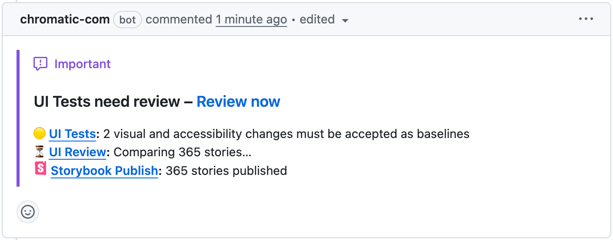
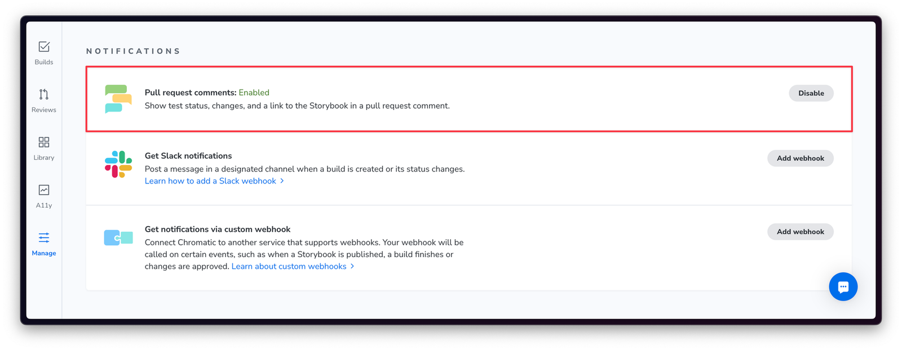

# PR comments (beta)

When enabled, Chromatic posts a comment on the pull request with the number of visual and accessibility changes, the UI Review status, and a link to your published Storybook.

## How it works

When a Chromatic build completes for a pull request, Chromatic posts a comment on that PR. The comment shows:

- **UI Tests:** the number of visual and accessibility changes that need to be accepted as baselines
- **UI Review:** the current review status
- **Storybook Publish:** a link to your published Storybook

The comment is created the first time a build posts results for a PR. From then on, it updates automatically with each new build on the same PR — no new comment is posted each time.

## Enable

PR comments require the [GitHub app to be installed and your project linked](/docs/access#linked-projects). Once that’s done, enable PR comments from your project’s Manage screen under _Notifications_.

ℹ️ PR comments are currently only supported for **GitHub**. Support for other Git providers is coming soon.

## Monorepo support

For monorepos linked to multiple Chromatic projects, each project posts its own comment. Consolidation into a single comment is coming soon.
