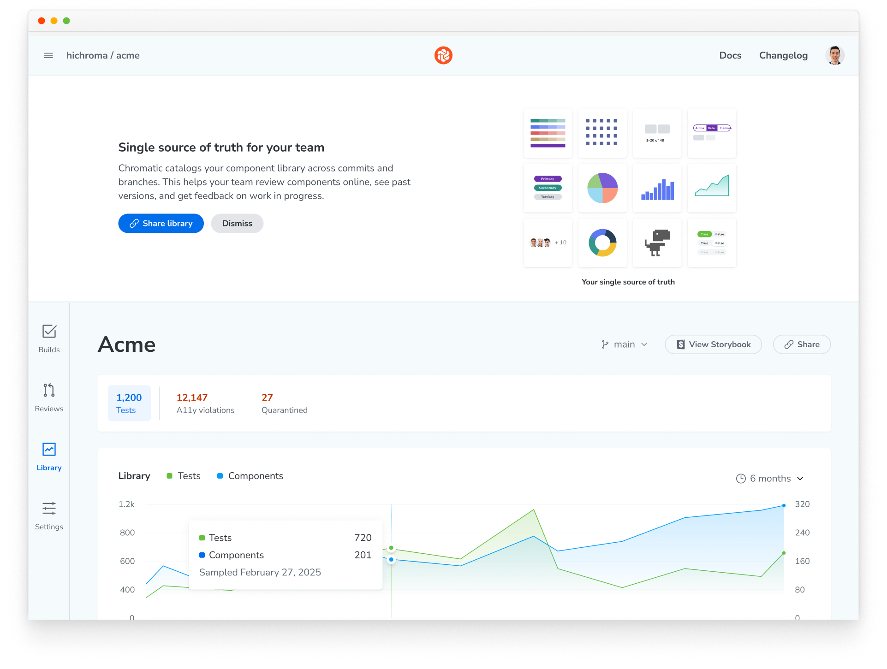
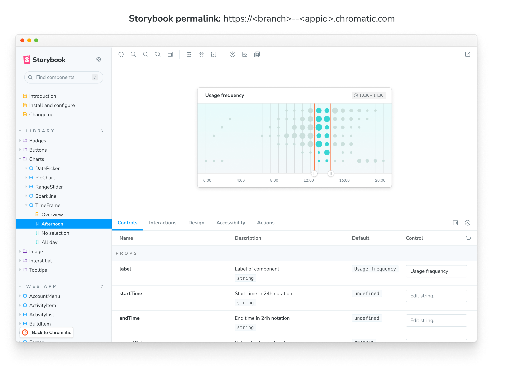
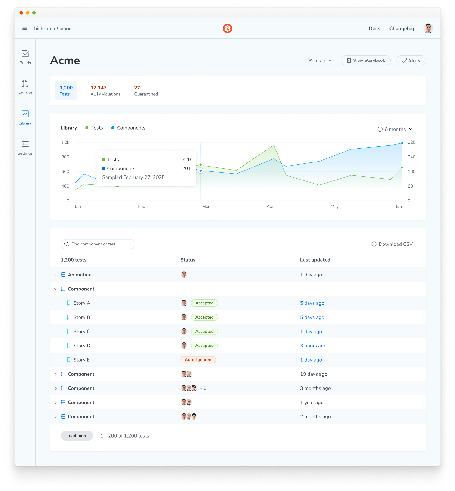
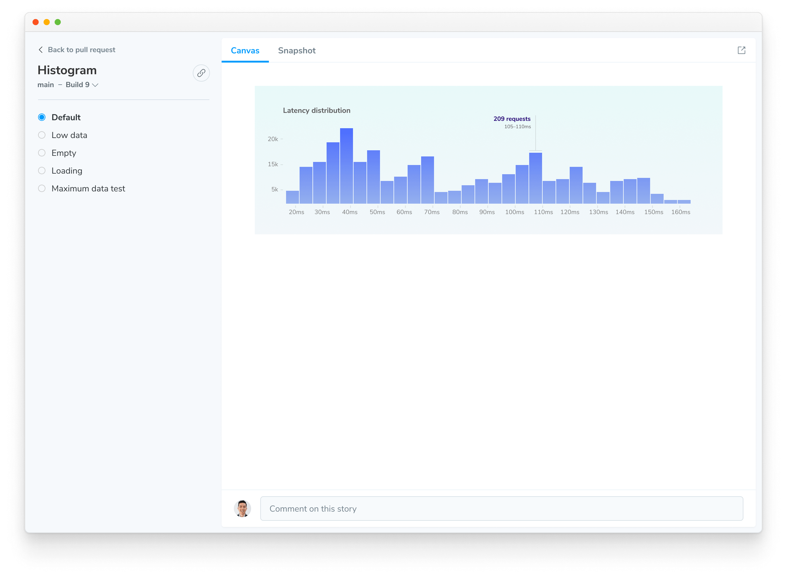

# Publish your Storybook

The Chromatic CLI builds and publishes your Storybook to a secure online workspace, making all your stories accessible to your team at [chromatic.com](https://www.chromatic.com/start). Chromatic also indexes and versions your stories, creating a searchable library within the web app. This allows teams to discover, reuse, and reference existing components easily.



## Direct access to your Storybook

Every time you trigger a Chromatic build, your Storybook is published on our secure CDN. Published Storybooks are private by default with [access](/docs/access) restricted to logged in collaborators. [Visibility](/docs/access/collaborators#storybook-visibility) can be set to public if desired.

Chromatic generates a [permalink](/docs/permalinks) for the latest uploaded Storybook on a given branch. That makes it easy to share with your teammates or link to from docs. `https://<branch>--<appid>.chromatic.com`



## Link to specific branches

When you're linking to a library or component on Chromatic, it can be useful to link to the latest version on a `branch` rather than a specific build. To do so, add the `branch=foo` query parameter to the URL.

**Example**: `https://www.chromatic.com/library?appId=...&branch=main`.

<div class="aside">
  If your branch name contains special characters like slashes or dots, URL-encode them in the query parameter. For example, <code>feature/my-branch</code> becomes <code>?branch=feature%2Fmy-branch</code>.
</div>

## Embedding

If you're documenting components outside of Storybook, you may be able to [embed interactive stories](/docs/embed). This works on many platforms that support the oEmbed specification.

## Browse library

The **Library** page in the Chromatic web app is a dashboard for your project's tests and components. It shows the latest components on a branch, how your test suite has grown over time, and the status of every story.

The summary bar at the top of the page switches between three views:

- **Tests**: Every component and story in the project, with test and component counts over time
- **A11y violations**: Accessibility issues across your components. See the [accessibility dashboard](/docs/accessibility/dashboard).
- **Quarantined**: Flaky tests that Chromatic ignores across all builds. See the [quarantine dashboard](/docs/quarantine-tests#dashboard-tracks-all-the-quarantined-tests).



## Demo components

Components and their stories are securely indexed each commit and branch. Use the component screen to demo components without needing to switch branches, pull code, or Git. It's your window into the metadata and variations of the component. You can also share a link to this screen to get feedback.

- **Canvas**: Interact with the real component code to reproduce the behavior
- **Snapshot**: Verify the image [snapshots](/docs/snapshots) used for cross-browser [UI Tests](/docs#test-how-uis-look--function)



---

## Component names change in published source blocks

If a published Storybook shows a renamed component in a source block, such as `<g>` instead of `<Button>`, Vite may have minified the component name during the build. If you use Storybook's Vite builder, you can disable minification in `.storybook/main.js`:

```js title=".storybook/main.js"
export default {
  async viteFinal(config) {
    const { mergeConfig } = await import('vite');
    return mergeConfig(config, { build: { minify: false } });
  },
};
```

Rebuild and publish your Storybook, then check the source block again.
