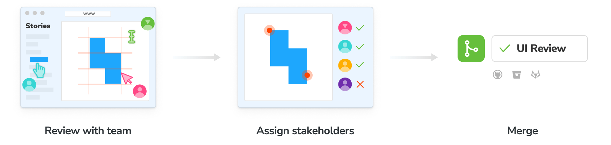
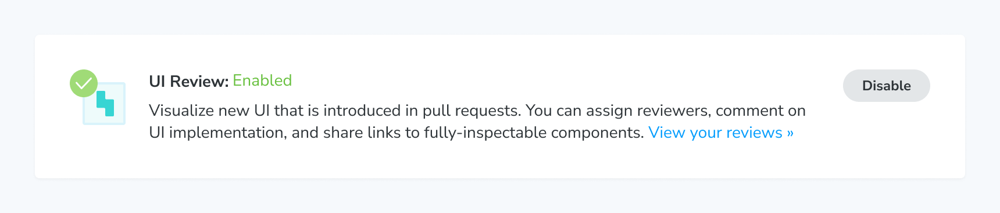
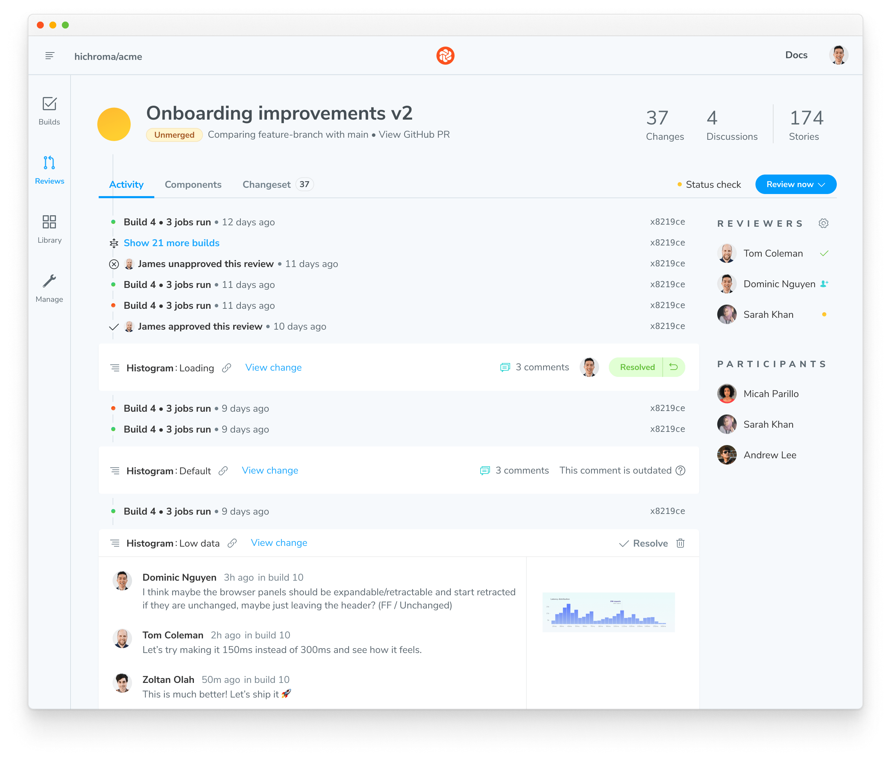
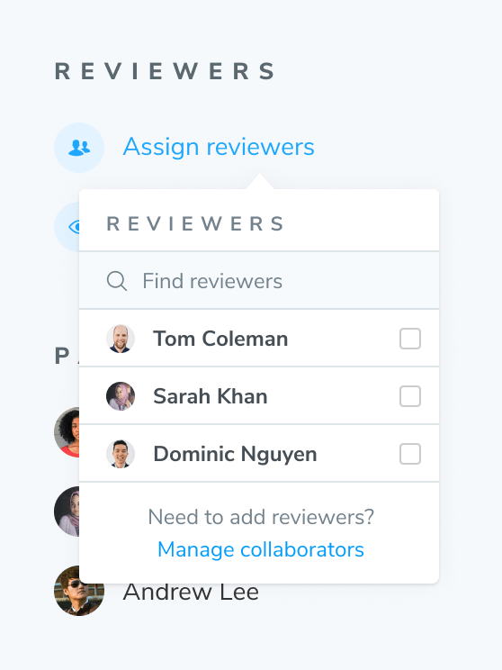
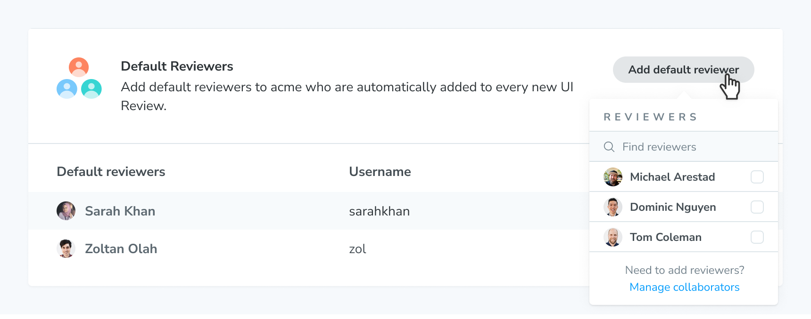
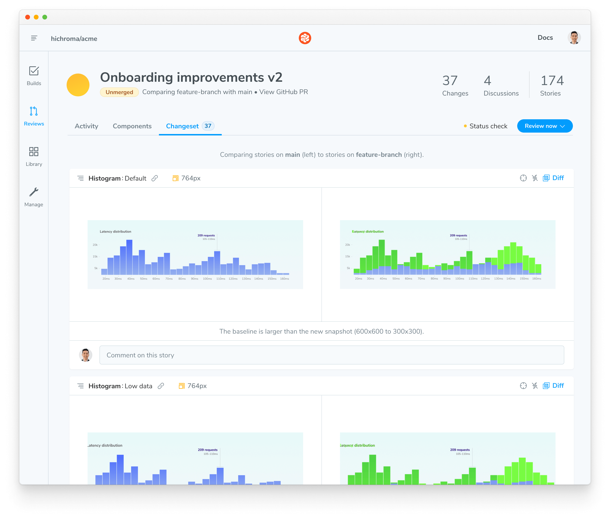
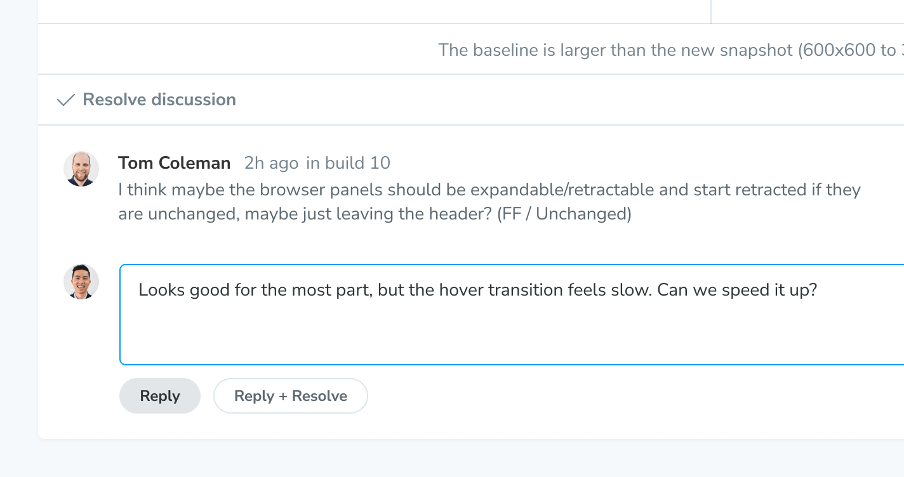

# UI Review powered by snapshots

As Chromatic's second core workflow, UI Review streamlines the process of getting approval and feedback on visual changes from designers, product managers, and other key stakeholders. While [UI Tests](/docs#test-how-uis-look--function) safeguard you from unintentional bugs, UI Review is where you discuss intentional changes with your team, ensuring everyone aligns with their expectations before you ship.

Each UI Review is linked to a pull/merge request, streamlining the workflow. Here's how it works:

- **Automated trigger:** When you open a pull request and run a Chromatic build via CI, Chromatic starts the UI Review workflow.
- **Visual diffing:** Chromatic generates a changeset highlighting the exact visual differences between your feature branch and the main branch. You can use the same diffing tools from [UI Tests](/docs#test-how-uis-look--function) to evaluate these changes.
- **Collaborative review:** Easily assign one or more reviewers to provide feedback on the visual changes.
- **Checklist for clarity:** All change requests are tracked within a convenient checklist attached to the Review.



<div class="aside">

👀 **Manual UI reviews without a linked Git provider**<br/>UI Reviews are typically triggered by and linked to pull/merge requests. However, you can still conduct manual UI reviews even without a linked Git provider. [Learn More »](/docs/manual-ui-review)

</div>

## Enable

Enable UI Review for your project on the Manage screen.



Once enabled, visit the Reviews tab in the web app sidebar. There you’ll be prompted to install the GitHub app or webhooks for GitLab/Bitbucket.

<div class="aside">

ℹ️ You must [set up CI](/docs/ci) so that Chromatic is able to run builds for each commit on the PR branch.

</div>

## Understanding the Review

Once a Review has been created—either manually or through CI—navigate to the Reviews tab and select the appropriate Review. You will then land on the Activity tab, which shows a timeline of [builds](/docs), active discussions, and Review status. This showcases what needs to be done in the Review process.



### Invite teammates

Invite other developers, designers, PMs, and stakeholders to help review changes. This closes the feedback loop between disciplines and helps you find the answer to “does this look right?”

If you [linked your project](/docs/access#linked-projects) to GitHub, Bitbucket, or GitLab, your project permissions are synced so collaborators can sign in to review immediately. If your [project is unlinked](/docs/access#unlinked-projects), use the project invite code to add collaborators.

### Assign reviewers

Use the Assign Reviewers link on the Review’s Activity screen to choose reviewers from the project’s collaborators. Reviewers will be emailed a link to the Review screen to begin their review.



### Default reviewers

If you find you’re always assigning the same reviewers, you can set default reviewers for your project. Default reviewers will be automatically assigned to new Review. You can also assign additional reviewers on a per-Review basis.

Add default reviewers on your project’s Manage page. Go to the Review section to add a default reviewer.



Remove a default reviewer by clicking "Remove" beside their name. This will remove them as default reviewer but not from the project.

## Review the changes

The Review screen includes a Changeset tab showing a side-by-side view of all visual changes introduced on your head branch. It compares the UI on the head branch to the base branch.



<div class="aside">

💡 **Tip:** To hint at what UI changed, toggle the highlighted diff (in neon green) on and off.

</div>

### Discussions

Reviewers can request updates to the implementation via the comment box beneath each change. Discussions are threaded and attached to the specific snapshot represented by the change.



## UI checklist

At the bottom of the Review screen’s [activity tab](/docs/review#ui-checklist) is a list of tasks that must be completed before UI is ready to be signed off on. If changes are found, the Review will enter the **🟡&nbsp;Pending** state. When changes are approved and checklist items are complete, the Review will be **🟢&nbsp;Passed**. Here’s how to resolve these tasks:

1. Changeset must be approved &rarr; Assign reviewers or approve yourself.
2. Outstanding discussions must be resolved &rarr; Click 'Resolve' on discussions.
3. All assigned reviewers must approve &rarr; Click 'Approve' in the Review screen tab bar.

<div class="aside">ℹ️ Step #3 is not required if you would like to close the Review.</div>


---

## PR check for "UI Review"


You'll get a 'UI Review' status check for each PR that shows the state of the UI Checklist. Require the check in [GitHub](https://help.github.com/en/github/administering-a-repository/enabling-required-status-checks), [GitLab](https://docs.gitlab.com/ee/api/commits.html#post-the-build-status-to-a-commit), or [Bitbucket](https://confluence.atlassian.com/bitbucket/suggest-or-require-checks-before-a-merge-856691474.html) to ensure that impactful changes are considered by the team before merging.

[**Integrate Chromatic into your CI pipeline »**](/docs/ci)

## Pull requests from forks

Chromatic supports UI Test and UI Review across forks, but there's some caveats. First, it only works with [CI integration](/docs/ci#configure-ci) configured to also build PR branches from forks. Secondly, you must expose your project token so that forks can use it. The easiest way to do that is to simply include it in in your `package.json`, for example:

```json
{
  "scripts": {
    "chromatic": "chromatic --project-token <CHROMATIC_PROJECT_TOKEN>"
  }
}
```

If you use a CI provider other than GitHub, you can still use an environment variable. Just make sure your CI is configured to also build forked branches. The project token does not grant access to the project (it can only retrieve a strict set of insensitive data), but it does allow running new builds which count against your snapshot quota.

---

## Frequently asked questions

<details>
<summary>When should I ask for UI Review?</summary>

You can initiate a UI Review at any time. However, we recommend doing it later in the development cycle, once baselines have been approved and UI Tests are green. Learn more about [PR workflow](/docs/in-pull-request).

</details>

<details>
<summary>Can I disable UI Review if I'd prefer not to use it?</summary>

Yes. Go to the manage page for your project where you can disable UI Review. Chromatic will no longer add status checks to your PRs for UI Review once it is disabled.

</details>

<details>
<summary>What commits does Chromatic use to calculate the UI changeset?</summary>

Similar to [GitHub code review](https://github.com/features/code-review/), Chromatic compares between the latest commit on the PR branch and the 'merge base' commit, that is the commit that is the shared ancestor between the PR branch and the branch it was created from. It is important that Chromatic has run a build on both commits outlined above. If you've recently enabled CI and have existing PRs that you would like to review, ensure Chromatic has run in CI for both branches of that PR.

The process might look something like:

1. Create a new PR to `main` adding Chromatic to CI
2. Merge that PR when everything works well.
3. Update your existing feature PR(s) w/ the latest from `main` (either merge or rebase from main).

</details>

<details>
<summary>Can I prevent people from auto-approving their own Review</summary>

No, you can't prevent people from auto-approving their own review.

However, you can [assign default reviewers](/docs/review#default-reviewers) to ensure that other teammates must approve of the review. Enable [mandatory pull request checks](/docs/mandatory-pr-checks/) for UI Review to require the reviewers you assign to approve.

</details>
