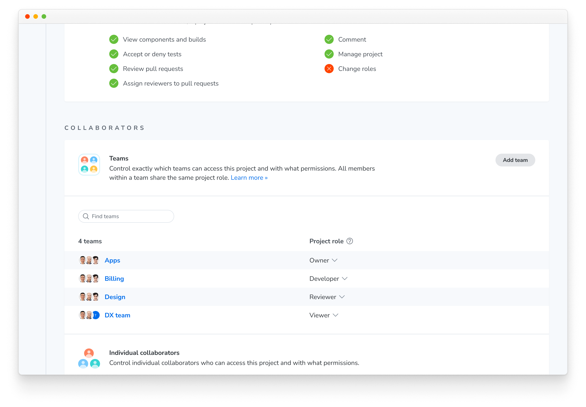
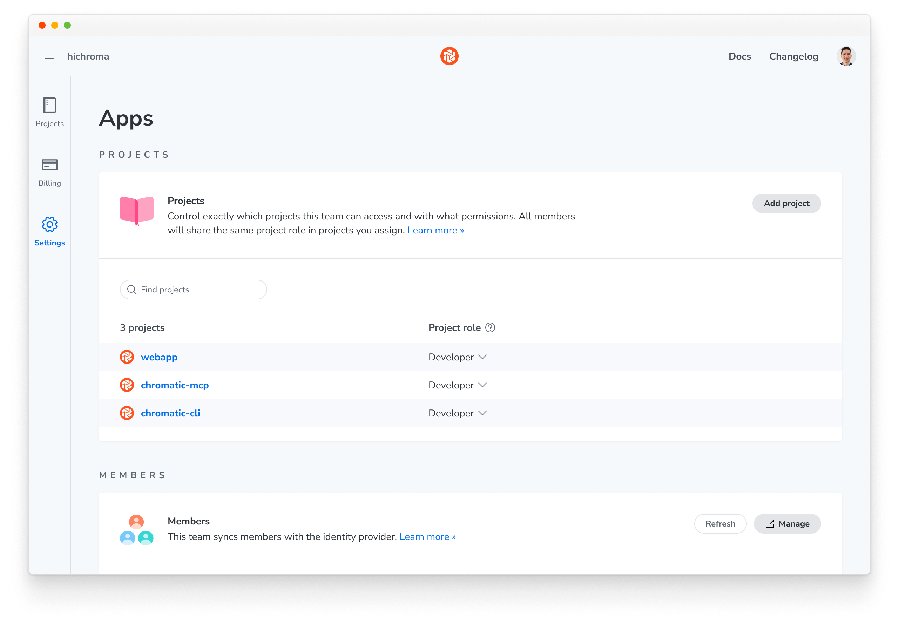

# Teams

Teams are available to organizations on the [Enterprise plan](/pricing). They let you control which users can access which projects in your Chromatic organization. Instead of assigning individuals to projects one by one, you assign groups synced from your identity provider (e.g., "Engineering" or "QA") to projects, while membership is managed centrally in your identity provider.

## How it works

An **organization** is the top-level container in Chromatic that holds:

- **Member:** user who belongs to the organization, each with an organization-level role.
- **Project:** app being tested.
- **Team:** group of users synced from a directory group in your identity provider (IdP). Teams are the primary mechanism for granting groups of users access to groups of projects.

## Setting up teams

Teams require [SSO with directory sync (SCIM)](/docs/sso). Each team in Chromatic corresponds to a directory group in your identity provider (IdP), such as Okta. Teams are provisioned automatically from the directory groups your IdP pushes via SCIM; they cannot be created or edited manually in Chromatic.

When a directory group is synced via SCIM:

- The team and its name are defined by the group in your IdP.
- Membership is controlled by the IdP and is read-only in Chromatic. When a user is added to or removed from the group in your IdP, they are automatically added to or removed from the team in Chromatic.
- A directory group maps to a single team, and a team maps to a single directory group.

### Assigning teams to projects

Team-to-project assignments are managed in Chromatic. Admins and Editors can assign a team to one or more projects and choose a [project role](#project-roles) for each assignment.

To assign a team to a project:

1. Go to the project's **Manage page » Collaborate tab**.
2. Under **Teams**, click **Add team**, select the team, and choose a role.

## Roles and permissions

A team is assigned to one or more projects with a specific [project role](#project-roles). Any user who is a member of that team automatically gets that role on those projects.

### How a user's effective project role is resolved

A user can receive project access from multiple sources. The **highest role** always wins.

1. **Organization Admin:** Admins have implicit Owner access on all projects.
2. **Direct project assignment:** A role assigned to the user on the specific project.
3. **Team membership:** The role granted by any team the user belongs to that is assigned to the project. If the user is in multiple teams with different roles on the same project, the highest applies.

Roles can only be elevated through this process, never reduced. For example, if a user's direct assignment grants `developer` and a team assignment grants `owner`, the user receives `owner`.

### Organization roles

Organization roles control what a member can do at the org level.

| Role        | What they can do                                                                                                                                                                                                                         |
| ----------- | ---------------------------------------------------------------------------------------------------------------------------------------------------------------------------------------------------------------------------------------- |
| **Admin**   | Full access to all settings, billing, SSO/SCIM configuration, team-to-project assignments, and all projects (implicit Owner on every project). Can manage members. Every organization must have at least one member with the Admin role. |
| **Editor**  | Can create projects and assign teams to projects. Cannot access billing or SSO settings. Team membership is managed through your IdP via SCIM, not in Chromatic.                                                                         |
| **Member**  | Standard membership. Can view organization details and member list. Project access is determined by team membership or direct assignment.                                                                                                |
| **Billing** | Full access to billing management (invoices, payment methods, subscription). Cannot manage teams or projects. Intended for finance team members who manage payments but don't need project access.                                       |

### Project roles

Project roles determine what a member can do within a specific project.

| Role          | What they can do                                                                       |
| ------------- | -------------------------------------------------------------------------------------- |
| **Owner**     | Full project access: settings, token management, collaborator management, Git linking. |
| **Developer** | Run builds, approve/reject changes in UI Review, manage baselines.                     |
| **Reviewer**  | Approve/reject changes in UI Review. Cannot run builds.                                |
| **Viewer**    | Read-only access to builds, stories, and review status.                                |
| **None**      | No access. The project is not visible to the user.                                     |

## What SCIM manages vs. what you manage manually

There is a clear boundary between what your IdP automates via SCIM and what you set manually in Chromatic.

| Managed via SCIM                                 | Managed manually in Chromatic         |
| ------------------------------------------------ | ------------------------------------- |
| Organization membership (who is in the org)      | Team-to-project assignments and roles |
| Organization roles (Admin, Editor, Member, etc.) | Direct project member assignments     |
| Team creation and naming                         |                                       |
| Team membership                                  |                                       |
