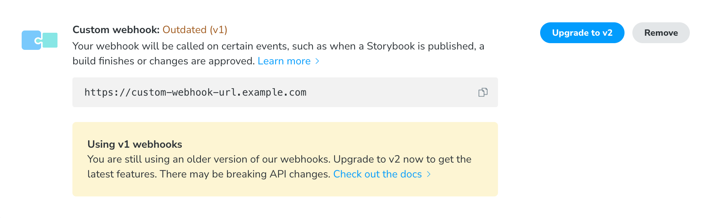

# Custom webhooks

You can integrate Chromatic into other services and script custom behavior to support advanced workflows using [webhooks](https://en.wikipedia.org/wiki/Webhook).

1. Go to your [Chromatic project](https://www.chromatic.com/start) and click the manage tab in the sidebar. Scroll down to "Integrations".
2. Click the "Add webhook" button in the custom webhook section, then paste your webhook into the input.

<div class="aside">

If you're currently using v1 webhooks, read the [upgrade guide](/docs/upgrading-webhooks).

</div>

## Build updates

When a build's [status changes](#build-result-and-status-codes), we'll send a `POST` request to your webhook with a body that looks like this:

```json
{
  "version": 2,
  "event": "build",
  "build": {
    "number": 123,
    "branch": "main",
    "commit": "f6f223efb3b99b83ac3b0b6ece9f9620619933c1",
    "committerName": "John Doe",
    "status": "ACCEPTED", // See table below for details
    "result": "SUCCESS",
    "storybookUrl": "https://5dca7f6a6ce19b00201febb7-yubzntxvow.chromatic.com/",
    "webUrl": "https://www.chromatic.com/build?appId=5dca7f6a6ce19b00201febb7&number=123",
    "changeCount": 12,
    "componentCount": 42,
    "specCount": 100,
    "project": {
      "name": "my-project",
      "accountName": "my-org",
      "accountAvatarUrl": "https://avatars.githubusercontent.com/u/24584319?s=200",
      "webUrl": "https://www.chromatic.com/builds?appId=5dca7f6a6ce19b00201febb7"
    }
  }
}
```

## Review updates

Similarly, we call your endpoint when a review is created:

```json
{
  "version": 2,
  "event": "review",
  "review": {
    "number": 1,
    "title": "My review",
    "status": "OPEN", // | "MERGED" | "CLOSED"
    "baseRefName": "main",
    "headRefName": "feature",
    "isCrossRepository": false,
    "webUrl": "https://www.chromatic.com/review?appId=5dca7f6a6ce19b00201febb7&number=1",
    "author": {
      "name": "John Doe",
      "username": "example",
      "avatarUrl": "https://avatars.githubusercontent.com/u/24584319?s=200"
    }
  }
}
```

## Review decisions

When a reviewer is assigned to a review or they approve the changes, we send an update like this:

```json
{
  "version": 2,
  "event": "review-decision",
  "reviewDecision": {
    "status": "PENDING", // | "APPROVED"
    "project": {
      "name": "my-project",
      "accountName": "my-org",
      "accountAvatarUrl": "https://avatars.githubusercontent.com/u/24584319?s=200",
      "webUrl": "https://www.chromatic.com/builds?appId=5dca7f6a6ce19b00201febb7"
    },
    "review": {
      "number": 1,
      "title": "My review",
      "status": "OPEN", // | "MERGED" | "CLOSED"
      "baseRefName": "main",
      "headRefName": "feature",
      "isCrossRepository": false,
      "webUrl": "https://www.chromatic.com/review?appId=5dca7f6a6ce19b00201febb7&number=1",
      "author": {
        "name": "John Doe",
        "username": "example",
        "avatarUrl": "https://avatars.githubusercontent.com/u/24584319?s=200"
      }
    },
    "reviewer": {
      "name": "John Doe",
      "username": "example",
      "avatarUrl": "https://avatars.githubusercontent.com/u/24584319?s=200"
    }
  }
}
```

<div class="aside">

Reviews are currently only supported on unlinked projects. [Read more ›](/docs/access#projects)

</div>

### How to integrate custom webhooks

Chromatic will make a post request with the above body to the designated webhook URL. That gives you flexibility to catch the webhook response and customize it to fit the service you're integrating with.

Most customers set up a simple proxy app to customize the webhook message. Below are some starter projects for known Git providers that use Express as a proxy to help you integrate with Chromatic.

| Git provider | Repository                                                 |
| ------------ | ---------------------------------------------------------- |
| GitHub       | [Source](https://github.com/chromaui/github-webhook-proxy) |
| GitLab       | [Source](https://github.com/chromaui/gitlab-webhook-proxy) |

### Versioned webhooks

Our webhooks are versioned and won't introduce breaking changes when we roll out an update. Our requests include the `X-Webhook-Version` header (e.g. `2`) to indicate what version was used and a `"version"` property in the JSON request body. We may introduce new events or add new fields, properties, or HTTP headers without incrementing the version number, as we consider those to be non-breaking changes.

If you've been using a custom webhook for a long time, or used to have one in the past, your project might still be configured to receive an older type of webhook. In this case you'll see a prompt like this:



You can either continue to use the existing integration, or upgrade your webhook to the latest version. As soon as you've upgraded, you'll start to receive the updated request format, so your endpoint should already be setup to handle them.

Removing and recreating your webhook will not automatically update you to the new format.

### Signed webhooks

Chromatic supports signed webhooks through an optional `X-Webhook-Signature` header. Please contact us via in-app chat or <a href="mailto:support@chromatic.com?Subject=Signed%20webhooks">email</a> to enable signed webhooks on your account.

We've provided example code for handling these signatures [here](https://github.com/chromaui/signed-webhook-examples).

### Build result and status codes

| Update                            | `result`        | `status`      | Legacy `status`  |
| --------------------------------- | --------------- | ------------- | ---------------- |
| 🔵 Storybook published            | n/a             | `PUBLISHED`   | n/a              |
| 🔵 Ready for testing              | n/a             | `PREPARED`    | n/a              |
| 🔵 Tests in progress              | n/a             | `IN_PROGRESS` | n/a              |
| 🌕 Ready for review (has changes) | `SUCCESS`       | `PENDING`     | `BUILD_PENDING`  |
| 🟢 Passed (no changes)            | `SUCCESS`       | `PASSED`      | `BUILD_PASSED`   |
| 🟢 Accepted                       | `SUCCESS`       | `ACCEPTED`    | `BUILD_ACCEPTED` |
| 🔴 Denied                         | `SUCCESS`       | `DENIED`      | `BUILD_DENIED`   |
| 🔴 Broken                         | `CAPTURE_ERROR` | `BROKEN`      | `BUILD_FAILED`   |
| ⚫️ Canceled                      | `SYSTEM_ERROR`  | `CANCELLED`   | `BUILD_ERROR`    |
| ⚫️ Error                         | `SYSTEM_ERROR`  | `FAILED`      | `BUILD_ERROR`    |
| ⚫️ Timed out                     | `TIMEOUT`       | `FAILED`      | `BUILD_ERROR`    |
