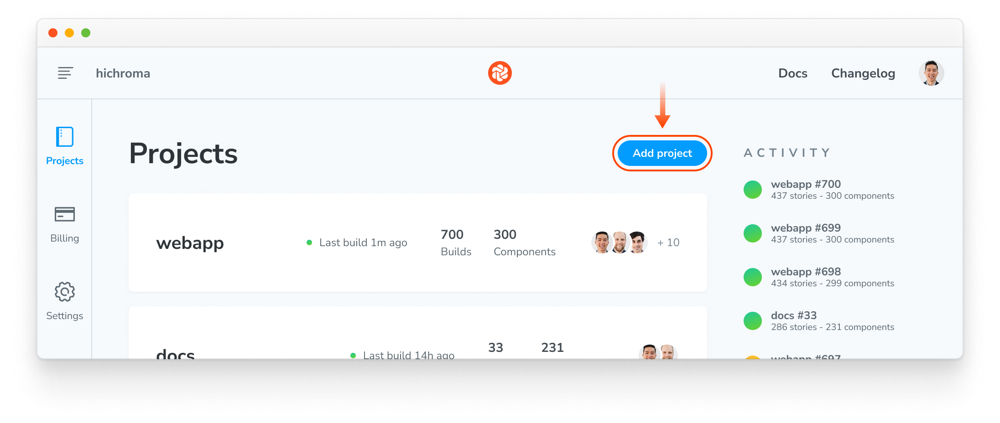
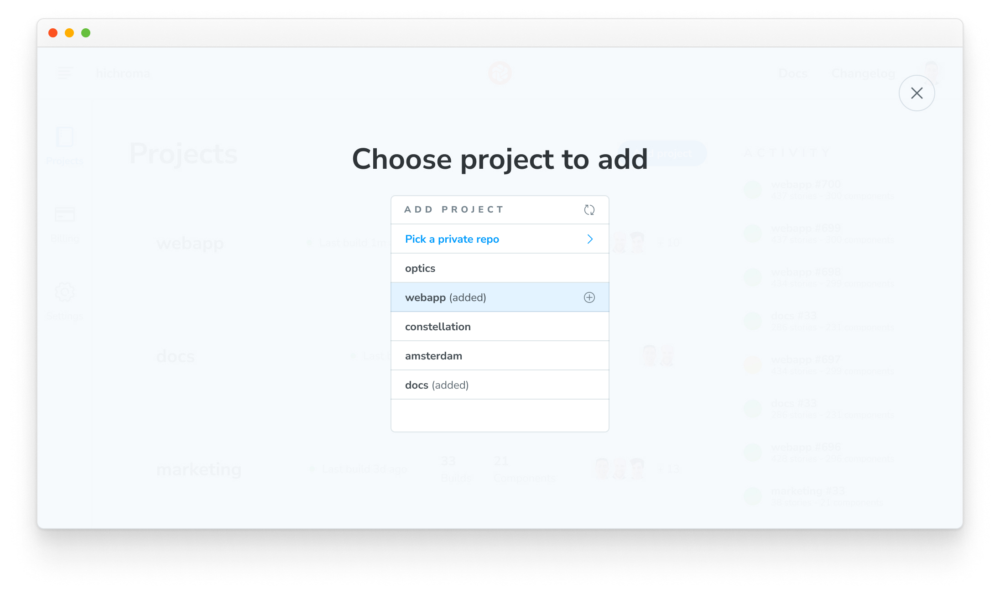
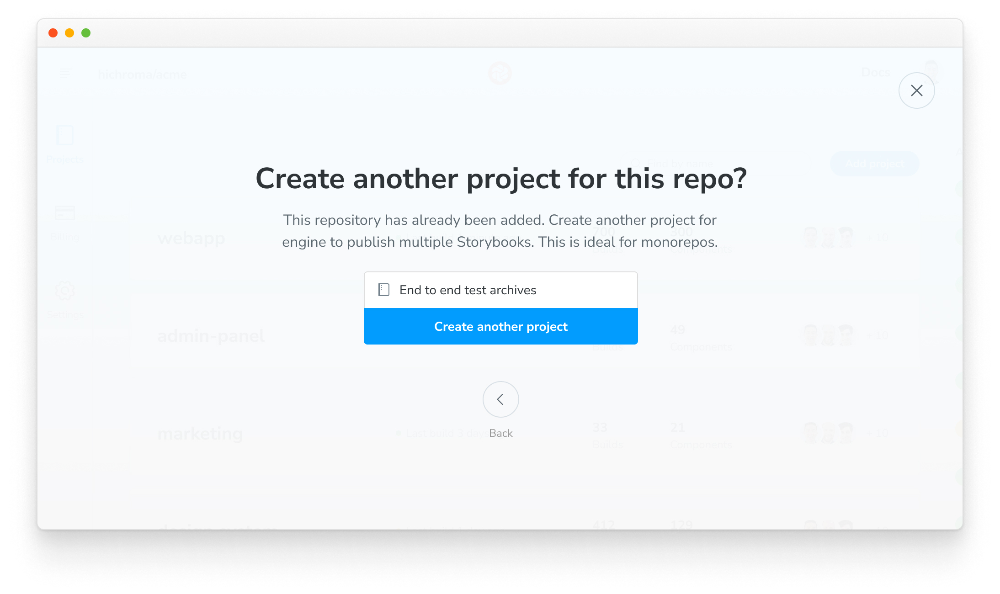
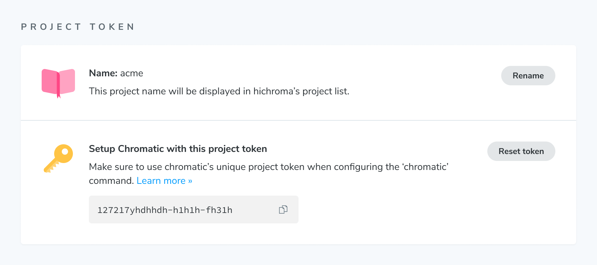

# Monorepos

A common pattern in modern web development is monorepos -- having a single repository that contains multiple distinct projects. As a monorepo can be associated with many Chromatic projects, there are a few tips that can help with using Chromatic with a monorepo.

Chromatic doesn’t assume anything about how you run the CLI. This means you can run it from inside any project or subproject so long as you pass the correct project token.

## Running Chromatic for more than one subproject's Storybook

You can have multiple linked subprojects in Chromatic for any given repository, so if you want to run Chromatic for more than one subproject, you have two options:

### Combine multiple projects into a single Storybook

A common approach that works well for many teams is to combine multiple subproject's Storybooks into a single Storybook. When you run Chromatic on the principal Storybook, you test all stories in a single Chromatic project.

For example, you could write in your `.storybook/main.js|ts`:

```ts title=".storybook/main.ts"
// Replace your-framework with the framework you are using (e.g., react-webpack5, vue3-vite)
import type { StorybookConfig } from "@storybook/your-framework";

const config: StorybookConfig = {
  stories: ["../project-1/**/*.stories.js", "../project-2/**/*.stories.js"],
};

export default config;
```

Often teams find a single Storybook for all their development works quite well, also!

### Run Chromatic for each subproject

In Chromatic, a project is typically linked to a Git repository and will synchronize permissions from the permissions of that repository as well as post build status messages to the repository’s pull/merge requests.

Each subproject in a monorepo can now be associated with a separate Chromatic project that adds additional build statuses to the repository’s pull/merge requests. Here's how to set it up.

1. Open [your Chromatic app](https://chromatic.com/start), browse to your account, and press the “Add project” button:

   

2. Choose your monorepo repository a second time:

   

3. Choose a name for your new project:

   

4. Take note of the token for the new project. You can also find it on the project’s manage page:

   

5. Paste the `project-token` in your CI step to run Chromatic for that subproject. Below are examples with popular CI services.
   - [GitHub Actions](/docs/github-actions#run-chromatic-on-monorepos)
   - [GitLab Pipelines](/docs/gitlab#run-chromatic-on-monorepos)
   - [Bitbucket Pipelines](/docs/bitbucket-pipelines#run-chromatic-on-monorepos)
   - [CircleCI](/docs/circleci#run-chromatic-on-monorepos)
   - [Travis CI](/docs/travisci#run-chromatic-on-monorepos)
   - [Jenkins](/docs/jenkins#run-chromatic-on-monorepos)
   - [Azure Pipelines](/docs/azure-pipelines#run-chromatic-on-monorepos)
   - [Other CI providers](/docs/custom-ci-provider#run-chromatic-on-monorepos)

Every monorepo subproject will get build statuses posted to the pull/merge request. In CI, you’ll need to add a step for each project and use the specific project token for that project.


---

## Only run Chromatic when changes occur in a subproject

If your monorepo consists of both UI and backend subprojects, it may be common to have commits that do not touch UI at all. In such cases, running Chromatic on those commits makes little sense.

You can use tools like [`lerna changed`](https://github.com/lerna/lerna/tree/4fcac71c782cf91a3624fded775faaf3ddb8d636/libs/commands/changed) to detect such situations (depending on how you've set up your monorepo).

If you want to get a Chromatic PR badge for such commits (for instance, if you block merging on Chromatic builds), you can use the `--skip` CLI flag to indicate that this commit does not need to be built and tested.

<details>
   <summary>How do I use Lerna changed to skip changes in a branch or skip certain builds?</summary>

Please refer to the [lerna docs](https://github.com/lerna/lerna/tree/4fcac71c782cf91a3624fded775faaf3ddb8d636/libs/commands/changed) for up to date info. Here's a sample workflow:

1. Install Lerna globally: `npm install -g lerna`
2. Initialize Lerna: `lerna init`
3. Configure `lerna.json` (replace `<your-branch-name>` with the branch name you want to skip):

   ```json title="lerna.json"
   {
     "command": {
       "changed": {
         "ignoreChanges": "<your-branch-name>"
       }
     }
   }
   ```

4. Run `lerna changed`

If you want to skip a certain build, you can use the `--ignore` flag with the build command.

For example: `lerna run build --ignore <package-name>`

</details>

## Advanced configuration

### Run tests on a subset of stories

If you are combining multiple Storybooks into one (see [above](#combine-multiple-projects-into-a-single-storybook)), but detected that only a subset of projects has changed, you can instruct Chromatic to capture and test that particular subset of stories as follows:

- Recommended: Use [TurboSnap](/docs/turbosnap) to automatically only snapshot stories for which related source files have changed.
- Use [`--only-story-files`](/docs/configure#options) to only snapshot stories matching a glob pattern by story file name.
- Use [`--only-story-names`](/docs/configure#options) to only snapshot stories matching a glob pattern by component/story name.

In each case, matching stories will not be captured again, instead we assume it has not changed, and copy the previous snapshot of the story (from one of the ancestor builds). Note you cannot use both `--only-story-files` and `--only-story-names` on the same build, as they conflict.

#### With TurboSnap

TurboSnap is an excellent feature to use with monorepos to avoid re-snapshotting all components across all projects when any changes occur.

The `--untraced` CLI flag can be used to ignore all changes outside of a package or related packages. For example, given a monorepo with unrelated packages `UI` and `app`, you can add the following CLI option to `UI`’s Chromatic command to only run snapshots when files inside the `UI` package change: `--untraced \"./packages/!(UI)/**\"` .

Note that the glob pattern starts from the root directory of the repository, not from the directory of the `UI` package. You can also specify `--untraced` multiple times to include multiple glob patterns.

```shell
npx chromatic --only-changed --untraced=package.json,yarn.lock --exit-zero-on-changes
```

Some monorepo setups manage third-party dependencies at the root level (so all dependencies in the monorepo have consistent versions). You may wish to ignore these root-level files (e.g., lockfile) to avoid unnecessary snapshots, but be aware that changes can go unnoticed.

#### With onlyStoryFiles

The `--only-story-files` flag accepts a glob and can be specified multiple times. Any story files (e.g., `Example.stories.js`) which match the glob will have all of their stories captured and tested.

```shell
npx chromatic --only-story-files "./src/components/**/.stories.js" --only-story-files "./shared/**/*.stories.js"
```

<div class="aside">
Using quotes around the glob patterns is intentional and recommended to avoid being incorrectly detected by your shell, preventing the command from executing correctly.
</div>

#### With onlyStoryNames

The `--only-story-names` flag accepts a glob and can be specified multiple times. Any component/story name (e.g., `Forms/Button/*`) which matches the glob will have all of its stories captured and tested.

```shell
npx chromatic --only-story-names "Forms/**" --only-story-names "**/Header/*"
```

This would match all stories for all components under "Forms" (i.e., any story file which `title` path starts with "Forms"), as well as all stories for the "Header" component, regardless of where it is in the hierarchy (i.e., any story file which `title` path ends with "Header"). Again, make sure to use quotes around glob patterns.

### Building a subset of your stories

With the removal of the `--preserve-missing` flag, building a partial Storybook containing a subset of your stories is no longer recommended. Publishing a Storybook with missing stories will result in those missing stories being marked as "removed".

---

## Troubleshooting

<details>
<summary>Why am I not seeing my monorepo subproject listed in my pull request checklist?</summary>

When using an existing project that is part of the monorepo and [requiring PR checks](/docs/ci#pull-request-checks) for merging, you will need to remove and re-add them within your Git provider as the name linked to the check will have changed. It also applies if a subproject is renamed.

</details>

<details>
<summary>Why is my monorepo project triggering a full rebuild?</summary>

If TurboSnap is enabled inside a monorepo project, [file changes](/docs/turbosnap#full-rebuilds) that impact one package will automatically trigger a full rebuild on all related projects when running Chromatic. Read more about how to ignore changes in unrelated packages [above](#with-turbosnap).

</details>
