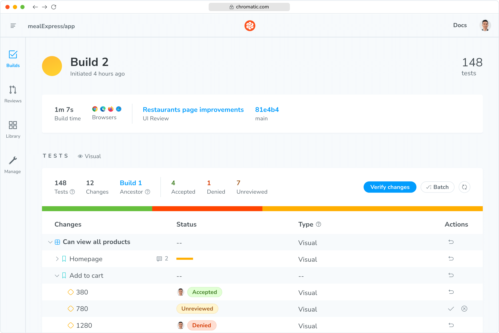
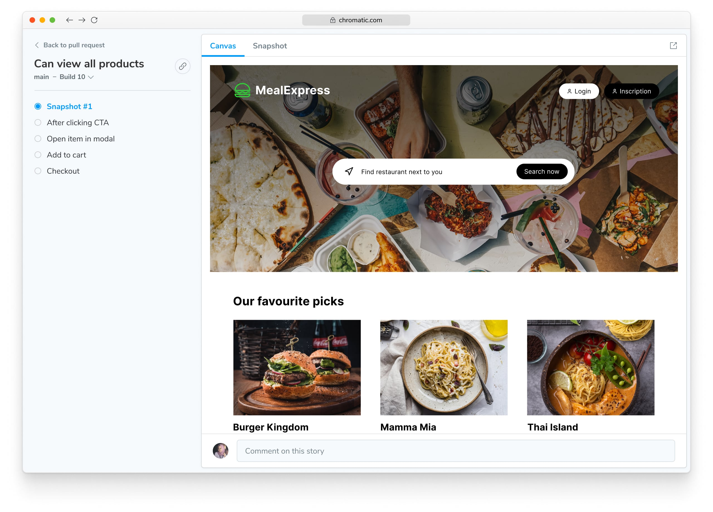

import { TabItem, Tabs } from "../../components/Tabs";

# E2E Visual Tests for Playwright (beta)

Chromatic E2E Visual Tests let you bring Chromatic's visual testing toolkit into your existing Playwright workflow. You can use Chromatic to capture snapshots of pages visited during Playwright tests—including DOM, styles, and assets—and then review and approve them in the Chromatic UI.

<div class="aside">
  Note: with the beta release we've made some changes to the setup for
  Chromatic's E2E Visual Tests feature. Please refer to the [upgrade
  guide](/docs/e2e-upgrade-guide) for more details.
</div>

### Requirements

- E2E Visual Tests works with end-to-end tests written in [Playwright](https://playwright.dev/) v1.12+.

## Table of contents

- [Getting started](#getting-started)
- [Taking manual snapshots](#taking-manual-snapshots)
- [Configuration](#configuration)
- [Working in Monorepos](#working-in-monorepos)
- [Sharded Playwright Runs](#sharded-playwright-runs)
- [Frequently asked questions](#frequently-asked-questions)

## Getting started

### 1. Set up a Chromatic project

If your repository already has an associated Chromatic project, you can set up an additional Chromatic project to test the Archive Storybook using the [instructions for monorepo support](/docs/monorepos#run-chromatic-for-each-subproject).

Otherwise, follow [these sign up instructions](/docs/setup#sign-up) to create a new Chromatic project.

<div class="aside">
  👉 Take note of the project token for the new project. You’ll need it in the
  next steps.
</div>

### 2. Install dependencies

Run the following command to install `@chromatic-com/playwright` and related dependencies.

<Tabs>
  <TabItem label="yarn">
    ```shell
    yarn add --dev chromatic @chromatic-com/playwright
    ```
  </TabItem>

  <TabItem label="npm">
    ```shell
    npm install --save-dev chromatic @chromatic-com/playwright
    ```
  </TabItem>
</Tabs>

### 3. Add Chromatic to Playwright

Update your Playwright tests with `@chromatic-com/playwright` imports

```js
// ➖ Remove this line
// import { test, expect } from '@playwright/test';
// ➕ Add this line
import { test, expect } from "@chromatic-com/playwright";

// Then use as normal 👇
test("Homepage", async ({ page }) => {
  await page.goto("https://mealexpress.com/");

  await expect(page).toHaveTitle("Mealdrop - find your next meal");

  // ...
});
```

### 4. Run Playwright as usual

<Tabs>
  <TabItem label="yarn">
    ```shell
    yarn playwright test
    ```
  </TabItem>

  <TabItem label="npm">
    ```shell
    npx playwright test
    ```
  </TabItem>
</Tabs>

### 5. Run a Chromatic build

You can use either the Chromatic CLI or the GitHub Action to run a build.

#### Chromatic CLI

Use the Chromatic CLI to run a build (using the token you noted above)

```shell
npx chromatic --playwright -t=<TOKEN>
```

This workflow results in tests that allow you to approve changes at a glance inside Chromatic.



Now, every time Chromatic runs, it produces snapshots for each test. Each snapshot has a unique URL, a fully-inspectable DOM, styling, and assets included:


#### GitHub Action

Use the GitHub Action with the `playwright` flag to run a build.

```yaml
- name: Publish to Chromatic
  uses: chromaui/action@latest
  with:
    playwright: true
    projectToken: ${{ secrets.CHROMATIC_PROJECT_TOKEN }}

# With env vars

- name: Publish to Chromatic
  uses: chromaui/action@latest
  with:
    playwright: true
    projectToken: ${{ secrets.CHROMATIC_PROJECT_TOKEN }}
  env:
    CHROMATIC_ARCHIVE_LOCATION=./custom/dir
```

---

## Taking manual snapshots

A snapshot is taken at the end of every test, whether is passes or fails. But you can also programmatically take manual snapshots at specific points in your tests using the `takeSnapshot` function inside your test runs:

```js
import { test, expect, takeSnapshot } from "@chromatic-com/playwright";

// 👇 Add testInfo parameter
test("Can filter product", async ({ page }, testInfo) => {
  await page.goto("/restaurant/dp/B07KMG72");

  await page.locator(".menu__item:first-of-type").click();

  // Call takeSnapshot to take an archive "snapshot"
  // of the page at this point in the test
  // 👇 Pass testInfo to takeSnapshot
  await takeSnapshot(page, testInfo);

  // continue with test
  await page.getByRole("link", { name: "Add to cart" }).click();

  // You can call takeSnapshot multiple times, as necessary
  // To help disambiguate, you can give the snapshot a name,
  // which is passed as the second argument to takeSnapshot
  await takeSnapshot(page, "After adding to cart", testInfo);

  await expect(page).toHaveTitle(/Cart/);
});
```

Every time this test is run, it produces a published library of snapshots using Chromatic's cloud.


---

## Configuration

You can further configure both your Playwright and Chromatic tests with the options described in the following sections.

### Playwright options

The Chromatic [Playwright Fixture](https://playwright.dev/docs/test-fixtures) can be configured with `use` like all [Playwright options](https://playwright.dev/docs/test-use-options).

Setting options globally can be done in your `playwright.config.js` as follows:

<Tabs>
  <TabItem label="TypeScript">
    ```ts
    // playwright.config.ts
    import { defineConfig } from "@playwright/test";
    import { ChromaticConfig } from "@chromatic-com/playwright";

    export default defineConfig<ChromaticConfig>({
      use: {
        // ...

        // 👇 your option overrides
        disableAutoSnapshot: true,
      },
      // ... your other configuration
    });
    ```

  </TabItem>
    <TabItem label="JavaScript">
    ```javascript
    // playwright.config.js

    import { defineConfig } from "@playwright/test";

    export default defineConfig({
      use: {
        // ...

        // 👇 your global options
        disableAutoSnapshot: true,
      },
      // ... your other configuration
    });
    ```

  </TabItem>
</Tabs>

Options can also be overridden at the test level:

```javascript
// mytest.spec.js

test.describe("some block", () => {
  // 👇 your option overrides
  test.use({ disableAutoSnapshot: true });

  test("some test", async ({ page }) => {
    // ...
  });
});
```

### E2E options

These options control how the Chromatic archive fixture behaves.

| Option                   | Type            | Description                                                                                                                                                                          |
| ------------------------ | --------------- | ------------------------------------------------------------------------------------------------------------------------------------------------------------------------------------ |
| `disableAutoSnapshot`    | `boolean`       | When `true`, will disable the snapshot that happens automatically at the end of a test when using the Chromatic test fixture.                                                        |
| `resourceArchiveTimeout` | `number`        | Maximum amount of time that each test will wait for the network to be idle while archiving resources.                                                                                |
| `assetDomains`           | `array[string]` | A list of domains external to the test location that you want Chromatic to also capture assets from, e.g., <code style="display: inline;">['other-domain.com','our-cdn.com']</code>. |

### Chromatic options

These options control how Chromatic behaves concerning the stories of your archives.

| Option                    | Type      | Chromatic Docs                                                          |
| ------------------------- | --------- | ----------------------------------------------------------------------- |
| `delay`                   | `number`  | [Delay](/docs/delay/)                                                   |
| `diffIncludeAntiAliasing` | `boolean` | [Threshold for changes](/docs/threshold#anti-aliasing)                  |
| `diffThreshold`           | `number`  | [Threshold for changes](/docs/threshold#setting-the-threshold)          |
| `forcedColors`            | `string`  | [Media Features](/docs/media-features#test-high-contrast-color-schemes) |
| `pauseAnimationAtEnd`     | `boolean` | [Animations](/docs/animations#css-animations)                           |
| `prefersReducedMotion`    | `string`  | [Media Features](/docs/media-features#verify-reduced-motion-animations) |

### Environment variables

Some options can be configured through environment variables.

| Environment variable         | Description                                                                                                                                                                                                                                                                                                                                                                                                                                                 |
| ---------------------------- | ----------------------------------------------------------------------------------------------------------------------------------------------------------------------------------------------------------------------------------------------------------------------------------------------------------------------------------------------------------------------------------------------------------------------------------------------------------- |
| `CHROMATIC_ARCHIVE_LOCATION` | If you have configured your project's [`outputDir`](https://playwright.dev/docs/api/class-testproject#test-project-output-dir) option to be different than the default, you must set the `CHROMATIC_ARCHIVE_LOCATION` environment variable to the same value. This must be done when starting the Storybook and when building it on CI. This ensures that the Archive Storybook can find the [archives](#what-are-archives) generated by the Test Archiver. |

<hr />

## Working in Monorepos

Often, when using a monorepo, developers tend to keep their e2e tests in a subdirectory instead of in the root of the project. At the same time, the Storybook and Chromatic configuration details live at the project’s root. In these cases, you will need to update the `archive-storybook` and `build-archive-storybook` scripts in your `package.json` by setting the [`-c` flag](https://storybook.js.org/docs/api/cli-options#build) and `CHROMATIC_ARCHIVE_LOCATION` environment variable. For example:

```json
"scripts": {
  "archive-storybook": "CHROMATIC_ARCHIVE_LOCATION=path/to/test-results archive-storybook -c path/to/node_modules/@chromaui/archive-storybook/config",
  "build-archive-storybook": "CHROMATIC_ARCHIVE_LOCATION=path/to/test-results build-archive-storybook -c path/to/node_modules/@chromaui/archive-storybook/config"
}
```

<div class="aside">

💡 For additional information on using Chromatic with a monorepo, see our [monorepo documentation](/docs/monorepos).

</div>

<hr />

## Sharded Playwright Runs

When running your Playwright tests over multiple shared CI jobs, you’ll need to wait for all jobs to complete, ensure you save the results in `./test-archives` to be accessible by the next job (for instance using an [artifact in GitHub Actions](https://docs.github.com/en/actions/using-workflows/storing-workflow-data-as-artifacts)), and run Chromatic in a job that depends on all of the shards.

For GitHub actions, that might look like:

```yaml
test:
  name: Run Playwright
  needs: install
  strategy:
    matrix:
      shard: [1, 2]
  steps:
    - name: Run Playwright tests
      run: npx playwright test --shard=${{ matrix.shard }}/${{ strategy.job-total }}

    - uses: actions/upload-artifact@v3
      if: always()
      with:
        name: playwright-report-${{ matrix.shard }}_${{ strategy.job-total }}
        path: ./test-archives/latest
        retention-days: 30

chromatic:
  name: Run Chromatic
  needs: test
  steps:
    - name: Download all workflow run artifacts
      uses: actions/download-artifact@v3

    - name: Publish E2E Archives to Chromatic
      uses: chromaui/action@v1
      with:
        projectToken: ${{ secrets.CHROMATIC_ARCHIVE_PROJECT_TOKEN }}
        buildScriptName: build-archive-storybook
```

<hr />
