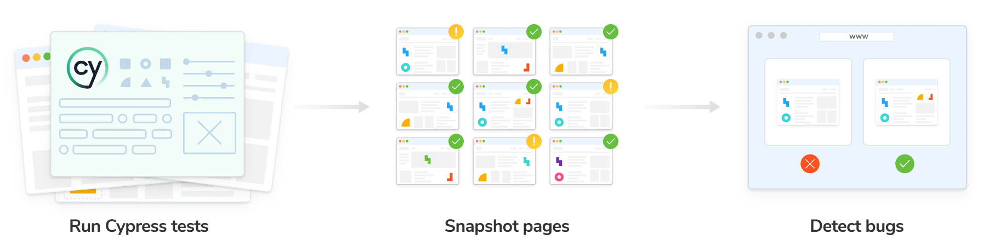
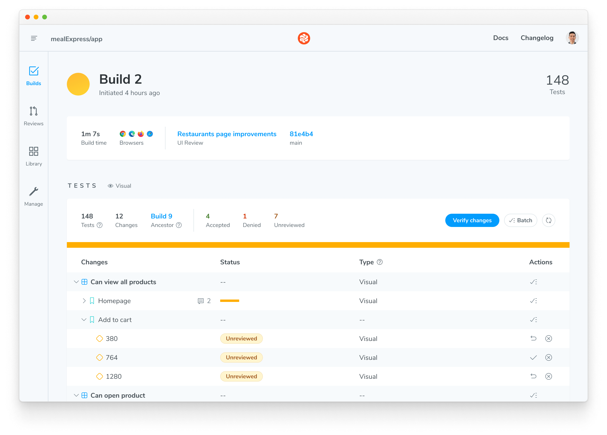

import DemoChromaticUnlinked from "../../shared-snippets/demo-chromatic-unlinked.mdx";
import RunE2E from "../../shared-snippets/setup/run-e2e.mdx";
import TroubleshootingSetup from "../../shared-snippets/setup/troubleshooting.mdx";
import InstallSnippets from "../../components/InstallSnippets.astro";

# Chromatic for Cypress

Chromatic’s visual tests integrate with Cypress via a plugin. This means you can transform your existing Cypress end-to-end (E2E) into visual regression tests with a single import change. Start capturing interactive snapshots while Cypress E2E tests run, and review visual changes in Chromatic’s cloud environment.



## Why visual test with Cypress?

Cypress enables you to write E2E tests that drive the browser to simulate key user flows through your application, like ‘sign up’ and ‘add to cart’. By snapshotting the UI states generated during your E2E tests, you can proactively catch visual bugs that might slip through traditional logic-based tests.

## How does Chromatic work?

Chromatic communicates with Cypress via the devtools protocol. While your Cypress E2E tests run, Chromatic captures an [**archive**](/docs/faq/what-is-archive) of the page and uploads it to the cloud. There, Chromatic generates snapshots and performs pixel diffing to identify any unintended visual changes.

Key advantages of Chromatic's Cypress integration:

- **Robustness:** Chromatic saves full page [archives](/docs/faq/what-is-archive) (DOM, styling, assets) of every test case. This lets you interactively debug the UI within the Chromatic app, eliminating the need to run tests locally for troubleshooting.
- **Workflow:** Chromatic streamlines visual testing by removing the need to manually manage screenshots in your repo. Snapshots are indexed, linked to git commits, and stored in the cloud for easy access.
- **Parallelized testing:** Chromatic's cloud infrastructure automatically scales to run all tests simultaneously, eliminating the need for you to configure multiple workers on your CI.
- **Dedicated review app:** Chromatic offers a suite of visual diffing tools to spot regressions fast. Features include unified and split diffs, highlighting ignored regions, spotlight mode to focus and zoom in on changes, and strobe diff to pinpoint subtle changes.

## Setup Chromatic for Cypress

Chromatic supports Cypress version 13.5.0 and above.

### 1. Sign up and create a new project

Generate a unique project token for your app by signing in to Chromatic and creating a project. Sign in with your GitHub, GitLab, Bitbucket, or email.

<div class="callout">
  If your repository already has a Chromatic project linked to it, you can
  create an additional Chromatic project to run visual tests with Cypress.
  Follow the instructions for [sub-projects support](/docs/combine-stories-e2e).
</div>

<DemoChromaticUnlinked />


### 2. Install Chromatic

Install [chromatic](https://www.npmjs.com/package/chromatic) and `@chromatic-com/cypress` packages from npm.

{/* prettier-ignore-start */}

<InstallSnippets>
  <Fragment slot="npm">
  ```shell
  $ npm install --save-dev chromatic @chromatic-com/cypress
  ```
  </Fragment>
  <Fragment slot="yarn">
  ```shell
  $ yarn add --dev chromatic @chromatic-com/cypress
  ```
  </Fragment>
  <Fragment slot="pnpm">
  ```shell
  $ pnpm add --dev chromatic @chromatic-com/cypress
  ```
  </Fragment>
</InstallSnippets>

{/* prettier-ignore-end */}

### 3. Add Chromatic to Cypress tests

Add the following to your `cypress/support/e2e.js` file:

```js title="cypress/support/e2e.js"
import "@chromatic-com/cypress/support";
```

Then, install the Chromatic plugin in your `cypress.config.js` file:

```js title="cypress.config.js"
const { defineConfig } = require("cypress");
const { installPlugin } = require("@chromatic-com/cypress");

module.exports = defineConfig({
  e2e: {
    setupNodeEvents(on, config) {
      installPlugin(on, config);
    },
  },
});
```

### 4. Run Cypress

Prefix your Cypress command with the following environment variable. This enables Chromatic to communicate with Cypress using the Chrome DevTools Protocol.

Then run your Cypress tests as you normally would.

{/* prettier-ignore-start */}

<InstallSnippets>
  <Fragment slot="npm">
  ```shell
  $ ELECTRON_EXTRA_LAUNCH_ARGS=--remote-debugging-port=9222 npx cypress run
  ```
  </Fragment>
  <Fragment slot="yarn">
  ```shell
  $ ELECTRON_EXTRA_LAUNCH_ARGS=--remote-debugging-port=9222 yarn cypress run
  ```
  </Fragment>
  <Fragment slot="pnpm">
  ```shell
  $ ELECTRON_EXTRA_LAUNCH_ARGS=--remote-debugging-port=9222 pnpm cypress run
  ```
  </Fragment>
</InstallSnippets>

{/* prettier-ignore-end */}

### 5. Run Chromatic

Use your project token and run the following command in your project directory.

```shell
npx chromatic --cypress -t=<TOKEN>
```

<RunE2E type="Cypress" />

### 6. Review changes

When complete, you’ll see the build status and a link to review the changes. Click on that link to open Chromatic.

```shell
✔ Started build 1
  → Continue setup at https://www.chromatic.com/setup?appId=...
✔ Build 1 auto-accepted
  → Tested X stories across 10 components; captured 10 snapshots in 1 minute 3 seconds
```



The build will be marked “unreviewed” and the changes will be listed in the “Tests” table. Go through each snapshot to review the diff and approve or reject the change.


Once you accept all changes, your build is marked as passed 🟢. This updates the baselines for those tests, ensuring future snapshots are compared against the latest approved version.


---

## Next: enhance your UI Testing workflow

You're building robust components by uncovering bugs during development. Take your testing to the next level and safeguard against visual bugs by automating Chromatic whenever you push code.


[**Integrate Chromatic into your CI pipeline**](/docs/ci) to get notified about any visual changes introduced by a pull request. Chromatic runs test any time you push code and reports changes via the “UI Tests” badge for your pull request.

### Advanced configuration options

Take full control of your Chromatic and Cypress setup to match your team's specific workflows. Here are some powerful customizations we offer:

- [**Take targeted snapshots:**](/docs/cypress/targeted-snapshots) Learn how to programmatically capture snapshots at specific points during your tests.
- [**Fine-tune snapshot capture:**](/docs/cypress/configure#chromatic-options) Add delays before snapshots, modify the sensitivity threshold for change detection, and employ other granular controls.
- [**Test for flexible user preferences:**](/docs/media-features#media-features) Ensure your UI gracefully adapts to user preferences like `forced-colors` and `prefers-reduced-motion`.
- [**Responsive testing:**](/docs/cypress/configure#viewports) Verify your UI's responsiveness across various screen sizes. Easily configure viewport dimensions in Cypress, both globally and within individual tests.

---

## Frequently asked questions

<TroubleshootingSetup />

<details>
<summary id="turbosnap-support">Can I use TurboSnap with Cypress visual tests?</summary>

No. Cypress is a "black box" tool that tests your fully built app UI in a browser. TurboSnap is incompatible with this testing methodology because it requires tracking code changes and git history to identify the UI that's likely to change. We would love to integrate TurboSnap and Cypress but it isn't technically feasible right now.

</details>

<details>
<summary id="storybook-step">Why is there a `Build your Storybook` step when running Cypress visual tests?</summary>

Chromatic creates and runs a Storybook [archive](/docs/faq/what-is-archive) based on your Cypress project, so the build Storybook step is required. Chromatic doesn't run Cypress directly.

</details>

<details>
<summary id="chrome-browser">Is using Chrome mandatory when running Cypress with Chromatic?</summary>

Yes. Chromatic relies on Chrome for snapshotting, so Chrome **must** be included in your Cypress configuration.
Omitting it will trigger error: `Failed to run chromatic -cypress`

Refer to Cypress documentation: [**Cross Browser Testing**](https://docs.cypress.io/app/guides/cross-browser-testing)

</details>
