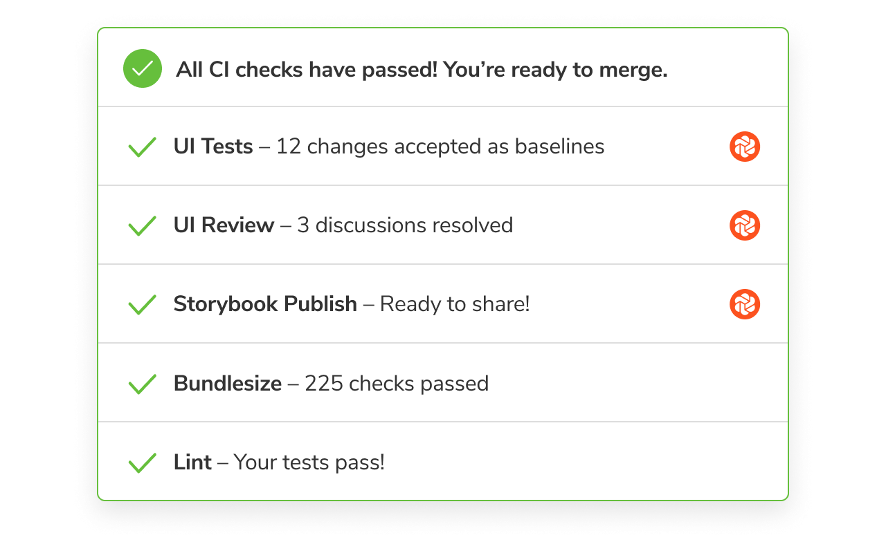

# Automate with continuous integration

Configure CI to publish your Storybook and run Chromatic's automation whenever you push code. Badge your PRs to get notified about test and review results.


## Configure CI

Before we begin, make sure you set the `CHROMATIC_PROJECT_TOKEN` environment variable (sometimes referred to as "secrets") in your CI service's configuration. Add a `chromatic` script to your `package.json` if you don't have one already, and make sure `chromatic` is listed in `devDependencies`.

```json
"scripts": {
  "chromatic": "chromatic --exit-zero-on-changes"
}
```

Integrate with popular CI tools like you would any other job. Run `npm run chromatic` to publish your Storybook. If [UI Test](/docs/test) or [UI Review](/docs/review) are enabled, it will return a non-zero exit code when there are changes. For example:

```yml
- run:
    command: npm install # install dependencies
- run:
    command: npm test # run your unit tests
- run:
    command: npm run chromatic # publish Storybook and run visual tests
```

Here's how we recommend configuring Chromatic for popular CI services:

- [GitHub Actions](/docs/github-actions)
- [GitLab Pipelines](/docs/gitlab)
- [Bitbucket Pipelines](/docs/bitbucket-pipelines)
- [CircleCI](/docs/circleci)
- [Travis CI](/docs/travisci)
- [Jenkins](/docs/jenkins)
- [Azure Pipelines](/docs/azure-pipelines)
- [Other CI providers](/docs/custom-ci-provider)

## Pull request checks

When a build runs it will automatically add a PR status check to the current pull request indicating the state of the build. By default, you'll see Storybook Publish. If you enabled UI Tests or UI Review you'll also see their respective checks.

GitHub, Bitbucket, or GitLab projects that are [linked to a repository](/docs/access) get this feature out of the box. If you use other version control services to host your code, you can write a custom CI script to add a check for Chromatic (via your CI provider).

Require checks in [GitHub](https://help.github.com/en/github/administering-a-repository/enabling-required-status-checks), [GitLab](https://docs.gitlab.com/ee/api/commits.html#post-the-build-status-to-a-commit), or [Bitbucket](https://confluence.atlassian.com/bitbucket/suggest-or-require-checks-before-a-merge-856691474.html) to ensure they are completed before merging.



---

## Next: See the recommended Chromatic workflow

How tools work together affects your development speed. Learn the recommended Chromatic workflow.

<a class="btn primary round" href="/docs/workflow">Read next chapter</a>

---

### Troubleshooting

<details>
<summary>Can I hide the CI messages in the web app?</summary>

Chromatic detects CI test runs for most services. But it's not possible for every system, which results in users seeing persistent "Setup CI / Automation" messages in the UI.

If this is happening to you, prepend `CI=true` to your test command like so `CI=true yarn chromatic...` to hide the "Setup CI" messages in Chromatic. [Learn more](/docs/test).

</details>

<details>
<summary>Why aren't pull request checks syncing with my git provider?</summary>

Pull/merge request checks show the status of your UI Tests and UI Review in GitHub, Bitbucket, or GitLab. If you find that your status checks are out of sync between Chromatic and your git provider, try the solutions below.

**1. Check that your project is linked to a git provider**

Go to your Project » Manage » Configure tab under the "Connected Applications". Then confirm that there is a repository connected to your project and that the access token is valid.

**2. Check whether commits are successfully linked to builds**

Chromatic runs builds for each commit to power UI Tests and UI Review. We expect the build commit in Chromatic to match the commit in your repository. But some CI environments and git providers create an "ephemeral" merge commit if your feature branch is not up to date with your default base branch (master, main, develop, etc).

You can verify that you're in this situation by going to the Build page and noting the commit hash. If your project is "linked" to a git provider, you can also click on the commit to go straight to the git provider website. If you get a "Not Found" page indicating the commit doesn't exist then this issue applies to you.

The way to fix this is to set the Chromatic [environment variables](/docs/cli/#environment-variables): `CHROMATIC_SHA`, `CHROMATIC_BRANCH`, `CHROMATIC_SLUG`. Note, you must set all three.

**3. Check if your environment variables are set correctly**

Another possibility is that your environment variables `CHROMATIC_SHA`, `CHROMATIC_BRANCH`, `CHROMATIC_SLUG` are not configured correctly.

The most likely reason is that you are pulling the incorrect value from your CI provider to set the variables or you are working on a forked repository and have not configured the variables to match the base repository.

<div class="aside">

If none of these situations apply to you, [email](mailto:support@chromatic.com) support and attach the full job that includes `chromatic` for your particular CI environment.

</div>

</details>
