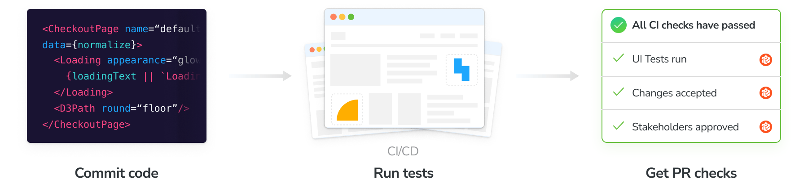

import TroubleshootingCI from "../../shared-snippets/ci/troubleshooting.md";

# Automate Cypress visual tests with CI

Configure CI to run your visual tests whenever you push code and get PR badges to get notified about test and review results.



## Configure CI

Before we begin, make sure you set the `CHROMATIC_PROJECT_TOKEN` environment variable (sometimes referred to as "secrets") in your CI service's configuration. Add a `chromatic` script to your `package.json` if you don't have one already, and make sure `chromatic` is listed in `devDependencies`.

```json
"scripts": {
  "chromatic": "chromatic --cypress --exit-zero-on-changes"
}
```

Integrate with popular CI tools like you would any other job. Run `npm run chromatic` to run [visual tests](/docs/cypress/test). It will return a non-zero exit code when there are changes. For example:

```yml
- run:
    command: npm install # install dependencies
- run:
    command: npx cypress run # run your cypress tests
- run:
    command: npm run chromatic # run visual tests
```

### GitHub Action

Chromatic provides a [GitHub Action](https://github.com/marketplace/actions/publish-to-chromatic) to help you automate your Cypress visual tests. Use this Action with the `cypress` flag to run a build.

```yaml
# .github/workflows/chromatic.yml

name: "Chromatic"

on: push

jobs:
  chromatic:
    runs-on: ubuntu-latest
    steps:
      - name: Checkout code
        uses: actions/checkout@v4
        with:
          fetch-depth: 0

      - name: Install dependencies
        # ⚠️ Pick one of these, matching the package manager for your project
        run: npm ci
        # run: pnpm install
        # run: yarn install --immutable --immutable-cache --check-cache

      # ...
      # Your existing setup to run Cypress tests
      # ...

      - name: Run Chromatic
        uses: chromaui/action@latest
        with:
          # ⚠️ enable cypress
          cypress: true
          # ⚠️ Make sure to configure a `CHROMATIC_PROJECT_TOKEN` repository secret
          projectToken: ${{ secrets.CHROMATIC_PROJECT_TOKEN }}
        # ⚠️ Optionally configure the archive loation with env vars
        env: CHROMATIC_ARCHIVE_LOCATION=./custom/dir
```

## Pull request checks

When a build runs it will automatically add a PR status check to the current pull request indicating the state of the build. By default, you'll see UI Tests and Storybook Publish. If you enabled UI Review you'll also see a checks for it.

GitHub, Bitbucket, or GitLab projects that are [linked to a repository](/docs/access) get this feature out of the box. If you use other version control services to host your code, you can write a custom CI script to add a check for Chromatic (via your CI provider).

Require checks in [GitHub](https://help.github.com/en/github/administering-a-repository/enabling-required-status-checks), [GitLab](https://docs.gitlab.com/ee/api/commits.html#post-the-build-status-to-a-commit), or [Bitbucket](https://confluence.atlassian.com/bitbucket/suggest-or-require-checks-before-a-merge-856691474.html) to ensure they are completed before merging.


---

## You're all set up

Next up, explore the advanced configuration options to tailor the Chromatic and Cypress setup to your needs.

<a class="btn primary round" href="/docs/cypress/configure">
  Configuration options
</a>

---

<TroubleshootingCI />
