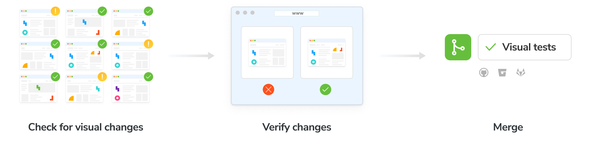

import EnableE2EVT from "../../shared-snippets/ui-tests/enable-for-e2e.mdx";
import Baselines from "../../shared-snippets/ui-tests/baselines.md";
import VerifyDiscussMerge from "../../shared-snippets/ui-tests/verify-discuss-merge.md";
import Troubleshooting from "../../shared-snippets/ui-tests/troubleshooting.md";

# Run visual tests with Cypress

Visual Tests are used to detect UI bugs down to the pixel. They capture a [snapshot](/docs/snapshots) of every Cypress test in a cloud browser environment. Whenever you push code, Chromatic generates a new set of snapshots and compares them against [baseline snapshots](/docs/branching-and-baselines#whats-a-baseline). If there are changes, you verify that they’re intentional. If there are test errors, you get notified to fix them.

<EnableE2EVT type="Cypress" />

<Baselines />

<VerifyDiscussMerge />

## PR check for “UI Tests”

Chromatic reports the status of Cypress visual tests through the ‘UI Tests’ pull request check. The badge shows errors or changes that need to be reviewed. Require the check in [GitHub](https://help.github.com/en/github/administering-a-repository/enabling-required-status-checks), [GitLab](https://docs.gitlab.com/ee/api/commits.html#post-the-build-status-to-a-commit), or [Bitbucket](https://confluence.atlassian.com/bitbucket/suggest-or-require-checks-before-a-merge-856691474.html) to prevent accidental UI bugs from being merged.

CI setup: Chromatic will return an exit code 0 on the CLI which can be used in CI/CD systems to indicate success and unblock deployment. [Learn about CI](/docs/cypress/ci).

---

## Next: Automate Cypress visual tests with CI

Having learned how to validate your application's appearance using Chromatic and Cypress, let's now explore integrating Chromatic into your continuous integration pipeline to enable PR status checks.

<a class="btn primary round" href="/docs/cypress/ci">
  Read next chapter
</a>

---

<Troubleshooting />
