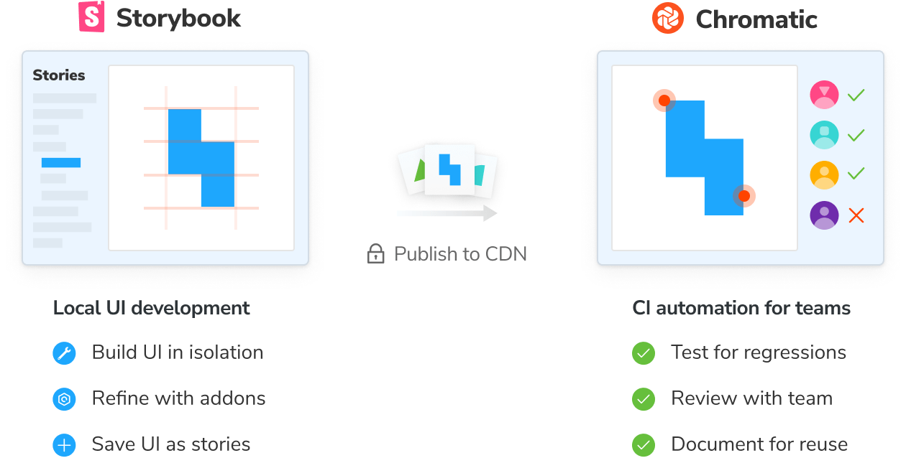

# Introduction to Chromatic

## What is Chromatic?

Chromatic is a cloud-based toolchain that helps teams ship UI components faster. It's made by the [team](https://www.chromatic.com/company/about) behind Storybook and integrates with Storybook, Playwright, and Cypress. Watch a [quick demo video](https://youtu.be/zhrboql8UuU) now or read on for the key features:

## For Storybook

#### ⬆️ Publish Storybook

Publish your Storybook to our secure CDN when you push code. Chromatic provides a shared workspace for teams to comment and review UI work together. It integrates with your existing CI workflow and Git hosting provider.

#### ✅ UI Tests

Test for visual regressions in components. Chromatic turns your stories into test baselines. Each story is rendered in Chrome, Firefox, Safari, and Edge simultaneously, then compared to a screenshot of the "last known good state" to detect bugs.

#### 💬 UI Review

Review a visual changeset of components affected by each pull request. Chromatic compares the new and updated components on a given feature branch versus a target branch to generate a UI changeset. That makes it easy to review with tech leads, designers, and product managers. Think of it like code review, but for UI.

#### 📚 Document

Maintain a documented, versioned, and searchable library for your components. Chromatic helps teammates discover your work to reuse. Reference Chromatic's library inside your local Storybook or on the website.

#### 🚥 Powered by continuous integration

Automate your component library with CI and version control. Chromatic includes three PR checks: "Storybook Publish", "UI Tests", and "UI Review". This helps you gauge UI work in progress.

<h4 class="no-anchor">Why use Storybook?</h4>

[Storybook](https://storybook.js.org) is an open source tool built for developing UI components in isolation and creating living, interactive component documentation. Storybook makes it trivial to reproduce hard to reach component states and ensuring those states are documented in code. When you adopt Storybook you also unlock automation for UI components and libraries via Chromatic.

New to Storybook? Read our peer-reviewed guides for professional developers at [storybook.js.org/tutorials](https://storybook.js.org/tutorials/).

## For Playwright & Cypress

Chromatic integrates with Playwright and Cypress to provide comprehensive visual coverage for your end-to-end (E2E) tests.

End-to-end tests check key user flows like “sign up” and “buy now". Chromatic piggybacks on your E2E tests' config, mocking, and settings to give you confidence that your application appears correctly.

### How Chromatic works

- Playwright/Cypress drives the browser to specific pages and states in your app
- For each state, Chromatic automatically captures the UI (complete with DOM, styling, and assets) and takes a snapshot
- When a new E2E test runs, Chromatic captures new snapshots and compares them to baseline snapshots to identify visual changes
  
---

## Next: Setup

Chromatic seamlessly integrates with your existing workflow and toolchain. Setup is straightforward and takes less than 2 minutes. Pick your testing tool of choice to get started.

  
  
  

