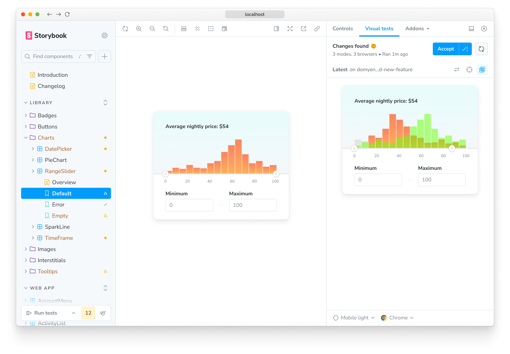
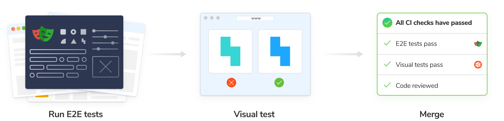

# Visual testing with Chromatic

Chromatic is a visual testing tool that scans every possible UI state across browsers to catch bugs in appearance and functionality. It enables you to assign reviewers and resolve discussions to streamline team sign-off.

Chromatic is made by the [team](https://www.chromatic.com/company/about) behind Storybook and integrates with Storybook, Playwright, and Cypress. Watch a [quick demo video](https://youtu.be/zhrboql8UuU) now or read on for the key features.

## Why use visual testing?

Functional UI tests excel at ensuring your app _works_, but they often fail to catch bugs in UI appearance. This is because functional tests don’t validate the pixels rendered by your application UI. Instead, they only verify the logic and behavior of components and pages.

For instance, buggy CSS might hide your app's “checkout” button behind a notification banner. Your [functional test](https://www.chromatic.com/blog/functional-testing/) might indicate that the button is clickable—because, technically, it is, even though it’s now inaccessible to your users. Visual testing catches such bugs and safeguards your app’s user experience.

## How does visual testing work?

You can think of Chromatic’s visual testing as "before-and-after" [snapshots](https://www.chromatic.com/docs/snapshots) of your app's interface. You begin by capturing a perfect "before" image—this becomes your [baseline](https://www.chromatic.com/docs/branching-and-baselines#whats-a-baseline). After any code changes, Chromatic compares a new "after" snapshot pixel-by-pixel against the baseline, revealing any visual differences.

Chromatic's streamlined workflow involves four steps:

1. **Cloud Rendering:** Chromatic renders your UI components in a cloud-based browser.
2. **Snapshot Capture:** Chromatic takes a snapshot for each test, with all tests running simultaneously to save you time.
3. **Automated diffing:** Whenever you update your code, Chromatic generates new snapshots and compares them to the baselines.
4. **Review and Verification:** When Chromatic detects changes, you’re prompted to review them to ensure they're intentional. Any unexpected changes trigger notifications so you can fix them quickly.

<video autoPlay muted playsInline loop style="margin-bottom: 1em; border: 1px solid rgba(0,0,0,0.1);">
  <source src="/docs/assets/visual-test-hero.mp4" type="video/mp4" />
</video>

## How does Chromatic fit into my stack?

Chromatic leverages your existing setup—configuration, mocking, and tests—to enable visual testing of your application's UI. That means you can verify how UIs look and function simultaneously.

### Visual testing with Storybook

Storybook is an open source workshop for developing components and pages in isolation. Chromatic is built and maintained by the team behind Storybook, ensuring a seamless integration.

Storybook lets you define the different states and variations of components as [stories](https://storybook.js.org/docs/get-started/whats-a-story). This gives you an ideal setup for functional testing. Attach a [play function](https://storybook.js.org/docs/writing-stories/play-function) to mimic how users interact with your components and include assertions to verify the expected behavior. Chromatic uses these stories to power visual tests.

Chromatic integrates with Storybook via an [addon](https://www.chromatic.com/storybook) to unlock on-demand visual testing right from within your familiar Storybook environment. With a single click, you can run visual checks on all your stories simultaneously. Chromatic runs the tests in the cloud, notifying you directly in Storybook if any component's appearance deviates from expectations. In addition to this local workflow, you can also run these tests in CI.

[**Get started with Storybook & Chromatic »**](https://www.chromatic.com/docs/storybook/setup/)

### Visual testing with Playwright

[Playwright](https://playwright.dev/) is an open source end-to-end (E2E) test runner developed by Microsoft. It verifies key app flows like "sign up" and "add to cart" by driving the browser to simulate user interactions.

Chromatic integrates with Playwright by extending its test and expect utilities. While your Playwright tests run, Chromatic captures an archive of the page (including DOM, styling, and assets) and uploads it to the cloud. There, Chromatic generates snapshots and performs pixel diffing to identify any unintended visual changes.

Playwright offers native visual testing capabilities, but Chromatic's unique snapshot approach and powerful diffing tools provide a more comprehensive testing experience.

[**Get started with Playwright & Chromatic »**](https://www.chromatic.com/docs/playwright/setup/)

### Visual testing with Cypress

[Cypress](https://www.cypress.io/) is another popular E2E test runner like Playwright, but it lacks built-in visual testing features. While Cypress tests can verify your app's functionality, they won't detect visual regressions in the interface. This is where Chromatic becomes an essential tool for Cypress users.

Chromatic integrates with Cypress via a plugin. While your Cypress tests execute, Chromatic captures complete archives of your test cases (DOM, styling, assets) and uploads them to the cloud. There, Chromatic generates snapshots and performs pixel diffing, enabling you to catch any unintended visual changes in your application.

[**Get started with Cypress & Chromatic »**](https://www.chromatic.com/docs/cypress/setup/)

## Benefits of visual testing with Chromatic

Chromatic’s visual regression testing lets you gain full confidence in your UI’s visual fidelity on every commit and code change.

🎛️ **Test the real UI**: Chromatic takes pixel-perfect snapshots of real code, styling, and assets. Your tests reflect exactly what your users see.

✅ **No test flake**: Chromatic tests run in a standardized environment to eliminate flake. We auto-detect when UI finishes loading, painting, and reflowing before taking a snapshot.

🏎️ **Run tests in parallel by default**: Chromatic tests run on as many machines as required to deliver results in the least time possible. Parallelization is automatic with no extra configuration or cost required.

🌐 **Cross-browser testing**: Chromatic test coverage extends to Chrome, Firefox, Safari, and Edge. All browser tests run in parallel so your test suite stays fast.

📲 **Responsive viewport testing**: Chromatic allows testing at all viewport sizes. You can adjust both width and height, and configure viewports globally or for individual tests.

⚡ **Test only what's changed**: Chromatic’s [TurboSnap](https://www.chromatic.com/features/turbosnap) feature analyzes your project’s Git history and bundler dependency graph to identify component files and dependencies with changes. Then, Chromatic only snapshots tests related to those changes. This speeds up test runs and reduces the infrastructure costs by up to 80%.

---

## Next: Master the basics

Explore Chromatic's UI testing workflow, where visual and functional testing merge into a seamless process. Learn how to generate baselines, review changes, and collaborate using discussions.

<a class="btn primary round" href="/docs/test">
  Read next chapter
</a>

**Eager to get started?** Experience the power of Chromatic firsthand! Setup takes just two minutes. Pick your testing tool of choice and get started.

  
  
  

