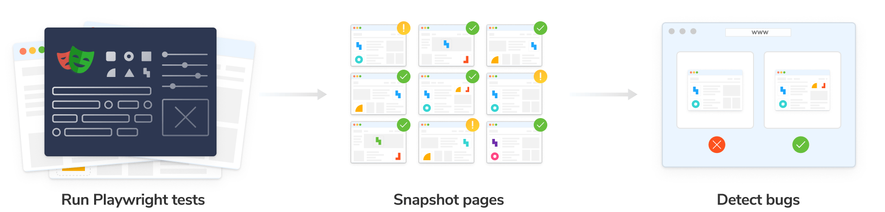
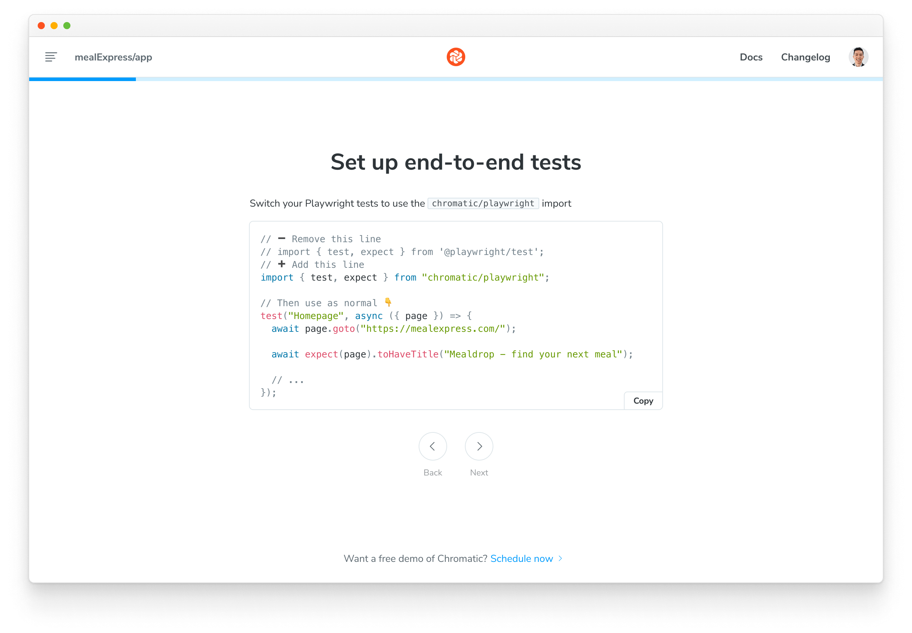

import DemoChromaticUnlinked from "../../shared-snippets/demo-chromatic-unlinked.md";
import TroubleshootingSetup from "../../shared-snippets/setup/troubleshooting.mdx";
import RunE2E from "../../shared-snippets/setup/run-e2e.mdx";
import { TabItem, Tabs } from "../../../components/Tabs";

# Setup Chromatic for Playwright

Bring Chromatic's visual testing toolkit into your Playwright workflow. You can use Chromatic to capture snapshots of pages visited during Playwright tests—including DOM, styles, and assets—and then review them in Chromatic's app.



## Sign up

Generate a unique project token for your app by signing in to [Chromatic](https://www.chromatic.com/start) and creating a project. Sign in with your GitHub, GitLab, Bitbucket, or email.

<div class="aside">
  If your repository already has a Chromatic project linked to it, you can
  create an additional Chromatic project to run visual tests with Playwright.
  Follow the instructions for [sub-projects
  support](/docs/monorepos#run-chromatic-for-each-subproject).
</div>

<DemoChromaticUnlinked />



## Install

Install [**chromatic**](https://www.npmjs.com/package/chromatic) and `@chromatic-com/playwright` packages from npm.

<Tabs>
  <TabItem label="npm">
    ```shell
    npm install --save-dev chromatic @chromatic-com/playwright
    ```
  </TabItem>

  <TabItem label="yarn">
    ```shell
    yarn add --dev chromatic @chromatic-com/playwright
    ```
  </TabItem>
</Tabs>

<div class="aside">
  Chromatic only works with tests written in Playwright v1.12+.
</div>

## Add Chromatic to Playwright tests

Update your Playwright tests to use the Chromatic specific testing utilities from `@chromatic-com/playwright`.

```js
// ➖ Remove this line
// import { test, expect } from '@playwright/test';
// ➕ Add this line
import { test, expect } from "@chromatic-com/playwright";

// Then use as normal 👇
test("Homepage", async ({ page }) => {
  await page.goto("https://mealexpress.com/");

  await expect(page).toHaveTitle("Mealdrop - find your next meal");

  // ...
});
```

## Run Playwright

Run your Playwright tests as you normally would. For example:

```shell
npx playwright test
```

## Run Chromatic

Use your project token and run the following command in your project directory.

```shell
npx chromatic --playwright -t=<TOKEN>
```

<RunE2E type="Playwright" />

---

## Taking manual snapshots

A snapshot is taken at the end of every test, whether is passes or fails. But you can also programmatically take manual snapshots at specific points in your tests using the `takeSnapshot` function inside your test runs:

```js
import { test, expect, takeSnapshot } from "@chromatic-com/playwright";

// 👇 Add testInfo parameter
test("Can filter product", async ({ page }, testInfo) => {
  await page.goto("/restaurant/dp/B07KMG72");

  await page.locator(".menu__item:first-of-type").click();

  // Call takeSnapshot to take an archive "snapshot"
  // of the page at this point in the test
  // 👇 Pass testInfo to takeSnapshot
  await takeSnapshot(page, testInfo);

  // continue with test
  await page.getByRole("link", { name: "Add to cart" }).click();

  // You can call takeSnapshot multiple times, as necessary
  // To help disambiguate, you can give the snapshot a name,
  // which is passed as the second argument to takeSnapshot
  await takeSnapshot(page, "After adding to cart", testInfo);

  await expect(page).toHaveTitle(/Cart/);
});
```

---

## Next: Catch UI bugs using Playwright & Chromatic

📸 Now that you've set up Chromatic to capture snapshots of Playwright tests, let's explore how [visual tests](/docs/playwright/test) can help catch bugs.

<a class="btn primary round" href="/docs/playwright/test">
  Read next chapter
</a>

---

### Troubleshooting

<TroubleshootingSetup />

<details>
<summary id="turbosnap-support">Can I use TurboSnap with Playwright visual tests?</summary>

No. Playwright is a "black box" tool that tests your fully built app UI in a browser. TurboSnap is incompatible with this testing methodology because it requires tracking code changes and git history to identify the UI that's likely to change. We would love to integrate TurboSnap and Playwright but it isn't technically feasible right now.

</details>