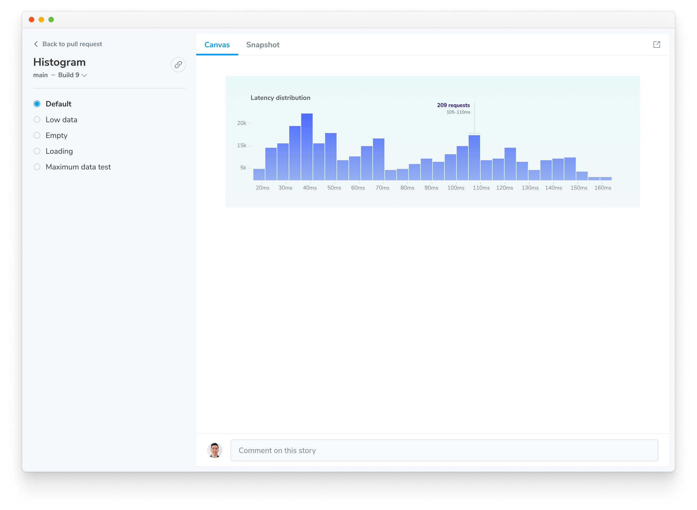

# Document

Chromatic indexes and versions your components in a searchable library. You can browse components and stories across branches and past builds from the web app. That helps teams discover existing work to reuse and reference "prior art".

## Browse library

The library screen visualizes the latest components on a branch-by-branch basis. Browse existing components to reuse or reference. Use the branch picker to find branch-specific components.

- Identify changes by comparing historical commits and branches
- Share the library with teammates
- Browse existing components for re-use

## Demo components

Components and their stories are securely indexed each commit and branch. Use the component screen to demo components without needing to switch branches, pull code, or Git. It's your window into the metadata and variations of the component. You can also share a link to this screen to get feedback.

- **Canvas**: Interact with the real component code to reproduce behavior
- **Snapshot**: Verify the image [snapshots](/docs/snapshots) used for cross-browser [UI Tests](/docs/test)

## Direct access to your Storybook

Your Storybook is published on our secure CDN. Published Storybooks are private by default with [access](/docs/access) restricted to logged in collaborators. [Visibility](/docs/collaborators#visibility) can be set to public if desired.

Chromatic generates a [permalink](/docs/permalinks) for the latest uploaded Storybook on a given branch. That makes it easy to share with your teammates or link to from docs. `https://<branch>--<appid>.chromatic.com`

## Link to specific branches

When you're linking to a library or component on Chromatic, it can be useful to link to the latest version on a `branch` rather than a specific build. To do so, add the `branch=foo` query parameter the the url.

**Example**: `https://www.chromatic.com/library?appId=...&branch=main`.

## Embedding

If you're documenting components outside of Storybook, you may be able to [embed interactive stories](/docs/embed). This works on many platforms that support the oEmbed specification.

---

## Next: Automate with CI

Now that you learned how UI components are documented in Chromatic, let's see how to integrate Chromatic into your continuous integration pipeline and get PR status checks.

<a class="btn primary round" href="/docs/storybook/ci">Read next chapter</a>

---

### Troubleshooting

Why is my Storybook failing to load in Chromatic's Canvas tab?

**Mixed content**
 
If your stories make use of non-HTTPS content (for instance, images), the iframe rendering your stories will fail to load, as modern browsers do not allow [mixed content](https://developer.mozilla.org/en-US/docs/Web/Security/Mixed_content) (HTTP content sources included within HTTPS pages).

To fix this, ensure all resources used by your stories are served via HTTPS.

**CORS violation**
 
Chromatic renders your published stories in an iframe. Due to browser security restrictions, your components and stories cannot reference `window.parent` or `window.top`. In Storybook, those properties would reference the Storybook manager interface, which is located on the same domain as the iframe and therefore allowed. But when rendered on chromatic.com, those properties would reference a different (sub)domain and therefore violate CORS restrictions, causing a JavaScript error. There are three ways to mitigate this issue:

1. Don’t reference `window.parent` or `window.top`. If you’re trying to communicate with the Storybook manager UI, it’s better to use “channels.” Storybook provides the [useChannel API](https://storybook.js.org/docs/react/addons/addons-api#usechannel) for this purpose.

2. Conditionally avoid `window.parent` and `window.top` by checking `isChromatic()`. We provide the [`isChromatic` utility](/docs/ischromatic) to “detect” when a story is rendered inside of Chromatic.

3. Wrap your `window.parent` and `window.top` references in a `try/catch` block. This will suppress the JavaScript error.

