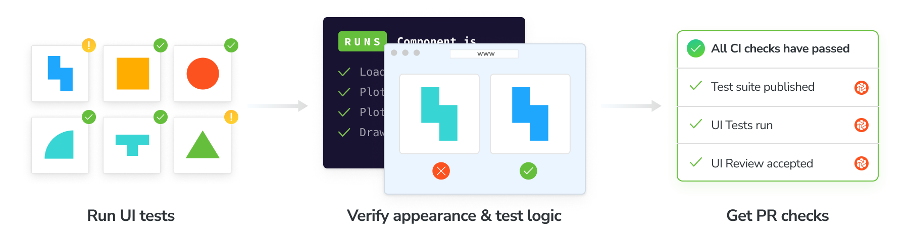

import Baselines from "../../shared-snippets/ui-tests/baselines.md";
import VerifyDiscussMerge from "../../shared-snippets/ui-tests/verify-discuss-merge.md";
import Troubleshooting from "../../shared-snippets/ui-tests/troubleshooting.md";

# Run UI tests with Storybook

UI Tests pinpoint visual changes and verify user [interactions](/docs/interactions). They capture a [snapshot](/docs/snapshots) of every story in a cloud browser environment. Whenever you push code, Chromatic generates a new set of snapshots and compares them against [baseline snapshots](/docs/branching-and-baselines#whats-a-baseline). If there are changes, you verify that they’re intentional. If there are test errors, you get notified to fix them.

## Enable

Enable visual tests for your project on the manage page. If your stories have [interaction tests](/docs/interactions), they’ll run automatically when visual tests are enabled.

All snapshots are taken in Chrome by default. Select additional browsers to expand test coverage in 1-click.

<Baselines />

What about component errors?

When a story fails to render it will be badged with “Component Error”. You will not be able to “pass” a build that has component errors. Fix story errors in Storybook and run the build again.

What about failed tests?

When interaction tests fail, the story will be badged with “Failed test.” You will not be able to “pass” a build that has failed tests. Fix interaction tests in Storybook and run the build again.

<VerifyDiscussMerge />

## PR check for “UI Tests”

Chromatic adds a ‘UI Tests’ check within the status checks for your pull/merge requests. The badge shows errors or changes that need to be reviewed. Require the check in [GitHub](https://help.github.com/en/github/administering-a-repository/enabling-required-status-checks), [GitLab](https://docs.gitlab.com/ee/api/commits.html#post-the-build-status-to-a-commit), or [Bitbucket](https://confluence.atlassian.com/bitbucket/suggest-or-require-checks-before-a-merge-856691474.html) to prevent accidental UI bugs from being merged.

CI setup: Chromatic will return an exit code 0 on the CLI which can be used in CI/CD systems to indicate success and unblock deployment. [Learn about CI](/docs/storybook/ci).

---

## Next: Learn about UI Review

Now that you can catch bugs during development, learn about how to invite stakeholders into Chromatic’s UI Review workflow to get the team sign off before merging.

<a class="btn primary round" href="review">
  Read next chapter
</a>

---

<Troubleshooting />
