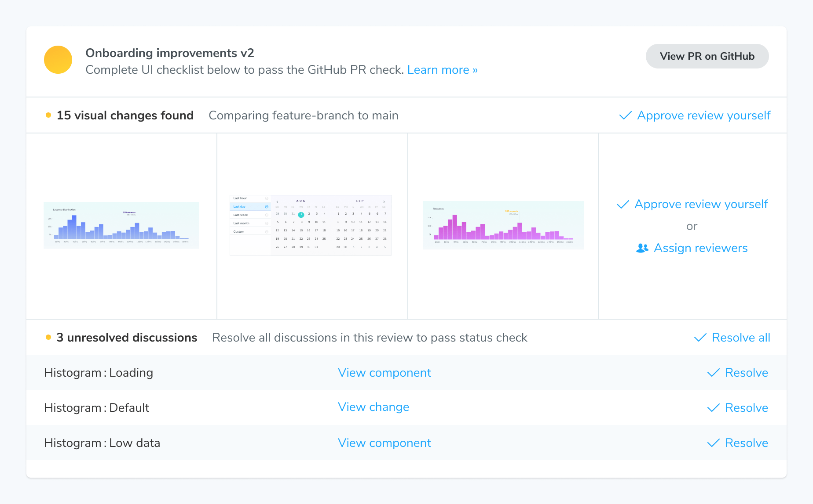
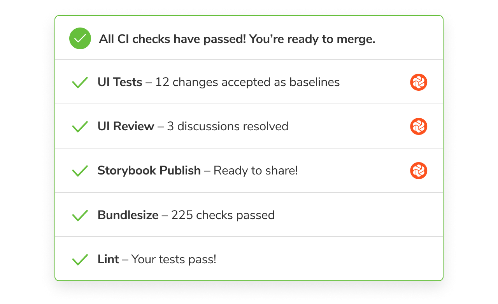

# How to use Chromatic

Chromatic automates UI development so you can build more features, faster, and with less manual work. Here’s the recommended workflow that takes full advantage of everything we have to offer.

### 1. Build in Storybook

Build UI components in isolation with Storybook. Implement [Component-driven development](https://www.componentdriven.org/), a process for building UIs from the “bottom up,” starting with atomic components and ending with pages.

In doing this, you’ll have captured all component states and variations as stories. Chromatic then uses these stories as test cases.

- [How to write stories?](https://storybook.js.org/docs/react/writing-stories/introduction)
- [Simulate user interactions (e.g., clicks and inputs) in stories using a play function](https://storybook.js.org/docs/react/writing-stories/play-function)
- [Building pages with Storybook](https://storybook.js.org/docs/react/writing-stories/build-pages-with-storybook)
- [Stories are tests](https://storybook.js.org/blog/stories-are-tests/)

### 2. Run Chromatic in CI

Once you've finished the first iteration of the implementation, open a pull request and run a Chromatic build. We recommend [configuring your CI](ci) to run a Chromatic build whenever you push code. This ensures the published Storybook on Chromatic is up to date and ensures comprehensive coverage for UI Test and UI Review.

How often should I run Chromatic?

We recommend running Chromatic on every push. This ensures that Chromatic is regularly updating baselines and can catch unintentional changes.

Each snapshot is associated with a commit. That enables you to pinpoint the particular commit where a change was introduced.

It also allows you to [visualize baseline history](branching-and-baselines#visualize-baseline-history). You can review the commits to see how a component changes over time.

Not running Chromatic on every commit makes it harder to review diffs and increases the risk of missing changes.

Let's say you run Chromatic on a commit. Then skip it for four commits and then rerun it. The Chromatic build for that fifth commit will also include changes from all the previous four commits. That makes it much harder to discern what is an acceptable change vs a UI bug.

How do I budget snapshots?

Our main recommendation is to use Chromatic’s [TurboSnap](turbosnap#turbosnap) feature. It uses Git and your project’s dependency graph to identify component files that changed, then intelligently builds and snapshots only the stories associated with those components.

This enables you to run Chromatic regularly while reducing the snapshot count per build.

### 3. UI Tests to catch bugs

Changes in development are inevitable, and bugs can easily slip in, especially with UIs. A small tweak to the CSS can cause a component or one of its states to break. Even worse, the bug can have a cascading effect cause other components and pages to break.

You use Storybook to isolate UI components, mock their variations, and save the supported test cases as stories. Chromatic then captures a snapshot of each story in a cloud browser for testing.

Chromatic’s [UI tests](test) are designed to catch visual and interaction bugs.

What are visual bugs?

Visual bugs are the unintentional errors in your UIs appearance that make it look untrustworthy. For example: cut-off elements, incorrect colors or font styles, broken layouts, and missing error states.

What are interaction bugs?

Interaction bugs are unintentional errors in UI behavior that prevents it from working as intended. For example: a dialog doesn't open or a form doesn't respond to typing events.

[Interactive stories combined with assertions](interactions) enable you to test how components respond to user input. Attach a [play function](https://storybook.js.org/docs/react/writing-stories/play-function) to the story to simulate user behavior (e.g., click and type) and assert against that behavior.

Interaction tests in Chromatic run behind the scenes without you having to configure anything. You'll be notified of any test failures via the Chromatic UI.

These are designated as critical failures that need immediate attention. You won't be able to pass the build until the test is fixed.

To debug, you can launch the published Storybook to reproduce the exact state of your story when the test failed. Click the "View Storybook" button on the test page to open the failed story.

UI Tests are similar to other types of testing (unit, E2E, etc.), in that they enable developers to catch and fix regressions. UI Tests compare the snapshot of a story with the previously accepted [baseline](branching-and-baselines#branches-and-baselines) in your git history (typically on the same branch). If there are changes, you'll get a diff of the changes. If the changes are intentional, press the accept button to update the baselines.

Once all changes are approved, the UI is considered “ready” and you can move to the UI Review phase.

### 4. UI Review to get team sign off

In tools like GitHub, Gitlab, and Bitbucket you assign other devs to review the code for a pull request. Chromatic complements this workflow by allowing you to assign designers, PMs, and other stakeholders to review UI changes in that pull request.

Review is the opportunity to discuss changes and get final team sign off. In the past, teams had to manually click through the UI to review all possible variations. Chromatic's superpower is that it knows exactly which stories have changed. It generates a changeset for your reviewers that shows precisely what they need to review. This speeds up the sign off process.

[UI Review](review) is essential because developers often run into edge cases or technical hurdles that your team didn't consider.

For UI Review, Chromatic shows you a branch vs branch comparison. That is, what will change on the base branch when you merge this PR.

How do I invite collaborators to my project?

To add or remove collaborators, go to the collaborate tab on your project's Manage page. You can invite them by email or by sharing an invite link.

[More on inviting collaborators »](collaborators#external-collaborators)

How to assign designers and PMs to review?

Use the Assign Reviewers link on the PR Activity page to choose reviewers from the project’s collaborators. Reviewers will be emailed a link to the PR screen to begin their review.

How do I track requested changes?

Reviewers can request changes to the implementation via the comment box beneath each story. These get aggregated at the bottom of the PR screen’s activity tab. Developers can see a [list of tasks](review#ui-checklist) which must be completed before UI is ready to merge.

### 5. Merge with confidence with PR checks

Chromatic will badge PRs to notify you about publish, test, and review results. Once all checks are complete, you’re ready to merge!

### 6. Publish and share your Storybook

During the build process, Chromatic builds and publishes your Storybook to its secure workspace (CDN) accessible to your entire team. That keeps everyone in sync with the latest UI implementation. No fussing with dependencies, git, or local dev environments.

- [Share permalinks with collaborators](permalinks#share-permalinks-with-collaborators)
- [Custom domain for your Storybook](permalinks#custom-domain-for-your-storybook)

The published Storybook is a shared reference point for your entire team, making cross-discipline collaboration easier.

#### Document your components

Storybook can automatically [generate UI documentation](https://storybook.js.org/docs/react/writing-docs/introduction) for components. These pages will contain stories rendered as live examples, as well as an interactive "args" table that showcases the component API. Customize the generated docs with additional prose. With Chromatic, you'll get shareable docs URL for your team to reference.

#### Connect Storybook and Figma

[Storybook Connect](figma#figma-plugin) is a Figma plugin that allows you to link stories to Figma components. Once linked, you can view your live stories in the design workspace without leaving Figma.

<video autoPlay muted playsInline loop width="560px" class="center" style="pointer-events: none;" title="Embedded story and design side-by-side">
  <source src="/videos/figma-plugin-open-story.mp4" type="video/mp4" />
</video>

#### Embed stories to showcase your work

[Embed](embed#embed-stories) stories in Medium articles, Notion pages, and countless other platforms that support oEmbed. You get to interact with live rendered components instead of static images.

---

## Conclusion

You finished setting up Chromatic. We look forward to the incredible UIs you'll build.

#### Our most popular guides and articles

- [Intro to Storybook](https://storybook.js.org/tutorials/intro-to-storybook/) is the essential guide to learning Storybook.
- [Design Systems for Developers](https://storybook.js.org/tutorials/design-systems-for-developers/) shares how to build production infrastructure for design systems.
- [Visual Testing Handbook](https://storybook.js.org/tutorials/visual-testing-handbook/) details how professional frontend teams visual test with Storybook.
- [Component-Driven Development](https://www.componentdriven.org/) is a "bottoms up" process for building modular UIs starting from components and ending with screens.
- [UI Testing Handbook](https://storybook.js.org/tutorials/ui-testing-handbook/) highlights testing strategies used by scaled front-end teams

#### How to get support

You're supported by the team behind Storybook. For the quickest response, [sign in](https://www.chromatic.com/start) and use the in-app chat or <a href="mailto:support@chromatic.com?Subject=Question">email</a>.
