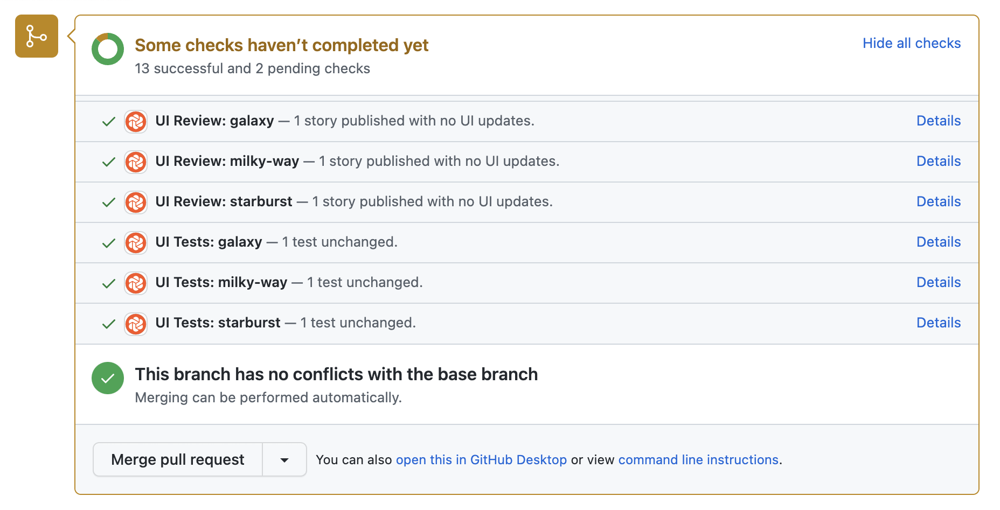

# Integrating Playwright or Cypress with Storybook and Chromatic

Developing a robust UI testing strategy often involves combining component-level and end-to-end (E2E) tests. While Storybook excels in isolated component testing, Playwright and Cypress handle E2E user flow verification. Chromatic integrates seamlessly with both Storybook and these E2E frameworks, enabling visual testing at both component and page levels.

This complexity can lead to confusion about how these tools work together. This guide addresses this by explaining how to combine Storybook, E2E testing frameworks (Playwright & Cypress), and Chromatic for a comprehensive UI testing strategy.

## Storybook is for testing components

Storybook provides an ideal environment for isolating and testing UI components. By representing different component states and variations as stories, you create a foundation for both visual and functional testing:

- **Visual testing:** Chromatic integrates with Storybook, capturing snapshots of your stories to pinpoint any unintended visual changes.
- **Functional testing:** Storybook's [play](https://storybook.js.org/docs/writing-stories/play-function) function enables you to simulate user interactions (clicks, typing, etc.) directly within a story. This allows you to write assertions and verify that your components behave as expected.

## Playwright & Cypress are for verifying user flows

Playwright and Cypress are ideal for verifying user flows within your web application, e.g.: "sign up" and "add to cart." They simulate real-world user interactions across multiple pages, ensuring that these end-to-end journeys function as intended.

While your Playwright or Cypress tests run, Chromatic captures an archive of the page (including DOM, styling, and assets) and uploads it to the cloud. There, Chromatic generates snapshots and performs pixel diffing to identify any unintended visual changes.

Does Chromatic support Playwright or Cypress component testing?

Playwright and Cypress Component Testing provides a component workbench for you to test components, similar to Storybook. However, that mode of testing is not yet supported by Chromatic. We recommend using Storybook for writing component tests.

## Should I use stories or E2E tests?

The ideal testing strategy often involves a strategic mix of component-level Storybook tests and E2E tests. Let's break down the strengths of each:

### Stories

- **Precision:** Stories ensure components render consistently given specific inputs (data, state, interactions).
- **Reliability:** Mocking data and services eliminates external dependencies, reducing flakiness and false positives.
- **Isolate failures:** Errors are quickly traced back to individual components.
- **Integrated development:** Writing stories is a natural part of the UI development process. You don’t have to maintain a separate test script because your story is reused for testing.

### E2E tests

- **System validation:** E2E tests confirm the entire system functions as designed, from user interactions to backend services.
- **Critical flows:** Validate essential user journeys (login, checkout, etc.) that span multiple components and pages.
- **Unforeseen interactions:** Can reveal issues arising from unexpected component combinations or side effects.

Most teams use Storybook to test a wide array of UI scenarios and employ E2E tests to safeguard key user journeys. Component-level tests offer greater stability due to their reliance on mocked data and APIs. This isolation also simplifies creating test cases for edge cases like failures and loading states. In contrast, E2E tests uncover integration issues and ensure the system functions cohesively.

## How to run visual tests with Storybook, Playwright, and Cypress in a single project?

You can achieve this using Chromatic by using a sub-project setup. Here's how:

1. Create two separate projects linked to the same Git repository.
2. Configure one project specifically for Storybook visual tests and the other for Playwright or Cypress visual tests.
3. Configure your CI to run Chromatic twice, once with each of the two project-specific tokens created in Step 1.
4. Upon initiating a pull request, you'll receive status checks from all Chromatic projects linked to that repository.

### Understanding sub-projects

Chromatic's sub-project functionality enables you to manage multiple testing environments within a single Git repository. By linking multiple Chromatic projects to the same repository, you'll maintain synchronized permissions and receive build status updates across all testing environments.

For details on creating sub-projects, please refer to the documentation: [Run Chromatic for each subproject](/docs/monorepos#run-chromatic-for-each-subproject).

### Can I use Playwright or Cypress to interact with stories before running visual tests?

While it's technically possible to use Playwright or Cypress to interact with stories, this workflow isn't ideal for visual testing purposes and isn't officially supported by Storybook or Chromatic. Here's why:

- **Purpose mismatch:** Playwright and Cypress are designed primarily for E2E tests across a full application. Storybook excels at isolating components for focused testing.
- **Storybook's play function is optimized:** The play function is specifically tailored for simulating interactions within the Storybook environment. Chromatic is able to wait for the play function to complete before capturing a snapshot.

For the most effective visual testing of your components, use Storybook's [play](https://storybook.js.org/docs/writing-stories/play-function) function to simulate interactions.
