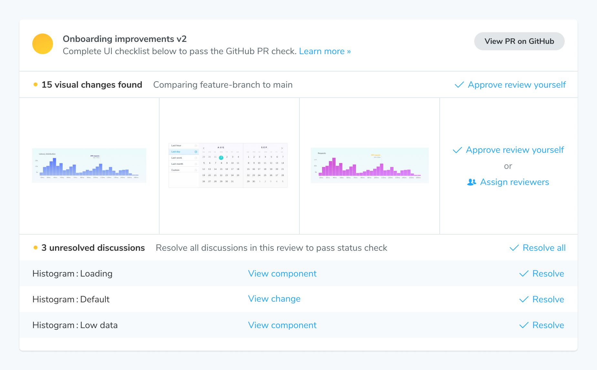

# Guide for designers

Chromatic helps designers collaborate with developers on UI implementation.

## In the design process

Chromatic serves as a library that maps every part of your UI. Use it as a shared reference point to ensure that everyone is referencing the latest UI as they design and spec products.

#### Keep everyone in sync with what's in production

During the design and product process, you often need to reference what's in production. But it's time consuming to navigate to the right page in the right state. Chromatic builds and publishes your Storybook online whenever you push code. This keeps everyone in sync with the latest UI implementation. No fussing with dependencies, git, or local dev environments. [Learn more »](/docs/quickstart)

#### Integrate with Figma to reference the real UI as you design

Design and development naturally diverge. During the design process, you need to double-check what's in production to ensure designs are accurate. Chromatic links stories to Figma components to enable quick access to both. Install our [Figma Plugin](/docs/figma-plugin) to view live stories inside of Figma. Use [Figma in Chromatic](/docs/figma-in-chromatic) to view design components inside of Chromatic alongside your production UI.

#### Documentation that's always up to date

Documentation goes out of date quickly. Storybook and Chromatic work together to automatically [generate UI documentation](https://storybook.js.org/docs/writing-docs) and publish it to a shareable URL. This documentation contains stories rendered as live examples, as well as an interactive component API explorer. You can also customize the generated docs with additional prose. [Learn more »](/docs/document)

#### Embed stories in Notion and other oEmbed services

During the specification process, you often need to describe complex UI behaviors that words can't do justice. Embed UI from Storybook directly into Notion, Medium, and countless other platforms that support oEmbed. This way your readers can interact with live, rendered components that easily show behavior. [Learn more »](/docs/embed#embed-stories)

---

## Track changes and sign-off on implementation

[UI Review](/docs/review) is made for designers and product managers. It's a purpose-built tool for discussing implementation details and tracking sign-offs. Chromatic works behind the scenes to make the review process easy for teams by organizing change requests, notifying participants, and syncing with Git providers for pull requests checks. The key features for reviewers are:

- Generate changesets to focus reviewer attention on only what changed
- Assign reviewers manually or automatically
- Specify fine-grained roles for teammates
- Create discussions and mention others
- Resolve discussions to show that feedback was addressed
- UI checklist to see visualize what needs to be done

