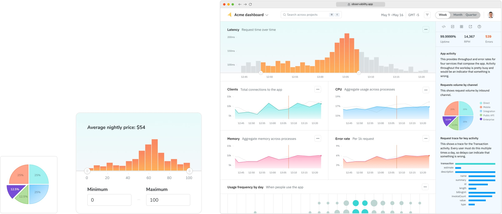
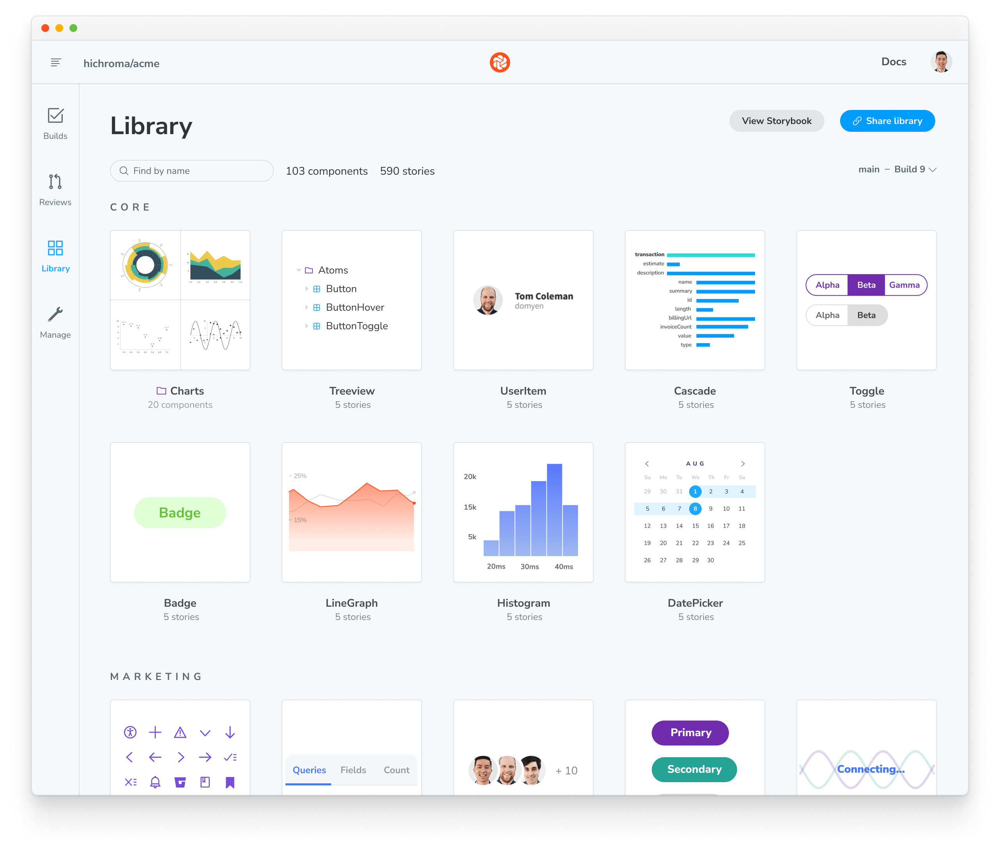

# In development workflow

Chromatic automates UI development so you can build features faster, with less manual work. Follow along with our recommended workflow to see how it fits into your development process.

Not using Storybook? Chromatic integrates seamlessly with [Playwright](/docs/playwright) and [Cypress](/docs/cypress) to offer thorough visual testing. In this scenario, proceed with writing E2E tests as usual and incorporate Chromatic into your [Pull Request workflow »](/docs/in-pull-request)

### Develop UIs with Storybook

Chromatic automatically turns stories into tests. So the more coverage of your UI with stories, the more time you'll save your team with our automation.

If you're just getting started with Storybook, we recommend you incrementally adopt Storybook to help develop discrete parts of your UI and then expand usage from there. For example, start by using Storybook to develop a new feature. This gives you the chance to write your first stories and see how it fits into your workflow.

If you're a seasoned Storybook user, most teams choose a [Component-Driven](https://componentdriven.org/) approach to UI development. UIs are built from the “bottom up” starting with basic components that are progressively combined to assemble pages.

1. Build each component in isolation and write stories for its variations.
2. Compose small components together to enable more complex functionality.
3. Assemble pages by combining composite components.
4. Integrate pages into your project by hooking up data and business logic.

Chromatic also integrates with Playwright and Cypress

Developers test user flows end-to-end by navigating between pages with Playwright or Cypress. This methodology allows you to simulate how users behave. Chromatic uses these E2E tests as visual test cases by automatically snapshotting key moments in the test.

- [Learn how to setup Playwright »](/docs/playwright)
- [Learn how to setup Cypress »](/docs/cypress)

### Verify each story in multiple dimensions

Once key UI states are captured as stories, verify how each story renders in different environments and with different user preferences to see how real users experience the UI.

| Dimension                              | What to test                              |
| -------------------------------------- | ----------------------------------------- |
| [Browsers](/docs/browsers)             | Chrome, Safari, Edge, Firefox             |
| [Viewports](/docs/viewports)           | Mobile, tablet, desktop                   |
| [Themes](/docs/themes)                 | Dark mode, light mode, and custom themes  |
| [Locales](/docs/custom-decorators)     | Languages, text direction                 |
| [Media features](/docs/media-features) | `forced-colors`, `prefers-reduced-motion` |

### Create a library of test cases

In the steps above, you developed UI and manually verified each story's appearance and functionality. Chromatic is designed to automate this manual verification process by creating a library of test cases from your stories. Once you create a story, you don't need to go back to check each story by hand to confirm that it looks correct. Instead, your library is automatically tested for changes every time you push code.

---

## Next: In pull request workflow

Now that you've developed UI in Storybook, see how Chromatic speeds up your pull request workflow. Learn how to collect feedback, manage change requests, and get stakeholder sign-off.

<a class="btn primary round" href="/docs/in-pull-request">Read next chapter</a>
