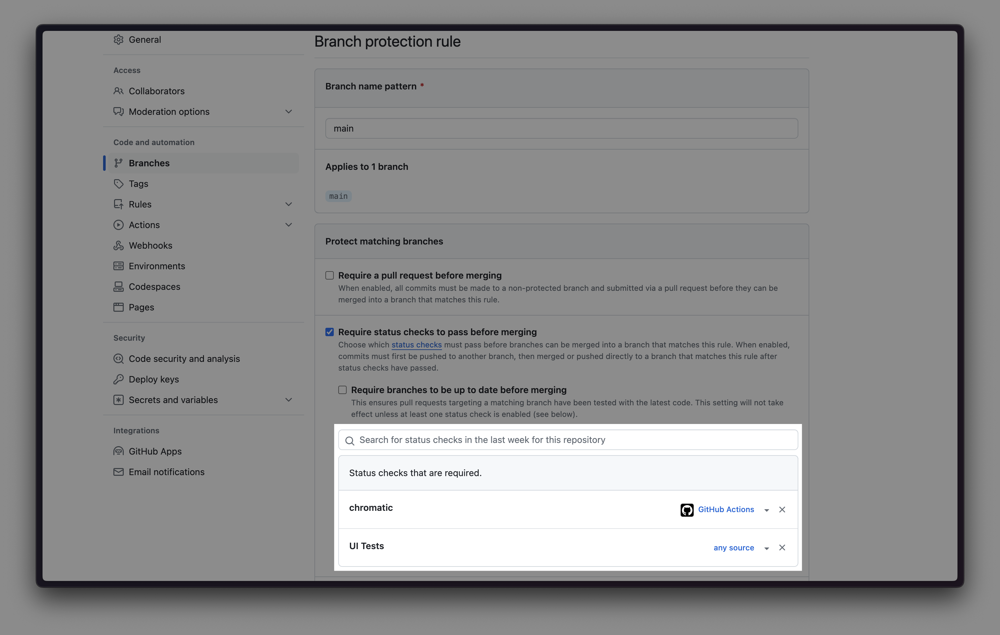
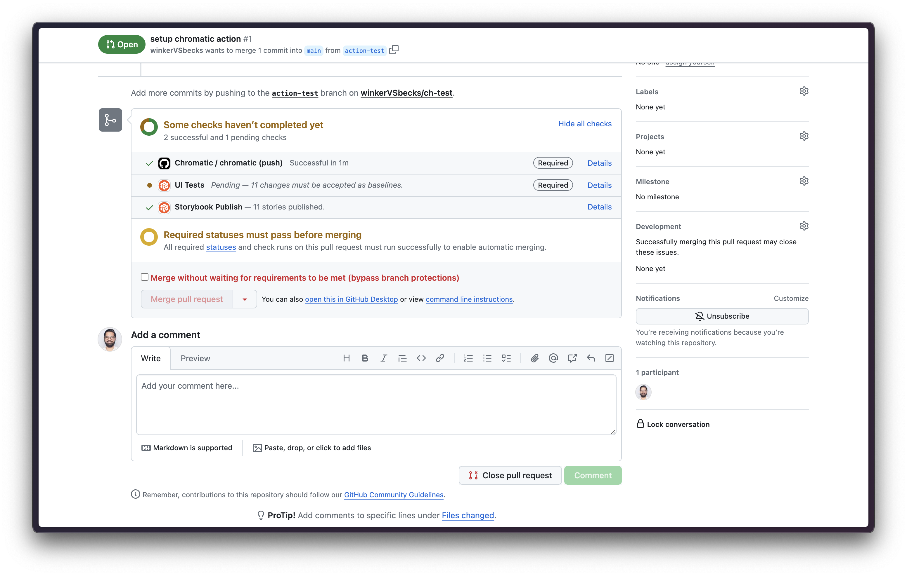
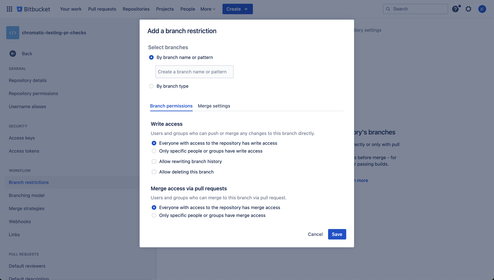
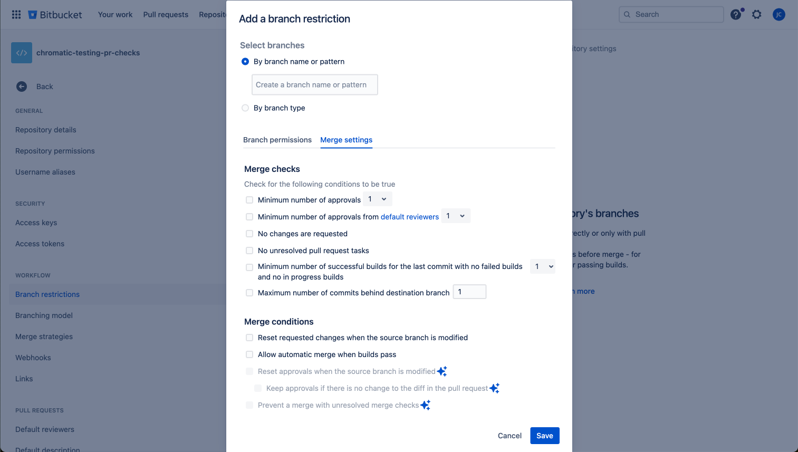
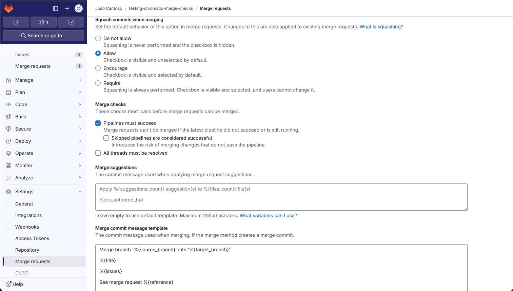
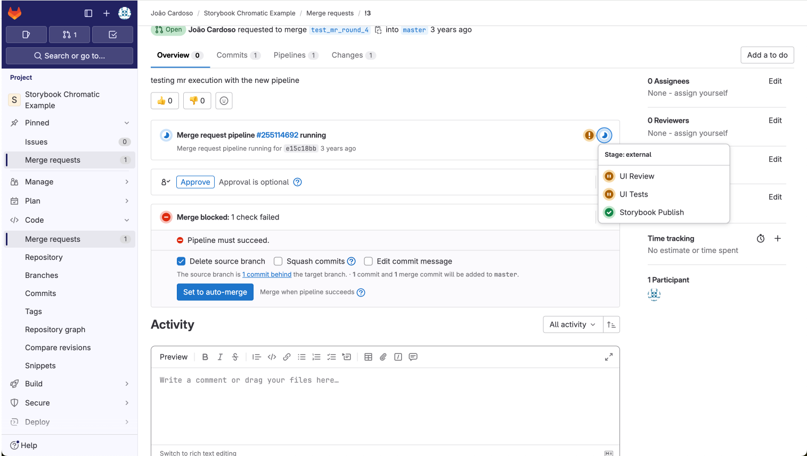

# Mandatory PR checks

When you link your Chromatic project to a GitHub, Bitbucket, or GitLab repository, Chromatic provides status checks directly on your pull requests. Depending on what features you have enabled, you'll see checks for: UI Tests, UI Review & Publish.

If Chromatic detects visual changes or if UI Review is required, the status checks will show as "pending." This indicates that a human needs to review the changes before proceeding.

You can add an additional layer of protection by requiring these checks to be mandatory. In other words, you will not be able to merge the pull request until all changes have been approved. This guarantees that no visual changes are merged without approval.

## Enable mandatory PR checks

Mandatory checks are a per-repository setting within your Git provider. The following steps show you how to require Chromatic checks to be mandatory on your pull requests:

### GitHub

For GitHub repositories, mandatory status checks are configured as branch protection rules. Here's how:

1. On GitHub.com, navigate to the main page of the repository.
2. Under your repository name, click **Settings**.
3. In the **Code and automation** section of the sidebar, click **Branches**.
4. Next to **Branch protection rules**, click **Add rule**.
5. Under **Branch name pattern**, type the branch name or pattern you want to protect. e.g., `main` or `*` to protect all branches.
6. Select **Require status checks to pass before merging**.
7. In the search field, search for status checks (e.g.: Chromatic, UI Test, UI Review, etc.), select the checks you want to require.
   
8. Click **Save changes**
9. Now all pull requests to the protected branch will require the Chromatic checks to pass before merging.
   

### Bitbucket

With BitBucket, some merge checks are already in place by default for pull requests. You can adjust that behavior with a custom configuration. Check out the following links for more information:

- [Default merge checks](https://confluence.atlassian.com/bitbucketserver/checks-for-merging-pull-requests-776640039.html)
- [Merge checklist](https://support.atlassian.com/bitbucket-cloud/docs/merge-a-pull-request/#Merge-checklist)
- [Branch permissions](https://support.atlassian.com/bitbucket-cloud/docs/use-branch-permissions/)
- [Merging strategies](https://support.atlassian.com/bitbucket-cloud/docs/suggest-or-require-checks-before-a-merge/)

To customize default settings, adjust the default configuration by following these steps:

1. Go to the repository settings
2. Click on the **Branch restrictions** item
3. Click on the **Add a branch restriction** button
4. Adjust the settings as needed for the **branch permissions**
   
5. Click the **Merge settings** tab to adjust the merge checks
   

Note: The items marked with a star are only available for paid accounts.

### GitLab

You can set up the basic merge checks for your repository by following these steps:

1. Go to the repository settings
2. Select the **Merge requests** item
3. Scroll down to the **Merge checks** section
4. Enable the checks you want to have in place for your repository. At least the "Pipelines must succeed" check is recommended.
   
5. Now all merge request in GitLab will require the Chromatic checks to pass before merging.
   

This can extended by enabling [branch protection](https://docs.gitlab.com/ee/user/project/protected_branches.html) for the repository. For GitLab paid plans, you can set up [additional rules](https://docs.gitlab.com/ee/user/project/merge_requests/authorization_for_merge_requests.html) for the repository.
