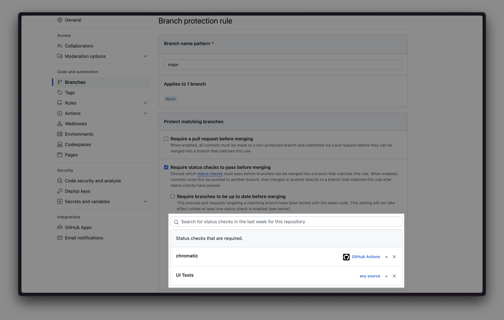
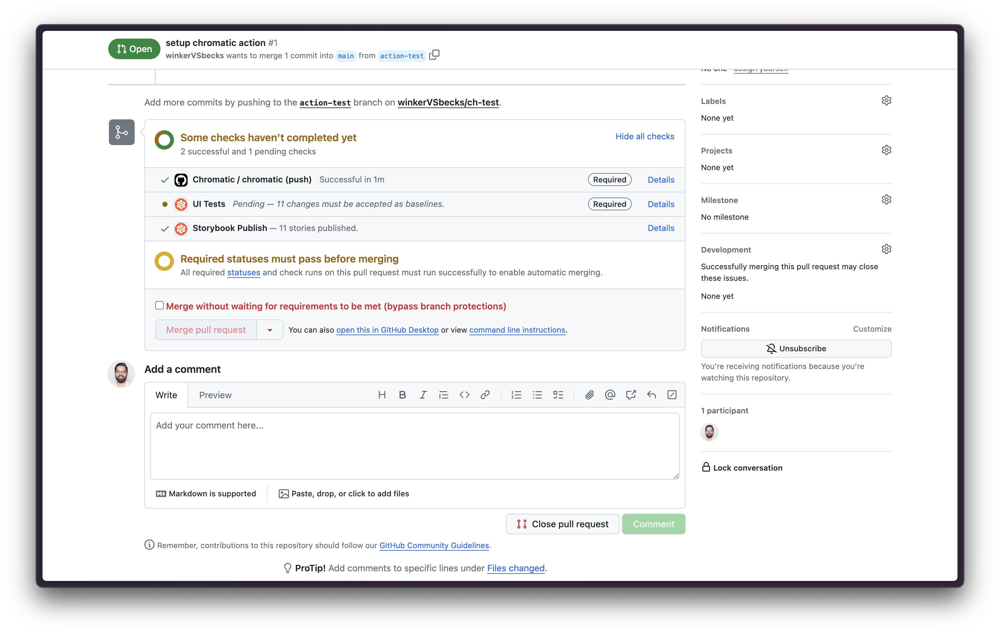
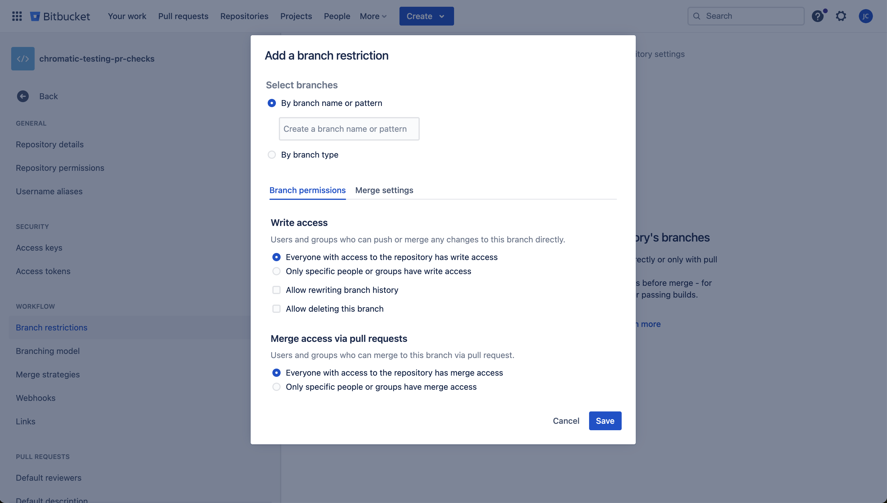
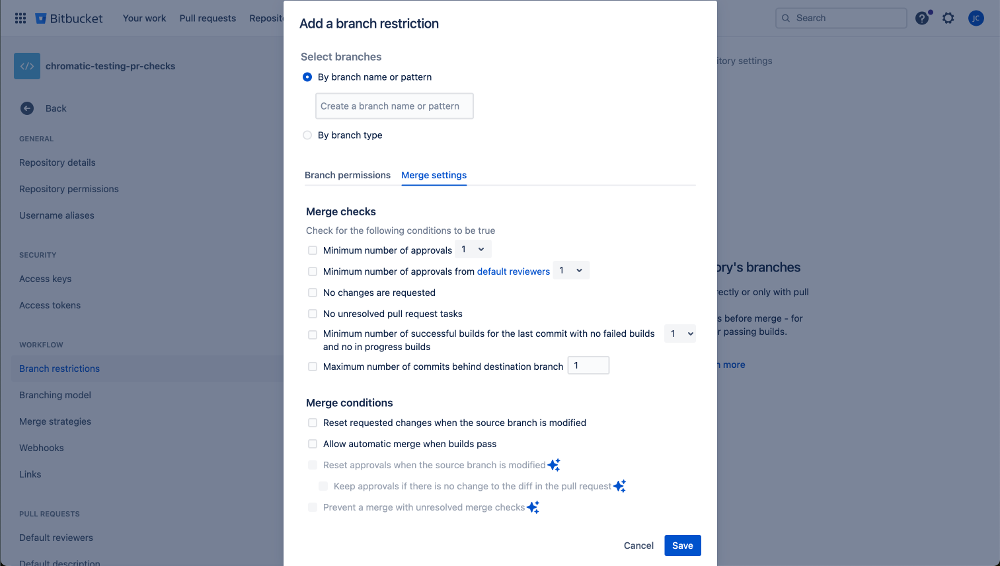
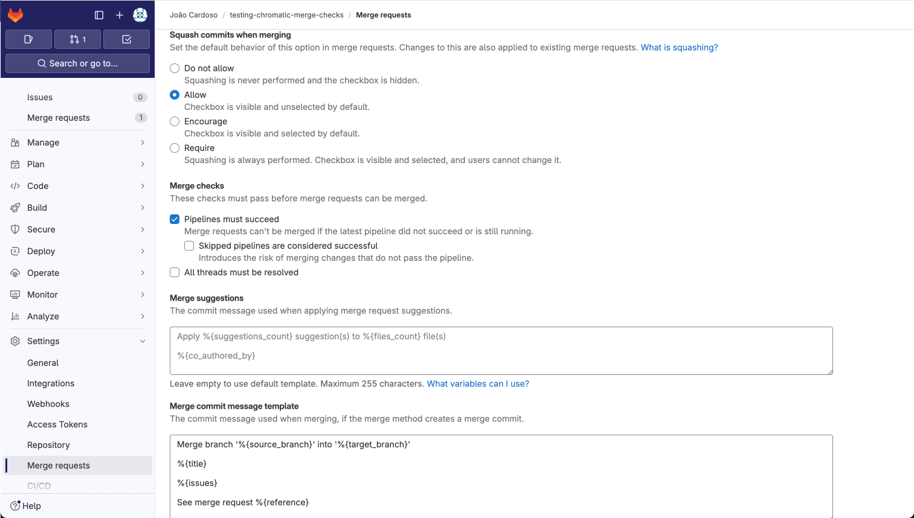
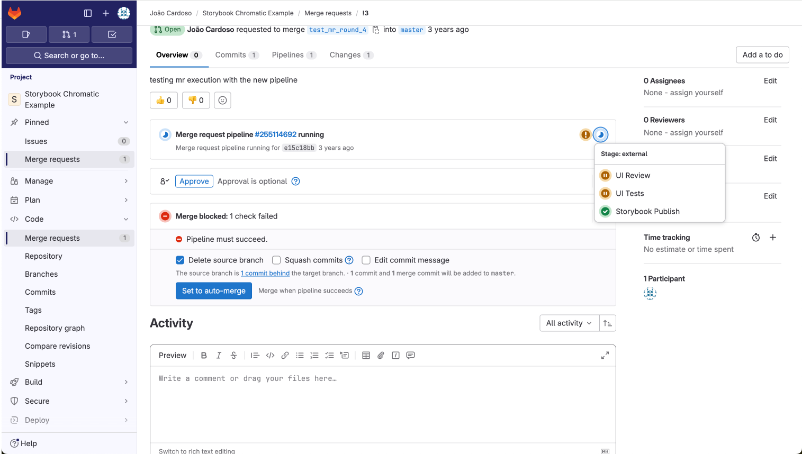

# Mandatory PR checks

When you link your Chromatic project to a GitHub, Bitbucket, GitLab, or [Azure DevOps](#azure-devops) repository, Chromatic provides status checks directly on your pull requests. Depending on what features you have enabled, you'll see checks for: UI Tests, UI Review & Publish.

If Chromatic detects visual changes or if UI Review is required, the status checks will show as "pending." This indicates that a human needs to review the changes before proceeding.

You can add an additional layer of protection by requiring these checks to be mandatory. In other words, you will not be able to merge the pull request until all changes have been approved. This guarantees that no visual changes are merged without approval.

## Enable mandatory PR checks

Mandatory checks are a per-repository setting within your Git provider. The following steps show you how to require Chromatic checks to be mandatory on your pull requests:

### GitHub

For GitHub repositories, mandatory status checks are configured as branch protection rules. Here's how:

1. On GitHub.com, navigate to the main page of the repository.
2. Under your repository name, click **Settings**.
3. In the **Code and automation** section of the sidebar, click **Branches**.
4. Next to **Branch protection rules**, click **Add rule**.
5. Under **Branch name pattern**, type the branch name or pattern you want to protect. e.g., `main` or `*` to protect all branches.
6. Select **Require status checks to pass before merging**.
7. In the search field, search for status checks (e.g.: Chromatic, UI Test, UI Review, etc.), select the checks you want to require.
   
8. Click **Save changes**
9. Now all pull requests to the protected branch will require the Chromatic checks to pass before merging.
   

### Bitbucket

With BitBucket, some merge checks are already in place by default for pull requests. You can adjust that behavior with a custom configuration. Check out the following links for more information:

- [Default merge checks](https://confluence.atlassian.com/bitbucketserver/checks-for-merging-pull-requests-776640039.html)
- [Merge checklist](https://support.atlassian.com/bitbucket-cloud/docs/merge-a-pull-request/#Merge-checklist)
- [Branch permissions](https://support.atlassian.com/bitbucket-cloud/docs/use-branch-permissions/)
- [Merging strategies](https://support.atlassian.com/bitbucket-cloud/docs/suggest-or-require-checks-before-a-merge/)

To customize default settings, adjust the default configuration by following these steps:

1. Go to the repository settings
2. Click on the **Branch restrictions** item
3. Click on the **Add a branch restriction** button
4. Adjust the settings as needed for the **branch permissions**
   
5. Click the **Merge settings** tab to adjust the merge checks
   

Note: The items marked with a star are only available for paid accounts.

### GitLab

You can set up the basic merge checks for your repository by following these steps:

1. Go to the repository settings
2. Select the **Merge requests** item
3. Scroll down to the **Merge checks** section
4. Enable the checks you want to have in place for your repository. At least the "Pipelines must succeed" check is recommended.
   
5. Now all merge request in GitLab will require the Chromatic checks to pass before merging.
   

This can extended by enabling [branch protection](https://docs.gitlab.com/ee/user/project/protected_branches.html) for the repository. For GitLab paid plans, you can set up [additional rules](https://docs.gitlab.com/ee/user/project/merge_requests/authorization_for_merge_requests.html) for the repository.

### Azure DevOps

Chromatic can post commit status checks to pull requests in [Azure Repos](https://learn.microsoft.com/en-us/azure/devops/repos/). Unlike GitHub, GitLab, and Bitbucket, Azure DevOps isn't a sign-in provider. Instead, you connect a Chromatic project to an Azure repository with a personal access token (PAT).

ℹ️ Azure DevOps status checks are in early access. [Contact support](mailto:support@chromatic.com) to enable them for your account.

#### Prerequisites

- A Chromatic project that isn't linked to another Git provider
- An Azure DevOps repository with your project's code
- An Azure DevOps [personal access token](https://learn.microsoft.com/en-us/azure/devops/organizations/accounts/use-personal-access-tokens-to-authenticate?view=azure-devops&tabs=Windows#create-a-pat) with **Code (Read & write)** scope

#### Link your Chromatic project to Azure DevOps

1. In your Chromatic project, go to **Manage** and open the **Configure** tab.
2. Scroll down to the **Connected applications** section and choose to link Azure DevOps.
3. Enter your Azure DevOps organization, project, and repository names. In a basic setup, the project and repository names are the same, but an Azure DevOps project can contain multiple repositories.
4. Paste your personal access token in the token field and save.

If the token is valid, the dialog closes and the repository is linked. Otherwise, Chromatic shows an error on the token field.

#### Run Chromatic in Azure Pipelines

Before Azure DevOps can require the Chromatic status, Chromatic needs to report it at least once. Set up a pipeline that runs Chromatic on pull requests:

1. Commit a pipeline YAML file that runs Chromatic to your repository's default branch. See [Automate Chromatic with Azure Pipelines](/docs/azure-pipelines) for an example.
2. In your Azure DevOps project, go to **Pipelines** and click **New pipeline**.
3. Select **Azure Repos Git**, then select your repository.
4. Select **Existing Azure Pipelines YAML file**, then choose the branch and path of the file you committed.
5. Click **Variables** and add a secret variable named `CHROMATIC_PROJECT_TOKEN` with your Chromatic [project token](/docs/faq/find-project-token).
6. Run the pipeline manually and confirm the build succeeds.

#### Run the pipeline on every pull request

1. In your Azure DevOps project, go to **Project settings** » **Repositories** and select your repository.
2. Open the **Policies** tab and, under **Branch Policies**, select your default branch.
3. Add a **Build Validation** policy and select the pipeline you just ran.
4. Set the trigger to **Automatic**, the policy requirement to **Required**, and the build expiration to **Never**.

#### Require the Chromatic status check

1. Open a pull request against your default branch. The pipeline will queue automatically.
2. Wait for the pipeline to finish. Chromatic's statuses (for example, `chromatic/UI Tests`) appear on the pull request, but they don't block merging yet.
3. Go back to **Project settings** » **Repositories** » your repository » **Policies**, and select your default branch under **Branch Policies**.
4. Add a **Status Check** policy and choose the Chromatic status (for example, `chromatic/UI Tests`) from the **Status to check** dropdown.
5. Set the policy requirement to **Required**.

Now, pull requests into that branch can't be merged until the Chromatic status passes. Existing pull requests, including the one you used to report the first status, pick up the policy without any changes.

Azure Pipelines can take several minutes to start a queued run. If the Chromatic status doesn't appear right away, check the pipeline queue before troubleshooting.

## Check status by scenario

Once a check is marked as mandatory in your Git provider, its outcome depends on how Chromatic runs (or doesn't run) for that commit. Check status is driven entirely by Chromatic's build result — there's no API or setting to programmatically mark a check as passed. Use this table to understand what to expect:

| Scenario                                                                                                                       | Check result                                                                                                                                                                                                                                      |
| ------------------------------------------------------------------------------------------------------------------------------ | ------------------------------------------------------------------------------------------------------------------------------------------------------------------------------------------------------------------------------------------------- |
| Build has no visual changes                                                                                                    | 🟢 Passes automatically.                                                                                                                                                                                                                          |
| Build run with the [`--skip`](/docs/configure#options) flag                                                                    | 🟢 Marked as skipped and passes immediately, unblocking the PR regardless of whether the commit has visual changes.                                                                                                                               |
| Build has visual changes to review                                                                                             | 🟡 Pending: blocks merging until someone reviews and approves the changes.                                                                                                                                                                        |
| Mandatory in your Git provider, but the corresponding check (UI Tests/UI Review) is turned off in Chromatic's project settings | 🟡 Pending indefinitely: Chromatic never sends a status for a check that isn't enabled, so the required check has nothing to satisfy it. Either disable the requirement in your Git provider or re-enable the check in Chromatic.                 |
| The Chromatic step itself is bypassed, for example with a conditional step (`if:` in GitHub Actions or `rules:` in GitLab CI)  | 🟡 Pending indefinitely: if Chromatic never runs, it never reports a status, so a mandatory check has nothing to resolve it. Skip the build with `--skip` instead of skipping the CI step, or don't mark the check as required for that scenario. |
| Your account has used all its included billed snapshots for the billing period                                                 | 🟡 Pending: the build can't complete, so no status is sent. See [additional billed snapshots](/docs/billing#additional-billed-snapshots).                                                                                                         |

If a check is stuck pending and none of these scenarios apply, see [Why aren't pull request checks syncing with my Git provider?](/docs/ci/#why-arent-pull-request-checks-syncing-with-my-git-provider)

