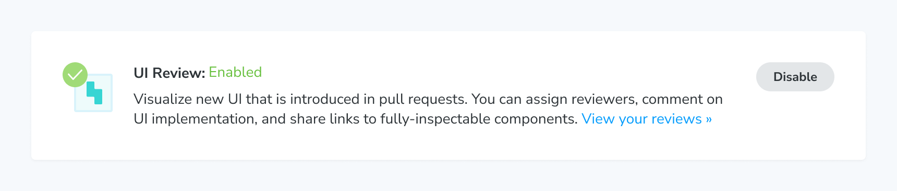

# Manual UI Review

Manual UI Review helps you see the visual differences between any pair of branches - even if your project isn't connected to a Git provider.

## Enable UI Review

Go to your project's Manage page to enable UI Review.

## Create a Review

Go to your project's Reviews page from the sidebar. Click the “Create review” button to pick the pair of branches you want to compare.

If you’re familiar with creating pull or merge requests with Git, this process will be very familiar:

- Select the base branch, which is the branch that’s used as the source of truth for comparison. Typically, this will be your `main` branch.
- Select the head branch, which is the branch that has changes that you want to compare with the source of truth. This is often a feature or bug fix branch you’re working on.
- Enter a title for the Review.
- Click the “Compare branches” button to generate your new Review.

Your Review is now ready for you and your team to discuss. Check out the [Understanding the Review](/docs/review#understanding-the-review) section for more information on how to benefit the most from UI Review.

Glossary

- <b>Base branch:</b> the branch you want to use as a baseline for the comparison
- <b>Head branch:</b> the branch with the new changes that need to be compared against the base branch

## PR check for "UI Review"

Manually created Reviews will not create a “UI Review” status check in GitHub, GitLab, or Bitbucket. To create a status check in your Git provider for manually created Reviews, you can use a [custom webhook](/docs/custom-webhooks).

## Closing a Review

Prune your completed manual UI Reviews by clicking the "Close review" menu item in the "Review now" button tooltip. Your review will be moved to the "Closed" Reviews list on the Reviews page.

ℹ️ Reminder: closing a Review **does not** merge the branches in Git.

### Notes:

- In order to create a Review, you will need to have at least two git branches with a build on each.
- If you are trying to review the changes completed in a pull (merge) request, you will want to match the head and base branches of the Review with the respective branches of the pull (merge) request.
- You can only have one open Review at a time with the same branch combination. For example, if your head branch is `new-changes` and your base branch is `main`, you cannot open another Review with `new-changes` as the head branch and `main` as the base branch.
- You can manually create a review for a linked project as well. This feature is available to all projects.

---
