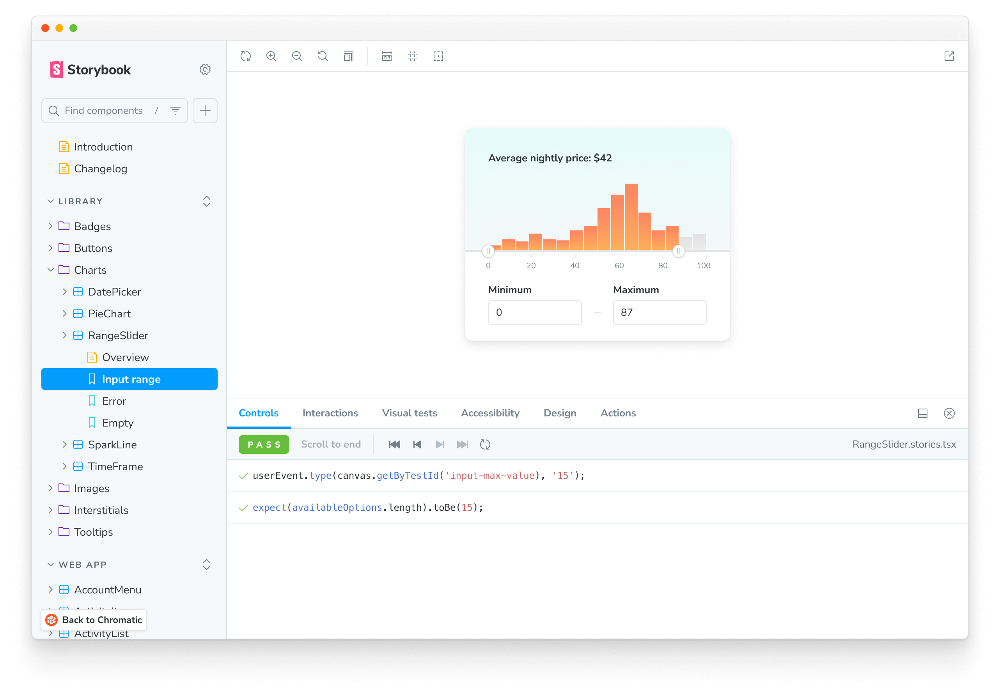
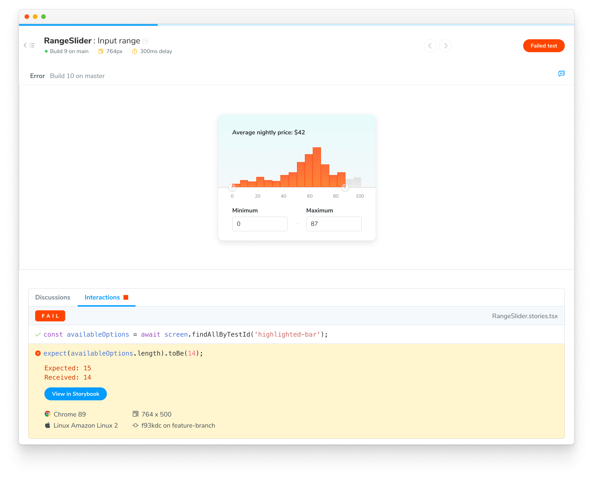
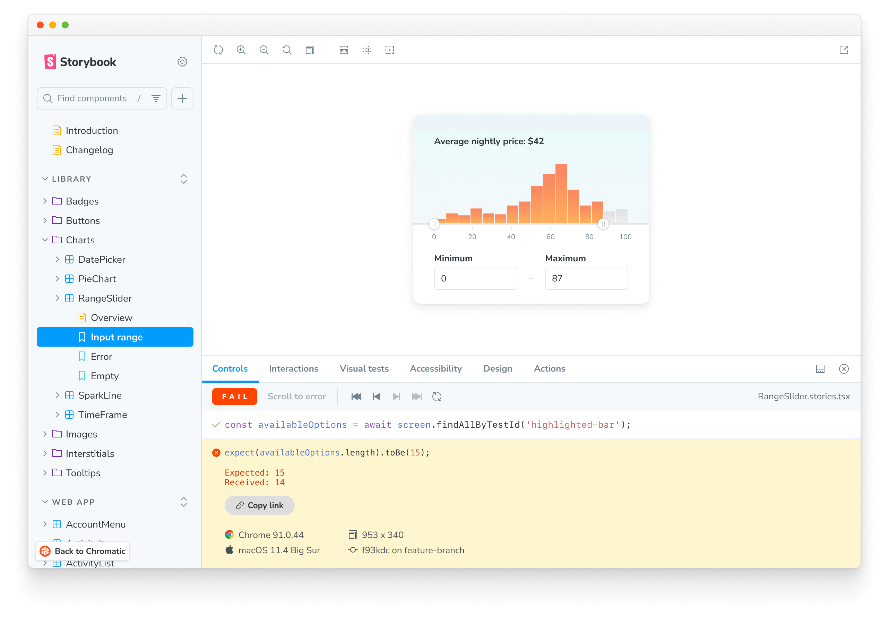
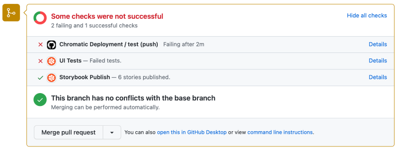

# Interaction testing with Chromatic

Interaction tests enable you to verify how a component responds to user behaviors like click, type, keyboard, and hover. It's powered by Storybook's [`play`](https://storybook.js.org/docs/writing-stories/play-function) function.

<div class="aside">

Interaction tests require Storybook 6.5.10+. Check which version you have in package.json or open the "About Storybook" page in your Storybook.

</div>

## How to write interaction tests

Add a [`play`](https://storybook.js.org/docs/writing-stories/play-function) function to your component's story to enable interaction tests. For example, if you want to validate a component's behavior write the following story:

```ts title="RangeSlider.stories.ts|tsx"
// Adjust this import to match your framework (e.g., nextjs, vue3-vite)
import type { Meta, StoryObj } from "@storybook/your-framework";

/*
 * Replace the storybook/test import with `@storybook/test` and adjust the stories accordingly if you're not using Storybook 9.0.
 * Refer to the Storybook documentation for the correct package and imports for earlier versions.
 */
import { expect } from "storybook/test";

import { RangeSlider } from "./RangeSlider";

const meta = {
  component: RangeSlider,
  title: "Library/Charts/RangeSlider",
} satisfies Meta<typeof RangeSlider>;

export default meta;
type Story = StoryObj<typeof meta>;

export const InputRange: Story = {
  play: async ({ canvas, userEvent }) => {
    // 🔢 Type into input field
    await userEvent.type(canvas.getByTestId("input-max-range"), "15");

    // ✅ Assert that component is responding to user behavior
    const availableOptions = await canvas.findAllByTestId("highlighted-bar");
    await expect(availableOptions.length).toBe(15);
  },
};
```

<div class="aside">

Read Storybook's interaction testing [docs](https://storybook.js.org/docs/writing-tests/interaction-testing).

</div>



Chromatic waits for interactions to pass before capturing a snapshot.

### Confirm interaction tests are working

Interaction tests run behind the scenes without you having to configure anything. To verify that they are working in Chromatic, publish your Storybook either via [CLI](/docs/cli) or [CI](/docs/ci). You can confirm that they’re running with the “Interaction” label in the Build page’s Tests section.


## Composing stories with the `play()` function

Similarly to `args`, `play()` functions can be [composed](https://storybook.js.org/docs/writing-stories/play-function#composing-stories) to reuse and reduce the amount of code being written. This can be helpful for instances where you are looking to snapshot multiple states of a longer interaction, or if you have interactions that can be reused to further compose other states of your component.

An important caveat to remember when invoking a `play()` function from another story is that you must pass the _full context_ as an argument to the `play()` function. The example below shows how to do this correctly.

```ts title="MyComponent.stories.ts|tsx"
// Adjust this import to match your framework (e.g., nextjs, vue3-vite)
import type { Meta, StoryObj } from "@storybook/your-framework";

/*
 * Replace the storybook/test import with `@storybook/test` and adjust the stories accordingly if you're not using Storybook 9.0.
 * Refer to the Storybook documentation for the correct package and imports for earlier versions.
 */
import { expect, screen, waitFor } from "storybook/test";

import { MyComponent } from "./MyComponent";

const meta = {
  component: MyComponent,
  title: "My Component",
} satisfies Meta<typeof MyComponent>;

export default meta;
type Story = StoryObj<typeof meta>;

export const FirstStory: Story = {
  play: async ({ canvas, userEvent }) => {
    const dropdownButton = canvas.getByRole("button");
    await userEvent.click(dropdownButton);
  },
};

export const SecondStory: Story = {
  play: async ({ canvas, context, userEvent }) => {
    //  👇 Pass the full context as an argument to the play function:
    await FirstStory.play(context);
    const findText = canvas.getByText("some text");
    await userEvent.hover(findText);
    await waitFor(() => expect(findText.focus()));
  },
};

export const ThirdStory: Story = {
  play: async ({ context, userEvent }) => {
    //  👇 SecondStory.play will execute the play functions from FirstStory.play since this is part of the SecondStory.play function:
    await SecondStory.play(context);
    const searchbox = screen.getByRole("searchbox", { label: "Search" });
    await userEvent.type(searchbox, "text for searchbox");
  },
};
```

Additionally, you can stack multiple `play()` functions within a story. Below is a quick pseudocode example.

```ts title="MyComponent.stories.ts|tsx"
// Adjust this import to match your framework (e.g., nextjs, vue3-vite)
import type { Meta, StoryObj } from "@storybook/your-framework";

/*
 * Replace the storybook/test import with `@storybook/test` and adjust the stories accordingly if you're not using Storybook 9.0.
 * Refer to the Storybook documentation for the correct package and imports for earlier versions.
 */
import { screen } from "storybook/test";

import { MyComponent } from "./MyComponent";

const meta = {
  component: MyComponent,
  title: "My Component",
} satisfies Meta<typeof MyComponent>;

export default meta;
type Story = StoryObj<typeof meta>;

export const FirstStory: Story = {
  play: async ({ canvas, userEvent }) => {
    await userEvent.type(canvas.getByTestId("an-element"), "some text");
  },
};

export const SecondStory: Story = {
  play: async ({ canvas, userEvent }) => {
    await userEvent.type(
      canvas.getByTestId("another-element"),
      "some more text",
    );
  },
};

export const CombinedStories: Story = {
  play: async ({ canvas, context }) => {
    //  👇 This executes FirstStory.play and SecondStory.play before executing the story's play function:
    await FirstStory.play(context);
    await SecondStory.play(context);
    await userEvent.type(canvas.getByTestId("another-one"), "even more text");
  },
};
```

## Debug test failures

Chromatic notifies you when an interaction errors or an assertion fails. We designate these as critical failures that need immediate attention. You won’t be able to pass the build until the test is fixed.


To find out which steps failed in your interaction test, click on the change to see a snapshot of the state where the error occurred. You'll see a detailed log and browser environment metadata to help with reproductions.



### Reproduce test failures with a URL

Go to your published Storybook to reproduce the exact state of your story when the test failed. Click the "View Storybook" button on the test page to open the failed story with the error message visible. Share the link with teammates to get a second opinion.



## PR check for interaction tests

Interaction tests are reported in the UI Tests pull request check. When a test fails, you'll see a "Failed tests" status message prompting you to fix the test before moving on.



---

## Frequently asked questions

<details>
<summary>My interactions aren't getting snapshotted consistently with external web fonts?</summary>

Interactions run as soon as the DOM loads. But external resources like web fonts can load before or after the interaction runs depending on network latency. This can cause dialogs, tooltips, and menus to change position.

We recommend [preloading fonts](/docs/font-loading) to ensure they're available when the DOM renders. If preloading is not possible, try adding a [delay before running interactions](/docs/delay#use-assertions-to-delay-snapshot-capture).

</details>

<details>

<summary>What happens when an interaction test fails?</summary>

When interaction tests fail, the story will be badged with “Failed test.” You will not be able to “pass” a build that has failed tests. Fix interaction tests in Storybook and run the build again.

</details>

<details>

<summary>Does Chromatic capture snapshots of every step of an interaction test?</summary>

No, Chromatic waits for the entire play function to execute and captures a snapshot only at the end.

If you need a snapshot of a specific step, we recommend breaking your story into multiple stories and using [play function composition](#composing-stories-with-the-play-function).

</details>
