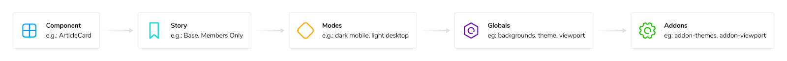
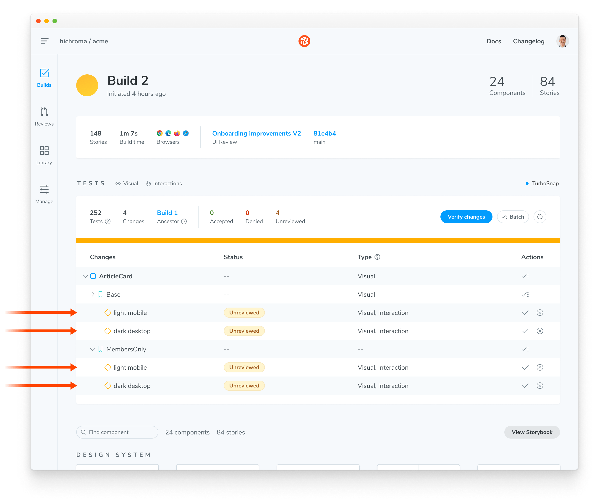

# Modes for testing themes, viewports, locales & more

Global-level configurations (globals) such as viewport size, theme (light/dark), and locale impact how a component renders. Chromatic simplifies the process of visually testing your stories with different global configs.

You can save combinations of globals as a unique "mode" and apply one or multiple modes to a story using the `chromatic.modes` parameter. When Chromatic tests your story, it will capture a snapshot for each applied mode. These modes are treated separately, with independent baselines and distinct approvals.

Using modes requires Storybook 6.0 or later.

<details>
<summary>Modes are powered by Storybook globals & decorators</summary>

Consider this card component. It supports both light and dark variants, and its layout adjusts based on the viewport size. To switch between themes and viewport sizes, we click on the Storybook toolbar.

<video autoPlay muted playsInline loop width="600px">
  <source src="/docs/assets/addons.mp4" type="video/mp4" />
</video>

This functionality is made possible by two features:

- **Globals** is a built-in mechanism that enables users to configure and track global settings. In the context of modes, globals are used to define different configurations that a mode can have. For example, theme: light & dark or locale: en, fr, es & kr .
- **Decorators** wrap stories to provide extra rendering functionality. They can read the global value and provide the necessary context to render a specific mode. For example, if your global state indicates "dark mode," a decorator can wrap your component with the appropriate theme provider and load the dark theme CSS.

**Addons** combine globals and decorators. Under the hood, many addons like [@storybookjs/addon-themes](https://github.com/storybookjs/storybook/tree/next/code/addons/themes) and [storybook-i18n](https://github.com/stevensacks/storybook-i18n/tree/main) use globals & decorators to provide the rendering context for stories.



</details>

## Using modes

A mode is a combination of different settings that determine the appearance of a UI. It can be as straightforward as displaying the component in light or dark mode, or it can involve more complex combinations like viewport, theme, and locale settings.

Example modes:

- `dark desktop spanish`
- `light tablet korean`
- `mobile english`
- `high-contrast`

### 1. Configure addons

Addons allow you to control various global settings within Storybook. For instance, you can use viewports, styling, and background addons to manage a story's theme, dimensions, and background color.

Make sure to configure the addons in `.storybook/preview.js|ts` for each global setting you want to test.

```ts title=".storybook/preview.ts"
// Replace your-framework with the framework you are using (e.g., react-vite, vue3-vite)
// if you're using Storybook 9, or with the appropriate renderer otherwise.
import type { Preview } from "@storybook/your-framework";

import { withThemeByClassName } from "@storybook/addon-themes";

import "../src/index.css";

const preview: Preview = {
  parameters: {
    viewport: {
      options: {
        small: { name: "Small", styles: { width: "640px", height: "800px" } },
        large: { name: "Large", styles: { width: "1024px", height: "1000px" } },
      },
    },
    backgrounds: {
      options: {
        light: { name: "light", value: "#fff" },
        dark: { name: "dark", value: "#1E293B" },
      },
    },
  },
  decorators: [
    withThemeByClassName({
      themes: {
        light: "light",
        dark: "dark",
      },
      defaultTheme: "light",
    }),
  ],
};

export default preview;
```

<div class="aside">

The `options` configuration object is only available in Storybook 9. See the versioned Storybook documentation for the [viewport](https://storybook.js.org/docs/essentials/viewport) and [backgrounds](https://storybook.js.org/docs/essentials/backgrounds) for more information on configuring these addons.

</div>

### 2. Define modes

To define all your modes, create a file called `.storybook/modes.js|ts`. Each mode should specify the values for the global settings it wants to control. This can be limited to a single global or can group multiple globals together.

```ts title=".storybook/modes.ts"
export const allModes = {
  mobile: {
    viewport: "small",
  },
  desktop: {
    viewport: "large",
  },
  dark: {
    backgrounds: { value: "#1E293B" },
    theme: "dark",
  },
  light: {
    backgrounds: { value: "#fff" },
    theme: "light",
  },
  "dark desktop": {
    backgrounds: { value: "#1E293B" },
    theme: "dark",
    viewport: "large",
  },
  "light mobile": {
    backgrounds: { value: "#fff" },
    theme: "light",
    viewport: "small",
  },
} as const;
```

### 3. Apply modes using the chromatic parameter

To apply the modes to a component, import them into a CSF (`*.stories.js|ts`) file and use the `chromatic` parameter.

```ts title="ArticleCard.stories.ts|tsx"
// Adjust this import to match your framework (e.g., nextjs, vue3-vite)
import type { Meta, StoryObj } from "@storybook/your-framework";

import { allModes } from "../.storybook/modes";

import { ArticleCard } from "./ArticleCard";

const meta = {
  component: ArticleCard,
  title: "ArticleCard",
  parameters: {
    chromatic: {
      //🔶 Test each story for ArticleCard in two modes
      modes: {
        "light mobile": allModes["light mobile"],
        "dark desktop": allModes["dark desktop"],
      },
    },
  },
} satisfies Meta<typeof ArticleCard>;

export default meta;
type Story = StoryObj<typeof meta>;

export const Base: Story = {};

export const MembersOnly: Story = {};
```

### 4. Auto-generate a test for every mode

When you run a Chromatic build, it will create a test for each mode. If you have two stories with two modes, you’ll get four tests. Each test will be badged with the mode’s name and have separate baselines and approvals.

When reviewing a build, the mode-specific tests will be grouped together.



---

## Stacking modes

You have the flexibility to apply modes at the project, component level, or story level. Instead of overriding modes defined at a higher level, Chromatic combines them all into a stack and tests the story against each mode in the stack.

### Project level modes

For instance, at the project level, we apply modes by setting the `chromatic` parameter in `.storybook/preview.js|ts`:

```ts title=".storybook/preview.ts"
// Replace your-framework with the framework you are using (e.g., react-vite, vue3-vite)
// if you're using Storybook 9, or with the appropriate renderer otherwise.
import type { Preview } from "@storybook/your-framework";

import { allModes } from "../.storybook/modes";

const preview: Preview = {
  parameters: {
    chromatic: {
      modes: {
        light: allModes["light"],
        dark: allModes["dark"],
      },
    },
  },
};

export default preview;
```

### Component and Story level modes

Then, in the CSF file, we set modes at the component level and/or the story level:

```ts title="ArticleCard.stories.ts|tsx"
// Adjust this import to match your framework (e.g., nextjs, vue3-vite)
import type { Meta, StoryObj } from "@storybook/your-framework";

import { allModes } from "../.storybook/modes";

import { ArticleCard } from "./ArticleCard";

const meta = {
  component: ArticleCard,
  title: "ArticleCard",
  parameters: {
    chromatic: {
      //🔶 Test each story for ArticleCard with this mode
      modes: {
        desktop: allModes["desktop"],
      },
    },
  },
} satisfies Meta<typeof ArticleCard>;

export default meta;
type Story = StoryObj<typeof meta>;

export const Base: Story = {
  parameters: {
    chromatic: {
      //🔶 Test only the Base story with this mode
      modes: {
        mobile: allModes["mobile"],
      },
    },
  },
};

export const MembersOnly: Story = {};
```

In the example above (`.storybook/preview.ts` combined with `ArticleCard.stories.ts`), Chromatic will generate the following tests:

1. For `ArticleCard.Base`, there will be 4 snapshots: light, dark, desktop, and mobile.
2. For `ArticleCard.MembersOnly`, there will be 3 snapshots: light, dark, and desktop.

### Disable a higher-level mode

In some situations, you might want to disable a mode defined at a higher level for a specific story. To do this, set `disable: true` on the mode.

In the example below, `desktop` mode is applied at the component level. But we’re disabling it for the Base story.

```ts title="ArticleCard.stories.ts|tsx"
// Adjust this import to match your framework (e.g., nextjs, vue3-vite)
import type { Meta, StoryObj } from "@storybook/your-framework";

import { allModes } from "../.storybook/modes";

import { ArticleCard } from "./ArticleCard";

const meta = {
  component: ArticleCard,
  title: "ArticleCard",
  parameters: {
    chromatic: {
      modes: {
        desktop: allModes["desktop"],
      },
    },
  },
} satisfies Meta<typeof ArticleCard>;

export default meta;
type Story = StoryObj<typeof meta>;

export const Base: Story = {
  parameters: {
    chromatic: {
      //🔶 Disable desktop mode for the Base Story
      modes: {
        desktop: { disable: true },
      },
    },
  },
};

export const MembersOnly: Story = {};
```

---

## Baselines for modes

Chromatic treats each mode as an individual entity, with its own unique baselines and specific approvals. The baselines for each mode are dependent solely on the name, rather than the type or value of globals defined within that mode.

Let’s look at an example, this Storybook uses the following set of modes:

```ts title=".storybook/modes.ts"
export const allModes = {
  "dark desktop": {
    backgrounds: { value: "#1E293B" },
    theme: "dark",
    viewport: "large",
  },
  "light mobile": {
    backgrounds: { value: "#fff" },
    theme: "light",
    viewport: "small",
  },
} as const;
```

We then apply some of those modes to a component, like so:

```ts title="ArticleCard.stories.ts|tsx"
// Adjust this import to match your framework (e.g., nextjs, vue3-vite)
import type { Meta, StoryObj } from "@storybook/your-framework";

import { allModes } from "../.storybook/modes";

import { ArticleCard } from "./ArticleCard";

const meta = {
  component: ArticleCard,
  parameters: {
    chromatic: {
      //🔶 Test each story for ArticleCard in two modes
      modes: {
        "light mobile": allModes["light mobile"],
        "dark desktop": allModes["dark desktop"],
      },
    },
  },
} satisfies Meta<typeof ArticleCard>;

export default meta;
type Story = StoryObj<typeof meta>;

export const Base: Story = {};

export const MembersOnly: Story = {};
```

With the above configuration, Chromatic will capture the following snapshots:

1. For `ArticleCard.Base`, 2 snapshots: `light mobile` and `dark desktop`
2. For `ArticleCard.MembersOnly`, 2 snapshots: `light mobile` and `dark desktop`

Now, let's consider a scenario where we modify the definition of the mode. Even if the viewport size changes, Chromatic will continue to compare the new snapshot for `dark desktop` against the previously accepted baseline for `dark desktop`.

```ts title=".storybook/modes.ts"
export const allModes = {
  "dark desktop": {
    backgrounds: { value: "#1E293B" },
    theme: "dark",
    // Using a different viewport size now
    viewport: "extra-large",
  },
  "light mobile": {
    backgrounds: { value: "#fff" },
    theme: "light",
    viewport: "small",
  },
} as const;
```

### Maintain the original non-modes based baseline

Sometimes, you might want to keep the original baseline for a story while testing it with extra modes. Add a mode called `1200px` with the value `{ viewport: 1200 }` to your story. This way, you can maintain the original baseline and still test the story with additional modes.

Let's take an example scenario. We want to test the base story in both light and dark modes. By introducing the `1200px` mode, we can maintain the original baseline for that story while also testing it with light and dark modes.

```ts title="ArticleCard.stories.ts|tsx"
// Adjust this import to match your framework (e.g., nextjs, vue3-vite)
import type { Meta } from "@storybook/your-framework";

import { allModes } from "../.storybook/modes";

import { ArticleCard } from "./ArticleCard";

export default {
  component: ArticleCard,
  parameters: {
    chromatic: {
      //🔶 Test each story for ArticleCard in two modes
      modes: {
        "light mobile": allModes["light mobile"],
        "dark desktop": allModes["dark desktop"],
        "1200px": { viewport: 1200 },
      },
    },
  },
} satisfies Meta<typeof ArticleCard>;
```

---

### Frequently asked questions

<details>
<summary>What happens if I remove a mode?</summary>

Each mode has its own independent baselines and distinct approvals. Therefore, if you remove a mode, Chromatic will not capture a snapshot for that mode.

Other modes set on your stories will not be affected because each mode has its own independent baselines with distinct approvals. We treat removing modes in the same way as we treat removing stories.

If you rename the mode, a new snapshot baseline will be created based on the new mode name. This is similar to what happens when you remove or rename a story.

</details>

<details>
<summary>Which addons are supported?</summary>

Any Storybook addon that uses [globals](https://storybook.js.org/docs/essentials/toolbars-and-globals#globals). For example: [@storybookjs/addon-themes](https://storybook.js.org/addons/@storybook/addon-themes), and [storybook-i18n](https://storybook.js.org/addons/storybook-i18n).

Or if you build a custom decorator that uses addons. For more on custom decorators, see: [Modes with custom decorators](/docs/custom-decorators).

</details>
