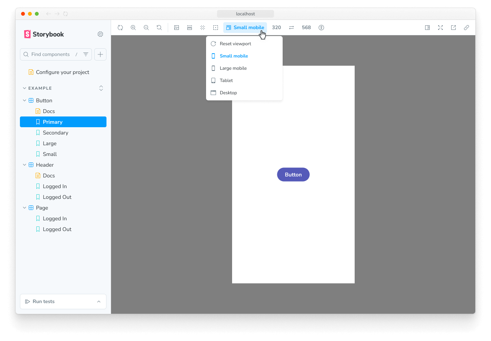

import { TabItem, Tabs } from "../../components/Tabs";

# Configure viewports for stories

<div class="aside" style="margin-bottom: 2rem;">

ℹ️&nbsp;&nbsp;This page documents viewports using the modes API. Learn how to [get started](/docs/modes). If you are transitioning from the <code>chromatic.viewports</code> API to the modes API, please consult the [migration guide](#migration-from-viewports-legacy-to-modes).

</div>

## Define viewport modes

Modes are defined in the `.storybook/modes.js|ts` file. If your project doesn't have this file yet, go ahead and create it. To set the viewport in a mode, specify the screen width and/or height using the `chromatic[<your-mode-name>].viewport` parameter.

The following are all acceptable viewport values:

- Integer (which defaults to width)
- Width & height (integer values only)
- String that is an integer or a string integer with `px` suffix, e.g.: `'1000px'`
- Only width (snapshot will be trimmed to the content height)
- Only height (snapshot will use the default width of 1200px, and be trimmed to the content width)

```ts title=".storybook/modes.ts"
export const allModes = {
  default: {
    // integer is just width
    viewport: 1280,
  },
  specificBoth: {
    // object can specify both
    viewport: {
      height: 300,
      width: 800,
    },
  },
  specificWidth: {
    // object with width
    viewport: {
      width: 800,
    },
  },
  specificHeight: {
    // object with height
    viewport: {
      height: 800,
    },
  },
  specificString: {
    // string values
    viewport: {
      height: "600",
      width: "800px",
    },
  },
} as const;
```

## Apply modes to set viewports

Modes can be applied at different levels: project, component, or story. When a mode includes a valid viewport parameter, Chromatic will adjust the viewport size to match the defined dimensions while capturing the snapshot.

For example, given the following set of modes in `.storybook/modes.ts`.

```ts title=".storybook/modes.ts"
export const allModes = {
  small: { name: "Small", styles: { width: "640px", height: "900px" } },
  medium: { name: "Medium", styles: { width: "768px", height: "900px" } },
  large: { name: "Large", styles: { width: "1024px", height: "900px" } },
} as const;
```

We can apply the modes, like so:

```ts title="ArticleCard.stories.ts|tsx"
// Adjust this import to match your framework (e.g., nextjs, vue3-vite)
import type { Meta } from "@storybook/your-framework";

import { allModes } from "../.storybook/modes";

import { ArticleCard } from "./ArticleCard";

const meta = {
  component: ArticleCard,
  title: "ArticleCard",
  parameters: {
    chromatic: {
      //🔶 Test each story for ArticleCard in two modes
      modes: {
        mobile: allModes["small"],
        desktop: allModes["large"],
      },
    },
  },
} satisfies Meta<typeof ArticleCard>;
```

When Chromatic captures your story, it will create *two* snapshots on your build, with the browser set at each viewport. These modes will be treated separately, with independent baselines and distinct approvals.

## Combining modes with the viewports feature

The Storybook [viewport feature](https://storybook.js.org/docs/essentials/viewport) enables you to adjust the dimensions of the story canvas. Developers use it to verify the responsive behavior of components when building UIs. With modes, you can easily reference the different viewport sizes configured with the feature.



### Reference the viewport by name

You start by configuring your desired set of viewports in `.storybook/preview.js|ts`. For example:

<div class="aside">
  ⚠️&nbsp;&nbsp;While the viewport feature allows you to specify dimensions
  using any valid CSS unit (such as px, rem, calc, etc.), Chromatic modes only
  support whole numbers or strings with a "px" suffix.
</div>

```ts title=".storybook/preview.ts"
// Replace your-framework with the framework you are using (e.g., react-vite, vue3-vite)
// if you're using Storybook 9, or with the appropriate renderer otherwise.
import type { Preview } from "@storybook/your-framework";

const preview: Preview = {
  parameters: {
    viewport: {
      options: {
        xsm: { name: "XSmall", styles: { width: "320px", height: "900px" } },
        sm: { name: "Small", styles: { width: "640px", height: "900px" } },
        md: { name: "Medium", styles: { width: "768px", height: "900px" } },
        lg: { name: "Large", styles: { width: "1024px", height: "900px" } },
        xl: { name: "XL", styles: { width: "1280px", height: "900px" } },
        "2xl": { name: "2XL", styles: { width: "1536px", height: "900px" } },
      },
    },
  },
};

export default preview;
```

You can now refer to these viewports by their key in your mode's definition. For example:

```ts title=".storybook/modes.ts"
export const allModes = {
  xsm: {
    viewport: "xsm",
  },
  md: {
    viewport: "md",
  },
  xl: {
    viewport: "xl",
  },
  // Note, you can still specify the more
  // specific options listed in the section above
  specific: {
    viewport: {
      height: 300,
      width: 800,
    },
  },
} as const;
```

---

### Using globals to define the default viewport

Within Storybook, you can configure the default viewport for stories at different levels: project, component, or story. You can do this by setting the `initialGlobals` configuration option at the project level and overriding it at the component or story level via the `globals` option. By adjusting this setting, you can control the dimensions of the story canvas when viewing it in the browser using Storybook. Chromatic will respect both options when capturing snapshots.

<Tabs>
  <TabItem label="preview.ts">
    ```ts title=".storybook/preview.ts"
    // Replace your-framework with the framework you are using (e.g., react-vite, vue3-vite)
    // if you're using Storybook 9, or with the appropriate renderer otherwise.
    import type { Preview } from "@storybook/your-framework";

    const preview: Preview = {
      parameters: {
        viewport: {
          options: {
            small: {
              name: "Small",
              styles: { width: "375px", height: "375px" },
            },
          },
        },
      },
      initialGlobals: {
        viewport: {
          viewport: { value: "small" },
        }
      },
    };
    export default preview;
    ```

  </TabItem>

  <TabItem label="stories.ts">
    ```ts title="MyComponent.stories.ts|tsx"
    // Adjust this import to match your framework (e.g., nextjs, vue3-vite)
    import type { Meta, StoryObj } from "@storybook/your-framework";

    import { MyComponent } from "./MyComponent";

    const meta = {
      component: MyComponent,
      title: "MyComponent",
    } satisfies Meta<typeof MyComponent>;

    export default meta;
    type Story = StoryObj<typeof meta>;


    export const DefaultViewportFromName: Story = {
      globals: {
        viewport: {
          value: "small", // This will use the 'small' viewport defined in preview.ts
        },
      },
    };
    ```

  </TabItem>
</Tabs>

<div class="aside">

When you specify a viewport for a story (or a component's stories) using `globals`, the viewport is applied and cannot be changed using the toolbar. This is useful to ensure a story is always rendered on a specific viewport.

</div>

That said, there are a few exceptions when Chromatic will ignore these options:

1. If your story has a `chromatic.viewport` parameter.
2. If your story uses a mode that specifies a viewport.
3. The globals configuration is set to a non-pixel value, e.g., `50%`, `65em`, `calc(100vh—calc(70% + 2w))`, etc.

In the example below, both stories will use the `md` viewport size when viewed in the browser. However, `FirstStory` will have one snapshot captured using the `md` viewport size, while `SecondStory` will have two snapshots captured at `lg` and `xl` viewport sizes respectively.

```ts title="MyComponent.stories.ts|tsx"
// Adjust this import to match your framework (e.g., nextjs, vue3-vite)
import type { Meta, StoryObj } from "@storybook/your-framework";

import { allModes } from "../.storybook/modes";

import { MyComponent } from "./MyComponent";

const meta = {
  component: MyComponent,
  title: "MyComponent",
} satisfies Meta<typeof MyComponent>;

export default meta;
type Story = StoryObj<typeof meta>;

export const FirstStory: Story = {
  globals: {
    viewport: {
      value: "md",
    },
  },
};

export const SecondStory: Story = {
  globals: {
    viewport: {
      value: "md",
    },
  },
  parameters: {
    chromatic: {
      modes: {
        lg: allModes["lg"],
        xl: allModes["xl"],
      },
    },
  },
};
```

---

## Migration from viewports (legacy) to modes

The new [modes API](/docs/modes) is a successor to the [viewport feature](/docs/legacy-viewports) and takes it a step further. With Modes, you can test your stories in different viewports and any combination of global settings you define. Additionally, you can specify specific viewport heights for tests.

We will continue to support both APIs, but we plan to deprecate the viewport feature. Behind the scenes, Chromatic automatically converts viewports to modes when capturing a snapshot. If you currently use the viewports feature, now is a good time to migrate to the new modes API.

### Can I use Viewports and Modes simultaneously?

No, Chromatic will throw an error if you use both. Additionally, if you include the "viewports" key, Chromatic will convert each entry in the array into a separate mode.

For example, the following will be converted into two modes: `320px` and `1200px`

```js
parameters: {
  chromatic: { viewports: [320, 1200] },
}
```

---

### Frequently asked questions

<details>
<summary>Are there any constraints on the viewport size that I can choose?</summary>

A width or height can be any whole number between 200 and 2560 pixels. The maximum number of pixels per snapshot is 25,000,000.

Safari and Firefox can't capture pages taller or wider than 32,767 pixels due to rendering engine limitations.

</details>

<details>
<summary>Can I control the height of the viewport?</summary>

Yes, you can control the height using the `viewport.height` property and enabling `parameters.chromatic.cropToViewport`.

- If the root container's intrinsic height exceeds the specified `viewport.height`, the snapshot will be clipped to `viewport.height`.
- If the root container's intrinsic height is less than the specified `viewport.height`, then the snapshot will be trimmed to that inherent height.

If no height is specified, Chromatic will capture a snapshot based on the intrinsic height of the root container.

```ts title="MyComponent.stories.ts|tsx"
// Adjust this import to match your framework (e.g., nextjs, vue3-vite)
import type { Meta } from "@storybook/your-framework";

import { MyComponent } from "./MyComponent";

const meta = {
  component: MyComponent,
  title: "MyComponent",
  parameters: {
    chromatic: {
      cropToViewport: true,
      modes: {
        small: {
          viewport: {
            height: 300,
            width: 800,
          },
        },
      },
    },
  },
} satisfies Meta<typeof MyComponent>;
```

</details>

<details>
<summary>How do I assign viewports globally to all components in my Storybook?</summary>

We don’t recommend this in most cases because each viewport is treated independently and snapshots must be approved as such.

But if you really want to assign project-level modes, you can do so by setting the `chromatic.modes` parameter in [`.storybook/preview.js|ts`](https://storybook.js.org/docs/configure#configure-story-rendering):

```ts title=".storybook/preview.ts"
// Replace your-framework with the framework you are using (e.g., react-vite, vue3-vite)
// if you're using Storybook 9, or with the appropriate renderer otherwise.
import type { Preview } from "@storybook/your-framework";

import { allModes } from "../.storybook/modes";

const preview: Preview = {
  parameters: {
    chromatic: {
      modes: {
        light: allModes["light"],
        dark: allModes["dark"],
      },
    },
  },
};

export default preview;
```

</details>

<details>
<summary>What happens when I don’t specify a viewport?</summary>

Chromatic defaults to a viewport of width 1200px and height 900px.

</details>

<details>
<summary>How does snapshot cropping work with viewport width and height?</summary>

When you add a viewport, Chromatic will size the browser’s viewport to the defined width and height. It will then [take a snapshot and crop](/docs/snapshots#how-are-snapshots-captured) it to the component's bounding box. This eliminates negative space around snapshots, reducing the visual information you must review.

By default, Chromatic captures the full height of the rendered UI, even if a viewport height has been set. This is because in most cases, you want to capture the entire rendered UI. To restrict the capture height to the specified height, set `parameters.chromatic.cropToViewport` to `true`.

</details>
