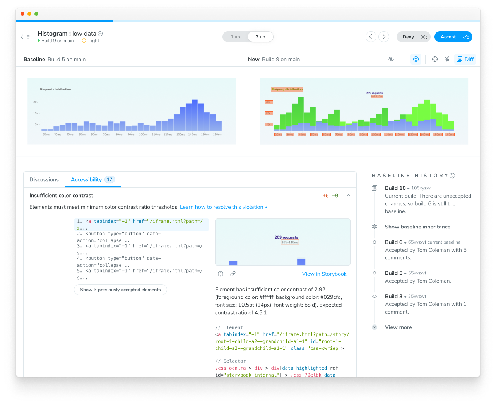

# Accessibility Testing

Catch accessibility issues early in your development workflow with Chromatic's automated accessibility testing. Built on top of Storybook's powerful accessibility testing capabilities, Chromatic helps teams ensure their components are inclusive and meet WCAG standards at scale.

Accessibility testing in Chromatic leverages [Storybook's a11y addon](https://storybook.js.org/docs/8.5/writing-tests/accessibility-testing) and [axe-core](https://github.com/dequelabs/axe-core) to automatically detect up to [57% of WCAG issues](https://www.deque.com/blog/automated-testing-study-identifies-57-percent-of-digital-accessibility-issues/). By integrating these tests into your Chromatic workflow, you can:

- [Shift-left](https://www.ibm.com/topics/shift-left-testing) by catching accessibility violations early in the development cycle
- Ensure consistent accessibility standards across your application
- Track accessibility compliance over time
- Generate reports for accessibility audits

## Getting Started

1. Set up Storybook's a11y addon: `npx storybook add @storybook/addon-a11y`
2. Start Storybook `npm run storybook`
3. Ensure that the Accessibility checkbox is ticked in the Testing Module
4. Run tests

## How It Works

During local development, accessibility errors will be reported in the Storybook sidebar. When you push changes to your repository, Chromatic will:

1. Build your Storybook
2. Run accessibility tests for each story
3. Compare results against previous builds
4. Generate detailed reports of any violations



## Customize the accessibility testing rules

Customize your accessibility testing rules using the `accessibility` parameter in your Storybook configuration. You can set these parameters at the story, component (meta), and project (global) levels. [Learn more »](docs/config-with-story-params).

For detailed configuration options, refer to the [Storybook Accessibility tests documentation](https://storybook.js.org/docs/writing-tests/accessibility-testing#configure).

```ts title=".storybook/preview.ts"
// Replace your-framework with the framework you are using (e.g., react, vue3)
import { Preview } from '@storybook/your-framework';

const preview: Preview = {
  parameters: {
    a11y: {
      // Optional selector to inspect
      element: '#storybook-root',
      // axe-core configurationOptions (https://github.com/dequelabs/axe-core/blob/develop/doc/API.md#parameters-1)
      config: {
        rules: [
          {
            // The autocomplete rule will only run based on the CSS selector provided
            id: 'autocomplete-valid',
            selector: '*:not([autocomplete="nope"])',
          },
          {
            // Setting the enabled option to false will disable checks for this particular rule on all stories.
            id: 'image-alt',
            enabled: false,
          },
        ],
      },
      // axe-core optionsParameter (https://github.com/dequelabs/axe-core/blob/develop/doc/API.md#options-parameter)
      options: {},
      // Optional flag to prevent the automatic check
      manual: true,
    },
  },
};

export default preview;
```

### Frequently asked questions

<details>
<summary>How does this differ from Storybook's built-in accessibility testing?</summary>

Chromatic builds upon Storybook's accessibility testing by providing automated testing at scale, historical tracking, and integrated reporting within your workflow.

</details>

<details>
<summary>Does this replace manual accessibility testing?</summary>

No, automated testing catches a subset of accessibility issues. Manual testing is still recommended for comprehensive accessibility compliance.

</details>
