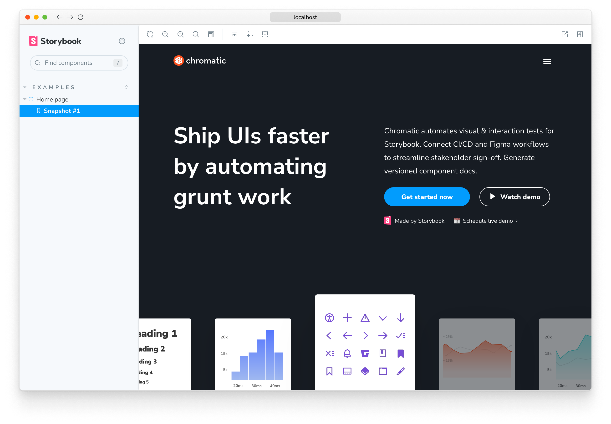
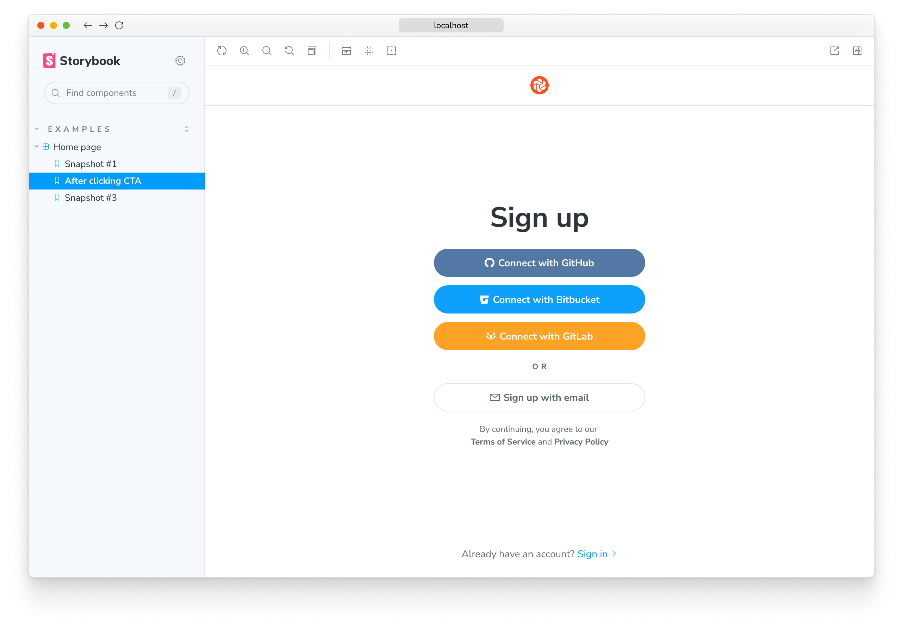

# E2E Visual Tests

<div class="aside">

🧪 **Experimental** We're actively integrating feedback from [early access users](https://forms.gle/w43XGAJXVWpAF5oC7), so the API and other details below may change.

Current limitations:

- Not yet tested on Windows
- Only available for Playwright right now

</div>

<!-- Without this the paragraph below butts up against the aside -->
<p></p>

Chromatic **E2E Visual Tests** capture live [“archives”](#what-are-archives) of pages during [Playwright](https://playwright.dev/) end-to-end tests. This means you can use the full Chromatic <a href="/docs/test"><b>UI Tests</b></a> and <a href="/docs/review"><b>UI Review</b></a> features _without_ writing any [Storybook stories](https://storybook.js.org/docs/react/get-started/whats-a-story). (Storybook is still used, but [automatically configured for you](#running-the-storybook-locally).)

The archives you create during each test run can be viewed in a Storybook UI, so you can inspect them in Chromatic (or [locally](#running-the-storybook-locally)) after each build to more closely debug changes and errors.

## What are archives?

An **archive** is a self-contained, re-renderable HTML “snapshot” of your page at a certain point in time extracted from the Playwright driven browser’s DOM. They are stored in your project's [`outputDir`](https://playwright.dev/docs/api/class-testproject#test-project-output-dir) (`./test-results`, by default). Those archives will automatically be integrated into the Archive Storybook (which can be [run locally](#running-the-storybook-locally)).

<div class="aside">

⚠️ If you have configured a different `outputDir`, you must [configure the Archive Storybook to match](#chromatic_archive_location).

</div>

The Archive Storyook is passed to Chromatic’s build process, which screenshots those archives in whichever <a href="/docs/browsers">cloud browsers you have configured for your project. Chromatic then compares the screenshots, and presents you with the changes to review.

## Requirements

- E2E Visual Tests works with end-to-end tests written in [Playwright](https://playwright.dev/) v1.12+.
- ⚠️ **Warning** If your project is already using Storybook, that Storybook will need to be on version 7+ to work alongside the Archive Storybook. If you’re using an older version of Storybook, you can follow this [migration guide](https://storybook.js.org/docs/7.0/react/migration-guide) to upgrade.

## Installation

Get started by installing the Test Archiver package and the Archive Storybook package (a specially-configured Storybook instance that can display your [archives](#what-are-archives)).

### As a new installation of Storybook

If you aren't yet using Storybook in your project, install with:

```shell
yarn add --dev @chromaui/test-archiver @chromaui/archive-storybook @storybook/cli @storybook/addon-essentials @storybook/server-webpack5 react react-dom
```

<div class="aside">

💡 Note that if you are already using React in your project, you should install the version you are already using to avoid conflicts. The command above will install the latest version of each package.

</div>

### If you are already using Storybook

If you are already using Storybook in your project, install as a second Storybook with:

```shell
# Replace <version> with the version you are using for your other Storybook packages, e.g. 7.1.0
yarn add --dev @chromaui/test-archiver @chromaui/archive-storybook @storybook/server-webpack5@<version>
```

## Usage

To create an [archive](#what-are-archives) at the end of a Playwright test, import `test` and `expect` from `@chromaui/test-archiver` instead of `@playwright/test`:

```js
// ➖ Remove this line
// import { test, expect } from '@playwright/test';
// ➕ Add this line
import { test, expect } from "@chromaui/test-archiver";

// Then use as normal
test("Home page", async ({ page }) => {
  await page.goto("https://chromatic.com/");

  await expect(page).toHaveTitle(/Chromatic/);

  // ...
});
```

Once the above is in place, Test Archiver will run in addition to the Playwright test, archiving the final state, whether it passes or fails.

The above snippet produces an archive that looks like this in Storybook:



(You can view your archives in a published Storybook, [via Chromatic](#using-with-chromatic), or [locally](#running-the-storybook-locally).)

### Manual snapshots

To take manual snapshots at specific points of your tests, you can use the `takeArchive` function inside your test runs:

```js
import { test, expect, takeArchive } from "@chromaui/test-archiver";

// 👇 Add testInfo parameter
test("Home page", async ({ page }, testInfo) => {
  await page.goto("https://chromatic.com/");

  await expect(page).toHaveTitle(/Chromatic/);

  // Call takeArchive to take an archive "snapshot" of the page at this point in the test
  // 👇 Pass testInfo to takeArchive
  await takeArchive(page, testInfo);

  await page.getByRole("link", { name: "Get started now" }).click();
  await expect(page).toHaveTitle(/Sign in/);

  // You can call it several times, as necessary
  // To help disambiguate, you can give the archive "snapshot" a name
  await takeArchive(page, "After clicking CTA", testInfo);
});
```

<div class="aside">

💡 Note that an archive is always taken at the end of every test, in addition to the ones you manually specify.

</div>

The above snippet produces archives that look like this in Storybook:



(You can view your archives in a published Storybook, [via Chromatic](#using-with-chromatic), or [locally](#running-the-storybook-locally).)

## Using with Chromatic

1. **Set up a Chromatic project**

   If your repository already has an associated Chromatic project, you can set up an additional Chromatic project to test the Archive Storybook using the [instructions for monorepo support](monorepos#run-chromatic-for-each-subproject).

   Otherwise, follow <a href="/docs/setup#sign-up">these sign up instructions</a> to create a new Chromatic project.

   <div class="aside">

   👉 Take note of the project token for the new project. You’ll need it in the next steps.

   </div>

2. **Run Chromatic on the archives manually**

   Add the script for building the Archive Storybook to your `package.json` (the same `scripts` from which you run your Playwright tests):

   ```json
   "scripts": {
     "build-archive-storybook": "build-archive-storybook"
   }
   ```

   Now you can try manually running Chromatic against the archives with the project you just created (using the token you noted above):

   ```shell
   npx chromatic@latest --build-script-name=build-archive-storybook -t=<TOKEN>
   ```

3. **Run Chromatic on the archives in CI**

   If you are already running Chromatic in CI, you can add an additional step to run Chromatic on the Archive Storybook. This additional step must be placed after your E2E tests run. It uses the project token from the new project you created above and the `--build-script-name=build-archive-storybook` flag:

   ```yaml
   # For instance in our GitHub action:
   steps:
     - name: Checkout repository
       uses: actions/checkout@v2
       with:
         fetch-depth: 0
     - name: Install dependencies
       run: yarn

     # 👇 Run Chromatic as normal for your Storybook
     - name: Publish to Chromatic
       uses: chromaui/action@v1
       with:
         projectToken: ${{ secrets.CHROMATIC_PROJECT_TOKEN }}

     # 👇 Run your E2E tests *before* running Chromatic for your E2E test archives
     - name: E2E tests
       run: yarn playwright test

     # 👇 Run Chromatic for your E2E test archives
     - name: Publish E2E Archives to Chromatic
       uses: chromaui/action@v1
       with:
         # 👇 This is the token for the archive project
         projectToken: ${{ secrets.CHROMATIC_ARCHIVE_PROJECT_TOKEN }}
         # 👇 Tell Chromatic to build the Archive Storybook
         buildScriptName: build-archive-storybook
   ```

   If you're not already running Chromatic in CI, you can follow the standard [CI setup instructions](ci) to automate your E2E test archives in Chromatic. Remember to use the project token from the new project you created above and the `--build-script-name=build-archive-storybook` flag.

   Once you’ve set up the above (or similar for your CI provider) and pushed a commit, you should see a build with your archive’s screenshots appear on the new project.

### Sharded Playwright Runs

When running your Playwright tests over multiple shared CI jobs, you’ll need to wait for all jobs to complete, ensure you save the results in `./test-archives` to be accessible by the next job (for instance using an [artifact in GitHub Actions](https://docs.github.com/en/actions/using-workflows/storing-workflow-data-as-artifacts)), and run Chromatic for the Archive Storybook in a job that depends on all of the shards.

For GitHub actions, that might look like:

```yaml
test:
  name: Run Playwright
  needs: install
  strategy:
    matrix:
      shard: [1, 2]
  steps:
    - name: Run Playwright tests
      run: npx playwright test --shard=${{ matrix.shard }}/${{ strategy.job-total }}

    - uses: actions/upload-artifact@v3
      if: always()
      with:
        name: playwright-report-${{ matrix.shard }}_${{ strategy.job-total }}
        path: ./test-archives/latest
        retention-days: 30

chromatic:
  name: Run Chromatic
  needs: test
  steps:
    - name: Download all workflow run artifacts
      uses: actions/download-artifact@v3

    - name: Publish E2E Archives to Chromatic
      uses: chromaui/action@v1
      with:
        projectToken: ${{ secrets.CHROMATIC_ARCHIVE_PROJECT_TOKEN }}
        buildScriptName: build-archive-storybook
```

## Running the Storybook locally

The Archive Storybook is a preconfigured Storybook instance that Chromatic uses to capture your [archives](#what-are-archives). It can also be run locally to view and debug your archives.

<div class="aside">

💡 In addition to running the Archive Storybook locally, you can debug by adding the [`--headed` flag](https://playwright.dev/docs/test-cli#reference) to the `playwright test` command, which will display your tests in the browser as they run.

</div>

First run the E2E tests to generate the latest results:

```shell
yarn playwright test # or similar
```

Then add the script for running the Archive Storybook to your `package.json` (the same `scripts` from which you run your Playwright tests):

```json
"scripts": {
  "archive-storybook": "archive-storybook", // 👈 Add this line
  "build-archive-storybook": "build-archive-storybook"
}
```

Now you can run the Archive Storybook with the `archive-storybook` command, and visit it like any other Storybook:

```shell
yarn archive-storybook
```

## Settings

You can further configure the Test Archiver with these settings:

### `CHROMATIC_ARCHIVE_LOCATION`

If you have configured your project's [`outputDir`](https://playwright.dev/docs/api/class-testproject#test-project-output-dir) option to be different than the default, you must set the `CHROMATIC_ARCHIVE_LOCATION` environment variable (both when starting the Storybook and when building it on CI) to the same value. This ensures that the Archive Storybook can find the [archives](#what-are-archives) generated by the Test Archiver.

## Frequently asked questions

<details>

<summary>Does this mean we should no longer write stories for our page components?</summary>

No. Our recommendation is still to develop and test your components, including pages, in Storybook. There are benefits to doing so:

- **Coverage** — Certain states (in-between loading states, unusual API responses) are difficult or impossible to achieve in E2E but simple in Storybook. It’s much easier to write a story for every possible input of a page.
- **Reproductions** — If something goes wrong with a snapshot, it’s much easier to pull up the story in Storybook and iterate towards fixing it.
- **[Component Driven Development](https://www.componentdriven.org)** — Anchoring work and conversations about a UI in a specific state (e.g., settings page for new project) also offers many workflow benefits for development and collaboration.

Unlike Storybook, E2E Visual Testing is well-suited to testing user flows between pages, not just individual page components.

For pages in a legacy project that are otherwise difficult to isolate in Storybook, E2E Visual Tests helps you extend visual test coverage to those pages.

</details>

<details>

<summary>Doesn’t the Archive Storybook get us most of the benefits of developing with stories?</summary>

It depends. Archive Storybooks are intended to make it easier to debug and reproduce visual tests. This way when you're reviewing visual changes, you don't have to rerun the E2E test suite to inspect what a page looks like in a specific state.

The tradeoff is that the full E2E test suite needs to be run before generating the archive Storybook. During development, this can lengthen the feedback loop.

If you're developing a new UI, we recommend writing stories for comprehensive coverage. If you're adding visual tests to an existing UI that already has E2E tests, we recommend E2EVT to cover the "happy paths".

</details>
