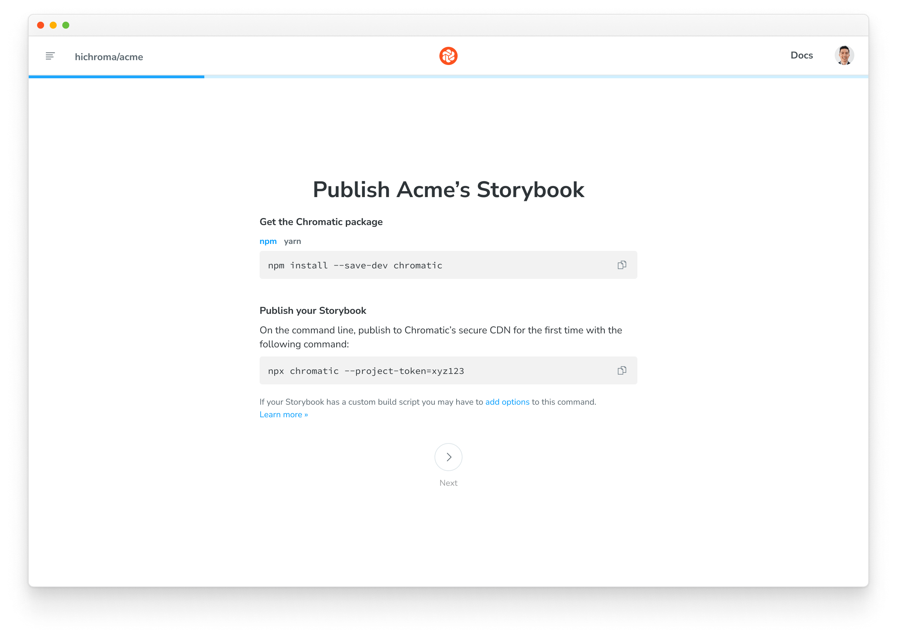
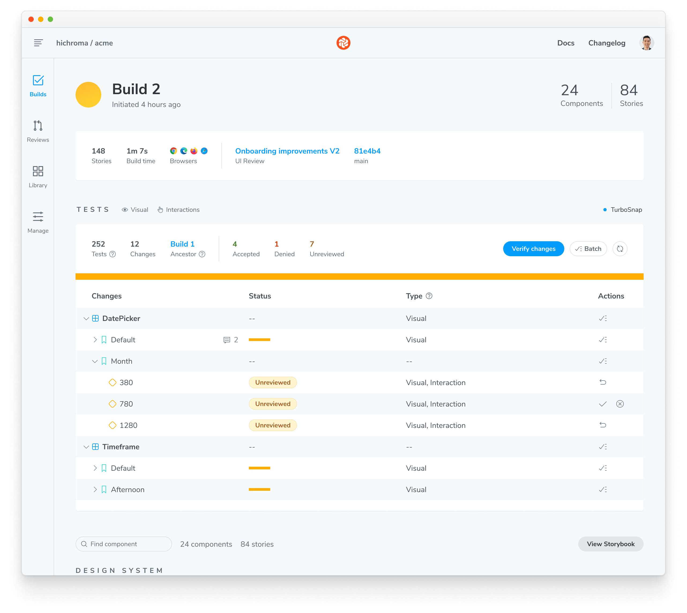
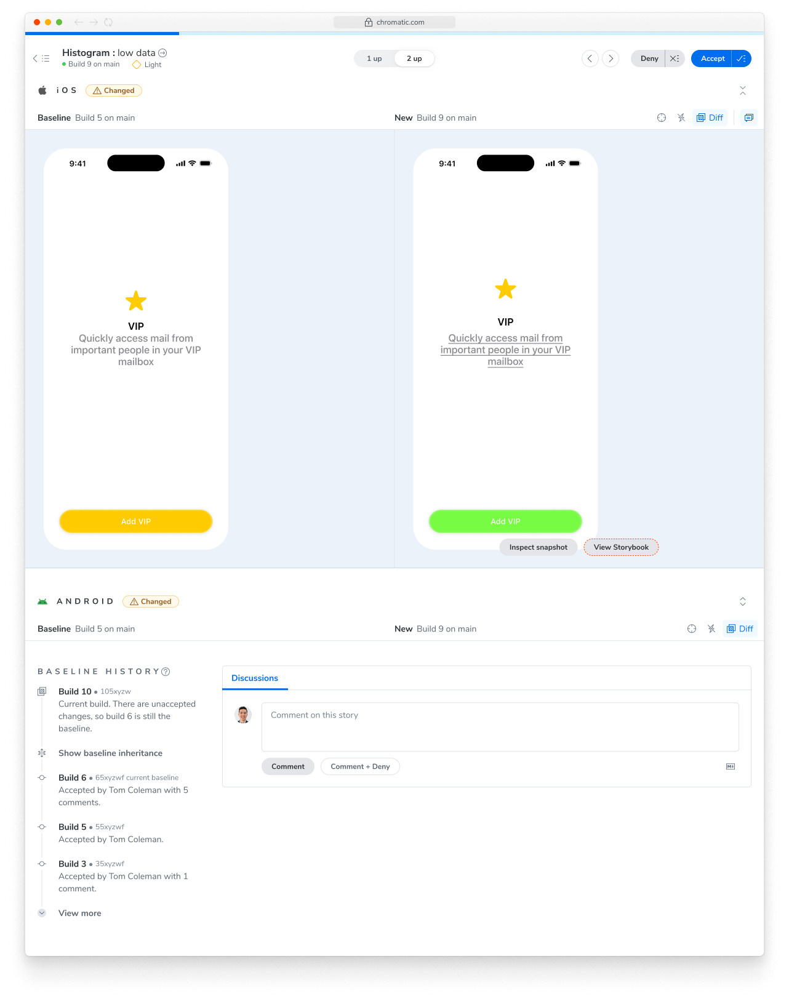
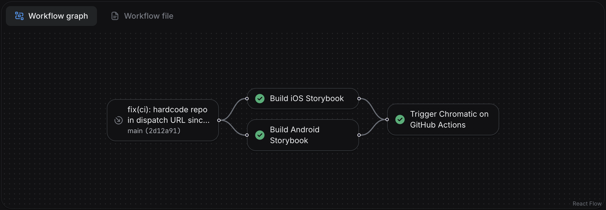
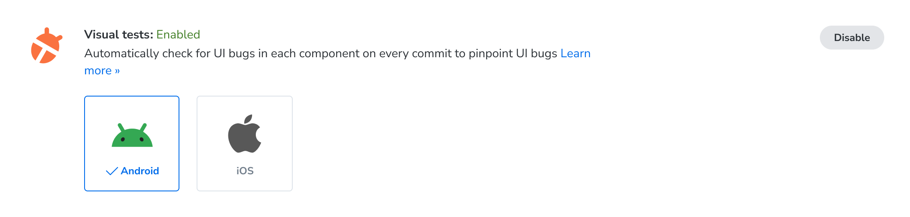

import TroubleshootingSetup from '../../shared-snippets/setup/troubleshooting.mdx';
import DemoChromaticUnlinked from '../../shared-snippets/demo-chromatic-unlinked.mdx';
import InstallSnippets from '../../components/InstallSnippets.astro';

# Chromatic for React Native (early access)

Chromatic enables you to visual test iOS and Android apps built with React Native. It's powered by [React Native for Storybook](https://storybookjs.github.io/react-native/docs/intro/), and your [stories](https://storybook.js.org/docs/get-started/whats-a-story) act as test cases.

Chromatic captures snapshots in the iOS Simulator on hosted macOS and the Android Emulator on hosted Linux, so you test exactly what your users see.

<div class="callout">

🚧 **Early access:** React Native support is currently in early access. If you’re interested in trying it out, [request access here](https://share.hsforms.com/1Bjqi15TSS3mQ9nb8yfTstgr5etx?__hstc=243929690.d9890273ac8b62b0f3e7b993d5dd426b.1748437903587.1778769445873.1778780700034.552&__hssc=243929690.6.1778780700034&__hsfp=ca0357851390fc6de8cfe1c23ae3a60e).

</div>

## Prerequisites

Before you start, make sure you have:

- A working React Native app ([Expo](https://expo.dev/), [Expo Router](https://docs.expo.dev/router/introduction/), [React Native CLI](https://reactnative.dev/docs/environment-setup), and [Re.Pack](https://re-pack.dev/) are all supported)
- [React Native for Storybook](https://storybookjs.github.io/react-native/docs/intro/) installed and running locally, v9.0 or higher
- A [Chromatic](https://www.chromatic.com) account

<details>
<summary>Don't have Storybook for React Native set up yet?</summary>

Use the Storybook CLI to get started. It handles all the set up: it wraps your bundler config with `withStorybook`, generates the Storybook entry point, and adds convenience scripts to your `package.json`.

```shell
npm create storybook@latest
```

</details>

## Set up Chromatic for React Native

The Chromatic CLI uploads your built React Native Storybook to the Chromatic cloud, where it runs on real iOS Simulator and Android Emulator instances and produces visual diffs against your baselines.

### 1. Sign up and create a new project

Generate a unique project token for your app by signing in to [Chromatic](https://www.chromatic.com/start) and creating a project. Sign in with your GitHub, GitLab, Bitbucket, or email.

Then reach out to your point of contact at Chromatic to enable React Native support for your project.

<DemoChromaticUnlinked />



If you bootstrapped a new React Native Storybook with v10.4+, Steps 2 and 3 aren’t required. When initializing a new project with v10.4+, Storybook handles all configuration automatically.

### 2. Ensure the root shows Storybook

Regardless of which router your project uses, you must return `<StorybookUI />` at the app's root when `STORYBOOK_ENABLED` or `EXPO_PUBLIC_STORYBOOK_ENABLED` is set.

For example, in `app/_layout.tsx`, you can conditionally render Storybook based on the environment variable:

```tsx title="app/_layout.tsx"
import { Stack } from 'expo-router';
import StorybookUI from '../.rnstorybook';

export default function RootLayout() {
  if (process.env.EXPO_PUBLIC_STORYBOOK_ENABLED === 'true') {
    return (
      <ThemeProvider value={colorScheme === 'dark' ? DarkTheme : DefaultTheme}>
        <StorybookUI />
      </ThemeProvider>
    );
  }

  // else render the normal app
  return (
    <Stack screenOptions={{ headerShown: false }}>
      <Stack.Screen name="(pages)/index" />
    </Stack>
  );
}
```

### 3. Configure Storybook UI using environment variables

Chromatic drives React Native Storybook via WebSockets and requires a few additional options to be enabled. These options must be controlled by environment variables read in `.rnstorybook/index.ts`.

```tsx title=".rnstorybook/index.ts"
import { view } from './storybook.requires';

const StorybookUIRoot = view.getStorybookUI({
  enableWebsockets: process.env.EXPO_PUBLIC_STORYBOOK_ENABLED === 'true',
  host: process.env.EXPO_PUBLIC_STORYBOOK_WEBSOCKET_HOST || 'localhost',
  port: parseInt(process.env.EXPO_PUBLIC_STORYBOOK_WEBSOCKET_PORT || '7007', 10),
  secured: process.env.EXPO_PUBLIC_STORYBOOK_WEBSOCKET_SECURED === 'true',
  onDeviceUI: process.env.EXPO_PUBLIC_STORYBOOK_DISABLE_UI !== 'true',
});

export default StorybookUIRoot;
```

### 4. Run your first build to establish baselines

Once you have a project token, you can establish baselines by running a Chromatic build for a new project. Chromatic builds your Storybook app, uploads it, captures a snapshot of each story, and sets those snapshots as the baseline.

Subsequent builds will generate new snapshots that are compared against existing baselines to detect UI changes.

{/* prettier-ignore-start */}

<InstallSnippets>
  <Fragment slot="npm">
  ```shell
  $ npx chromatic --project-token <your-project-token>
  ```
  </Fragment>
  <Fragment slot="yarn">
  ```shell
  $ yarn chromatic --project-token <your-project-token>
  ```
  </Fragment>
  <Fragment slot="pnpm">
  ```shell
  $ pnpm chromatic --project-token <your-project-token>
  ```
  </Fragment>
</InstallSnippets>

{/* prettier-ignore-end */}

The Chromatic CLI will build your Storybook `.apk` and/or `.app` for Expo based projects.

If you have a custom build process, you can also build the artifacts yourself and pass the directory to `chromatic` with the `--storybook-build-dir` flag. More on that in the [advanced configuration](#reusing-an-existing-build) docs.

### 5. Review changes

On each build, Chromatic compares new snapshots to existing baselines from previous builds. Try modifying a component a bit and running another Chromatic build.

When tests are complete, you'll see the build status and a link to review the changes. Click on that link to open Chromatic.

```shell
Build 2 published.

View it online at https://www.chromatic.com/build?appId=...&number=2.
```



The build will be marked "unreviewed" and the changes will be listed in the "Tests" table. Go through each snapshot to review the diff and approve or reject the change.

✅ **Accept change**: This updates the story baseline, ensuring future snapshots are compared against the latest approved version. Once a snapshot is accepted, it won't need re-acceptance until it changes, even across git branches or merges.

❌ **Deny change**: This marks the change as "denied", indicating a regression and immediately failing the build. You can deny multiple changes per build. Denying a change will force a re-capture on the next build.



---

## Advanced configuration options

### Environment Variables

All build commands invoked by the Chromatic CLI set environment variables to properly configure your Storybook for visual testing. These environment variables let you control Storybook behavior without changing code, as [documented here](https://storybookjs.github.io/react-native/docs/intro/configuration/environment-variables).

The Chromatic CLI sets the following environment variables. It also sets them with the `EXPO_PUBLIC_` prefix for [use with Expo](https://docs.expo.dev/guides/environment-variables/).

| **Name**                                                | **Value**                            | **Description**                                      |
| ------------------------------------------------------- | ------------------------------------ | ---------------------------------------------------- |
| `STORYBOOK_ENABLED`                                     | `true`                               | Enables Storybook in bundle                          |
| `STORYBOOK_DISABLE_UI`                                  | `true`                               | Disables the Storybook manager UI                    |
| `STORYBOOK_SERVER`                                      | `false`                              | Do not start the channel server.                     |
| `STORYBOOK_WEBSOCKET_HOST` or `STORYBOOK_WS_HOST`       | `react-native.capture.chromatic.com` | Connects the Storybook to Chromatic capture systems. |
| `STORYBOOK_WEBSOCKET_PORT` or `STORYBOOK_WS_PORT`       | `7007`                               | Connects the Storybook to Chromatic capture systems. |
| `STORYBOOK_WEBSOCKET_SECURED` or `STORYBOOK_WS_SECURED` | `true`                               | Ensures the use of TLS when connecting to Chromatic. |

### Custom build commands

For non-Expo users or setups Chromatic doesn't currently account for, two escape-hatch options are available via the [config file](/docs/cli/#chromatic-config-file):

- [reactNative.iosBuildCommand](/docs/configure/#reactnative-iosbuildcommand)
- [reactNative.androidBuildCommand](/docs/configure/#reactnative-androidbuildcommand)

When set, the CLI invokes these commands instead of its defaults. The commands must output artifacts named `storybook.apk` and/or `storybook.app` to the directory specified by `CHROMATIC_ARTIFACT_DIRECTORY`.

### Reusing an existing build

Pass `--storybook-build-dir` to skip all build steps except `manifest.json` generation. This is most useful for parallelizing native builds across CI machines: one machine builds the Android artifact, another builds the iOS artifact, and a third runs Chromatic with `--storybook-build-dir` pointing to the directory containing both artifacts.

### The `react-native-build` command for Expo users

The CLI includes a `react-native-build` sub-command for building your React Native app that use Expo. It uses the same logic as a regular Chromatic run, but lets you split your CI pipeline and parallelize Android and iOS builds.

```bash
$ npx chromatic@latest react-native-build --help

  Build React Native Storybook for Chromatic

  Usage
    $ chromatic react-native-build [options]

  Options
    --platform    Platform to build (android, ios). Can be specified multiple times. Defaults to all platforms in Expo config.
    --output-dir  Directory to write build artifacts and log file to.
```

## Configure CI

Integrate Chromatic into your CI pipeline to get notified about any visual changes introduced by a pull request. Chromatic will run tests when you push code and report changes via the "UI Tests" badge for your pull request.

Here's a sample GitHub Actions workflow (for Expo) that builds the Storybook app for iOS and Android in parallel, then runs Chromatic with the generated artifacts:

```yml title=".github/workflows/test.yml"
name: Build

on:
  pull_request:
    types: [opened, edited, synchronize]
  push:
    branches:
      - main

jobs:
  build-ios:
    runs-on: macos-latest
    steps:
      - name: Checkout
        uses: actions/checkout@v6
        with:
          fetch-depth: 0

      - name: Select Xcode
        run: sudo xcode-select -s /Applications/Xcode_26.3.app

      - name: Setup Node.js
        uses: actions/setup-node@v6
        with:
          node-version: 24
          cache: npm

      - name: Install dependencies
        run: npm install

      - name: Cache CocoaPods spec repo
        uses: actions/cache@v5
        with:
          path: ~/.cocoapods
          key: cocoapods-specs-${{ hashFiles('package.json', 'app.json') }}
          restore-keys: |
            cocoapods-specs-

      - name: Cache Pods directory
        uses: actions/cache@v5
        with:
          path: ios/Pods
          key: ios-pods-${{ hashFiles('package.json', 'app.json') }}
          restore-keys: |
            ios-pods-

      - name: Build iOS
        run: npx --yes chromatic react-native-build --platform=ios --output-dir=build

      - name: Upload iOS build
        uses: actions/upload-artifact@v7
        with:
          name: ios-build
          path: build/
          retention-days: 1

  build-android:
    runs-on: ubuntu-latest
    steps:
      - name: Checkout
        uses: actions/checkout@v6
        with:
          fetch-depth: 0

      - name: Setup Node.js
        uses: actions/setup-node@v6
        with:
          node-version: 24
          cache: npm

      - name: Cache Gradle wrapper
        uses: actions/cache@v5
        with:
          path: ~/.gradle/wrapper
          key: gradle-wrapper-${{ hashFiles('package.json', 'app.json') }}

      - name: Cache Gradle dependencies
        uses: actions/cache@v5
        with:
          path: ~/.gradle/caches
          key: gradle-caches-${{ hashFiles('package.json', 'app.json') }}
          restore-keys: |
            gradle-caches-

      - name: Cache Android directory
        uses: actions/cache@v5
        with:
          path: android/
          key: android-dir-${{ hashFiles('package.json', 'app.json') }}
          restore-keys: |
            android-dir-

      - name: Install dependencies
        run: npm install

      - name: Build Android
        run: npx --yes chromatic react-native-build --platform=android --output-dir=build

      - name: Upload Android build
        uses: actions/upload-artifact@v7
        with:
          name: android-build
          path: build/
          retention-days: 1

  chromatic:
    needs: [build-ios, build-android]
    runs-on: ubuntu-latest
    steps:
      - name: Checkout
        uses: actions/checkout@v6
        with:
          fetch-depth: 0

      - name: Setup Node.js
        uses: actions/setup-node@v6
        with:
          node-version: 24
          cache: npm

      - name: Install dependencies
        run: npm install

      - name: Download iOS build
        uses: actions/download-artifact@v8
        with:
          name: ios-build
          path: build/ios

      - name: Download Android build
        uses: actions/download-artifact@v8
        with:
          name: android-build
          path: build/android

      - name: Move Storybook static files
        run: |
          mkdir -p storybook-static
          mv build/ios/storybook.app storybook-static/
          mv build/android/storybook.apk storybook-static/

      - name: Publish to Chromatic
        run: npx --yes chromatic -d storybook-static --exit-zero-on-changes --exit-zero-on-errors
        env:
          CHROMATIC_PROJECT_TOKEN: ${{ secrets.CHROMATIC_PROJECT_TOKEN }}
```

## Configure CI with EAS Build

If you already build with [EAS Build](https://docs.expo.dev/build/introduction/), you can build the Storybook artifacts on EAS instead of on GitHub-hosted runners, keeping your credentials and build profiles in one place.

This is a two-part setup: an [EAS workflow](https://docs.expo.dev/eas/workflows/get-started/) builds the iOS `.app` and Android `.apk` artifacts in parallel, then triggers a GitHub Actions workflow that downloads them and runs Chromatic.

### 1. Add a Storybook build profile

Both platform builds use a dedicated `storybook` [build profile](https://docs.expo.dev/build/eas-json/) so the artifacts contain Storybook instead of your app. In `eas.json`, enable Storybook in the bundle and produce artifacts Chromatic can install—an iOS Simulator build and an Android APK:

```json title="eas.json"
{
  "build": {
    "storybook": {
      "ios": {
        "simulator": true
      },
      "android": {
        "buildType": "apk"
      },
      "env": {
        "EXPO_PUBLIC_STORYBOOK_ENABLED": "true"
      }
    }
  }
}
```

### 2. Build artifacts and trigger the GitHub workflow

The EAS workflow builds both platforms, then uses the build IDs to trigger the Chromatic workflow on GitHub Actions via a [repository dispatch](https://docs.github.com/en/rest/actions/workflows#create-a-workflow-dispatch-event).

```yml title=".eas/workflows/chromatic.yml"
name: Chromatic

on:
  push:
    branches: ['main']
  pull_request:
    branches: ['*']

jobs:
  build_ios:
    name: Build iOS Storybook
    type: build
    params:
      platform: ios
      profile: storybook

  build_android:
    name: Build Android Storybook
    type: build
    params:
      platform: android
      profile: storybook

  trigger_chromatic:
    name: Trigger Chromatic on GitHub Actions
    needs: [build_ios, build_android]
    steps:
      - name: Dispatch chromatic-eas workflow
        # 👇 Replace `<owner>/<repo>` with your repository.
        run: |
          curl --fail-with-body -sS -X POST \
            -H "Accept: application/vnd.github+json" \
            -H "Authorization: Bearer ${GH_DISPATCH_TOKEN}" \
            "https://api.github.com/repos/<owner>/<repo>/actions/workflows/chromatic-eas.yml/dispatches" \
            -d "{
              \"ref\": \"${{ github.ref_name || 'main' }}\",
              \"inputs\": {
                \"ios_build_id\": \"${{ needs.build_ios.outputs.build_id }}\",
                \"android_build_id\": \"${{ needs.build_android.outputs.build_id }}\"
              }
            }"
```

The `build_ios` and `build_android` jobs each expose a `build_id` output. The `trigger_chromatic` job passes those IDs to the GitHub workflow as inputs so it knows which artifacts to download.

`GH_DISPATCH_TOKEN` is a [GitHub personal access token](https://docs.github.com/en/authentication/keeping-your-account-and-data-secure/managing-your-personal-access-tokens) with `workflow` scope, both read and write. Store it as an [EAS environment variable](https://docs.expo.dev/eas/environment-variables/) (marked secret) so the workflow can authenticate the dispatch request.



### 3. Run Chromatic on GitHub Actions

The dispatched workflow receives the two EAS build IDs, downloads the artifacts with the [EAS CLI](https://docs.expo.dev/eas/), arranges them into a `storybook-static` directory using the `storybook.app` / `storybook.apk` names Chromatic expects, and runs Chromatic with `storybookBuildDir`.

```yml title=".github/workflows/chromatic-eas.yml"
name: Chromatic (EAS artifacts)

on:
  workflow_dispatch:
    inputs:
      ios_build_id:
        description: 'EAS build ID for the iOS Storybook build'
        required: true
        type: string
      android_build_id:
        description: 'EAS build ID for the Android Storybook build'
        required: true
        type: string

jobs:
  chromatic:
    runs-on: ubuntu-latest
    steps:
      - name: Checkout
        uses: actions/checkout@v4
        with:
          fetch-depth: 0

      - name: Setup Node.js
        uses: actions/setup-node@v4
        with:
          node-version: 22
          cache: npm

      - name: Install dependencies
        run: npm ci

      - name: Download EAS build artifacts
        env:
          EXPO_TOKEN: ${{ secrets.EXPO_TOKEN }}
        run: |
          mkdir -p storybook-static
          IOS_PATH=$(npx eas-cli build:download --build-id "${{ inputs.ios_build_id }}" --non-interactive --json | jq -r '.path')
          cp -R "$IOS_PATH" storybook-static/storybook.app
          ANDROID_PATH=$(npx eas-cli build:download --build-id "${{ inputs.android_build_id }}" --non-interactive --json | jq -r '.path')
          cp "$ANDROID_PATH" storybook-static/storybook.apk

      - name: Run Chromatic
        uses: chromaui/action@latest
        with:
          projectToken: ${{ secrets.CHROMATIC_PROJECT_TOKEN }}
          storybookBuildDir: storybook-static
          exitZeroOnChanges: true
```

This workflow needs two secrets in your GitHub repository:

- `EXPO_TOKEN` — an [Expo access token](https://docs.expo.dev/accounts/programmatic-access/) so the EAS CLI can download your builds.
- `CHROMATIC_PROJECT_TOKEN` — your Chromatic project token.

Because the artifacts already contain both platforms, Chromatic skips the build step and snapshots directly from `storybook.app` and `storybook.apk`, just like the [`--storybook-build-dir` flow](#reusing-an-existing-build) above.

---

## Frequently asked questions

<details>
<summary>Can I run only iOS or only Android?</summary>

Yes. Toggle the platforms you want to capture on the project's **Configure** screen in the Chromatic app.



</details>

<details>
<summary>Which iOS and Android OS versions does Chromatic use?</summary>

iOS: 26.1 and Android: 36

You can also view infrastructure details from the project's **Configure** screen in the Chromatic app.


</details>

<details>
<summary>Do animations and Reanimated worklets work? How do I avoid inconsistent snapshots?</summary>

Yes. Animations driven by [Reanimated](https://docs.swmansion.com/react-native-reanimated/) and [Worklets](https://docs.swmansion.com/react-native-worklets/) run normally during capture.

To stabilize a story whose initial frames are mid-animation, use the Storybook [`delay` parameter](https://storybook.js.org/docs/api/parameters#delay).

</details>

<details>
<summary>How are custom fonts and static assets handled?</summary>

They're bundled into the build itself. This is standard React Native behavior, fonts registered through `expo-font`, [`react-native-asset`](https://github.com/exodusmovement/react-native-asset), or platform-native asset catalogs are part of the `.app` and `.apk` artifacts that Chromatic captures from. There's no Chromatic-specific font configuration to manage.

</details>

<details>
<summary>Are dark mode, locale, and viewport modes supported in React Native?</summary>

Not yet via the [modes API](/docs/modes). You can write a separate story per variant, for example a `LightMode` story and a `DarkMode` story for the same component.

</details>

<details>
<summary>Is TurboSnap supported for React Native?</summary>

Not yet

</details>

---
