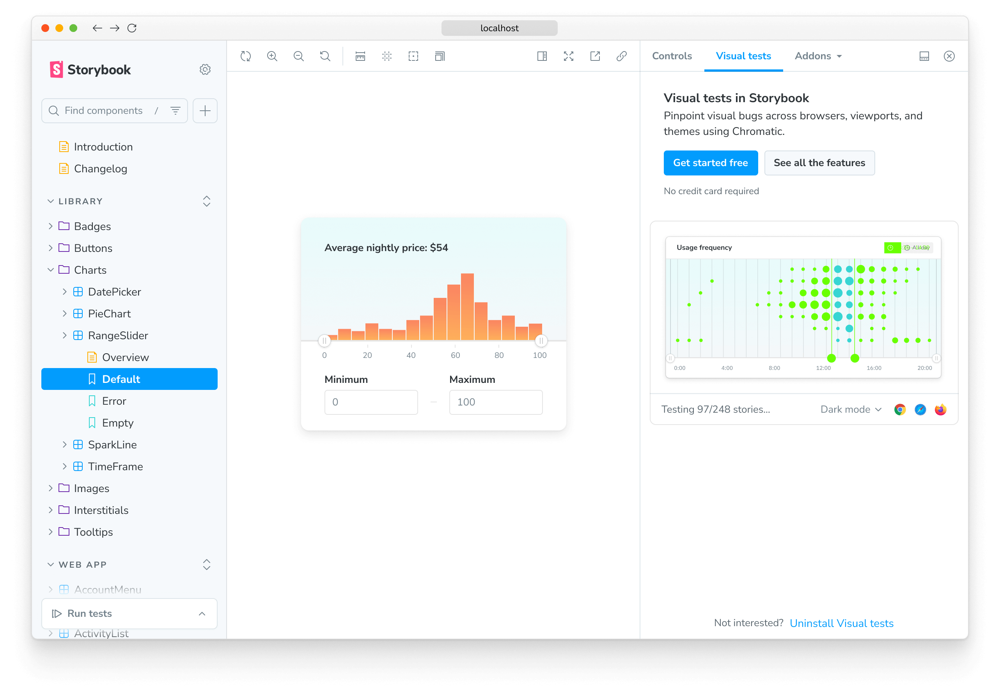

# Visual testing addon for Storybook

<div class="aside" style="margin-bottom: 2rem;">

🧪 **Experimental** We're actively integrating feedback from [early access users](https://forms.gle/NCDV1BMGuNfjWrPm9). As a result, both APIs and functionality may undergo potential changes.

</div>

Chromatic's Visual Testing addon helps you detect UI bugs during development. It enables you to run visual tests on your stories and compare changes with the latest baselines across multiple browsers and viewport sizes. Pinpoint changes in UI appearance and behavior and automate visual testing without leaving Storybook.

## Installation

To enable visual testing with Storybook, you must take additional steps to set it up properly. We recommend that you have a fully functional Storybook project running the latest version (e.g., 7.4 or higher) and a Chromatic account configured with a [project](setup#sign-up) to which you have access.

Run the following command to install the addon:

```shell
yarn add --dev @chromaui/addon-visual-tests
```

<div class="aside">

ℹ️ If you have an older version of Storybook, upgrade to the latest version by running the command `npx storybook@latest upgrade` before installing the addon. See the [migration guide](https://storybook.js.org/docs/7.0/react/migration-guide) for more information.

</div>

Update your Storybook configuration file `.storybook/main.js|ts` file to include the addon:

```js
// .storybook/main.js

const config = {
  stories: ["../src/**/*.mdx", "../src/**/*.stories.@(js|jsx|mjs|ts|tsx)"],
  addons: [
    // Other Storybook addons
    "@chromaui/addon-visual-tests",
  ],
};
export default config;
```

Start your Storybook, and you'll see some noticeable changes in the UI: a new toolbar icon and the Visual tests panel where you can inspect the test results.



## Authentication

Before using the Visual Testing addon, you must authenticate yourself with Chromatic. Click the "Enable" button in the addon panel and follow the onboarding workflow to set up your account and link your existing Storybook instance with Chromatic. After the authentication process is complete, you'll be redirected back to Storybook, where you'll see a list of available projects to which you have access.


<div class="aside">

💡 As part of the authentication process, the addon will ask you for light permissions to access your Chromatic account. The addon will only use this information to authenticate you and to synchronize your visual tests with Chromatic. The addon won't use this information for any other purpose.

</div>

Select the project on which you want to run your visual tests to complete the onboarding process. The addon will automatically save your selection, adjust the configuration file to include the necessary project identifiers, and retrieve the latest baselines if available.


## Configure

By default, your project configuration is stored in a configuration file (i.e., `chromatic.config.json`) in the root directory of your Storybook. However, if you want, you can extend it and provide additional options to control how tests are run. Listed below are the available options and examples of how to use them.

| Option            | Description                                                                                                                  |
| ----------------- | ---------------------------------------------------------------------------------------------------------------------------- |
| `projectId`       | Automatically configured. Sets the value for the project identifier <br/> `"projectId": "Project:64cbcde96f99841e8b007d75"`  |
| `projectToken`    | Automatically configured. Sets the value for the project token <br/> `"projectToken": "chpt_b2ae83517a0a706"`                |
| `buildScriptName` | Defines the custom Storybook build script <br/> `"buildScriptName": "deploy-storybook"`                                      |
| `debug`           | Output verbose debugging information to the console <br/> `"debug": true`                                                    |
| `zip`             | Recommended for large projects. Configures the addon to deploy your Storybook to Chromatic as a zip file <br/> `"zip": true` |

```json
{
  "projectId": "Project:64cbcde96f99841e8b007d75",
  "projectToken": "chpt_fa88b088041ccde",
  "buildScriptName": "deploy-storybook",
  "debug": true,
  "zip": true
}
```

### Override the default configuration

If you want to customize the addon's default configuration, you can create a file in your project's root directory and adjust the addon's settings in Storybook's configuration file to include it. For example, if you want to run tests based on the current environment:

```js
// .storybook/main.js

const config = {
  stories: ["../src/**/*.mdx", "../src/**/*.stories.@(js|jsx|mjs|ts|tsx)"],
  addons: [
    // Other Storybook addons
    {
      name: "@chromaui/addon-visual-tests",
      options: {
        //👇 Loads the configuration file based on the current environment
        configFile:
          process.env.NODE_ENV === "development"
            ? "chromatic.config.json"
            : "production.config.json",
      },
    },
  ],
};
export default config;
```

## How to run visual tests

Get started visual testing by introducing a change in one of your components; for example, change a background color or font size. Then save the file, and commit your local changes. Click the "Play" button in the sidebar to begin the process. This will:

1. Connect to Chromatic
2. Start a local build, which will:
   - Snapshot your components, including [browsers](browsers) and [viewport sizes](viewports)
   - Compare the new snapshots against the latest baselines
3. Display the results in the addon panel


## Review changes

To find out which changes were introduced in the latest build, the addon highlights the stories that require your attention. Cycle through them and review them. If the changes are intentional, the addon allows you to accept individual snapshots, stories, or the entire build, updating the baseline with the latest changes and marking them as accepted in Chromatic. This will ensure that when you push the changes into your remote repository, they will be reconciled with builds deployed from [CI](ci) or the [CLI](cli).


If you accept a change, the addon provides an "Unaccept" button in the addon panel that allows you to revert it. This resets the status to "unreviewed," updates Storybook's sidebar, and syncs the change with Chromatic.


---

#### What's the difference in testing with the addon vs. CI?

Running tests with the Visual Testing addon shortens the feedback loop by providing a simple workflow to detect UI bugs during development. This means you don't have to wait until your CI environment finishes running, reducing the costs and computational power used to verify what's changed. Once you combine the addon with [TurboSnap](turbosnap)([see below](#turbosnap-support)), only stories with potential changes will be tested, decreasing the number of snapshots taken and the time it takes to run the tests.

---

## Troubleshooting

<details>
<summary>Running Storybook with the addon enabled throws an error</summary>

When running Storybook with the addon enabled, you may encounter the following error:

```shell
const stringWidth = require('string-width');

Error [ERR_REQUIRE_ESM]: require() of ES Module /my-project/node_modules/string-width/index.js is not supported.
```

This is a [known issue](https://github.com/storybookjs/storybook/issues/22431#issuecomment-1630086092) when using an older version of the Yarn package manager (e.g., version 1.x). To solve this issue, you can upgrade to the latest stable version. However, if you cannot upgrade, adjust your `package.json` file and provide a resolution field to enable the Yarn package manager to install the correct dependencies. In doing so, you may be required to delete your `node_modules` directory and `yarn.lock` file before installing the dependencies again.

```json
{
  "resolutions": {
    "jackspeak": "2.1.1"
  }
}
```

</details>

<details>
<summary>How does the addon impact on snapshot usage?</summary>

Running tests with the addon enabled still counts towards your monthly snapshot usage, but they're likely to stay the same despite the number of builds you run. For customers who are subscribed to the early access program, the snapshots taken will not be billed until the end of the program. If you still see them listed in your bill or have any questions, contact us <a class="intercom-opensource-qualification-bot"><b>via in-app chat</b></a>.

</details>

<details>
<summary id="turbosnap-support">Does the addon support TurboSnap?</summary>

No. The Visual Testing addon is still in its early access stage. Support for TurboSnap will be added as part of a future release.

</details>

<details>
<summary>Can I deny a change with the addon?</summary>

No. Denying changes is only available when running builds from CI or the CLI. If you need to, you can revert changes by clicking the "Unaccept" button in the addon panel and re-running the tests to verify them.

</details>
